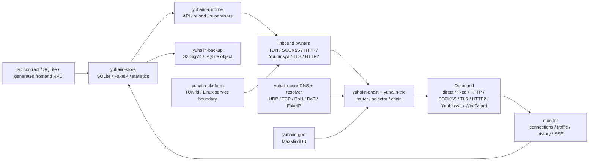

# yuhaiin Go → Rust 迁移清单

更新时间：2026-08-13

这是一份面向“Rust 二进制直接替换 Go 后端、前端不改”的活清单。它按模块记录 Go 的权威入口、Rust 的实现位置、可复现证据和剩余动作；不再使用 P1/P2。

运行约定：宿主机只负责路径准备、Podman 调度、curl 和结果收集；Rust/Go harness、测试函数、runtime、代理链、SQLite 副本和网络命名空间均在 Podman 中运行。构建缓存和测试状态只放在 `~/.cache/yuhaiin-rust`，不使用 `/tmp`。

缓存维护：`make cache-usage` 是只读检查，会报告总量、最大一级目录并在默认 20 GiB（可用
`YUHAIIN_CACHE_WARN_GIB` 调整）时报警；`make cache-prune` 只清理超过
`YUHAIIN_CACHE_RETENTION_DAYS`（默认 1 天）的 integration/parity/benchmark 场景目录，保留
`cargo-target` 和 `fixtures`。需要预览时设置 `YUHAIIN_CACHE_DRY_RUN=1`；不会自动删除可复用
构建产物。一次性 cross/CI/musl target 也只有在显式设置
`YUHAIIN_CACHE_PRUNE_TRANSIENT=1` 后才会按固定 allowlist 清理；确认没有 cargo/rustc 运行时，
还可设置 `YUHAIIN_CACHE_PRUNE_DEBUG=1` 清掉 `cargo-target/debug` 的依赖中间产物，但保留
debug 二进制。所有临时状态仍放在 `~/.cache/yuhaiin-rust`，不使用 `/tmp`。

## 总体状态

| 指标 | 当前值 |
| --- | ---: |
| 纳入统计的验收项 | 48 |
| 已完成 `[x]` | 40 |
| 主路径可用但仍有现场/样本缺口 `[~]` | 8 |
| 有实际功能缺口 `[ ]` | 0 |
| 加权覆盖率 | **91.7%** = `(40 + 8 × 0.5) / 48` |
| 主目标 | Linux desktop：Rust 可启动、管理前端可接入、普通 inbound/outbound 可串联 |
| 当前结论 | **主路径已可在 Linux desktop 进行替换前验收**；rootful TUN 多路由 lease、RST/reconnect、graceful/SIGKILL teardown、Debian rootful firewall matrix 和 TPROXY UDP delivery/idle/force-stop 已闭环，生产异常快照、更多平台现场和第三方 WireGuard 仍是 `[~]` |

`[x]` 表示代码和对应测试/进程证据都存在；`[~]` 表示主路径已经能运行，但验证范围还不足以称为 Go 的完整替换；`[ ]` 表示仍有明确功能或现场证据缺口；`延期` 不计入 48 项统计。

## 架构边界



TUN 是 inbound 的一种。它和 SOCKS5、HTTP proxy、Yuubinsya、TLS/HTTP2 inbound 一样由 `inbounds` owner 管理；WireGuard 的 userspace stack 只属于 outbound，不创建第二个 OS TUN inbound。

## 模块状态

### 1. 公共数据面、NAT 和 TUN

| Go 权威入口 | Rust 位置 | 状态 | 证据 | 下一动作 |
| --- | --- | :---: | --- | --- |
| `pkg/net/netapi/*`、`pkg/net/proxy/proxy/*` | `crates/yuhaiin-core/src/lib.rs`、`proxy.rs`、`flow.rs` | `[x]` | `workspace-tests`、proxy/flow unit tests | — |
| `pkg/net/nat/table.go`、`source.go`、`migrate.go` | `crates/yuhaiin-core/src/nat.rs`、`nat_tests.rs`、`nat_process` | `[x]` | full-cone、多 source、rebind、idle reap、force-stop | — |
| `pkg/net/proxy/tun/tun.go`、`tun/device/*` | `crates/yuhaiin-core/src/tun.rs`、`tun_unit_tests.rs`、`tun_runtime_tests.rs` | `[~]` | `tun-rs AsyncDevice + smoltcp`；TCP/UDP/ICMP、fragment、DNS/FakeIP、NAT、真实 packet echo、rootful TCP+UDP fixed traffic、3-route lease、TCP RST/reconnect、graceful/SIGKILL teardown 已有；IPv4 kernel fragmentation 五档、IPv6 合法 MTU 四档和扩展头分片布局单测均通过；Debian VM 又通过了 TCP/reload/force-stop、MTU 1280 UDP 和 TLS/H2/Yuubinsya chain；桌面 supervisor 现在按 Go 语义为每个 enabled TUN inbound 管理独立 OS TUN/device/route lease，注入式 FD API 仍保持单设备 | 仍需补更广泛发行版/防火墙现场，以及真实内核 IPv6 extension-header 分片现场 |
| `pkg/net/proxy/tun/tun2socket/*`、`tun/gvisor/*` | 单一路径 `tun-rs + smoltcp` | `延期` | 按约定不同时维护 tun2socket 和第二套 userspace stack | 只有当前路径出现性能/兼容性问题时再评估 |
| `pkg/route/loopback.go`、`pkg/net/netlink/*` | `crates/yuhaiin-runtime/src/loopback.rs`、`interfaces.rs`、`crates/yuhaiin-core/src/tun.rs` | `[x]` | rootful TUN connection metadata 已逐字段固定 endpoint、localAddr、process、PID、UID 和 selected node；loopback guard 单测覆盖 | — |

### 2. DNS、FakeIP 和 MaxMindDB

| Go 权威入口 | Rust 位置 | 状态 | 证据 | 下一动作 |
| --- | --- | :---: | --- | --- |
| `pkg/net/dns/resolver/udp.go`、`tcp.go`、`dns.go` | `crates/yuhaiin-core/src/dns_resolver_async.rs`、`dns_udp_async.rs`、`dns_tcp_async.rs` | `[x]` | UDP/TCP resolver/server source-bind smoke 和 unit tests；新增完整 DNS packet boundary，MX/TXT/CNAME/NS/DNSSEC 等未建模 QTYPE 会保留原始报文、EDNS/DNSSEC 字段和 transaction id | — |
| `pkg/net/dns/resolver/doh.go`、`dot.go`、`dohjson.go` | `crates/yuhaiin-runtime/src/doh_tls.rs`、`dot_tls.rs`、`rustcrypto_resolver.rs` | `[x]` | DoH/DoT real TLS、HTTP/2、timeout、certificate、local bind tests；DoH/UDP/TCP 原始 DNS 报文透传复用同一 resolver boundary | — |
| `pkg/net/dns/server/server.go` | `crates/yuhaiin-runtime/src/data_plane.rs`、`crates/yuhaiin-core/src/dns_*` | `[x]` | 同一配置同时绑定 UDP/TCP，reload 复用同一 handler；运行时 DNS 对预加载 FakeIP 的 IPv4/IPv6 PTR 反向映射返回本地答案；长期运行的 TUN DNS handler 会在 resolver/FakeIP/`hijackDns` reload 后切换快照；未建模 QTYPE 走原始 upstream packet path | — |
| `pkg/net/dns/fakeip/*` | `crates/yuhaiin-store/src/fakeip.rs`、`resolver.rs`、`tun.rs` | `[x]` | 双栈 allocation/reverse/TTL/touch/reopen、Go Pebble NDJSON/v6 takeover、DNS packet hook；FakeDNS whitelist/skipCheckList 按 Go 优先级从 JSON/SQLite 加载，含 wildcard、query 和 overlay reload 单测 | — |
| `pkg/net/trie/maxminddb/*` | `crates/yuhaiin-geo/src/lib.rs` | `[x]` | 纯 Rust reader、SHA-256、atomic refresh、坏库 fail-closed、IPv4-mapped IPv6；`make maxmind-smoke` 使用用户指定的 `Country-without-asn.mmdb` 和固定 SHA-256 在 Podman 中查询真实库 | — |

### 3. Router、Trie 和 GeoIP

| Go 权威入口 | Rust 位置 | 状态 | 证据 | 下一动作 |
| --- | --- | :---: | --- | --- |
| `pkg/net/trie/domain/*`、`pkg/net/trie/cidr/*` | `crates/yuhaiin-trie/src/lib.rs`、`router.rs` | `[x]` | parent/wildcard/normalize、IPv4/IPv6 LPM、随机 naive model 对照 | — |
| `pkg/route/rule.go`、`nested.go`、`history.go` | `crates/yuhaiin-runtime/src/route.rs`、`crates/yuhaiin-trie/src/router.rs`、`crates/yuhaiin-runtime/src/proxy.rs` | `[x]` | priority、host/CIDR/port、all/any/not、negative matcher、match history，以及 Go `node_tags_v2` 的 node/mirror tag 数据面选择；TCP/UDP node set 均支持成员失败重试，且 tag endpoint 会同步到连接 metadata；Podman HTTP inbound→tag→HTTP outbound 链通过 | — |
| `pkg/route/list.go`、`downloader.go`、`contract.go` | `crates/yuhaiin-runtime/src/route.rs`、`api.rs` | `[x]` | local/HTTP route list、atomic cache、API mutation/reload；Podman loopback HTTP fixture 已验证 remote body→`.part` 原子缓存→reload→运行时 trie→`errorMsgs=[]`；RuntimeService 已按 Go 分钟语义启动可 reload/shutdown 的后台刷新 timer；3 个停止态 Go SQLite 的 route/resolver projection、mutation 和错误 contract 均与 Rust identical | — |
| `pkg/route/loopback.go`、process/inbound matchers | `crates/yuhaiin-runtime/src/loopback.rs`、`route.rs`、`proxy.rs` | `[x]` | process/inbound/local endpoint metadata 参与选择；自环 fail-closed | TUN 真实 kernel 现场另计 |

### 4. Protocol、transport 和 proxy chain

| Go 权威入口 | Rust 位置 | 状态 | 证据 | 下一动作 |
| --- | --- | :---: | --- | --- |
| `pkg/net/proxy/direct/*`、`fixed/*`、`fixedv2/*`、`drop/*`、`reject/*`、`http/*`、`mock/http.go` | `crates/yuhaiin-core/src/proxy.rs`、`crates/yuhaiin-core/src/proxy_factory.rs`、`crates/yuhaiin-protocol/src/http.rs`、`http_mock.rs`、`crates/yuhaiin-runtime/src/proxy/http.rs`、`proxy.rs` | `[x]` | direct/fixed/drop/reject(block)/HTTP CONNECT service chain；Go `drop` 的 per-destination 512-entry/5-second expiry adaptive delay、TCP/UDP write sink 和 delayed EOF 已与立即 reject 分离并由 core TCP/UDP tests 固定；域名 endpoint async resolve 已修复；Go `fixedv2` 的首地址与 alternate 地址会保留为有序 endpoint 列表，连接失败时按顺序回退；每地址 `network_interface` 会传到 Linux TCP/UDP socket 的 `SO_BINDTODEVICE`，并由 Podman 单测验证；Go outbound `http_mock` 的固定 GET 请求、runtime 节点映射和底层 datagram 透传已补齐，`yuhaiin-runtime` 进程 builder 的真实 TCP echo 测试通过；Go inbound `proxy`/`http_mock` 透明 transport 也复用普通 listener，`service-chain-smoke` 通过 2/2 实际 HTTP echo | — |
| `pkg/net/proxy/socks5/client.go`、`server.go` | `crates/yuhaiin-protocol/src/socks5.rs`、`socks5_server.rs`、`crates/yuhaiin-runtime/src/inbounds/socks5.rs` | `[x]` | TCP auth/request、UDP ASSOCIATE、IPv4/IPv6/domain framing、inbound/outbound chain | — |
| `pkg/net/proxy/socks4a/server.go`、`mixed/*` | `crates/yuhaiin-runtime/src/proxy/socks4a.rs`、`inbounds/mod.rs` | `[x]` | mixed inbound dispatches SOCKS4A/SOCKS5/HTTP | — |
| `pkg/net/proxy/tls/*` | `crates/yuhaiin-protocol/src/tls.rs`、`crates/yuhaiin-runtime/src/proxy/*` | `[x]` | RustCrypto TLS inbound/outbound、SNI、CA、insecureSkipVerify contract | — |
| Go `pkg/net/proxy/tls.NewTlsAutoServer`、`pkg/cert.GenerateServerCert` | `crates/yuhaiin-runtime/src/inbounds/tls_auto.rs` | `[~]` | 动态 SNI 叶子证书、精确/单标签 wildcard、DNS/IP SAN、ALPN、按配置域名共享证书缓存；RustCrypto X.509 builder 已兼容 Go 的 ECDSA P-256、Ed25519、RSA CA/PKCS#8，6 个 Podman focused tests 通过 | rustls server-side ECH 尚未有等价公开 API；补 Go/Rust live config 和 ECH 现场后再升为 `[x]` |
| `pkg/net/proxy/http2/v1/*`、`v2/*` | `crates/yuhaiin-chain/src/h2_tunnel.rs`、`h2_server.rs`、`crates/yuhaiin-core/src/http2.rs` | `[x]` | prior-knowledge、TLS ALPN、pool/drain/GOAWAY、HTTP CONNECT/SOCKS5 bridge | — |
| `pkg/net/proxy/yuubinsya/*`、`yuubinsya2/*` | `crates/yuhaiin-core/src/yuubinsya.rs`、`crates/yuhaiin-chain/src/session.rs`、`direct_uot.rs` | `[x]` | TCP、native UDP、UOT/dup-over-TCP、Ping、migration/reconnect、Go client interop | — |
| `pkg/net/proxy/aead/*` | `crates/yuhaiin-protocol/src/aead.rs`、`crates/yuhaiin-runtime/src/inbounds/mod.rs` | `[x]` | TCP/UDP wire and Go interop；入站 AEAD→HTTP/2、AEAD→WebSocket 共享 transport 解包，声明顺序逆置时仍按 Go listener wrapper 顺序解包；TLS→AEAD→HTTP/2 也由真实进程链验证；Podman focused/runtime tests 通过 | — |
| `pkg/net/proxy/websocket/*`、HTTP obfs | `crates/yuhaiin-protocol/src/websocket.rs`、`http_obfs.rs`、`crates/yuhaiin-runtime/src/proxy/websocket.rs` | `[x]` | Go WebSocket→HTTP/2 interop、fragmented headers、early data | — |
| `pkg/net/proxy/vless/*`、`vmess/*`、`trojan/*` | `crates/yuhaiin-protocol/src/{vless,vmess,trojan}.rs`、runtime counterparts | `[~]` | parser/runtime/unit coverage；`make service-chain-smoke` 在 Podman 中通过 API→HTTP inbound→domain router→普通 VLESS/VMess/Trojan outbound 的 TCP 3/3 payload echo，并新增 VLESS/VMess/Trojan 的普通、TLS+WebSocket TCP 7/7 payload echo，以及 VLESS/VMess 普通、TLS+WebSocket UDP 5/5 framing、connections、selected node、match history；Rust runtime builder 现在也覆盖 Go-compatible VLESS/VMess/Trojan TLS/WebSocket transport layer，且共享 stream transport builder；本轮新增 `fixedv2 → HTTP/2 → VLESS/VMess/Trojan` 的可复用 transport/protocol 组合和真实 H2 CONNECT body wire harness，Podman `http2_protocol_layers` 通过 1/1（循环覆盖 3 种协议），runtime 构造回归 2/2；新增真实 `::1 → HTTP/2 → VLESS/VMess/Trojan` TCP 链路，Podman focused test 通过 3/3，fixed transport 使用 listener 实际地址族；`make go-protocol-interop-smoke` 当前在 Podman 通过 14/14 个真实 Go listener/client wire test，覆盖 VLESS 双向普通/TLS/TLS+WebSocket、VLESS UDP、VMess 普通/TLS+WebSocket、Trojan 普通/TLS+WebSocket；本轮补齐 Go 兼容 VMess legacy `alter_id>0` 的 user 链、时间 HMAC、AES-128-CFB 请求/响应头和 MD5 body key/IV，协议 focused `39 passed, 0 failed, 2 ignored`、workspace all-features `40 passed, 0 failed, 2 ignored`，runtime legacy builder 回归通过 | 更广的 runtime listener/outbound、地址族和远端 UDP/真实远端组合矩阵 |
| `pkg/net/proxy/tproxy/*`、`redir/*` | `crates/yuhaiin-runtime/src/proxy/transparent.rs` | `[x]` | REDIRECT TCP、IPv4/IPv6 ancillary decoder unit tests；透明 TCP 现在复用普通 inbound transport 解包，TLS/TLS-auto/AEAD/http_mock allow-list 与 TLS→relay、AEAD→relay Podman unit 均已验证；PROXY protocol、HTTP/2、WebSocket 仍因会改变原始目的地址而显式拒绝；当前源码二进制在 Debian 6.5 rootful VM 中通过 iptables 与 native nft TPROXY UDP（每项 2 flow、original destination、reply/rebind、monitor 统计、socket readback、idle reap）、IPv4/IPv6 REDIRECT 及 SIGKILL teardown；测试脚本的 `--rm` 回收竞态也已收敛 | — |
| `pkg/net/proxy/shadowsocks/*`、`shadowsocksr/*` | Rust protocol modules remain compatibility code | `延期` | 当前迁移范围不以 SS/SSR 为门槛 | 后续若 Go 未废弃再决定是否保留 |
| `pkg/net/proxy/quic/*`、`reality/*`、`mux/*`、`tailscale/*` | — | `延期` | 用户明确暂不实现 | 不阻塞 Linux desktop replacement |

### 5. WireGuard outbound

| Go 权威入口 | Rust 位置 | 状态 | 证据 | 下一动作 |
| --- | --- | :---: | --- | --- |
| `pkg/net/proxy/wireguard/{wireguard,bind,device}.go` | `crates/yuhaiin-wireguard/src/lib.rs`、`crates/yuhaiin-runtime/tests/wireguard_chain.rs` | `[x]` | Cloudflare `boringtun 0.7.1`、reserved/base64/PSK/keepalive/AllowedIPs、smoltcp TCP/UDP adapter；本地双 peer 已验证 authenticated endpoint roaming 和完整 UDP session；runtime WireGuard 让 peer endpoint 和最终目标都使用配置 resolver，驱动初始化也在构建返回前完成 ready/error 握手；外部验证入口同时接受 Go JSON 与标准 WARP/`wg-quick` INI；`make wireguard-chain-smoke` 在 Podman 通过真实 runtime HTTP/TCP 与 SOCKS5/UDP inbound→CIDR router→WireGuard outbound→BoringTun peer 的 TCP/UDP echo、连接元数据和 latency；16 MiB packet benchmark 为 593.24 MiB/s、peak RSS 3,428 KiB | 真实第三方/WARP peer、真实链路 keepalive/NAT endpoint 变化归入下方外部兼容项 |
| Go `WireGuard` node config | `crates/yuhaiin-store/src/compat_proxy*.rs`、`crates/yuhaiin-runtime/src/proxy.rs` | `[x]` | `make wireguard-smoke`：Podman `--network=none` 双 userspace peer，11/11（另 1 个 benchmark ignored），并覆盖 WARP/`wg-quick` INI 解析和不完整配置拒绝 | — |
| Go packet path | `scripts/benchmark/wireguard.sh` | `[x]` | release BoringTun packet benchmark，结果只作同机回归基线 | 公网/第三方链路性能不能由本地 benchmark 推断 |

### 6. SQLite、配置兼容、FakeIP persistence 和统计

| Go 权威入口 | Rust 位置 | 状态 | 证据 | 下一动作 |
| --- | --- | :---: | --- | --- |
| `pkg/storage/sqlite/{sqlite,migrations,compact}.go` | `crates/yuhaiin-store/src/sqlite.rs`、`schema.rs`、`migration.rs` | `[x]` | `rusqlite + bundled SQLite`、WAL、busy timeout、quick check、rollback、backup/restore、force-stop | — |
| `pkg/store/{node,inbound,resolver,route_*,settings,backup}.go`、`pkg/app/backup.go`、`pkg/s3/*` | `crates/yuhaiin-store/src/repository.rs`、`compat_runtime.rs`、`crates/yuhaiin-backup/src/lib.rs`、`tests/*` | `[~]` | typed repository、Go v1/v5/v6/schema-7、unknown JSON、users/routes/tags/settings/NAT；S3 SigV4 PUT/GET、Go camelCase 配置、BLAKE2b `lastBackupHash` 和选中 outbound proxy transport 已接入 API，并由本地兼容端点 wire test、runtime API test、`make s3-minio-smoke` 的真实 MinIO Podman 上传/下载覆盖 | 真实 AWS 权限现场，以及更多异常快照逐表 diff |
| `pkg/net/dns/fakeip/sqlite.go`、`pool.go` | `crates/yuhaiin-store/src/fakeip.rs` | `[x]` | reopen、cursor、release、capacity、dual-stack 和 legacy import | 更多生产容量/TTL 样本 |
| `pkg/statistics/{sqlite,statistic,telemetry,conn}.go` | `crates/yuhaiin-store/src/statistics.rs`、`crates/yuhaiin-runtime/src/monitor.rs` | `[~]` | traffic/history/telemetry、Go projection、SSE、并发 reader/writer、force-stop recovery；Go/Rust live-flow parity 与 API history UTC 已验证；新增真实前台 HTTP flow 的 SSE 初始/新增/移除、close、total/traffic/telemetry/history 进程测试；`make stats-soak-smoke` 在 Podman 中以 24 readers×1000 rounds、2000 writes 运行 89.50s 通过；跨进程 SQLite 写锁释放后的 projection retry 也有 focused 回归 | 更长 production projection 与真实生产时段样本 |

### 7. Runtime、inbound owner、API 和实时观察面

| Go 权威入口 | Rust 位置 | 状态 | 证据 | 下一动作 |
| --- | --- | :---: | --- | --- |
| `pkg/node/runtime.go`、`pkg/inbound/*` | `crates/yuhaiin-runtime/src/controller.rs`、`inbounds/mod.rs` | `[x]` | immutable snapshot、atomic reload；普通 node/route/resolver reload 只替换已注册 live selector，并同步长期 TUN DNS handler，inbound/user/selected-node/apply 才发送专用事件重绑 listener；HTTP CONNECT 持久连接在 route reload 期间继续传输，inbound reload 仍采用 latest-wins | — |
| `pkg/inbound/*`、`pkg/net/proxy/{http,socks5,yuubinsya,tls}.go`、`pkg/net/proxy/reverse/*` | `crates/yuhaiin-runtime/src/inbounds/*`、`proxy/*` | `[x]` | inbound→router→outbound service chain；HTTP/SOCKS5/Yuubinsya/TLS/HTTP2/mixed/reverse；Go 的 `proxy`/`http_mock` server transport 透明 wrapper 已纳入普通 listener；Podman 真实前台进程已覆盖 reverse TCP raw relay 和 reverse HTTP path/Host rewrite、direct outbound、connections metadata，以及透明 transport 2/2 HTTP echo；新增 AEAD→HTTP/2→HTTP、TLS→AEAD→HTTP/2→HTTP outbound 真实进程链 | — |
| Go TUN inbound contract | `crates/yuhaiin-runtime/src/inbounds/mod.rs`、`data_plane.rs` | `[~]` | TUN 作为 inbound supervisor；真实 user+network namespace、rootful TCP+UDP fixed traffic、multi-route lease、reload、RST/reconnect、graceful/SIGKILL teardown 已通过；真实 kernel IPv4 五档、IPv6 合法 MTU 四档 fragmentation matrix 已通过；扩展头分片布局在 Podman core harness 中通过；`tun-api-process-smoke` 编译和运行均在 Podman，验证真实前台二进制通过 API 对默认禁用 TUN、单个新增 TUN 和两个同时 enabled 的 TUN 做开关，两个设备可同时在 `/proc/net/dev` 出现并独立关闭 | 继续补更广泛发行版/firewall 组合和真实 IPv6 extension-header 现场 |
| `pkg/httpapi/v2*.go`、`register.go` | `crates/yuhaiin-runtime/src/api.rs` | `[x]` | generated frontend RPC route coverage、read/mutation/error parity、API reload/live flow；`inbounds/config` 的 DNS 劫持变更会触发 inbound owner reload | 更多生产 response 字段样本 |
| `pkg/net/netapi/{conn,server}.go`、`pkg/statistics/notify.go` | `crates/yuhaiin-runtime/src/monitor.rs`、`log.rs`、`service.rs` | `[x]` | connections、SSE、traffic、history、telemetry、node latency、pprof、启动日志；TUN 在出站 TCP/UDP socket 建立前先发布 pending flow，建链后以同一 ID merge `localAddr/underlyingType/protocol`，并以 Go-compatible `connections_added` 更新事件回填；真实前台 API 进程测试覆盖连接字段、SSE 初始/新增/移除、close、total/traffic/telemetry/history；Podman `go-live-flow-parity-smoke` 比较 Go/Rust 真实 live flow，workspace 283 runtime tests 通过 | — |
| Go service lifecycle | `crates/yuhaiin-runtime/src/service.rs`、`src/bin/service/*`、`src/update.rs` | `[~]` | Linux systemd install/rollback/health smoke；macOS launchd plist/bootstrap/kickstart、Windows Service SCM install/start/stop/delete/recovery-actions/health/rollback 已实现；update helper 的成功安装、保留 rollback image、restart failure 恢复和 staged retry 均有单测；foreground 默认 stderr progress | macOS/Windows 真实权限现场安装、更新和回滚 |

### 8. Platform boundary

| Go 权威入口 | Rust 位置 | 状态 | 证据 | 下一动作 |
| --- | --- | :---: | --- | --- |
| `pkg/net/proxy/tun/device/*`、`pkg/net/netlink/*` | `crates/yuhaiin-platform/src/lib.rs`、`yuhaiin-core::TunRuntime` | `[~]` | Unix owned FD、Linux desktop TUN、injected FD boundary、纯 Rust route manager、rootful multi-route lease/teardown、IPv4/IPv6 kernel fragmentation；IPv6 扩展头分片布局也已在 Podman core harness 覆盖；桌面 enabled TUN 使用独立设备和可回收 route lease，TUN DNS handler 支持 resolver/inbound policy hot reload | 更广泛发行版 firewall 现场和真实 IPv6 extension-header 分片现场 |
| Android `VpnService` / AAR host | `TunRuntime::from_owned_fd` API 已预留 | `延期` | 当前范围先完成纯 desktop replacement | 后续同步修改 yuhaiin-android |
| macOS utun / app lifecycle | platform boundary 文档和接口已留口 | `延期` | 当前范围不计入 desktop Linux 覆盖率 | 后续单独验收 |

## Inbound / outbound 能力矩阵

| 能力 | Inbound | Outbound | 当前状态 |
| --- | :---: | :---: | :---: |
| direct / reject(block) / drop / fixed | fixed/direct listener | 是 | `[x]` |
| HTTP proxy / CONNECT | 是 | 是 | `[x]` |
| SOCKS5 TCP | 是 | 是 | `[x]` |
| SOCKS5 UDP ASSOCIATE | 是 | 是 | `[x]` |
| mixed / mix UDP | 是 | 是 | `[x]` |
| SOCKS4A | 是 | — | `[x]` |
| TLS | 是 | 是 | `[x]` |
| HTTP/2 | 是 | 是 | `[x]` |
| Yuubinsya TCP | 是 | 是 | `[x]` |
| Yuubinsya native UDP | 是 | 是 | `[x]` |
| Yuubinsya UOT / dup-over-TCP | 是 | 是 | `[x]` |
| reverse TCP / reverse HTTP | 是 | — | `[x]`：真实前台进程分别验证 raw relay、HTTP path/Host rewrite、direct outbound 和 connections metadata |
| TUN | 是 | — | `[~]`：真实 user/rootful data-plane、每个 enabled inbound 独立设备、3-route lease、reload、reset/reconnect、teardown、IPv4 五档和 IPv6 合法 MTU 四档 fragmentation 通过；扩展头布局单测通过，更广泛 firewall/真实 extension-header 现场仍补 |
| redir TCP / TPROXY UDP | 是 | — | `[x]`：TLS/TLS-auto/AEAD transport 可在透明 TCP listener 上先解包再 relay；当前源码在 Debian rootful VM 通过 iptables/native nft 的 2-flow delivery、original destination、回包/rebind、idle reap、IPv4/IPv6 REDIRECT 和 force-stop |
| DNS UDP / TCP / DoH / DoT | server/client | resolver/client | `[x]` |
| WireGuard | — | 是 | `[~]`：BoringTun userspace adapter 已通过本地双 peer |
| Cloudflare WARP MASQUE | — | — | `延期`：Go 侧依赖 QUIC/HTTP3；当前范围明确延期 QUIC/DoH3，不把它误报成 WireGuard 缺口 |
| DoQ / DoH3、QUIC、Reality、Mux、Tailscale | — | — | `延期` |
| Shadowsocks / ShadowsocksR | — | — | `延期` |

## 可执行 checklist（唯一未完成清单）

### Linux 权限和数据面

- `[x]` Debian VM rootful Podman 已通过基础 TUN route lease、普通 packet echo、3 次 reload、MTU 五档、TLS/H2/Yuubinsya chain 和 force-stop teardown。
- `[x]` `make tun-route-matrix-smoke` 的 rootful Podman matrix 已通过 3 条真实 IPv4 routes（含 metric）：owner 存活时可见，graceful close 与 owner SIGKILL 后均 absent；日志位于 `~/.cache/yuhaiin-rust/integration/tun-route-matrix/`。
- `[x]` rootful TUN 已通过 TCP RST 后重新建立连接并完成 echo；smoltcp dispatcher 的 fragment reassembly、overlap、expiry、overflow 和恢复已有单元/模拟 packet 覆盖。
- `[x]` rootful runtime-owned TUN 已通过同一服务内的 TCP+UDP fixed outbound traffic；UDP 客户端使用独立子进程避开 loopback guard，虚拟 routed destination 回包源地址由 smoltcp 单测固定为目标地址。
- `[x]` 真实 kernel IPv4 fragmentation 已在 Debian VM rootful Podman 通过 MTU 576/1280/1500/9000/9216 五档；每档均回环最大合法 IPv4 UDP payload 65507 字节，覆盖 kernel ingress 分片、smoltcp 重组、smoltcp 出方向分片和 kernel egress 重组。
- `[x]` IPv6 ingress/egress fragmentation 已在 Debian VM rootful Podman 通过合法 MTU 1280/1500/9000/9216 四档；每档均回环最大合法 IPv6 UDP payload 65507 字节，覆盖 kernel ingress 分片、Rust ingress 重组、proxy echo、TUN boundary egress 分片和 kernel egress 重组。IPv6 MTU 576 按协议最低 MTU 约束 fail-closed，不作为合法档位。
- `[x]` 在同一 rootful namespace 执行 TPROXY UDP：默认 iptables 与 native nft backend 均通过 transparent socket readback、original destination `10.254.1.2:18082`、local listener `0.0.0.0:18083`、两个 source flow、回包、rebind 和 upload/download monitor 统计。
- `[x]` TPROXY UDP 在 rootful VM 用测试专用 1 秒 timeout 验证了 2 个 flow 的 idle reap；iptables 与 native nft 均通过 service SIGKILL 后的进程级观测，生产默认仍保持 90 秒 `UDP_IDLE_TIMEOUT`。
- `[x]` 当前源码透明服务二进制已在 Debian 6.5 rootful VM 通过 iptables/native nft 两套 firewall backend；每套均覆盖 IPv4 TCP REDIRECT、IPv6 TCP REDIRECT、TPROXY UDP 两条 source flow、original destination、reply/rebind、monitor 统计、idle reap 和 SIGKILL teardown。透明 TCP 的 TLS wrapper 已复用 `prepare_inbound_stream` 并有 Podman unit 覆盖，公共 `UDP_IDLE_TIMEOUT`/reap/close 单测、容器 namespace teardown 也已覆盖基础生命周期；更广发行版/现场差异归入 platform `[~]`。
- `[~]` 将当前 user+network namespace TUN smoke 保持为 CI 默认路径；它证明真实 kernel TUN packet path，但 rootful route takeover 另由 `tun-route-matrix-smoke` 验证。
- `[x]` IPv6 出方向扩展头分片布局已在 Podman `network=none` 中通过：Hop-by-Hop、Routing、Routing 后 Destination Options、分片重组和重复分片拒绝均有断言；真实内核对该组合的端到端现场仍待补。
- `[x]` rootful TUN connection metadata 已在 rootful fixture 中逐字段固定 endpoint/localAddr、selected node、process、PID 和 UID；本轮现场为 `/usr/local/bin/tun-service-smoke`、pid `7`、uid `0`。
- `[x]` `make tun-api-process-smoke` 的编译和运行均在 Podman 中完成；disposable user/network namespace 验证默认 TUN、新增 TUN 和两个同时 enabled 的 TUN，rootful namespace 又验证了真实设备创建/销毁和 API 开关。共享脚本的 rootful entrypoint 已改为使用调用者实际挂载的 harness，避免 API smoke 错误调用未挂载的 `tun-service-smoke`；rootful TUN → TLS/H2/Yuubinsya chain 也通过。

### Go 生产兼容和统计

- `[~]` 对更多停止态 Go SQLite 做逐表 schema/未知表/异常快照 diff；当前 3 份停止态 snapshot 的 API read/mutation/error parity 已通过，源库只读，副本和结果放 `~/.cache/yuhaiin-rust`。
- `[x]` `production-parity-smoke` 现在额外在 Podman 中审计三份停止态快照的 SQLite 对象、逐表列约束和索引保留；Rust 允许的 `dns_resolvers`、`route_rules`、小时级 traffic/failure projection schema migration 被显式列出，其余源表/对象缺失会直接失败，行数变化会保留在 JSON 报告中供 projection 复核。
- `[~]` 增加更长时间 telemetry/history、强停和 reload 组合样本；当前已补充 Podman 真实前台进程的 16 readers×400 rounds、800 writes 压力回归（2/2 passed），并保留更高的 24×1000、2000 writes 结果。
- `[x]` SQLite 升级/启动与统计投影的锁竞争已有跨进程 Podman 回归：真实持有 `<db>-yuhaiin-write-lock` 时，另一个 `ConfigStore::open` 会等待并在释放后完成；真实 `BEGIN IMMEDIATE` 持有者释放后，`replace_go_statistics` 会通过生产 busy-retry 路径完成，6 个 cross-process tests 通过（另 1 个长压 test 显式 ignored）。
- `[x]` 使用缓存中的停止态 Go `state.db` 做 Go/Rust API read + core mutation parity；包括 `connections.history` 的 UTC 时间格式、节点/入站/解析器/路由/发布/订阅 deferred 错误 contract。
- `[x]` refact-user 分支的 users API parity harness 现在也完全在 Podman 中运行；先在容器内让 Rust 接管 prepared SQLite，再用独立 Go/Rust 容器对 basic/UUID/token 的 create/update/get/list/delete、node reference conflict 和 missing-user 错误做对照。
- `[~]` S3 backup 已不再静默退化为本地备份：`backup.run` 按 Go object name 上传，`backup.restore` 空请求按配置下载，失败返回 unavailable；SigV4、本地兼容端点、Go BLAKE2b hash 和“经选中 outbound proxy 访问 S3”的 HTTP/HTTPS transport 已测试。`make s3-minio-smoke` 已在 Podman 通过真实 MinIO 完成 bucket 创建、SigV4 PUT/GET、object 校验和 restore 下载；真实 AWS 权限现场及更多异常快照逐表 diff 仍待补。
- `[x]` 统计公开契约已逐字段对齐：connections 的完整 metadata/matchHistory、total 的 string counters、traffic 的 UTC bucket、telemetry 的固定九维/失败计数、history/failed-history/block-history 的 process、count、time、dumpProcessEnabled 和 API 1000 条边界均有单测或 Podman parity；失败项按 `(protocol, host, process)` 分组，阻断历史不再丢失进程标志，同时保留 Go failed-history 全量 SQLite 语义。
- `[x]` 2026-08-13 在 Podman 重跑 `make go-live-flow-parity-smoke` 和 `make workspace-tests`：Go/Rust 真实 live flow 的 connections、total、traffic、telemetry、history 对照通过；workspace 49 个 harness 全部通过（285 个 runtime tests、131 个 store tests、22 个 service-chain tests、2 个 WireGuard chain tests）。结果保存在 `~/.cache/yuhaiin-rust/integration/go-live-flow-parity/20260813034332-2381346` 与 `~/.cache/yuhaiin-rust/integration/workspace-tests`。
- `[x]` route list `refreshInterval` 已由 RuntimeService 持有后台 timer：配置 reload 立即重读，刷新产生的 reload 不会忙循环，服务 shutdown 会停止任务；定时刷新夹具验证 `lastRefreshTime` 和 reload 生命周期。
- `[x]` API response 字段、生产 route/resolver projection 和 MaxMind country projection 已补齐证据：三份停止态 Go SQLite 的完整 API read/mutation/error parity、runtime route-list GeoIP metadata 持久化测试，以及 `make maxmind-smoke` 对用户指定 Country-without-asn 数据库的真实查询均通过；Go 当前 MaxMind 接口只暴露 country，不额外把 ASN 当作迁移缺口。
- `[x]` Runtime DNS handler 在 socket/TUN 共用边界上恢复预加载 FakeIP 的 `in-addr.arpa`/`ip6.arpa` PTR 映射；未知 PTR 仍按上游 resolver 的现有能力处理。
- `[x]` Go inbound `proxy` 与 `http_mock` transport 已按其真实 `NewServer` 语义复用普通 listener；allow-list 单测覆盖大小写和 deferred transport，Podman `service-chain-smoke` 的 18/18 进程链包含两种透明 wrapper 的 HTTP echo。
- `[x]` 入站 transport 组合按 Go listener 声明顺序通过真实进程链验证：`TLS → AEAD → HTTP/2 → HTTP outbound`，包含 TLS/AEAD 解包、H2 CONNECT、router、SQLite connections、流量统计和 HTTP authority。
- `[~]` Go `tls_auto` inbound 已进入普通 TCP/TLS listener：从 Go-shaped `ca_cert`/`ca_key`/`servernames`/`next_protos` 生成动态 SNI 证书，支持 ECDSA P-256、Ed25519、RSA CA 和 wildcard/SAN；runtime focused test 在 Podman 通过 6/6。ECH server key API 仍保留为明确缺口，不伪装成完整支持。

### WireGuard 外部兼容

- `[~]` 使用真实第三方/WARP peer 验证 reserved、handshake、keepalive 和 NAT endpoint 变化；本地 authenticated roaming 及 TCP/UDP userspace session 已由双 peer 单测覆盖。`make wireguard-external-smoke` 已提供用户配置驱动的 Podman host-network 入口，现在可直接读取 Go JSON 或标准 WARP/`wg-quick` INI；仍需第三方现场确认 endpoint roaming 和真实链路行为。
- `[x]` 保持本地双 peer smoke 和 release packet benchmark；两者只证明协议/适配器正确性和同机趋势，不宣称公网性能。

### CI 与发布（不计入上面的 48 项功能覆盖率）

- `[~]` `.github/workflows/rust.yml` 已加入 Rust/Podman 检查、Linux `x86_64/aarch64-unknown-linux-musl`、Darwin `x86_64/aarch64`、Windows `x86_64/aarch64` 六项 release matrix；`make release-contract-smoke` 会在 CI checks 阶段锁定六个 target、产物名、checksum 和 rolling-main 发布条件，仍需第一次 GitHub Actions 远程运行确认 runner/SDK 的现场差异。
- `[x]` 旧 Actions 的 `trojan.rs` `clippy::byte-char-slices` 已通过 `*b"\r\n"` 修复，`rusqlite 0.39.0` / `libsqlite3-sys 0.37.0` 锁定；Rust 1.97.1 Podman 中 fmt、全 workspace Clippy 和 workspace tests 均通过。HTTP/2 pool 的 key 还纳入 endpoint `network_interface`，避免相同地址的不同网卡策略复用连接。
- `[x]` 发布资产名称与运行时 update contract 对齐：`yuhaiin-{linux,darwin,windows}-{amd64,arm64}`，Windows 保留 `.exe`；`v*` tag 发布稳定 release，`main` 生成可覆盖的 rolling prerelease 并更新 `main` tag。
- `[~]` macOS launchd 与 Windows Service 的安装/更新/回滚代码、跨 target 编译和单测已完成；update helper 的替换事务已通过注入 platform hooks 覆盖成功与 restart failure rollback；真实 launchd/SCM 权限现场及远程 Actions 首次运行仍待验收。

### 主动延期（本轮不阻塞）

- `延期` DoQ、DoH3、QUIC、Reality、Mux、yamux、Tailscale。
- `延期` Cloudflare WARP MASQUE（依赖 QUIC/HTTP3）；WireGuard userspace 仍使用已验证的 Cloudflare BoringTun。
- `延期` Shadowsocks、ShadowsocksR、订阅。
- `延期` Android 独立应用、AAR/JNI/VpnService lifecycle、macOS utun/独立应用；macOS launchd 桌面服务已纳入本轮。

## 最近一次可复现证据

下面只保留每类证据的最新结果；模块表和“唯一未完成清单”负责说明范围，历史结果不在这里重复堆积。

| 类别 | 命令 | Podman 验证结果 |
| --- | --- | --- |
| 全 workspace | `make workspace-tests` | 49 个 harness，0 失败；chain 55、core 153、runtime 285、store 131（5 ignored）、trie 27、service-chain 23、WireGuard 11（1 benchmark ignored）、WireGuard runtime chain 2、stats concurrency 2；外部 WARP 测试显式 ignored |
| Go API / SQLite | `make production-parity-smoke` | 3 份停止态 Go SQLite 的 info/settings/nodes/inbounds/resolvers/routes/publishes/connections/统计读接口、核心 mutation 和错误矩阵逐项 identical；Rust takeover 结构审计逐表保留源对象/列约束/索引，已知 projection migration 单独记录 |
| Go live flow | `make go-live-flow-parity-smoke` | Go/Rust 真实 HTTP inbound → router → HTTP outbound 流量、connections、total、traffic、history、telemetry 和 reload 后统计 parity |
| SQLite lock contention | `podman-cargo.sh -- cargo test -p yuhaiin-store --test cross_process --no-run`，随后在 Debian Podman 执行 harness | 升级/启动 write-lock 与统计 `BEGIN IMMEDIATE` holder 两条跨进程场景通过；6 passed、1 ignored |
| Go wire interop | `make go-protocol-interop-smoke` | 14 passed，覆盖 Yuubinsya、WebSocket/H2、H2 v1、VLESS TCP/UDP、VMess、Trojan 的 Go↔Rust wire tests |
| HTTP/2 protocol layering | `podman-cargo.sh -- cargo test -p yuhaiin-chain --test http2_protocol_layers` | 1 passed；同一 harness 循环验证 VLESS/VMess/Trojan 在 Go-compatible H2 CONNECT transport 上完成 TCP 握手、响应头和 payload echo；runtime service-chain 又以 1 个 TCP + 1 个 UDP 测试分别循环覆盖三种协议 |
| service chains | `make service-chain-smoke` | 23 passed；HTTP/SOCKS5/mixed/TLS/H2/Yuubinsya、VLESS/VMess/Trojan TCP/UDP、VLESS/VMess/Trojan over HTTP/2 TCP/UDP、reverse、透明 wrapper 和实时状态链通过 |
| statistics soak | `YUHAIIN_STATS_READER_COUNT=24 YUHAIIN_STATS_READER_ROUNDS=1000 YUHAIIN_STATS_WRITE_ROUNDS=2000 make stats-soak-smoke` | Podman 真实前台进程 24 readers×1000 rounds、2000 writes，含强停恢复：2 passed，89.50s |
| API / SSE | `make api-contract-smoke` | 4 passed；管理 API、嵌套路由 history、domain latency、SSE 初始/新增/移除、连接字段、close、total/traffic/telemetry/history 通过 |
| TUN lifecycle | `make tun-api-process-smoke` | 真实前台 runtime 通过 API 独立开关单个及两个 TUN，验证设备出现/消失和反复 disable→enable→disable |
| TUN data plane | `make tun-chain-service-smoke` | 真实 TUN → fixed → TLS → HTTP/2 → Yuubinsya → echo 通过；rootful route lease、MTU、RST/reconnect、UDP、graceful/SIGKILL teardown 已有对应证据 |
| rootful TUN process | `YUHAIIN_TUN_USER_NAMESPACE=0 make tun-api-process-smoke tun-service-smoke tun-chain-service-smoke` | Podman rootful namespace 通过 API 设备开关、TUN packet echo，以及 TUN → TLS/H2/Yuubinsya chain；共享 harness entrypoint 修复后真实执行 |
| transparent | `make transparent-service-smoke` + Debian rootful VM matrix | 当前源码二进制通过 IPv4/IPv6 REDIRECT、iptables/native nft TPROXY UDP 2-flow、original destination、reply/rebind、idle reap、SIGKILL force-stop；脚本由 Podman 执行，VM kernel 为 Debian 6.5 |
| WireGuard protocol | `make wireguard-smoke` | Cloudflare BoringTun userspace 双 peer：11 passed，1 ignored；authenticated handshake、PSK、reserved、keepalive、AllowedIPs、TCP/UDP、resolver、interface bind 和 WARP/`wg-quick` INI 配置覆盖 |
| WireGuard chain | `make wireguard-chain-smoke` | 2 passed；HTTP/TCP 与 SOCKS5/UDP inbound → CIDR router → BoringTun WireGuard outbound → peer echo 通过 |
| MaxMind / feature gate | `make maxmind-smoke`；`podman-cargo.sh -- cargo test -p yuhaiin-core --no-default-features --all-targets` | 真实 Country-without-asn 数据库查询 1/1 通过；core 无 async-proxy feature 65 个单测、NAT process 1 个测试通过 |
| startup / service | `make startup-logs-smoke`、`make systemd-service-smoke` | 默认前台日志、runtime ready/shutdown、systemd install/health/自动 rollback/显式 rollback 通过 |
| release contract | `make release-contract-smoke` | Linux musl、Darwin、Windows 的 amd64/arm64 六目标、产物名、checksum、checks gate、rolling-main contract 通过 |
| musl release build | `make build-release-musl` | Podman 内成功完成 `x86_64-unknown-linux-musl` release 构建，产出 static PIE `yuhaiin` |
| benchmark | `make benchmark-throughput`、`make benchmark-tun-throughput`、`make benchmark-wireguard-throughput` | HTTP CONNECT 158.39 MiB/s / 17,904 KiB；TLS/H2/Yuubinsya 33.38 MiB/s / 20,320 KiB；TUN 44.88 MiB/s / 13,224 KiB；BoringTun 593.24 MiB/s / 3,428 KiB（16 MiB run）。均为同机趋势基线 |
| quality gate | `make check`、`make clippy` | Podman 中 workspace check 与 `clippy --workspace --all-targets --all-features -- -D warnings` 通过 |

## 常用命令

```bash
make build                         # debug binary
make build-release                 # release binary
make build-musl                   # MUSL=1 debug binary
make fmt-check
make workspace-tests
make service-chain-smoke
make go-protocol-interop-smoke
make tun-reload-traffic-smoke
make tun-reset-reconnect-smoke
make tun-mtu-smoke
make wireguard-smoke
make tun-api-process-smoke
make maxmind-smoke
make wireguard-chain-smoke
YUHAIIN_WIREGUARD_EXTERNAL_CONFIG=... YUHAIIN_WIREGUARD_EXTERNAL_TCP_TARGET=... make wireguard-external-smoke
make benchmark-throughput
make benchmark-tun-throughput
make benchmark-wireguard-throughput
make cache-usage
```

运行 TUN 测试时，`YUHAIIN_TUN_USER_NAMESPACE=auto` 会在宿主没有 `CAP_NET_ADMIN` 时自动使用容器内 disposable user/network namespace；rootful 现场可设置 `YUHAIIN_TUN_USER_NAMESPACE=0`，显式验证正常 Linux namespace 的权限和路由行为。
