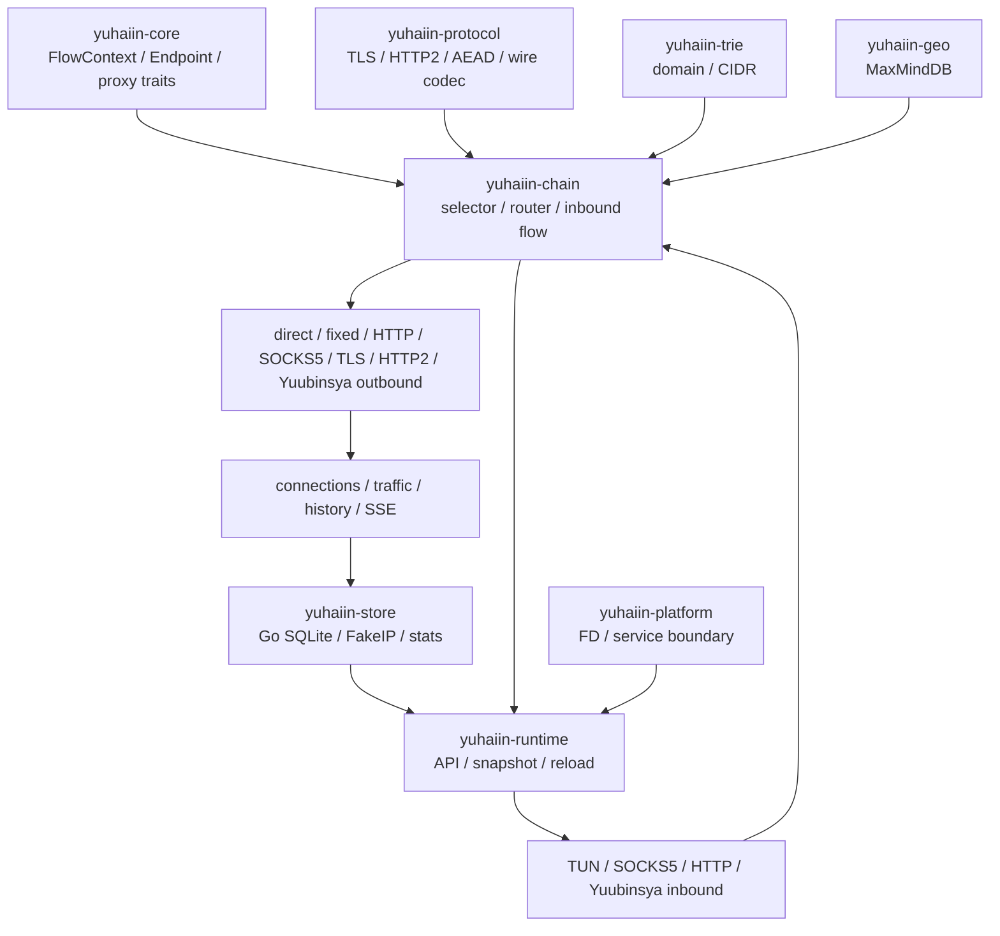

# yuhaiin Go → Rust 实现清单

更新时间：2026-08-11

这份清单按“模块树 → 已完成 → 未完成 → 下一步验收”组织。它不把“代码存在”当成“替换完成”：`[x]` 必须有单测或真实进程证据，`[~]` 表示 Linux 主路径可用但仍有平台、权限、生产样本或现场证据缺口，`[ ]` 表示未实现，`延期` 表示按当前范围主动不阻塞替换。

## 总体状态

| 指标 | 当前值 |
| --- | ---: |
| 当前清单条目 | Linux 纯桌面模块验收项 + P0/P1 gates（延期项、协议矩阵重复项不计入） |
| 已完成 `[x]` | 30 项 |
| 主路径完成 `[~]` | 13 项 |
| 仍未完成 `[ ]` | 3 项 |
| 加权覆盖率 | **79.3%**（`(30 + 13 × 0.5) / (30 + 13 + 3)`） |
| 可运行范围 | Linux desktop/container：SQLite、API、DNS、普通 inbound、TUN、router、主要 proxy chain |
| 当前结论 | **未完成**：rootful TUN/TPROXY、更多生产兼容样本和 TUN loopback 现场证据仍需验收；Android/macOS 独立应用暂不计入本轮 |



## 模块树

### `crates/yuhaiin-core`：公共数据面基础

已完成：

- `[x]` `Endpoint`、`FlowContext`、`AsyncProxy`、`AsyncDatagram`、错误、超时和 socket metadata。
- `[x]` direct/fixed/drop、域名 endpoint 解析、TCP/UDP direct fallback。
- `[x]` TUN 单一路径：`tun-rs AsyncDevice + smoltcp`，不同时维护 tun2socket 和第二套 userspace IP stack。
- `[x]` TUN TCP/UDP/ICMP dispatcher、bounded queue、fragment reassembly、DNS/FakeIP hook、NAT hook。
- `[x]` Yuubinsya TCP、native UDP、UOT/dup-over-TCP 基础。

未完成：

- `[~]` TUN flow 级异常隔离已有单测和 rootless 回归，但真实 TCP reset、多 flow 重连、超限 fragment 仍需 rootful namespace。
- `延期` WireGuard userspace adapter；本轮完成了依赖审计：`boringtun 0.7.1` 的协议核心可复用但依赖 `ring`（含 `cc` build dependency）及 `libc/nix`，`wireguard 0.2.0` 同样依赖 `ring/libc` 且是较旧的参考实现；两者都不符合当前“纯 Rust、可直接接入现有 TCP/UDP data-plane”的约束，暂不引入。

下一步：

- 在 CAP_NET_ADMIN namespace 重跑 TUN fragment、flow reset、reconnect 和 teardown matrix。

### `crates/yuhaiin-protocol`：可组合协议与 transport

已完成：

- `[x]` RustCrypto TLS，HTTP/2 prior knowledge/client pool/server，HTTP CONNECT、SOCKS5 wire codec。
- `[x]` Yuubinsya TCP、UDP、UOT/dup-over-TCP，AEAD transport。
- `[x]` transport 组合通过统一 stream/datagram trait 接入 chain，不把协议状态散落到 runtime。

未完成/延期：

- `延期` DoQ/DoH3、QUIC、Mux、Reality。
- `延期` Shadowsocks/SSR、Tailscale、订阅协议。
- `[~]` TPROXY ancillary data 代码存在，但尚无 rootful UDP 现场证据。

### `crates/yuhaiin-chain`：router 与 proxy chain

已完成：

- `[x]` router snapshot、domain/CIDR/GeoIP/host/process/inbound/negative matcher、优先级和 `all/any/not`。
- `[x]` direct、drop、fixed、HTTP proxy、SOCKS5、TLS、HTTP/2、Yuubinsya 的 TCP/UDP chain。
- `[x]` TCP/UDP 独立 selected node；TUN、SOCKS5 UDP、Yuubinsya UDP 使用 UDP selection。
- `[x]` source address/interface policy、出站 endpoint metadata、loopback guard。

未完成：

- `[~]` TUN→proxy 自环需要真实进程 PID/path/endpoint 现场证据。
- `[~]` 更多生产 route/resolver projection 和负向 matcher 快照。

### `crates/yuhaiin-trie`：域名/CIDR 索引

- `[x]` domain parent/wildcard/normalize/priority、网络和端口约束。
- `[x]` IPv4/IPv6 longest-prefix lookup、随机对照和边界测试。
- 下一步：补更多生产规则快照；当前无 Linux 主路径缺口。

### `crates/yuhaiin-geo`：MaxMindDB

- `[x]` 纯 Rust MaxMind reader、坏库 fail-closed、SHA-256 校验、atomic refresh、IPv4-mapped IPv6。
- `[x]` fixture 存放在 `~/.cache/yuhaiin-rust-maxmind/`，不进入仓库。
- `[~]` 更多真实生产数据库版本和 country/ASN projection 样本。

### `crates/yuhaiin-store`：SQLite 配置、FakeIP、统计

已完成：

- `[x]` 使用经过验证的 `rusqlite + bundled SQLite`；不采用 fsqlite 作为生产后端。
- `[x]` WAL、busy timeout、quick check、事务 rollback、backup/restore、强停恢复和多进程 reader/writer。
- `[x]` Go v1/v5/v6/schema-7 增量兼容、未知 JSON 保留、未来版本 fail-closed。
- `[x]` typed repository：nodes、inbounds、resolvers、routes/lists/tags、settings、users、NAT、MaxMind、FakeIP、statistics。
- `[x]` FakeIP 双栈 pool、TTL/touch/release、重启恢复、Go Pebble NDJSON/v6 table takeover。
- `[x]` Go statistics projection、checkpoint、traffic/history/telemetry 和 force-stop recovery。

未完成：

- `[~]` 更多真实生产 schema、未知表、异常快照逐表 diff。
- `[~]` 长时间 telemetry/history 和升级期间 SQLite lock contention。
- `[~]` 更多生产 FakeIP 双栈容量、TTL、回收稳定性样本。

### `crates/yuhaiin-runtime`：运行时、inbound owner、管理面

已完成：

- `[x]` `RuntimeSnapshot` + atomic reload；API mutation 会重新构建 live selector/listener。
- `[x]` 普通 inbound 统一由 `inbound::run_until` 管理：SOCKS5、mixed、HTTP、Yuubinsya、reverse、UDP、TLS/HTTP2 transport。
- `[~]` TUN 作为 inbound 生命周期的一部分；Linux 桌面设备和注入式 host FD 都有统一 shutdown/abort/reload 边界，且已提取可复用的 `RuntimeService` 宿主编排；rootful 数据面证据仍待补齐。
- `[x]` connections、SSE、traffic、telemetry、history、failed history、node latency、pprof。
- `[x]` Go/Rust API read/mutation/error parity、Podman live flow parity、API reload flow、stats concurrency。
- `[x]` 启动日志默认写 stderr：数据库、API bind/listen、runtime ready、shutdown/stopped；`YUHAIIN_QUIET` 只接受显式 truthy 值。

未完成：

- `[~]` 完整 response 字段和更多生产 history/telemetry 样本。
- `[~]` rootful TUN/TPROXY 和 Linux 桌面 route lifecycle；Android/macOS host binding 不计入本轮。
- `[x]` Linux systemd 服务安装、失败自动回滚、持久化 backup、显式 rollback 和 `/health` 检查；`make systemd-service-smoke` 已在 disposable systemd Podman 环境通过。

### `crates/yuhaiin-platform`：平台边界

- `[x]` Unix owned FD 接管、权限/服务配置边界、Linux systemd 配置生成。
- `延期` Android target、VpnService、AAR/JNI 和移动端生命周期。
- `延期` macOS 独立应用、utun/SDK/LaunchDaemon 现场。

## 协议与 inbound/outbound 矩阵

| 能力 | Inbound | Outbound | 状态/证据 |
| --- | :---: | :---: | --- |
| direct / drop / fixed | fixed listener | 是 | `[x]` unit + service chain |
| HTTP proxy / CONNECT | 是 | 是 | `[x]` |
| SOCKS5 TCP | 是 | 是 | `[x]` |
| SOCKS5 UDP ASSOCIATE | 是 | 是 | `[x]` `socks5-udp-associate-smoke` |
| mixed/mix UDP | 是 | 是 | `[x]` Go mode regression |
| SOCKS4A | 是 | — | `[x]` |
| TLS | 是 | 是 | `[x]` TLS chain |
| HTTP/2 | 是 | 是 | `[x]` prior-knowledge + TLS ALPN |
| Yuubinsya TCP | 是 | 是 | `[x]` |
| Yuubinsya native UDP | 是 | 是 | `[x]` |
| Yuubinsya UOT/dup-over-TCP | 是 | 是 | `[x]` |
| TUN | 是 | — | `[~]` rootful/platform evidence pending |
| redir TCP / tproxy UDP | 是 | — | `[~]` rootful TPROXY pending |
| DoH/DoT | resolver | client | `[x]` |
| DoQ/DoH3 | resolver | client | `延期` |
| WireGuard | — | — | `延期` library audit: `boringtun`/`wireguard` 依赖 native crypto/runtime 边界，暂不引入 |

## 当前阻塞项与优先级

### P0：必须继续收尾

- `[ ]` rootful/CAP_NET_ADMIN TUN：真实 route、TCP reset/reconnect、多 flow、fragment overflow、namespace teardown。
- `[ ]` rootful TPROXY UDP：ancillary destination、多个 flow、回包/rebind、idle reap、异常关闭。

### P1：替换前建议完成

- `[~]` 更多 production SQLite schema/未知表/FakeIP/history/telemetry 快照 diff；3 份真实生产形态快照的 Go/Rust API parity 已通过，仍需逐表 schema/异常快照 diff。
- `[~]` SQLite lock contention、长时间 stats 投影、升级和强停组合测试；并发 stats reader/writer 与 force-stop recovery 已通过，升级组合仍待补。
- `[x]` 真实 Linux systemd 环境的替换、回滚、备份恢复和 health-check：`make systemd-service-smoke`。
- `[ ]` TUN loopback guard 真实 endpoint/PID/path 证据。

### P2：按使用量开启

- `延期` DoQ/DoH3、Shadowsocks/SSR、Tailscale、Reality、Mux、QUIC、订阅、WireGuard、Android/macOS 独立应用。

## 验收命令

基础：

```bash
make fmt-check
make check
make test
git diff --check
```

主链路/控制面：

```bash
make service-chain-smoke
make api-contract-smoke
make api-reload-flow-smoke
make go-api-parity-smoke
make go-live-flow-parity-smoke
make production-parity-smoke
make stats-concurrency-smoke
make systemd-service-smoke
```

TUN/透明/性能：

```bash
make tun-service-smoke
make tun-reload-smoke
make tun-reload-traffic-smoke
make tun-chain-service-smoke
make tun-mtu-smoke
make transparent-service-smoke
make benchmark-throughput
make benchmark-tun-throughput
```

构建：

```bash
make build
make build-release
make build MUSL=1
make build-release-musl
make android-aarch64
```

## 缓存与产物规则

所有临时数据库、Podman 状态、失败日志、测试副本和 benchmark 输出放在
`~/.cache/yuhaiin-rust` 或 `~/.cache/yuhaiin-rust-maxmind`，禁止使用 `/tmp`。提交前检查：

```bash
make cache-usage
du -sh ~/.cache/yuhaiin-rust
df -h /
```

当前 checklist 的历史证据和 Go 源码逐项映射见 [MIGRATION.md](MIGRATION.md)。
