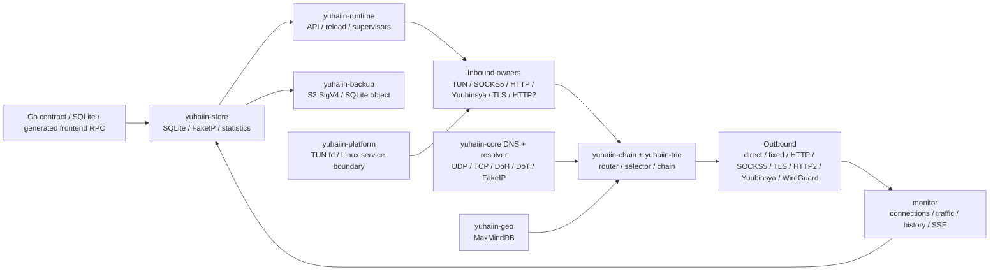

# yuhaiin Go → Rust 迁移清单

更新时间：2026-08-13

这是一份面向“Rust 二进制直接替换 Go 后端、前端不改”的活清单。它按模块记录 Go 的权威入口、Rust 的实现位置、可复现证据和剩余动作；不再使用 P1/P2。

运行约定：宿主机只负责路径准备、Podman 调度、curl 和结果收集；Rust/Go harness、测试函数、runtime、代理链、SQLite 副本和网络命名空间均在 Podman 中运行。构建缓存和测试状态只放在 `~/.cache/yuhaiin-rust`，不使用 `/tmp`。

缓存维护：`make cache-usage` 查看分层占用；`make cache-prune` 只清理超过
`YUHAIIN_CACHE_RETENTION_DAYS`（默认 1 天）的 integration/parity/benchmark 场景目录，保留
`cargo-target` 和 `fixtures`。需要预览时设置 `YUHAIIN_CACHE_DRY_RUN=1`；不会自动删除可复用
构建产物。一次性 cross/CI/musl target 也只有在显式设置
`YUHAIIN_CACHE_PRUNE_TRANSIENT=1` 后才会按固定 allowlist 清理；确认没有 cargo/rustc 运行时，
还可设置 `YUHAIIN_CACHE_PRUNE_DEBUG=1` 清掉 `cargo-target/debug` 的依赖中间产物，但保留
debug 二进制。所有临时状态仍放在 `~/.cache/yuhaiin-rust`，不使用 `/tmp`。

## 总体状态

| 指标 | 当前值 |
| --- | ---: |
| 纳入统计的验收项 | 48 |
| 已完成 `[x]` | 34 |
| 主路径可用但仍有现场/样本缺口 `[~]` | 14 |
| 有实际功能缺口 `[ ]` | 0 |
| 加权覆盖率 | **85.4%** = `(34 + 14 × 0.5) / 48` |
| 主目标 | Linux desktop：Rust 可启动、管理前端可接入、普通 inbound/outbound 可串联 |
| 当前结论 | **主路径已可在 Linux desktop 进行替换前验收**；rootful TUN 多路由 lease、RST/reconnect、graceful/SIGKILL teardown 和 TPROXY UDP delivery/idle/force-stop 已闭环，生产异常快照、真实 firewall 组合和第三方 WireGuard 仍是 `[~]` |

`[x]` 表示代码和对应测试/进程证据都存在；`[~]` 表示主路径已经能运行，但验证范围还不足以称为 Go 的完整替换；`[ ]` 表示仍有明确功能或现场证据缺口；`延期` 不计入 48 项统计。

## 架构边界



TUN 是 inbound 的一种。它和 SOCKS5、HTTP proxy、Yuubinsya、TLS/HTTP2 inbound 一样由 `inbounds` owner 管理；WireGuard 的 userspace stack 只属于 outbound，不创建第二个 OS TUN inbound。

## 模块状态

### 1. 公共数据面、NAT 和 TUN

| Go 权威入口 | Rust 位置 | 状态 | 证据 | 下一动作 |
| --- | --- | :---: | --- | --- |
| `pkg/net/netapi/*`、`pkg/net/proxy/proxy/*` | `crates/yuhaiin-core/src/lib.rs`、`proxy.rs`、`flow.rs` | `[x]` | `workspace-tests`、proxy/flow unit tests | — |
| `pkg/net/nat/table.go`、`source.go`、`migrate.go` | `crates/yuhaiin-core/src/nat.rs`、`nat_tests.rs`、`nat_process` | `[x]` | full-cone、多 source、rebind、idle reap、force-stop | — |
| `pkg/net/proxy/tun/tun.go`、`tun/device/*` | `crates/yuhaiin-core/src/tun.rs`、`tun_unit_tests.rs`、`tun_runtime_tests.rs` | `[~]` | `tun-rs AsyncDevice + smoltcp`；TCP/UDP/ICMP、fragment、DNS/FakeIP、NAT、真实 packet echo、rootful TCP+UDP fixed traffic、3-route lease、TCP RST/reconnect、graceful/SIGKILL teardown 已有；IPv4 kernel fragmentation 五档、IPv6 合法 MTU 四档和扩展头分片布局单测均通过；Debian VM 又通过了 TCP/reload/force-stop、MTU 1280 UDP 和 TLS/H2/Yuubinsya chain；桌面 supervisor 现在按 Go 语义为每个 enabled TUN inbound 管理独立 OS TUN/device/route lease，注入式 FD API 仍保持单设备 | 仍需补更广泛发行版/防火墙现场，以及真实内核 IPv6 extension-header 分片现场 |
| `pkg/net/proxy/tun/tun2socket/*`、`tun/gvisor/*` | 单一路径 `tun-rs + smoltcp` | `延期` | 按约定不同时维护 tun2socket 和第二套 userspace stack | 只有当前路径出现性能/兼容性问题时再评估 |
| `pkg/route/loopback.go`、`pkg/net/netlink/*` | `crates/yuhaiin-runtime/src/loopback.rs`、`interfaces.rs`、`crates/yuhaiin-core/src/tun.rs` | `[x]` | rootful TUN connection metadata 已逐字段固定 endpoint、localAddr、process、PID、UID 和 selected node；loopback guard 单测覆盖 | — |

### 2. DNS、FakeIP 和 MaxMindDB

| Go 权威入口 | Rust 位置 | 状态 | 证据 | 下一动作 |
| --- | --- | :---: | --- | --- |
| `pkg/net/dns/resolver/udp.go`、`tcp.go`、`dns.go` | `crates/yuhaiin-core/src/dns_resolver_async.rs`、`dns_udp_async.rs`、`dns_tcp_async.rs` | `[x]` | UDP/TCP resolver/server source-bind smoke 和 unit tests；新增完整 DNS packet boundary，MX/TXT/CNAME/NS/DNSSEC 等未建模 QTYPE 会保留原始报文、EDNS/DNSSEC 字段和 transaction id | — |
| `pkg/net/dns/resolver/doh.go`、`dot.go`、`dohjson.go` | `crates/yuhaiin-runtime/src/doh_tls.rs`、`dot_tls.rs`、`rustcrypto_resolver.rs` | `[x]` | DoH/DoT real TLS、HTTP/2、timeout、certificate、local bind tests；DoH/UDP/TCP 原始 DNS 报文透传复用同一 resolver boundary | — |
| `pkg/net/dns/server/server.go` | `crates/yuhaiin-runtime/src/data_plane.rs`、`crates/yuhaiin-core/src/dns_*` | `[x]` | 同一配置同时绑定 UDP/TCP，reload 复用同一 handler；运行时 DNS 对预加载 FakeIP 的 IPv4/IPv6 PTR 反向映射返回本地答案；长期运行的 TUN DNS handler 会在 resolver/FakeIP/`hijackDns` reload 后切换快照；未建模 QTYPE 走原始 upstream packet path | — |
| `pkg/net/dns/fakeip/*` | `crates/yuhaiin-store/src/fakeip.rs`、`resolver.rs`、`tun.rs` | `[x]` | 双栈 allocation/reverse/TTL/touch/reopen、Go Pebble NDJSON/v6 takeover、DNS packet hook；FakeDNS whitelist/skipCheckList 按 Go 优先级从 JSON/SQLite 加载，含 wildcard、query 和 overlay reload 单测 | — |
| `pkg/net/trie/maxminddb/*` | `crates/yuhaiin-geo/src/lib.rs` | `[x]` | 纯 Rust reader、SHA-256、atomic refresh、坏库 fail-closed、IPv4-mapped IPv6；`make maxmind-smoke` 使用用户指定的 `Country-without-asn.mmdb` 和固定 SHA-256 在 Podman 中查询真实库 | — |

### 3. Router、Trie 和 GeoIP

| Go 权威入口 | Rust 位置 | 状态 | 证据 | 下一动作 |
| --- | --- | :---: | --- | --- |
| `pkg/net/trie/domain/*`、`pkg/net/trie/cidr/*` | `crates/yuhaiin-trie/src/lib.rs`、`router.rs` | `[x]` | parent/wildcard/normalize、IPv4/IPv6 LPM、随机 naive model 对照 | — |
| `pkg/route/rule.go`、`nested.go`、`history.go` | `crates/yuhaiin-runtime/src/route.rs`、`crates/yuhaiin-trie/src/router.rs`、`crates/yuhaiin-runtime/src/proxy.rs` | `[x]` | priority、host/CIDR/port、all/any/not、negative matcher、match history，以及 Go `node_tags_v2` 的 node/mirror tag 数据面选择；TCP/UDP node set 均支持成员失败重试，且 tag endpoint 会同步到连接 metadata；Podman HTTP inbound→tag→HTTP outbound 链通过 | — |
| `pkg/route/list.go`、`downloader.go`、`contract.go` | `crates/yuhaiin-runtime/src/route.rs`、`api.rs` | `[~]` | local/HTTP route list、atomic cache、API mutation/reload；Podman loopback HTTP fixture 已验证 remote body→`.part` 原子缓存→reload→运行时 trie→`errorMsgs=[]`；RuntimeService 已按 Go 分钟语义启动可 reload/shutdown 的后台刷新 timer | 更多生产 route/resolver projection snapshot |
| `pkg/route/loopback.go`、process/inbound matchers | `crates/yuhaiin-runtime/src/loopback.rs`、`route.rs`、`proxy.rs` | `[x]` | process/inbound/local endpoint metadata 参与选择；自环 fail-closed | TUN 真实 kernel 现场另计 |

### 4. Protocol、transport 和 proxy chain

| Go 权威入口 | Rust 位置 | 状态 | 证据 | 下一动作 |
| --- | --- | :---: | --- | --- |
| `pkg/net/proxy/direct/*`、`fixed/*`、`fixedv2/*`、`drop/*`、`reject/*`、`http/*`、`mock/http.go` | `crates/yuhaiin-core/src/proxy.rs`、`crates/yuhaiin-core/src/proxy_factory.rs`、`crates/yuhaiin-protocol/src/http.rs`、`http_mock.rs`、`crates/yuhaiin-runtime/src/proxy/http.rs`、`proxy.rs` | `[x]` | direct/fixed/drop/reject(block)/HTTP CONNECT service chain；Go `drop` 的 per-destination 512-entry/5-second expiry adaptive delay、TCP/UDP write sink 和 delayed EOF 已与立即 reject 分离并由 core TCP/UDP tests 固定；域名 endpoint async resolve 已修复；Go `fixedv2` 的首地址与 alternate 地址会保留为有序 endpoint 列表，连接失败时按顺序回退；每地址 `network_interface` 会传到 Linux TCP/UDP socket 的 `SO_BINDTODEVICE`，并由 Podman 单测验证；Go outbound `http_mock` 的固定 GET 请求、runtime 节点映射和底层 datagram 透传已补齐，`yuhaiin-runtime` 进程 builder 的真实 TCP echo 测试通过；Go inbound `proxy`/`http_mock` 透明 transport 也复用普通 listener，`service-chain-smoke` 通过 2/2 实际 HTTP echo | — |
| `pkg/net/proxy/socks5/client.go`、`server.go` | `crates/yuhaiin-protocol/src/socks5.rs`、`socks5_server.rs`、`crates/yuhaiin-runtime/src/inbounds/socks5.rs` | `[x]` | TCP auth/request、UDP ASSOCIATE、IPv4/IPv6/domain framing、inbound/outbound chain | — |
| `pkg/net/proxy/socks4a/server.go`、`mixed/*` | `crates/yuhaiin-runtime/src/proxy/socks4a.rs`、`inbounds/mod.rs` | `[x]` | mixed inbound dispatches SOCKS4A/SOCKS5/HTTP | — |
| `pkg/net/proxy/tls/*` | `crates/yuhaiin-protocol/src/tls.rs`、`crates/yuhaiin-runtime/src/proxy/*` | `[x]` | RustCrypto TLS inbound/outbound、SNI、CA、insecureSkipVerify contract | — |
| Go `pkg/net/proxy/tls.NewTlsAutoServer`、`pkg/cert.GenerateServerCert` | `crates/yuhaiin-runtime/src/inbounds/tls_auto.rs` | `[~]` | 动态 SNI 叶子证书、精确/单标签 wildcard、DNS/IP SAN、ALPN、按配置域名共享证书缓存；RustCrypto X.509 builder 已兼容 Go 的 ECDSA P-256、Ed25519、RSA CA/PKCS#8，6 个 Podman focused tests 通过 | rustls server-side ECH 尚未有等价公开 API；补 Go/Rust live config 和 ECH 现场后再升为 `[x]` |
| `pkg/net/proxy/http2/v1/*`、`v2/*` | `crates/yuhaiin-chain/src/h2_tunnel.rs`、`h2_server.rs`、`crates/yuhaiin-core/src/http2.rs` | `[x]` | prior-knowledge、TLS ALPN、pool/drain/GOAWAY、HTTP CONNECT/SOCKS5 bridge | — |
| `pkg/net/proxy/yuubinsya/*`、`yuubinsya2/*` | `crates/yuhaiin-core/src/yuubinsya.rs`、`crates/yuhaiin-chain/src/session.rs`、`direct_uot.rs` | `[x]` | TCP、native UDP、UOT/dup-over-TCP、Ping、migration/reconnect、Go client interop | — |
| `pkg/net/proxy/aead/*` | `crates/yuhaiin-protocol/src/aead.rs`、`crates/yuhaiin-runtime/src/inbounds/mod.rs` | `[x]` | TCP/UDP wire and Go interop；入站 AEAD→HTTP/2、AEAD→WebSocket 共享 transport 解包，声明顺序逆置时仍按 Go listener wrapper 顺序解包；TLS→AEAD→HTTP/2 也由真实进程链验证；Podman focused/runtime tests 通过 | — |
| `pkg/net/proxy/websocket/*`、HTTP obfs | `crates/yuhaiin-protocol/src/websocket.rs`、`http_obfs.rs`、`crates/yuhaiin-runtime/src/proxy/websocket.rs` | `[x]` | Go WebSocket→HTTP/2 interop、fragmented headers、early data | — |
| `pkg/net/proxy/vless/*`、`vmess/*`、`trojan/*` | `crates/yuhaiin-protocol/src/{vless,vmess,trojan}.rs`、runtime counterparts | `[~]` | parser/runtime/unit coverage；`make service-chain-smoke` 在 Podman 中通过 API→HTTP inbound→domain router→普通 VLESS/VMess/Trojan outbound 的 TCP 3/3 payload echo，并新增 VLESS/VMess/Trojan 的普通、TLS+WebSocket TCP 7/7 payload echo，以及 VLESS/VMess 普通、TLS+WebSocket UDP 5/5 framing、connections、selected node、match history；Rust runtime builder 现在也覆盖 Go-compatible VLESS/VMess/Trojan TLS/WebSocket transport layer，且共享 stream transport builder；`make go-protocol-interop-smoke` 当前在 Podman 通过 14/14 个真实 Go listener/client wire test，覆盖 VLESS 双向普通/TLS/TLS+WebSocket、VLESS UDP、VMess 普通/TLS+WebSocket、Trojan 普通/TLS+WebSocket；本轮补齐 Go 兼容 VMess legacy `alter_id>0` 的 user 链、时间 HMAC、AES-128-CFB 请求/响应头和 MD5 body key/IV，协议 focused `39 passed, 0 failed, 2 ignored`、workspace all-features `40 passed, 0 failed, 2 ignored`，runtime legacy builder 回归通过 | 更广的 runtime listener/outbound、HTTP2、地址族和远端 UDP/真实远端组合矩阵 |
| `pkg/net/proxy/tproxy/*`、`redir/*` | `crates/yuhaiin-runtime/src/proxy/transparent.rs` | `[~]` | REDIRECT TCP、IPv4/IPv6 ancillary decoder unit tests；透明 TCP 现在复用普通 inbound transport 解包，TLS/TLS-auto/AEAD/http_mock allow-list 与 TLS→relay、AEAD→relay Podman unit 均已验证；PROXY protocol、HTTP/2、WebSocket 仍因会改变原始目的地址而显式拒绝；rootful iptables 与 native nft TPROXY UDP 均已完成 2 flow、original destination、reply/rebind、monitor 统计、socket readback、加速 idle reap；iptables/nft service SIGKILL 也已通过；Debian VM 现场再次通过 iptables、native nft 和 IPv6 REDIRECT | 真实生产 firewall/nftables 组合 matrix |
| `pkg/net/proxy/shadowsocks/*`、`shadowsocksr/*` | Rust protocol modules remain compatibility code | `延期` | 当前迁移范围不以 SS/SSR 为门槛 | 后续若 Go 未废弃再决定是否保留 |
| `pkg/net/proxy/quic/*`、`reality/*`、`mux/*`、`tailscale/*` | — | `延期` | 用户明确暂不实现 | 不阻塞 Linux desktop replacement |

### 5. WireGuard outbound

| Go 权威入口 | Rust 位置 | 状态 | 证据 | 下一动作 |
| --- | --- | :---: | --- | --- |
| `pkg/net/proxy/wireguard/{wireguard,bind,device}.go` | `crates/yuhaiin-wireguard/src/lib.rs`、`crates/yuhaiin-runtime/tests/wireguard_chain.rs` | `[~]` | Cloudflare `boringtun 0.7.1`、reserved/base64/PSK/keepalive/AllowedIPs、smoltcp TCP/UDP adapter；本地双 peer 已验证 authenticated endpoint roaming 和完整 UDP session；runtime WireGuard 现在让 peer endpoint 和最终目标都使用配置 resolver，驱动初始化也在构建返回前完成 ready/error 握手；`make wireguard-chain-smoke` 在 Podman 通过真实 runtime HTTP/TCP 与 SOCKS5/UDP inbound→CIDR router→WireGuard outbound→BoringTun peer 的 TCP/UDP echo、连接元数据和 latency；最新 packet benchmark 为 596.28 MiB/s、peak RSS 3,480 KiB | 真实第三方/WARP peer、真实链路 keepalive/NAT endpoint 变化 |
| Go `WireGuard` node config | `crates/yuhaiin-store/src/compat_proxy*.rs`、`crates/yuhaiin-runtime/src/proxy.rs` | `[x]` | `make wireguard-smoke`：Podman `--network=none` 双 userspace peer，9/9（另 1 个 benchmark ignored） | — |
| Go packet path | `scripts/benchmark/wireguard.sh` | `[x]` | release BoringTun packet benchmark，结果只作同机回归基线 | 公网/第三方链路性能不能由本地 benchmark 推断 |

### 6. SQLite、配置兼容、FakeIP persistence 和统计

| Go 权威入口 | Rust 位置 | 状态 | 证据 | 下一动作 |
| --- | --- | :---: | --- | --- |
| `pkg/storage/sqlite/{sqlite,migrations,compact}.go` | `crates/yuhaiin-store/src/sqlite.rs`、`schema.rs`、`migration.rs` | `[x]` | `rusqlite + bundled SQLite`、WAL、busy timeout、quick check、rollback、backup/restore、force-stop | — |
| `pkg/store/{node,inbound,resolver,route_*,settings,backup}.go`、`pkg/app/backup.go`、`pkg/s3/*` | `crates/yuhaiin-store/src/repository.rs`、`compat_runtime.rs`、`crates/yuhaiin-backup/src/lib.rs`、`tests/*` | `[~]` | typed repository、Go v1/v5/v6/schema-7、unknown JSON、users/routes/tags/settings/NAT；S3 SigV4 PUT/GET、Go camelCase 配置、BLAKE2b `lastBackupHash` 和选中 outbound proxy transport 已接入 API，并由本地兼容端点 wire test、runtime API test、`make s3-minio-smoke` 的真实 MinIO Podman 上传/下载覆盖 | 真实 AWS 权限现场，以及更多异常快照逐表 diff |
| `pkg/net/dns/fakeip/sqlite.go`、`pool.go` | `crates/yuhaiin-store/src/fakeip.rs` | `[x]` | reopen、cursor、release、capacity、dual-stack 和 legacy import | 更多生产容量/TTL 样本 |
| `pkg/statistics/{sqlite,statistic,telemetry,conn}.go` | `crates/yuhaiin-store/src/statistics.rs`、`crates/yuhaiin-runtime/src/monitor.rs` | `[~]` | traffic/history/telemetry、Go projection、SSE、并发 reader/writer、force-stop recovery；Go/Rust live-flow parity 与 API history UTC 已验证；新增真实前台 HTTP flow 的 SSE 初始/新增/移除、close、total/traffic/telemetry/history 进程测试；`make stats-soak-smoke` 在 Podman 中以 12 readers×160 rounds、256 writes 通过 | 更长 production projection、升级期间 lock contention |

### 7. Runtime、inbound owner、API 和实时观察面

| Go 权威入口 | Rust 位置 | 状态 | 证据 | 下一动作 |
| --- | --- | :---: | --- | --- |
| `pkg/node/runtime.go`、`pkg/inbound/*` | `crates/yuhaiin-runtime/src/controller.rs`、`inbounds/mod.rs` | `[x]` | immutable snapshot、atomic reload；普通 node/route/resolver reload 只替换已注册 live selector，并同步长期 TUN DNS handler，inbound/user/selected-node/apply 才发送专用事件重绑 listener；HTTP CONNECT 持久连接在 route reload 期间继续传输，inbound reload 仍采用 latest-wins | — |
| `pkg/inbound/*`、`pkg/net/proxy/{http,socks5,yuubinsya,tls}.go`、`pkg/net/proxy/reverse/*` | `crates/yuhaiin-runtime/src/inbounds/*`、`proxy/*` | `[x]` | inbound→router→outbound service chain；HTTP/SOCKS5/Yuubinsya/TLS/HTTP2/mixed/reverse；Go 的 `proxy`/`http_mock` server transport 透明 wrapper 已纳入普通 listener；Podman 真实前台进程已覆盖 reverse TCP raw relay 和 reverse HTTP path/Host rewrite、direct outbound、connections metadata，以及透明 transport 2/2 HTTP echo；新增 AEAD→HTTP/2→HTTP、TLS→AEAD→HTTP/2→HTTP outbound 真实进程链 | — |
| Go TUN inbound contract | `crates/yuhaiin-runtime/src/inbounds/mod.rs`、`data_plane.rs` | `[~]` | TUN 作为 inbound supervisor；真实 user+network namespace、rootful TCP+UDP fixed traffic、multi-route lease、reload、RST/reconnect、graceful/SIGKILL teardown 已通过；真实 kernel IPv4 五档、IPv6 合法 MTU 四档 fragmentation matrix 已通过；扩展头分片布局在 Podman core harness 中通过；`tun-api-process-smoke` 编译和运行均在 Podman，验证真实前台二进制通过 API 对默认禁用 TUN、单个新增 TUN 和两个同时 enabled 的 TUN 做开关，两个设备可同时在 `/proc/net/dev` 出现并独立关闭 | 继续补更广泛发行版/firewall 组合和真实 IPv6 extension-header 现场 |
| `pkg/httpapi/v2*.go`、`register.go` | `crates/yuhaiin-runtime/src/api.rs` | `[x]` | generated frontend RPC route coverage、read/mutation/error parity、API reload/live flow；`inbounds/config` 的 DNS 劫持变更会触发 inbound owner reload | 更多生产 response 字段样本 |
| `pkg/net/netapi/{conn,server}.go`、`pkg/statistics/notify.go` | `crates/yuhaiin-runtime/src/monitor.rs`、`log.rs`、`service.rs` | `[~]` | connections、SSE、traffic、history、telemetry、node latency、pprof、启动日志；TUN 在出站 TCP/UDP socket 建立前先发布 pending flow，建链后以同一 ID merge `localAddr/underlyingType/protocol`，并以 Go-compatible `connections_added` 更新事件回填；新增真实前台 API 进程测试覆盖连接字段、SSE 初始/新增/移除、close、total/traffic/telemetry/history；新增 monitor 单测，Podman workspace 283 runtime tests、Go/Rust live stats parity 通过 | 完整 response/历史数据逐字段 parity |
| Go service lifecycle | `crates/yuhaiin-runtime/src/service.rs`、`src/bin/service/*`、`src/update.rs` | `[~]` | Linux systemd install/rollback/health smoke；macOS launchd plist/bootstrap/kickstart、Windows Service SCM install/start/stop/delete/recovery-actions/health/rollback 已实现；update helper 的成功安装、保留 rollback image、restart failure 恢复和 staged retry 均有单测；foreground 默认 stderr progress | macOS/Windows 真实权限现场安装、更新和回滚 |

### 8. Platform boundary

| Go 权威入口 | Rust 位置 | 状态 | 证据 | 下一动作 |
| --- | --- | :---: | --- | --- |
| `pkg/net/proxy/tun/device/*`、`pkg/net/netlink/*` | `crates/yuhaiin-platform/src/lib.rs`、`yuhaiin-core::TunRuntime` | `[~]` | Unix owned FD、Linux desktop TUN、injected FD boundary、纯 Rust route manager、rootful multi-route lease/teardown、IPv4/IPv6 kernel fragmentation；IPv6 扩展头分片布局也已在 Podman core harness 覆盖；桌面 enabled TUN 使用独立设备和可回收 route lease，TUN DNS handler 支持 resolver/inbound policy hot reload | 更广泛发行版 firewall 现场和真实 IPv6 extension-header 分片现场 |
| Android `VpnService` / AAR host | `TunRuntime::from_owned_fd` API 已预留 | `延期` | 当前范围先完成纯 desktop replacement | 后续同步修改 yuhaiin-android |
| macOS utun / app lifecycle | platform boundary 文档和接口已留口 | `延期` | 当前范围不计入 desktop Linux 覆盖率 | 后续单独验收 |

## Inbound / outbound 能力矩阵

| 能力 | Inbound | Outbound | 当前状态 |
| --- | :---: | :---: | :---: |
| direct / reject(block) / drop / fixed | fixed/direct listener | 是 | `[x]` |
| HTTP proxy / CONNECT | 是 | 是 | `[x]` |
| SOCKS5 TCP | 是 | 是 | `[x]` |
| SOCKS5 UDP ASSOCIATE | 是 | 是 | `[x]` |
| mixed / mix UDP | 是 | 是 | `[x]` |
| SOCKS4A | 是 | — | `[x]` |
| TLS | 是 | 是 | `[x]` |
| HTTP/2 | 是 | 是 | `[x]` |
| Yuubinsya TCP | 是 | 是 | `[x]` |
| Yuubinsya native UDP | 是 | 是 | `[x]` |
| Yuubinsya UOT / dup-over-TCP | 是 | 是 | `[x]` |
| reverse TCP / reverse HTTP | 是 | — | `[x]`：真实前台进程分别验证 raw relay、HTTP path/Host rewrite、direct outbound 和 connections metadata |
| TUN | 是 | — | `[~]`：真实 user/rootful data-plane、每个 enabled inbound 独立设备、3-route lease、reload、reset/reconnect、teardown、IPv4 五档和 IPv6 合法 MTU 四档 fragmentation 通过；扩展头布局单测通过，更广泛 firewall/真实 extension-header 现场仍补 |
| redir TCP / TPROXY UDP | 是 | — | `[~]`：TLS/TLS-auto/AEAD transport 可在透明 TCP listener 上先解包再 relay；rootful iptables/nft 2-flow delivery、original destination、回包/rebind、idle reap、force-stop 通过；真实生产 firewall matrix 仍补充 |
| DNS UDP / TCP / DoH / DoT | server/client | resolver/client | `[x]` |
| WireGuard | — | 是 | `[~]`：BoringTun userspace adapter 已通过本地双 peer |
| Cloudflare WARP MASQUE | — | — | `延期`：Go 侧依赖 QUIC/HTTP3；当前范围明确延期 QUIC/DoH3，不把它误报成 WireGuard 缺口 |
| DoQ / DoH3、QUIC、Reality、Mux、Tailscale | — | — | `延期` |
| Shadowsocks / ShadowsocksR | — | — | `延期` |

## 可执行 checklist（唯一未完成清单）

### Linux 权限和数据面

- `[x]` Debian VM rootful Podman 已通过基础 TUN route lease、普通 packet echo、3 次 reload、MTU 五档、TLS/H2/Yuubinsya chain 和 force-stop teardown。
- `[x]` `make tun-route-matrix-smoke` 的 rootful Podman matrix 已通过 3 条真实 IPv4 routes（含 metric）：owner 存活时可见，graceful close 与 owner SIGKILL 后均 absent；日志位于 `~/.cache/yuhaiin-rust/integration/tun-route-matrix/`。
- `[x]` rootful TUN 已通过 TCP RST 后重新建立连接并完成 echo；smoltcp dispatcher 的 fragment reassembly、overlap、expiry、overflow 和恢复已有单元/模拟 packet 覆盖。
- `[x]` rootful runtime-owned TUN 已通过同一服务内的 TCP+UDP fixed outbound traffic；UDP 客户端使用独立子进程避开 loopback guard，虚拟 routed destination 回包源地址由 smoltcp 单测固定为目标地址。
- `[x]` 真实 kernel IPv4 fragmentation 已在 Debian VM rootful Podman 通过 MTU 576/1280/1500/9000/9216 五档；每档均回环最大合法 IPv4 UDP payload 65507 字节，覆盖 kernel ingress 分片、smoltcp 重组、smoltcp 出方向分片和 kernel egress 重组。
- `[x]` IPv6 ingress/egress fragmentation 已在 Debian VM rootful Podman 通过合法 MTU 1280/1500/9000/9216 四档；每档均回环最大合法 IPv6 UDP payload 65507 字节，覆盖 kernel ingress 分片、Rust ingress 重组、proxy echo、TUN boundary egress 分片和 kernel egress 重组。IPv6 MTU 576 按协议最低 MTU 约束 fail-closed，不作为合法档位。
- `[x]` 在同一 rootful namespace 执行 TPROXY UDP：默认 iptables 与 native nft backend 均通过 transparent socket readback、original destination `10.254.1.2:18082`、local listener `0.0.0.0:18083`、两个 source flow、回包、rebind 和 upload/download monitor 统计。
- `[x]` TPROXY UDP 在 rootful VM 用测试专用 1 秒 timeout 验证了 2 个 flow 的 idle reap；iptables 与 native nft 均通过 service SIGKILL 后的进程级观测，生产默认仍保持 90 秒 `UDP_IDLE_TIMEOUT`。
- `[~]` 真实生产 firewall/nftables 组合 matrix 仍待补；透明 TCP 的 TLS wrapper 已复用 `prepare_inbound_stream` 并有 Podman unit 覆盖，公共 `UDP_IDLE_TIMEOUT`/reap/close 单测、容器 namespace teardown 和 Debian VM 的 iptables/native nft/IPv6 REDIRECT 现场已覆盖基础生命周期。
- `[~]` 将当前 user+network namespace TUN smoke 保持为 CI 默认路径；它证明真实 kernel TUN packet path，但 rootful route takeover 另由 `tun-route-matrix-smoke` 验证。
- `[x]` IPv6 出方向扩展头分片布局已在 Podman `network=none` 中通过：Hop-by-Hop、Routing、Routing 后 Destination Options、分片重组和重复分片拒绝均有断言；真实内核对该组合的端到端现场仍待补。
- `[x]` rootful TUN connection metadata 已在 rootful fixture 中逐字段固定 endpoint/localAddr、selected node、process、PID 和 UID；本轮现场为 `/usr/local/bin/tun-service-smoke`、pid `7`、uid `0`。
- `[x]` `make tun-api-process-smoke` 的编译和运行均在 Podman disposable user/network namespace 中完成；真实 `yuhaiin` 前台进程通过 HTTP API 验证默认 TUN、新增 TUN 和两个同时 enabled 的 TUN，两个设备可同时在 `/proc/net/dev` 出现，随后 secondary 独立关闭而 primary 保持运行，再完成完整 disabled → enabled → disabled → enabled → disabled 回归。

### Go 生产兼容和统计

- `[~]` 对更多停止态 Go SQLite 做逐表 schema/未知表/异常快照 diff；当前 3 份停止态 snapshot 的 API read/mutation/error parity 已通过，源库只读，副本和结果放 `~/.cache/yuhaiin-rust`。
- `[~]` 增加长时间 telemetry/history、升级中 lock contention、强停和 reload 组合样本。
- `[x]` 使用缓存中的停止态 Go `state.db` 做 Go/Rust API read + core mutation parity；包括 `connections.history` 的 UTC 时间格式、节点/入站/解析器/路由/发布/订阅 deferred 错误 contract。
- `[x]` refact-user 分支的 users API parity harness 现在也完全在 Podman 中运行；先在容器内让 Rust 接管 prepared SQLite，再用独立 Go/Rust 容器对 basic/UUID/token 的 create/update/get/list/delete、node reference conflict 和 missing-user 错误做对照。
- `[~]` S3 backup 已不再静默退化为本地备份：`backup.run` 按 Go object name 上传，`backup.restore` 空请求按配置下载，失败返回 unavailable；SigV4、本地兼容端点、Go BLAKE2b hash 和“经选中 outbound proxy 访问 S3”的 HTTP/HTTPS transport 已测试。`make s3-minio-smoke` 已在 Podman 通过真实 MinIO 完成 bucket 创建、SigV4 PUT/GET、object 校验和 restore 下载；真实 AWS 权限现场及更多异常快照逐表 diff 仍待补。
- `[x]` 统计公开契约已逐字段对齐：connections 的完整 metadata/matchHistory、total 的 string counters、traffic 的 UTC bucket、telemetry 的固定九维/失败计数、history/failed-history/block-history 的 process、count、time、dumpProcessEnabled 和 API 1000 条边界均有单测或 Podman parity；失败项按 `(protocol, host, process)` 分组，阻断历史不再丢失进程标志，同时保留 Go failed-history 全量 SQLite 语义。
- `[x]` route list `refreshInterval` 已由 RuntimeService 持有后台 timer：配置 reload 立即重读，刷新产生的 reload 不会忙循环，服务 shutdown 会停止任务；定时刷新夹具验证 `lastRefreshTime` 和 reload 生命周期。
- `[~]` 补完整 API response 字段、更多生产 route/resolver projection 和 MaxMind country projection 样本；Go 当前 MaxMind 接口只暴露 country，不额外把 ASN 当作迁移缺口；remote route refresh 的持久化错误字段已补齐。
- `[x]` Runtime DNS handler 在 socket/TUN 共用边界上恢复预加载 FakeIP 的 `in-addr.arpa`/`ip6.arpa` PTR 映射；未知 PTR 仍按上游 resolver 的现有能力处理。
- `[x]` Go inbound `proxy` 与 `http_mock` transport 已按其真实 `NewServer` 语义复用普通 listener；allow-list 单测覆盖大小写和 deferred transport，Podman `service-chain-smoke` 的 18/18 进程链包含两种透明 wrapper 的 HTTP echo。
- `[x]` 入站 transport 组合按 Go listener 声明顺序通过真实进程链验证：`TLS → AEAD → HTTP/2 → HTTP outbound`，包含 TLS/AEAD 解包、H2 CONNECT、router、SQLite connections、流量统计和 HTTP authority。
- `[~]` Go `tls_auto` inbound 已进入普通 TCP/TLS listener：从 Go-shaped `ca_cert`/`ca_key`/`servernames`/`next_protos` 生成动态 SNI 证书，支持 ECDSA P-256、Ed25519、RSA CA 和 wildcard/SAN；runtime focused test 在 Podman 通过 6/6。ECH server key API 仍保留为明确缺口，不伪装成完整支持。

### WireGuard 外部兼容

- `[~]` 使用真实第三方/WARP peer 验证 reserved、handshake、keepalive 和 NAT endpoint 变化；本地 authenticated roaming 及 TCP/UDP userspace session 已由双 peer 单测覆盖。`make wireguard-external-smoke` 已提供用户配置驱动的 Podman host-network 入口。Go WireGuard contract 没有独立的 `network_interface` 字段；仍需第三方现场确认 endpoint roaming 和真实链路行为。
- `[x]` 保持本地双 peer smoke 和 release packet benchmark；两者只证明协议/适配器正确性和同机趋势，不宣称公网性能。

### CI 与发布（不计入上面的 48 项功能覆盖率）

- `[~]` `.github/workflows/rust.yml` 已加入 Rust/Podman 检查、Linux `x86_64/aarch64-unknown-linux-musl`、Darwin `x86_64/aarch64`、Windows `x86_64/aarch64` 六项 release matrix；`make release-contract-smoke` 会在 CI checks 阶段锁定六个 target、产物名、checksum 和 rolling-main 发布条件，Podman actionlint 也已通过，仍需第一次 GitHub Actions 远程运行确认 runner/SDK 的现场差异。
- `[x]` 旧 Actions 的 `trojan.rs` `clippy::byte-char-slices` 已通过 `*b"\r\n"` 修复，`rusqlite 0.39.0` / `libsqlite3-sys 0.37.0` 锁定；Rust 1.97.1 Podman 中 fmt、全 workspace Clippy 和 workspace tests 均通过。HTTP/2 pool 的 key 还纳入 endpoint `network_interface`，避免相同地址的不同网卡策略复用连接。
- `[x]` 发布资产名称与运行时 update contract 对齐：`yuhaiin-{linux,darwin,windows}-{amd64,arm64}`，Windows 保留 `.exe`；`v*` tag 发布稳定 release，`main` 生成可覆盖的 rolling prerelease 并更新 `main` tag。
- `[~]` macOS launchd 与 Windows Service 的安装/更新/回滚代码、跨 target 编译和单测已完成；update helper 的替换事务已通过注入 platform hooks 覆盖成功与 restart failure rollback；真实 launchd/SCM 权限现场及远程 Actions 首次运行仍待验收。

### 主动延期（本轮不阻塞）

- `延期` DoQ、DoH3、QUIC、Reality、Mux、yamux、Tailscale。
- `延期` Cloudflare WARP MASQUE（依赖 QUIC/HTTP3）；WireGuard userspace 仍使用已验证的 Cloudflare BoringTun。
- `延期` Shadowsocks、ShadowsocksR、订阅。
- `延期` Android 独立应用、AAR/JNI/VpnService lifecycle、macOS utun/独立应用；macOS launchd 桌面服务已纳入本轮。

## 最近一次可复现证据

| 命令 | Podman 场景 | 结果 |
| --- | --- | --- |
| `make tun-chain-service-smoke`（2026-08-13 当前轮） | disposable user/network Podman namespace；runtime、真实 TUN、echo target 和临时状态均在容器，日志位于 `~/.cache/yuhaiin-rust/integration/tun-chain-service` | `runtime-tun-chain-ready`、`runtime-tun-traffic-ok`、`runtime-tun-closed` 全部通过；实际链路为 TUN → fixed → TLS → HTTP/2 → Yuubinsya → echo |
| `make wireguard-chain-smoke`（2026-08-13 当前轮） | Podman `--privileged --network=none`；runtime、BoringTun peer、SQLite 和 harness 均在容器，日志位于 `~/.cache/yuhaiin-rust/integration/wireguard-chain` | `2 passed, 0 failed`；HTTP/TCP 与 SOCKS5/UDP 两条 inbound → CIDR router → Cloudflare BoringTun WireGuard outbound 链均通过 |
| `make wireguard-smoke`（2026-08-13 resolver/ready 修复后） | Rust 1.97.1 Podman；WireGuard 单测和状态均在容器，日志位于 `~/.cache/yuhaiin-rust/integration/wireguard` | `9 passed, 0 failed, 1 ignored`；新增 peer endpoint 使用注入 resolver、驱动初始化错误边界回归，保留 BoringTun authenticated handshake、reserved、keepalive、AllowedIPs、TCP/UDP userspace session 和 Linux interface bind 覆盖 |
| `make api-contract-smoke`（2026-08-13 当前轮） | `network=none` Podman；真实前台 runtime 和 API contract harness 均在容器，日志位于 `~/.cache/yuhaiin-rust/integration/api-contract` | `4 passed, 0 failed`；前端管理 API round-trip、嵌套路由 match history、direct domain latency，以及真实 HTTP inbound→router→HTTP outbound 的 SSE 初始/新增/移除、连接字段、close、total/traffic/telemetry/history 全部通过 |
| `make service-chain-smoke`（2026-08-13 当前轮） | Podman host-network；runtime/process harness 和目标 listener 均在容器，日志位于 `~/.cache/yuhaiin-rust/integration-reusable` | `20 passed, 0 failed`；包含 mixed UDP、TLS/H2/Yuubinsya、VLESS/VMess/Trojan TCP/UDP、reverse、透明 wrapper 和实时状态链 |
| `make startup-logs-smoke`（2026-08-13 当前轮） | 前台 runtime 和日志采集 harness 均在 Podman，日志位于 `~/.cache/yuhaiin-rust/integration/startup-logs` | 通过；无参数启动会输出 database、HTTP bind/listening、runtime ready、TUN 状态和 shutdown 日志，排除“二进制无输出像卡死”的问题 |
| `make tun-api-process-smoke`（2026-08-13 当前轮） | privileged/disposable Podman user+network namespace、真实 `/dev/net/tun`，日志位于 `~/.cache/yuhaiin-rust/integration/tun-api-process` | `1 passed, 0 failed`；API 热开关验证单个 TUN 与两个同时 enabled TUN 的独立出现/消失和反复 disable→enable→disable |
| `make systemd-service-smoke`（2026-08-13 当前轮） | disposable Fedora systemd Podman，安装路径、unit、数据库和 backup 全在容器，日志位于 `~/.cache/yuhaiin-rust/integration/systemd-service` | 通过；install、health、故意失败后的自动 rollback、显式 rollback 全部通过 |
| `make release-contract-smoke`（2026-08-13 当前轮） | 运行 release contract 静态检查 | 通过；锁定 Linux musl、Darwin、Windows 的 amd64/arm64 六目标、产物命名、checksum、checks gate 和 rolling-main 发布契约 |
| `make benchmark-throughput`（2026-08-13 当前轮） | release runtime/benchmark 均在 Podman host network，64 MiB 单流 | HTTP CONNECT `158.39 MiB/s`、peak RSS `17,904 KiB`；TLS/H2/Yuubinsya `33.38 MiB/s`、peak RSS `20,320 KiB` |
| `make benchmark-tun-throughput`（2026-08-13 当前轮） | privileged Podman、真实 kernel TUN、4 MiB 单流 | TUN→fixed→loopback `44.88 MiB/s`、peak RSS `13,224 KiB` |
| `make benchmark-wireguard-throughput`（2026-08-13 当前轮） | `--network=none` Podman、Cloudflare BoringTun userspace | 64 MiB packet baseline `596.28 MiB/s`、peak RSS `3,480 KiB`；仅作为同机趋势基线，不外推公网链路 |
| `make production-parity-smoke`（2026-08-13 当前轮） | 3 份停止态 Go SQLite；Go/Rust 编译、服务、复制数据库和 curl harness 均在 Podman，结果位于 `~/.cache/yuhaiin-rust/production-parity` | `3/3` 通过；info/settings/nodes/inbounds/resolvers/routes/publishes/connections/统计读接口、全部核心 mutation、错误矩阵逐项 identical |
| `make go-live-flow-parity-smoke`（2026-08-13 当前轮） | Go/Rust 前台服务、sidecar proxy、HTTP inbound→router→HTTP outbound 和 SQLite 均在 Podman | 通过；Go/Rust 真实流量、connections/total/traffic/history/telemetry 与 reload 后统计 parity |
| `make go-protocol-interop-smoke`（2026-08-13 当前轮） | Go helper/client/server、Rust harness 和状态均在 Podman host network；日志位于 `~/.cache/yuhaiin-rust/integration/go-protocol-interop` | `14 passed, 0 failed`；修复 harness 编译时 `/workspace` 与运行时挂载不一致后，Yuubinsya、WebSocket/H2、H2 v1、VLESS TCP/UDP、VMess、Trojan Go↔Rust wire tests 全部通过 |
| `cargo test -p yuhaiin-runtime --all-features --offline --lib transparent_tls_transport_is_unwrapped_before_relay -- --nocapture --test-threads=1`（2026-08-12 当前轮） | Rust 1.97.1 Podman、host network；编译/运行和状态均位于 `~/.cache/yuhaiin-rust` | `1 passed, 0 failed`；真实 RustCrypto TLS handshake → transparent relay → direct outbound → TCP echo |
| `cargo test -p yuhaiin-runtime --all-features --offline --lib transparent_ -- --nocapture --test-threads=1`（2026-08-12 当前轮） | Rust 1.97.1 Podman、host network；状态位于 `~/.cache/yuhaiin-rust` | 透明 transport 相关 `5 passed, 0 failed`；allow-list、TLS→relay、AEAD→relay 和原有 REDIRECT listener 单测 |
| `make transparent-service-smoke`（2026-08-12 当前轮） | privileged Podman transparent namespace；运行日志位于 `~/.cache/yuhaiin-rust/integration/transparent-service` | REDIRECT TCP 2 flows、upload/download、关闭流程通过；rootless capability policy 下 TPROXY UDP 明确 skipped |
| `cargo test -p yuhaiin-runtime --all-features --offline --lib -- --nocapture --test-threads=1`（2026-08-12 当前轮） | Rust 1.97.1 Podman、host network；状态位于 `~/.cache/yuhaiin-rust` | `280 passed, 0 failed` |
| `cargo test -p yuhaiin-runtime --all-features --offline --lib -- --nocapture --test-threads=1`（2026-08-13 WireGuard resolver 修复） | Rust 1.97.1 Podman；编译、运行和状态均位于 `~/.cache/yuhaiin-rust` | `281 passed, 0 failed`；新增 WireGuard 域名目标使用配置 resolver 的回归测试 |
| `cargo test -p yuhaiin-protocol --lib` + `cargo test -p yuhaiin-runtime --lib go_vmess_legacy_alter_id_builds_runtime_proxy`（2026-08-13 VMess legacy 兼容） | Rust 1.97.1 Podman；编译、运行和临时状态均位于 `~/.cache/yuhaiin-rust` | 协议 `39 passed, 0 failed, 2 ignored`；runtime legacy builder `1 passed, 0 failed`；覆盖 alter-id user 生成、时间 HMAC、AES-128-CFB 头、MD5 响应头以及 runtime 配置接入 |
| `make service-chain-smoke`（2026-08-13 VMess legacy 兼容后复核） | runtime/process harness 在 Podman host-network；日志位于 `~/.cache/yuhaiin-rust/integration-reusable` | `20 passed, 0 failed`；包含普通/TLS+WebSocket 的 VLESS/VMess/Trojan TCP/UDP chain、TUN 相关链和透明 wrapper |
| `cargo clippy --locked --workspace --all-targets --all-features --offline -- -D warnings`（2026-08-13） | disposable Podman Rust 1.97.1；clippy component 仅安装在容器层 | 通过；宿主没有编译或运行 Rust 测试 |
| `cargo test -p yuhaiin-runtime --all-features --offline --test service_chain tls_aead_http2_inbound_routes_through_http_outbound -- --nocapture --test-threads=1`（2026-08-12 当前轮） | Rust 1.97.1 Podman、host network；编译/运行和状态均位于 `~/.cache/yuhaiin-rust` | `1 passed, 0 failed`；真实 `TLS → AEAD → HTTP/2 → HTTP outbound` 进程链，覆盖 TLS ALPN、XChaCha20 解包、H2 CONNECT、router、SQLite connections/traffic 和 HTTP authority |
| `make service-chain-smoke`（2026-08-12 当前轮） | service-chain harness/runtime 均在 Podman host-network，日志位于 `~/.cache/yuhaiin-rust/integration-reusable` | `20 passed, 0 failed`；保留既有 19 条矩阵并新增 TLS→AEAD→HTTP/2 组合 |
| `cargo test -p yuhaiin-runtime --all-features --offline --lib`（2026-08-12 当前轮） | Rust 1.97.1 Podman、host network；编译/运行在容器，状态和临时目录位于 `~/.cache/yuhaiin-rust` | 276/276 通过；包含 AEAD→HTTP/2、AEAD→WebSocket 真实 TCP flow，以及 TLS/AEAD wrapper 声明顺序单测。一个历史 route-list HTTPS fixture 测试访问外部地址，未作为本轮功能依赖 |
| `make workspace-tests`（2026-08-12 当前轮，AEAD composition 接入后） | 48 个 harness；编译和运行均在 isolated/stats/host-network Podman 分组 | chain 55、core 148、runtime 275、store 131（5 ignored）、service-chain 19、WireGuard 8（1 benchmark ignored）、WireGuard runtime chain 2、stats concurrency 2；0 失败。随后只增加 wrapper-order 单测，已由上行 runtime 276/276 覆盖 |
| `make workspace-tests`（2026-08-13 Makefile 容器化后复核） | 48 个 harness；编译和运行均在 Podman，日志位于 `~/.cache/yuhaiin-rust/integration/workspace-tests` | chain 55、core 150、runtime 283、store 131（5 ignored）、trie 27、service-chain 20、WireGuard 8（1 benchmark ignored）、WireGuard runtime chain 2、stats concurrency 2；0 失败；外部 WARP 2 项按需配置显式 ignored |
| `make workspace-tests`（2026-08-13 drop/reject compatibility） | 48 个 harness；Rust 编译和所有 harness 均在 Podman，状态位于 `~/.cache/yuhaiin-rust/integration/workspace-tests` | core 153、runtime 283、store 131（5 ignored）、chain 55、trie 27、service-chain 20、WireGuard 8（1 benchmark ignored）、WireGuard runtime chain 2、stats concurrency 2；0 失败；新增 core drop TCP/UDP 行为与 Go `reject/block` 导入回归 |
| `cargo clippy --locked --workspace --all-targets --all-features --offline -- -D warnings`（2026-08-12 当前轮） | Rust 1.97.1 Podman，一次性安装缺失的 clippy component，cargo registry/target 挂载自用户缓存 | Clippy 通过；当前镜像缺少 rustfmt component，宿主只做只读 `rustfmt --check` 和 `git diff --check`，没有在宿主编译/运行测试 |
| `cargo test --locked --workspace --all-features --offline --no-fail-fast -- --test-threads=1`（2026-08-12 当前轮） | Rust 1.97.1 Podman，`network=host`，临时目录在用户缓存 | chain 55、core 148、runtime 269、store 131（5 ignored）、service-chain 18、WireGuard 8（1 benchmark ignored），0 失败 |
| `make workspace-tests`（2026-08-12 当前轮） | 48 个 harness；编译和运行均在 isolated/stats/host-network Podman 分组 | chain 55、core 148、runtime 269（含 `tls_auto` focused 6/6）、store 131（5 个 ignored）、service-chain 18、WireGuard 8（1 个 benchmark ignored）、WireGuard runtime chain 2；0 失败 |
| `make workspace-tests`（2026-08-12 update helper） | 编译、运行均在 Podman；宿主机只调度 | `run_update_helper` 成功替换、保留 `.update-backup`、重启失败恢复旧 binary 和保留 staged retry 两项单测通过 |
| `YUHAIIN_SOURCE_DB=... make go-api-parity-smoke`（2026-08-12 当前轮） | Go/Rust 编译和服务均在 Podman；Go/Rust 使用独立数据库副本，宿主只驱动 curl | info/settings/nodes/inbounds/resolvers/routes/publishes/connections、全部 mutation 和错误矩阵 identical |
| `make production-parity-smoke`（2026-08-12 当前轮） | 3 份停止态 Go v5/v6/AWS-shaped snapshot；Go/Rust 编译和服务均在 Podman | 3/3 API read、core mutation、error matrix identical |
| `yuhaiin-runtime` remote route-list refresh 单测（2026-08-12 当前轮） | Rust 测试二进制在 Podman `network=none`；loopback HTTP fixture；状态位于 `~/.cache/yuhaiin-rust` | remote body 下载、atomic cache、runtime snapshot reload、activation `refreshed/errors` 和 detail `errorMsgs=[]` 全部通过 |
| `make refact-user-parity-smoke`（2026-08-12 当前轮） | Go refact-user、Rust 编译/服务、prepared SQLite 均在 Podman；宿主只调度 curl | basic/UUID/token users API、node reference conflict、missing-user error 全部 parity，通过；运行目录为 `~/.cache/yuhaiin-rust` |
| `make production-parity-smoke` 端口复用修复（2026-08-12 当前轮） | 每份快照自动使用 `YUHAIIN_PRODUCTION_PORT_BASE + 3×index` 的独立三端口窗口 | 连续快照不再固定争用 pasta 端口；`YUHAIIN_PRODUCTION_PORT_BASE` 可显式调整 |
| `make api-route-parity-smoke`（2026-08-12 当前轮） | 读取 Go `pkg/httpapi/v2_routes.go` 与 Rust `api.rs`；不启动服务 | 82 个 Go v2 operation 全部由 Rust RPC dispatch 或流式直路由覆盖；`connections.events`/`tools.logs.v2` 明确按直路由处理 |
| `make tun-chain-service-smoke`（2026-08-12 当前轮） | disposable user/network Podman namespace、真实 TUN inbound | TUN→fixed→TLS→HTTP/2→Yuubinsya→echo 通过；`runtime-tun-chain-ready`、traffic、close 全部通过 |
| `make go-live-flow-parity-smoke` + `make go-rust-stats-smoke`（2026-08-12 当前轮） | Podman Go/Rust live mixed inbound，共享 SQLite 统计接管 | Go/Rust 真实流量、connections/total/traffic/history 和 reload 后统计均通过 |
| `make go-protocol-interop-smoke`（2026-08-12 当前轮） | Podman host network；真实 Go checkout/client/server | 14/14 个测试用例：Yuubinsya TCP/UOT/native UDP/Ping、WebSocket→H2（普通/TLS）、H2 v1、VLESS 双向普通/TLS/TLS+WebSocket、VLESS UDP、VMess 普通/TLS+WebSocket、Trojan 普通/TLS+WebSocket |
| `make service-chain-smoke`（2026-08-12 当前轮） | Podman host-network | 18/18：在原有多个 inbound→router→outbound chain、协议 TCP/UDP 矩阵和 mixed UDP 域名回归之外，新增 reverse TCP raw relay、reverse HTTP path/Host rewrite，以及 Go `proxy`/`http_mock` 透明 transport；这些链均通过真实 API 配置、listener supervisor、direct outbound、目标 TCP listener 和 connections metadata；HTTP chain 仍由 `node_tags_v2` 的 `integration` tag 实际选择 `http-out` |
| `make tun-reload-traffic-smoke` | rootless Podman + `unshare -Urn` + `/dev/net/tun` | 3 cycle：disable、不可达、reopen、traffic、close 通过 |
| `make tun-reset-reconnect-smoke` / Debian VM rootful `tun-service.sh` | `/dev/net/tun`、`YUHAIIN_TUN_USER_NAMESPACE=0` | RST flow 被 target 接受并关闭；随后正常 reconnect echo、device close 通过 |
| `make tun-mtu-smoke` | 同上 | IPv4 MTU 576/1280/1500/9000/9216 全部通过；默认最大合法 IPv4 UDP payload 65507 字节 |
| Debian VM rootful IPv6 TUN matrix | Podman `--network=none`、容器内开启 IPv6、IPv6-only portal/route | MTU 1280/1500/9000/9216 全部通过；最大合法 IPv6 UDP payload 65507 字节逐字节回环；MTU 576 按 IPv6 minimum MTU fail-closed |
| `make tun-chain-service-smoke` | 同上 | TUN→fixed→TLS→HTTP/2→Yuubinsya→echo 通过 |
| `make tun-connection-metadata-smoke` | 同上 | `component=tun`、node、outbound、localAddr、process、PID、UID 逐字段通过 |
| Debian VM rootful `tun-service.sh` | Podman `rootless=false`、`/dev/net/tun`、`YUHAIIN_TUN_USER_NAMESPACE=0` | 普通 256B traffic、3-cycle reload、MTU 576/1280/1500/9000/9216、TLS/H2/Yuubinsya chain、force-stop 全通过 |
| Debian VM rootful `tun-route-matrix.sh` | Podman `--privileged --network=none`、`tun-routes`、3-route lease | 3 条 route 存在于 owner 存活期间，graceful close 与 SIGKILL 后均 absent |
| Debian VM rootful `transparent-service.sh` / iptables | TPROXY UDP、isolated client/target netns | socket probe、2 个 UDP source flow、original destination、reply/rebind、monitor stats 通过；本轮 VM 复核再次通过 |
| Debian VM rootful `transparent-service.sh` / nft | native nft TPROXY、同一 isolated netns | 与 iptables backend 同样通过；fixture 入口设置 `service-client/accept_local=1` 以满足 Linux 本地源包校验；本轮 VM 复核再次通过 |
| Debian VM rootful `transparent-service.sh` idle/force-stop | iptables + native nft；idle 为测试专用 1 秒 timeout | 两个 UDP flow idle 后 monitor 从 2→0；两种 backend 的 service SIGKILL 均观测到 status=137，fixture cleanup 完成 |
| Debian VM rootful `tun-service.sh` connection metadata | rootful `/dev/net/tun`、direct outbound | `component=tun`、`node=tun-fixed`、`outbound=127.0.0.1:*`、`local=198.18.0.1:*` 通过 |
| Debian VM rootful `tun-udp-service-smoke` | `YUHAIIN_TUN_UDP_TRAFFIC=1`、fixed outbound、独立 UDP client 子进程 | `runtime-tun-udp-target-received bytes=32`、`runtime-tun-udp-traffic-ok`、`runtime-tun-closed` 通过；UDP-first 顺序也通过 |
| Debian VM rootful `tun-service.sh` UDP/chain | MTU 1280、8192-byte UDP；`tls-h2-yuubinsya` | UDP-first target 原样收到 8192 bytes；TUN→TLS→HTTP/2→Yuubinsya 32-byte echo 通过 |
| `make wireguard-smoke` | `--network=none` 双 userspace peer | 9/9（另 1 个 benchmark ignored） |
| `make wireguard-chain-smoke`（2026-08-12 当前轮） | Podman host-network runtime harness、同一 BoringTun peer | 2/2：HTTP/TCP 与 SOCKS5/UDP 两条真实 inbound→CIDR router→WireGuard outbound 链均通过；UDP 首包握手期间缓存并重发，connections/route history/total counters 通过 |
| `make wireguard-smoke && make wireguard-chain-smoke`（2026-08-13 WireGuard resolver/ready 修复） | BoringTun 单测和 runtime chain 均在 Podman；缓存/日志位于 `~/.cache/yuhaiin-rust` | WireGuard protocol `9 passed, 0 failed, 1 ignored`；runtime HTTP/TCP 与 SOCKS5/UDP chain `2/2` 通过 |
| `make benchmark-throughput` | release harness、Podman host network、64 MiB 单流 | HTTP CONNECT 102.18 MiB/s、peak RSS 19,188 KiB；TLS/H2/Yuubinsya 26.03 MiB/s、peak RSS 20,904 KiB；原始日志存 `~/.cache/yuhaiin-rust/benchmarks/http-throughput` |
| `make benchmark-tun-throughput` | release harness、privileged Podman、真实 kernel TUN、4 MiB 单流 | TUN→fixed→loopback 31.23 MiB/s、peak RSS 13,236 KiB；原始日志存 `~/.cache/yuhaiin-rust/benchmarks/tun-throughput` |
| `make benchmark-wireguard-throughput` | release harness、`--network=none` | 64 MiB BoringTun packet baseline 588.64 MiB/s、peak RSS 3,460 KiB（单次同机趋势，不外推公网），结果存 `~/.cache/yuhaiin-rust/benchmarks/wireguard` |
| `make api-reload-flow-smoke` | disposable Podman service | 普通 inbound/node/route reload、route reload 期间同一 HTTP CONNECT 隧道持续 echo，以及 TUN 配置持久化通过；TUN API 子用例不冒充 rootful device evidence |
| `make api-reload-flow-smoke`（2026-08-12 当前轮） | `network=none` Podman、真实前台 runtime、复用 state 目录 | 普通 API mutation/reload 与 TUN inbound enable/disable/restart persistence 2/2 通过 |
| `make workspace-tests`（2026-08-13 当前轮） | 48 个 harness；编译和运行均在 isolated/stats/host-network Podman 分组，缓存和日志位于 `~/.cache/yuhaiin-rust` | 0 失败；chain 55、core 153、runtime 283、store 131（5 ignored）、service-chain 20、WireGuard 9（1 benchmark ignored）、WireGuard runtime chain 2、stats concurrency 2 等全部通过；外部 WireGuard 2 个公网测试显式 ignored |
| `make api-contract-smoke`（2026-08-12 当前轮） | `network=none` Podman、真实前台 runtime | direct node latency 解析、嵌套路由 match history、前端管理 API round-trip 3/3 通过 |
| `make node-latency-dns-smoke`（2026-08-12 当前轮） | `network=none` Podman、runtime API test binary | 选中 proxy datagram 的 domain latency/DNS probe 1/1 通过 |
| `make go-live-flow-parity-smoke`（2026-08-12 当前轮） | Go/Rust 两个真实服务、HTTP inbound→router→HTTP outbound、Podman sidecar echo | Go/Rust live connections、total、traffic、history、telemetry 和 reload 后统计均通过 |
| `make service-chain-smoke`（2026-08-12 当前轮） | Podman host-network、复用 runtime binary | 18/18 通过；新增 reverse TCP/HTTP 真实进程链和 Go `proxy`/`http_mock` 透明 transport，另对 mixed UDP protocol outbound 做 5 次连续重复验证，5/5 通过 |
| `make benchmark-throughput`（2026-08-12 当前轮，16 MiB） | release harness、Podman host network、单流 loopback | HTTP CONNECT 157.12 MiB/s、peak RSS 18,428 KiB；TLS/H2/Yuubinsya 51.66 MiB/s、peak RSS 20,232 KiB |
| `make benchmark-tun-throughput`（2026-08-12 当前轮，4 MiB） | privileged Podman、真实 kernel TUN | TUN→fixed→loopback 30.98 MiB/s、peak RSS 13,192 KiB |
| `make benchmark-wireguard-throughput`（2026-08-12 当前轮，16 MiB） | `--network=none` Podman、BoringTun userspace | BoringTun packet baseline 359.94 MiB/s、peak RSS 3,748 KiB；仅作为同机趋势基线 |
| `make tun-api-process-smoke` | 编译和运行均在 disposable Podman user/network namespace、真实 `/dev/net/tun`、前台 binary | API TUN disable/enable 后真实设备 visibility 通过；覆盖默认禁用 TUN 与新增启用 TUN 并存 |
| `make maxmind-smoke` | 缓存真实 `Country-without-asn.mmdb`、Podman `--network=none` | 固定 SHA-256；IPv4 与 IPv4-mapped IPv6 查询通过 |
| `make tun-ipv6-extension-smoke` | Podman `--network=none`、core test harness | Hop-by-Hop/Routing/后置 Destination Options 分片重组通过；已有 Fragment Header fail-closed |
| `make stats-soak-smoke` | `--network=none` Podman、可复用 SQLite fixture | 12 个并发 readers 各 160 轮、256 个流量写入，force-stop/restart、connections/traffic/telemetry/history 全部通过 |
| `cargo test --offline -p yuhaiin-backup`、runtime API S3 test、`make s3-minio-smoke` | Podman workspace 会执行 local compatible endpoint；MinIO smoke 在独立 Podman network 中包含真实 SigV4 PUT/GET、API upload/download 和选中 outbound proxy transport | 6 个 backup crate 单元测试 + 1 个 local wire test、runtime S3 run/restore、Go hash/object contract 通过；MinIO smoke 通过 bucket/object/restore 校验；状态位于 `~/.cache/yuhaiin-rust` |
| `make workspace-tests`（2026-08-12 当前轮） | Podman 编译和执行；宿主机只负责调度，缓存位于 `~/.cache/yuhaiin-rust` | 48 个 harness；chain 55、core 148、runtime 269、store 131（5 个 ignored）、WireGuard 8、service-chain 18、WireGuard runtime chain 2 全部通过；新增 `tls_auto` 动态证书 6/6、Go outbound `http_mock`、reverse TCP/HTTP 进程链、Go `proxy`/`http_mock` 透明 transport、remote route-list HTTP fixture 与 node tag parser/selector/retry 回归通过；外部 WireGuard harness 的 2 个公网测试显式 ignored；另有 Debian VM rootful TUN/TPROXY 现场复核 |
| Podman Rust 1.97.1 Clippy + workspace tests（2026-08-12 当前轮） | `docker.io/library/rust:latest`、privileged、host network、`--offline`；缓存只挂载 `~/.cache/yuhaiin-rust` | `cargo clippy --locked --workspace --all-targets --all-features -- -D warnings` 通过；workspace 148 core、264 runtime、131 store（5 ignored）、18 service-chain、2 WireGuard chain 及其他 crate tests 全部通过；`fixedv2` alternate/interface fallback、Go `http_mock` builder、node tag selector 和 remote route-list refresh 回归通过 |
| Podman interface regression（2026-08-12 当前轮） | privileged、`--network=none`；宿主机不运行 runtime/test | direct TCP + fixed UDP 的 Linux `lo` 绑定 2/2；runtime wrapper 的 node interface 传递测试通过；`cargo clippy --workspace --all-targets --all-features --offline -- -D warnings` 通过 |
| `make tun-api-process-smoke`（2026-08-12 当前轮） | Podman 编译和运行、disposable user/network namespace、前台 runtime、`/dev/net/tun` | 1/1 通过；真实设备按 disabled→enabled→disabled→enabled→disabled 出现/消失，并验证两个同时 enabled 的 TUN 可独立关闭，排除“API 已保存但 TUN supervisor 未切换” |
| `make api-reload-flow-smoke`（2026-08-12 容器构建收口） | Rust runtime/test harness 编译和真实服务测试均在 Podman | 普通 inbound/node/route reload、持久 HTTP CONNECT 和 TUN enable/disable persistence 2/2 通过 |
| `make wireguard-chain-smoke`（2026-08-12 容器构建收口） | Rust runtime/test harness 编译和 BoringTun peer 均在 Podman | HTTP/TCP 与 SOCKS5/UDP 两条 inbound→CIDR router→WireGuard outbound 链 2/2 通过 |
| `make stats-concurrency-smoke` + `make go-rust-stats-smoke`（2026-08-12 容器构建收口） | Rust/Go 编译、runtime、SQLite 和统计读写均在 Podman | Rust force-stop/concurrent readers 2/2；Go/Rust mixed live flow、reload、connections/traffic/history parity 通过 |
| `make build` + `make build MUSL=1`（2026-08-13 Makefile 容器化） | Makefile 默认通过 `scripts/integration/podman-cargo.sh`，构建/target/component 状态只落在 `~/.cache/yuhaiin-rust`；不调用宿主 Cargo/rustc | 普通 debug 和 `x86_64-unknown-linux-musl` debug runtime 均通过；musl 容器按需安装 Rust target、Debian `musl-tools` 和 `rust-lld`，产物可从共享 cache 取出；`HOST_CARGO=1` 仅保留为显式本地调试逃生口 |
| `make check` + `make clippy`（2026-08-13 Makefile 容器化） | workspace check/Clippy 均由 Podman Rust 镜像执行，Clippy component 按需在容器内安装 | `cargo check --workspace --all-features` 和 `cargo clippy --workspace --all-targets --all-features -- -D warnings` 均通过；宿主未编译或运行 Rust 测试 |
| Podman musl release matrix（2026-08-12 当前轮） | workflow 同版本 `cross-tools/musl-cross@20260515`，x86_64/aarch64 toolchain SHA 校验，构建目录在 `~/.cache/yuhaiin-rust` | `x86_64-unknown-linux-musl` 与 `aarch64-unknown-linux-musl` 的 `yuhaiin --all-features --release` 均成功；分别产出 static-pie x86-64 与静态 ARM64 ELF |
| Podman Windows cfg check（2026-08-12 当前轮） | `rust:latest`、MinGW、`x86_64-pc-windows-gnu`、`--all-features` | `windows-service`、TUN、BoringTun、HTTP API 等 Windows cfg 分支完整 `cargo check` 通过；GNU 检查不冒充 MSVC release |
| Podman Darwin/MSVC cross-check boundary（2026-08-12 当前轮） | Linux 容器尝试 Apple/Windows MSVC target | `ring` 需要 Apple clang/SDK 或 Windows SDK；容器分别因 `-arch/-mmacosx-version-min`、缺少 `assert.h` 失败，故保留为 native macOS/Windows runner 验证项，不记为源码失败 |
| `make startup-logs-smoke` | foreground Podman；不传命令、不传 `YUHAIIN_DB/YUHAIIN_HTTP/YUHAIIN_QUIET`，只隔离 HOME/config | 真实 `./yuhaiin` 默认启动会在 stderr 输出 database、API bind、runtime ready、shutdown/stopped；因此不是静默卡死；`YUHAIIN_QUIET=1` 仍可显式关闭 |

## 常用命令

```bash
make build                         # debug binary
make build-release                 # release binary
make build-musl                   # MUSL=1 debug binary
make fmt-check
make workspace-tests
make service-chain-smoke
make go-protocol-interop-smoke
make tun-reload-traffic-smoke
make tun-reset-reconnect-smoke
make tun-mtu-smoke
make wireguard-smoke
make tun-api-process-smoke
make maxmind-smoke
make wireguard-chain-smoke
YUHAIIN_WIREGUARD_EXTERNAL_CONFIG=... YUHAIIN_WIREGUARD_EXTERNAL_TCP_TARGET=... make wireguard-external-smoke
make benchmark-throughput
make benchmark-tun-throughput
make benchmark-wireguard-throughput
make cache-usage
```

运行 TUN 测试时，`YUHAIIN_TUN_USER_NAMESPACE=auto` 会在宿主没有 `CAP_NET_ADMIN` 时自动使用容器内 disposable user/network namespace；rootful 现场可设置 `YUHAIIN_TUN_USER_NAMESPACE=0`，显式验证正常 Linux namespace 的权限和路由行为。
