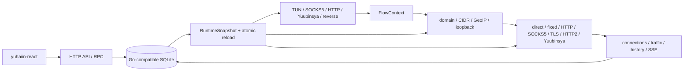

# yuhaiin Go → Rust 实现清单

更新时间：2026-08-10

这份文件只回答四个问题：现在有什么、完成到哪里、还缺什么、下一步怎么验收。
Go 源码映射、设计取舍和历史结果放在 [MIGRATION.md](MIGRATION.md)，不在这里重复堆长段落。

## 读法与总体进度

- `[x]`：功能已实现，并有单元测试或进程级验收。
- `[~]`：主路径可用，但仍有明确的兼容、平台、生产或现场验收缺口。
- `[ ]`：尚未实现。
- `延期`：按当前范围暂不阻塞 Rust 替换；不是“忘记了”。
- `不适用`：Go 当前版本没有对应能力。

| 指标 | 当前值 |
| --- | ---: |
| 当前替换范围 | 66 项 |
| 已完成 `[x]` | 54 项（81.8%） |
| 主路径完成 `[~]` | 12 项（18.2%） |
| 加权覆盖率 | **90.9%**（`(54 + 12 × 0.5) / 66`） |
| 明确延期 | 订阅、DoQ/DoH3、Shadowsocks/SSR、Tailscale、Reality、Mux、QUIC 等复杂协议 |
| 当前总体状态 | **未完成**：Linux 主链路已可运行，平台/生产/少数边界证据仍缺 |

### 主链路



## 1. 公共核心与 workspace

### 已完成

- `[x]` crate 边界：`yuhaiin-core`、`chain`、`protocol`、`store`、`geo`、`trie`、`runtime`。
- `[x]` 共用 `FlowContext`、`Endpoint`、`AsyncProxy`、`AsyncDatagram`、selector、错误和超时边界。
- `[x]` 默认网络基础使用 Rust 实现；SQLite 的 `rusqlite + bundled SQLite` 是明确批准的 C binding 例外。

### 未完成与下一步

- 无 Linux 主路径缺口。
- Android/macOS 的权限、设备 fd、route 和真实生命周期归入第 10 节验收。

## 2. SQLite 配置与状态

### 已完成

- `[x]` 成熟 SQLite 后端：WAL、busy timeout、quick check、backup/restore、事务回滚。
- `[x]` Go v1/v5/v6/schema-7 增量兼容、未知 JSON 保留、未来版本 fail-closed。
- `[x]` typed repository：nodes、inbounds、resolvers、routes/lists/tags、settings、NAT、MaxMind、FakeIP、统计。
- `[x]` 多进程 reader/writer、未提交事务强停、WAL/sidecar 重开恢复。
- `延期` fsqlite：实测性能/内存/生态不满足要求，不作为生产后端。

### 未完成与下一步

- `[~]` 更多真实生产版本、未建模表和异常快照逐表核对。
- 下一步：增加生产数据库版本样本；强停后对未知表、route/resolver projection 做 schema diff。

### 证据

- `make production-parity-smoke`
- `cargo test -p yuhaiin-store --all-features --offline`
- `~/.cache/yuhaiin-rust/production-parity/`

## 3. FakeIP

### 已完成

- `[x]` IPv4/IPv6 独立池、容量、cursor、TTL、touch、release、重启恢复和冲突快照保护。
- `[x]` DNS A/AAAA/PTR/HTTPS/SVCB hint、FakeIP 反解、TUN/router/monitor 闭环。
- `[x]` Go Pebble NDJSON、Go v6 表和 force-stop 接管。

### 未完成与下一步

- `[~]` 真实生产 FakeIP 数据样本不足。
- 下一步：从更多停止快照核对双栈容量、TTL、分配稳定性和旧条目回收。

### 证据

- `yuhaiin-store` FakeIP tests
- `make production-parity-smoke`
- `make tun-chain-service-smoke`

## 4. DNS resolver 与 server

### 已完成

- `[x]` system、UDP、TCP、hosts、FakeIP、IPv4/IPv6 policy、按 route 选择 resolver、query fallback。
- `[x]` DoH/DoT client：RustCrypto TLS、HTTP/2、bootstrap/proxy/source-address policy。
- `[x]` 本地 DNS server：同地址 UDP+TCP、并发 accept、owner shutdown、配置 API。
- `[x]` DNS hijack：TUN、HTTP、SOCKS5、透明 UDP、Trojan/VLESS/Yuubinsya chain 共用 resolver snapshot。

### 未完成与下一步

- `延期` DoQ/DoH3：使用量低，等待稳定的纯 Rust QUIC/HTTP3 方案。
- 下一步：继续用生产快照核对异常 resolver/server 配置；不新增 Go 没有的本地 DoH listener。

### 证据

- `make dns-source-smoke`
- `make doh-source-smoke`
- `make node-latency-dns-smoke`
- `cargo test -p yuhaiin-core --all-features --offline`

## 5. Router、Trie、GeoIP

### 已完成

- `[x]` domain trie：parent、wildcard、规范化、优先级、网络/端口约束。
- `[x]` CIDR trie：IPv4/IPv6 longest-prefix lookup 和随机对照。
- `[x]` route snapshot：publish/rollback、resolver policy、direct/proxy/bypass/block、nested `all/any/not`、history。
- `[x]` host/process/inbound/negative matcher、list membership、GeoIP country matcher。
- `[x]` MaxMindDB reader、坏库保护、校验下载、atomic refresh、IPv4-mapped IPv6。
- `[x]` 统一 loopback guard：监听地址自环、自身进程 path/PID；命中后 `Block + skip_route`。

### 未完成与下一步

- `[x]` 出站 socket 的本地端点注册已接入 direct/fixed/HTTP CONNECT/SOCKS5、TLS、HTTP/2 pool、Yuubinsya TCP/UOT；guard 按连接生命周期 reference-counted 回收。
- `[~]` TUN→proxy 自环进程验收仍需真实进程元数据和 endpoint 命中证据；未暴露 socket endpoint 的内存 transport 保持安全降级。
- 下一步：补更多生产 route/resolver projection 和负向 matcher fixture。

### 证据

- `cargo test -p yuhaiin-trie --all-features --offline`
- `cargo test -p yuhaiin-runtime --lib`
- `make service-chain-smoke`
- MaxMind fixture：`~/.cache/yuhaiin-rust-maxmind/`

## 6. Proxy、transport 与 inbound/outbound

所有 inbound 都在 `yuhaiin-runtime::inbound::run_until` 下拥有生命周期；inbound 和 outbound
协议实现分别放在 `core`/`protocol`/`chain`，统一经过 selector/router/monitor。

### 6.1 已完成协议矩阵

| 协议/transport | Inbound | Outbound | 状态 |
| --- | :---: | :---: | --- |
| direct / drop / fixed | — / fixed listener | 是 | `[x]` |
| HTTP proxy / CONNECT | 是 | 是 | `[x]` |
| SOCKS5 TCP | 是 | 是 | `[x]` |
| SOCKS5 UDP ASSOCIATE | 是 | 是 | `[x]` |
| SOCKS4A | 是 | — | `[x]` |
| TLS | 是 | 是 | `[x]` |
| HTTP/2 prior knowledge | 是 | 是 | `[x]` |
| Yuubinsya TCP | 是 | 是 | `[x]` |
| Yuubinsya native UDP | 是 | 是 | `[x]` |
| Yuubinsya UOT / dup over TCP | 是 | 是 | `[x]` |
| reverse HTTP/TCP | 是 | — | `[x]` |
| `redir` TCP / `tproxy` UDP | 是 | — | `[~]`：TPROXY 仍缺 rootful namespace 证据 |

### 6.2 主链路证据

- `[x]` HTTP/SOCKS5/SOCKS4A/Trojan/VLESS/Yuubinsya/TUN → router → outbound 共用 `FlowContext`。
- `[x]` 域名先按同一 resolver snapshot 解析 socket endpoint，同时保留 domain 给 TLS/H2/Yuubinsya framing。
- `[x]` HTTP、TLS、HTTP/2、SOCKS5、mixed、Yuubinsya 的 TCP/UDP 真实进程链路已通过。
- `[x]` HTTP/2 bounded backpressure、半关闭、GOAWAY/drain、Yuubinsya UOT/native UDP 生命周期已验证。

### 6.3 未完成与下一步

- `[~]` Linux `tproxy` UDP：实现已存在，但当前 rootless Podman 只允许明确 skip；需要 rootful/CAP_NET_ADMIN namespace 验收多 flow、异常 teardown。
- `[~]` inbound listen socket 的平台专用绑定仍需 Android/macOS 验收。
- `延期` Shadowsocks/SSR、Tailscale、Reality、Mux、QUIC；不作为当前替换门槛。

### 证据

- `make service-chain-smoke`
- `make socks5-udp-associate-smoke`
- `make transparent-service-smoke`
- `make benchmark-throughput`
- `cargo test -p yuhaiin-chain --all-features --offline`

## 7. NAT

### 已完成

- `[x]` Full Cone NAT：source/migration ID、endpoint-independent forward/reverse mapping。
- `[x]` TUN/UDP relay：同 source 多目标共享 relay，外部 peer 回包、rebind、idle/touch/sweep。
- `[x]` graceful close、force abort、backpressure、runtime drop、重启回收。

### 未完成与下一步

- `[~]` Android/macOS 的平台 route/NAT 生命周期未实机验证。
- 下一步：随第 10 节平台 fd/route 测试验证 NAT 清理和重启。

## 8. TUN（inbound）

### 已完成

- `[x]` 单一路径：`tun-rs AsyncDevice + smoltcp`，不并行实现 tun2socket 和第二套 userspace IP stack。
- `[x]` TUN 作为 inbound owner 的一部分，与 SOCKS5/HTTP/Yuubinsya/UDP 共用 reload/shutdown/abort。
- `[x]` TCP/UDP/ICMP dispatcher、DNS hijack、FakeIP reverse、NAT、bounded queue/backpressure。
- `[x]` Linux Podman：设备创建、route、MTU 576/1280/1500/9000/9216、1 MiB 长流、TLS/H2/Yuubinsya chain、force-stop 重开。

### 未完成与下一步

- `[~]` 超过有界 fragment 重组上限的长流、更多 namespace teardown 矩阵。
- `[~]` 新增 live connection metadata smoke：在 TUN flow 存活期间断言 `component/inbound/nodeId/outbound/localAddr`；当前 rootless Podman 现场没有稳定的 TUN netdev/route，需在干净或 rootful namespace 重跑后才能升级为现场证据。
- `[~]` Android VpnService fd/权限/route/电量/RSS；macOS utun/权限/route。
- 下一步：先补 Linux 超限 fragment 的进程级恢复证据，再做 Android/macOS 实机验收。

### 证据

- `make tun-service-smoke`
- `make tun-long-service-smoke`
- `make tun-chain-service-smoke`
- `make tun-connection-metadata-smoke`
- `YUHAIIN_TUN_FORCE_STOP=1 make tun-chain-service-smoke`
- `make tun-mtu-smoke`

## 9. 管理 API、connections、traffic 与 history

### 已完成

- `[x]` 前端 generated client 的 operation 已有自动路由覆盖；`connections.events`、`tools.logs` 的直接 SSE 路由单独验证。
- `[x]` settings、nodes、inbounds、resolvers、DNS、hosts/FakeDNS、routes/lists/tags、NAT、users、publishes 共用 store/runtime struct。
- `[x]` API mutation → atomic reload → 新数据面生效；旧 snapshot/旧 flow 不被破坏。
- `[x]` connections 建立、更新、关闭、数字 ID close、SSE added/removed、local/outbound/protocol/process/route metadata。
- `[x]` traffic、telemetry、failed history、history、checkpoint、Go projection、跨进程 SQLite 接管。
- `[x]` fresh state、三份生产快照、核心错误矩阵、API reload flow 已逐响应对照 Go。

### 未完成与下一步

- `[~]` users：当前 Go main 没有 refact-user handler；Rust 已按 refact-user schema-v6 实现，但逐响应 Go handler parity 仍缺。
- `[~]` process/inbound/negative matcher、完整 response 字段和更多 history/telemetry 生产样本。
- `[~]` 升级期间 SQLite 表锁竞争与更长时间范围逐字段对照。
- 下一步：优先补 refact-user 可运行 Go fixture；然后增加长时间 telemetry/history snapshot 和 lock contention。

### 证据

- `make api-contract-smoke`
- `make api-reload-flow-smoke`
- `make go-api-parity-smoke`
- `make production-parity-smoke`
- `make go-rust-stats-smoke`
- `make stats-concurrency-smoke`

## 10. 平台、更新与发布

### 已完成

- `[x]` Linux desktop/container：binary、SQLite、API、DNS、inbound owner、TUN、Podman smoke。
- `[x]` Rust-native pprof：按 Rust `pprof` crate，不承诺 Go wire compatibility。
- `[x]` Linux systemd/macOS LaunchDaemon 的 install/uninstall/start/stop/restart 配置生成和原子写入。
- `[x]` Android 构建入口默认使用 `/opt/android-ndk`，支持 `aarch64-linux-android` target check/build。
- `[x]` musl build：`make build MUSL=1`、`make build-release-musl`。

### 未完成与下一步

- `[~]` Android：真实 VpnService fd、权限、route、生命周期、电量/RSS。
- `[~]` macOS：runtime SDK/clang 编译、utun、权限、route、LaunchDaemon、SIGTERM。
- `[~]` 发布替换：至少一种真实 systemd 和一种 launchd 环境的替换、回滚、backup/health-check 演练。
- 下一步：平台可用环境优先做 runtime target build，再做设备/服务管理现场 smoke。

## 11. 下一阶段执行顺序

按影响整体替换能力排序，不按提交数量排序：

1. **Router loopback 现场验收**：补 TUN→proxy 自环进程验收，并确认 endpoint guard 在真实 TUN flow 结束后回收。
2. **生产与统计边界**：更多 schema/telemetry/history 样本，补升级期间 SQLite lock contention。
3. **Linux transparent TPROXY**：rootful/CAP_NET_ADMIN namespace 的 UDP、多 flow、异常 teardown。
4. **TUN Linux 收尾**：超限 fragment 长流恢复和 namespace teardown matrix。
5. **Android/macOS**：fd、route、权限、设备生命周期、RSS/电量。
6. **发布替换现场**：systemd/launchd 真实替换、回滚、备份恢复和健康检查。
7. **仅按实际需要评估延期协议**：订阅、DoQ/DoH3、Shadowsocks/SSR、Tailscale、Reality、Mux、QUIC。

## 12. 必跑命令与缓存规则

基础验证：

```bash
make fmt-check
make check
make test
git diff --check
```

主链路与控制面：

```bash
make service-chain-smoke
make api-contract-smoke
make api-reload-flow-smoke
make production-parity-smoke
make go-rust-stats-smoke
make stats-concurrency-smoke
```

TUN/透明/性能：

```bash
make tun-chain-service-smoke
make tun-mtu-smoke
make transparent-service-smoke
make benchmark-throughput
make benchmark-tun-throughput
```

所有临时数据库、Podman 状态、失败日志和 benchmark 输出放在
`~/.cache/yuhaiin-rust`；禁止使用 `/tmp`。检查缓存：

```bash
make cache-usage
du -sh ~/.cache/yuhaiin-rust
df -h /
```

详细历史证据索引：见 [MIGRATION.md](MIGRATION.md) 的最新日期条目和协议/平台章节。
