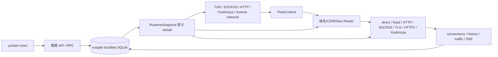

# yuhaiin Go → Rust 实现清单

更新时间：2026-08-09

这份文件是“当前实现状态”的唯一入口；详细迁移设计、Go 源码映射和历史验收记录放在 [MIGRATION.md](MIGRATION.md)。这里不再使用 P0/P1/P2，所有事项按模块组织。

状态含义：

- `[x]` 已实现，并有自动化测试或运行验收。
- `[~]` 主路径已实现，但仍有明确的兼容、平台或生产验收缺口。
- `[ ]` 尚未实现。
- `不适用` 表示 Go 当前版本没有对应能力，不能把它当作 Rust 缺口。
- `延期` 表示当前范围明确不阻塞 Rust 替换 Go；不是“忘记了”。

## 替换目标

Rust 服务必须能够复用现有 `yuhaiin-react`，从 inbound 到 outbound 经过同一个 snapshot/router/monitor 链路：



当前总体结论：`[~]`。Linux 单一路径的数据面、管理面、SQLite、FakeIP、DNS、Router、NAT、核心代理组合和 Rust-native pprof 已能运行；完整替换仍受平台路径、少数低频兼容协议、发布切换手册和订阅等明确缺口限制。

## 1. 公共核心与 workspace

| 状态 | 模块 | Rust 位置 | 当前结果 | 剩余工作 |
| --- | --- | --- | --- | --- |
| `[x]` | workspace 分层 | `crates/yuhaiin-core`, `chain`, `protocol`, `store`, `geo`, `trie`, `runtime` | 共用类型、proxy/transport、存储、路由、运行时边界已拆开；HTTP API 复用 store/runtime struct | Android/macOS 的权限、TUN fd/route 和实机验收 |
| `[x]` | Flow/Proxy contract | `yuhaiin-core::FlowContext`, `proxy::{AsyncProxy,AsyncDatagram,AsyncProxySelector}` | TCP、UDP、ping、close、取消、timeout、backpressure 统一到一个可扩展边界 | 少数协议专属错误语义继续补齐 |
| `[x]` | 纯 Rust 网络基础 | core 的 DNS/TUN/NAT/protocol，以及 `socket2` | 默认不引入 TLS/OpenSSL/C 网络绑定；SQLite bundled C binding 是批准的例外 | 不为不需要的 Go 包机械复刻 |

## 2. SQLite 配置与状态

| 状态 | 功能 | 位置 | 验收 |
| --- | --- | --- | --- |
| `[x]` | 经过验证的 SQLite 后端 | `crates/yuhaiin-store/src/sqlite.rs` | `rusqlite 0.40 + bundled SQLite`；WAL/NORMAL、busy timeout、quick_check、backup/restore、资源 probe |
| `[x]` | schema/migration | `schema.rs`, `migration.rs` | Rust schema v3、Go v1/v5/v6 compatibility、未来版本 fail-closed、事务回滚/修复重试 |
| `[x]` | typed repository | `repository.rs` | nodes、inbounds、resolvers、routes、lists、tags、settings、NAT、MaxMind、FakeIP 读写；未知 Go JSON 保留 |
| `[x]` | 并发与异常终止 | `src/tests`, `tests/cross_process` | WAL 多进程 writer/reader、未提交事务 force-stop、sidecar lock、损坏库 fail-closed |
| `[~]` | 真实生产库兼容覆盖 | store tests | 已有真实 Go v5/v6-shaped fixture 和 415MB 导出；仍需持续增加未建模生产表/异常快照 |
| `延期` | fsqlite | — | 已停止实验；性能、内存和生态不满足要求，不再作为候选后端 |

## 3. FakeIP

| 状态 | 功能 | 位置 | 当前结果 | 剩余工作 |
| --- | --- | --- | --- | --- |
| `[x]` | 双栈池与持久化 | `yuhaiin-store/src/fakeip.rs` | IPv4/IPv6 独立 namespace、cursor、allocate/release/reopen、反向映射、容量 LRU、TTL、touch flush |
| `[x]` | DNS transform | `FakeIpAsyncDnsHandler`, `FakeIpView` | A/AAAA/PTR/HTTPS/SVCB hint、FakeIP→域名恢复、DNS/TUN/router 闭环 |
| `[x]` | 异常与压力 | FakeIP tests | Go Pebble NDJSON/Go v6 import、force-stop、双栈 soak、冲突 snapshot 原子失败 |
| `[~]` | 更多生产数据 | store fixture | 继续增加真实生产库样本；不影响当前主路径 |

## 4. DNS resolver 与 server

| 状态 | 功能 | 位置 | 当前结果 | 剩余工作 |
| --- | --- | --- | --- | --- |
| `[x]` | resolver facade | `yuhaiin-core/src/dns*`, `runtime/src/resolver.rs` | system/UDP/TCP、hosts、FakeIP、IPv4/IPv6 policy、按 route 选择 resolver、query fallback |
| `[x]` | UDP/TCP | `dns_udp_async.rs`, `dns_tcp_async.rs`, runtime DNS supervisor | 纯 Tokio client/server、RFC1035 TCP fallback、多连接、同地址 UDP+TCP listener、owner cancellation |
| `[x]` | DoH/DoT client | `runtime::{doh_tls,dot_tls,resolver}.rs` | RustCrypto TLS、HTTP/2 DoH、DoT length-prefix、可注入 proxy/bootstrap connector |
| `[x]` | DNS/TUN/Inbound 闭环 | `RuntimeDnsHandler`, `ConnectionMonitor`, TUN dispatcher, socket inbound adapters | TUN 与 socket inbound 共用 snapshot 选择 resolver/FakeIP；公共 TCP relay、SOCKS5/Trojan/VLESS/Yuubinsya/透明 UDP 及 Yuubinsya chain TCP/UOT 都在协议边界接管 DNS request，并按各自 wire framing 回写；非法 DNS payload 仍转发 |
| `[x]` | DNS 上游 interface policy | resolver factories | UDP/TCP、RustCrypto DoH/DoT direct dialer 接受和 outbound 相同的 source-address policy；自定义 factory 保持默认兼容，selector reload 会重建 resolver |
| `[x]` | Go 空配置启动基线 | `RuntimeSettings`, `runtime::defaults`, `data_plane::configured_dns_server`, `api::default_settings` | 无持久 settings 时对齐 Go 的 IPv6、HTTP system proxy、debug/save 日志默认值；无 DNS row/overlay 时默认监听 `127.0.0.1:5353`；真正空库首次构建时幂等写入 mixed/TUN/yuubinsya、bootstrap resolver、LAN route/list；API 与运行时共用同一默认对象 | 真实生产库的更多部分/异常快照继续补 fixture；删除默认项后不自动恢复 |
| `延期` | DoQ / DoH3 | — | 使用量低，等纯 Rust QUIC/HTTP3 方案稳定后再加入；不阻塞当前替换 |
| `不适用` | 本地 DoH server 管理端点 | — | Go `pkg/net/dns/server/server.go` 的本地 DNS server 只启动 UDP/TCP；DoH 是 resolver 的上游 client transport，现有 Rust 已实现 DoH/HTTP2 client 和 `resolver.server` UDP/TCP 管理 API | 若未来前端明确新增本地 DoH listener，再作为独立能力设计；当前不为填补表格增加 Go 没有的功能 |

## 5. Router、Trie、GeoIP

| 状态 | 功能 | 位置 | 当前结果 | 剩余工作 |
| --- | --- | --- | --- | --- |
| `[x]` | domain trie | `yuhaiin-trie` | parent、wildcard、优先级、规范化、网络/端口约束 |
| `[x]` | CIDR trie | `yuhaiin-trie` | IPv4/IPv6 longest-prefix lookup、随机对照回归 |
| `[x]` | runtime router | `runtime/src/route.rs`, `trie::router` | immutable snapshot、publish/rollback、resolver policy、direct/proxy/bypass/block |
| `[x]` | connection explainability | `FlowContext`, monitor | rule/tag/list/matchHistory/resolver/geo 与实际 proxy 选择共用同一 snapshot |
| `[x]` | MaxMindDB | `crates/yuhaiin-geo` | reader、坏库错误、校验下载、atomic refresh、IPv4-mapped IPv6、route 注入、真实 `Country-without-asn.mmdb` 查询验收均已完成；fixture 保存在 `~/.cache/yuhaiin-rust-maxmind`，SHA-256 为 `1d900f73aa4644d255793548319410ff559ef9294a662ec1a0354f106c794155` | 后续只需按发布策略更新并重新验收数据库 |

## 6. Proxy 与 transport（inbound / outbound）

所有支持的 inbound 都在 `yuhaiin-runtime::inbound::run_until` 下启动；outbound 通过 `RuntimeSnapshot::build_proxy_selector` 进入同一个 router/monitor 链路。协议 wire codec 和可复用 transport 放在 `yuhaiin-protocol` / `yuhaiin-chain`，不是散落到 inbound 文件中。

### 6.1 已支持的协议矩阵

| 状态 | 能力 | Inbound | Outbound | 主要位置 |
| --- | --- | --- | --- | --- |
| `[x]` | direct / drop / fixed | — / fixed listener 边界 | 是 | `core::proxy`, `proxy_factory` |
| `[x]` | HTTP proxy / CONNECT | 是 | 是 | `runtime::inbound`, `core::proxy` |
| `[x]` | SOCKS5 | 是 | 是 | `runtime::inbound`, `core::proxy`；outbound 已覆盖 TCP CONNECT + UDP ASSOCIATE、认证和 domain framing |
| `[x]` | SOCKS4A | 是 | — | `runtime/src/proxy/socks4a.rs` |
| `[x]` | TLS transport | 是 | 是 | `runtime::doh_tls`, `protocol::tls` |
| `[x]` | HTTP/2 transport | 是 | 是 | `chain`, runtime HTTP2 inbound |
| `[x]` | Yuubinsya TCP | 是 | 是 | `core::yuubinsya`, `chain` |
| `[x]` | Yuubinsya native UDP | 是 | 是 | `core::proxy`, `chain` |
| `[x]` | Yuubinsya UDP-over-TCP | 是 | 是 | `chain::{h2,UOT,direct_uot}` |
| `[x]` | WebSocket transport | 是 | 是 | `core::websocket`, runtime/protocol |
| `[x]` | protocol wrappers | inbound/outbound 共用 | inbound/outbound 共用 | `yuhaiin-protocol` |
| `[x]` | Go inbound protocol aliases / noop | `none` accept-and-close；`mix`、`reverseHttp`、`reverseTcp` 旧 JSON 拼写归一化并保留 section 配置 | 与 Go contract oneof 的兼容字段回归 | `runtime::inbounds::normalize_inbound_protocol` |
| `[x]` | Go 低频 inbound：`reverse_http` / `reverse_tcp` | 是；目标地址/URL 解析后复用共享 router、outbound、relay 和 monitor | reverse TCP 原始流、reverse HTTP 请求改写/原始流回退均有 loopback 单测；HTTPS target 受 `doh-tls` feature 控制 | 继续补 Go fixture 互操作 |
| `[~]` | Linux 透明 inbound：`tproxy` / `redir` | TCP 已接入；TPROXY UDP 已接入；redir 按 Go contract 禁用 UDP | Linux TCP 使用 `IP_TRANSPARENT`、`SO_ORIGINAL_DST`/`IP6T_SO_ORIGINAL_DST`；TPROXY UDP 使用原目标 ancillary；IPv4 原目标字节序已有回归。Podman 中 REDIRECT TCP 已真实回环成功；rootless Podman veth 即使 privileged 也未将非本地 TPROXY 包交给透明 socket，故 UDP 仍保留环境受限状态；TLS/WS 等透明 transport fail-closed | 用真实 Linux network namespace/宿主机 CAP_NET_ADMIN 重跑 TPROXY UDP ancillary、redir IPv4/IPv6、权限失败及多 flow 生命周期；Podman REDIRECT TCP 验收已完成 |

### 6.2 连接链路与策略

| 状态 | 功能 | 当前结果 | 剩余工作 |
| --- | --- | --- | --- |
| `[x]` | inbound → router → outbound | HTTP/SOCKS5/SOCKS4A/Trojan/VLESS/Yuubinsya/TUN 都走共享 FlowContext 和 selector；有真实 loopback relay 回归 | 继续增加 Go fixture，不改变主链路 |
| `[x]` | inbound settings | `store::InboundSettings`, `RuntimeSnapshot`, `ConnectionMonitor` | Go legacy `inbound_settings` 与 Rust overlay、前端 API、reload 已统一；`sniff` 影响公共 relay，DNS 三项同时作用于 TUN、socket inbound 和 Yuubinsya chain；reload 原子替换 resolver handler |
| `[x]` | HTTP/2 pool | fixed endpoint、TLS identity、ALPN、multi-stream/multi-connection、idle/drain、GOAWAY replacement、metrics | h2 公共 API 无法主动发送 client GOAWAY，保持 application-level drain |
| `[x]` | Yuubinsya reliability | migrate ID、coalesce、bounded retry/replay、UOT/native UDP、ping、服务端 demux、TLS/H2 listener | 主动 GOAWAY 同上；继续 Go 低版本 fixture |
| `[x]` | outbound source interface | `SocketPolicyProxy` 统一覆盖 direct/fixed/HTTP CONNECT/SOCKS5、protocol wrappers、HTTP/2 Yuubinsya、direct UOT 和 native UDP；reload 替换 policy；UDP/TCP/DoH/DoT resolver dialer 也复用同一 source-address policy | inbound listen socket 的平台专用绑定仍需按平台验收 |
| `[x]` | node latency DNS/UDP/IP | `runtime::latency` | `dns`/`udp` 经由共享 `AsyncProxy::open_datagram` 发起 DNS A 查询并校验事务 ID；`ip` 通过运行时 resolver 并行解析 A/AAAA，再将具体 IPv4/IPv6 endpoint 交给 proxy，同时保留 Host/SNI；默认 resolver/target 与 Go 兼容；DoQ 继续延期 | 增加远端节点和 Podman 网络环境的长期回归 |
| `[~]` | 低频/复杂 Go 协议 | 现有可用协议已优先完成；Tailscale、WireGuard、Reality、Mux、QUIC 等不纳入当前 Rust 主路径 | 仅在实际前端配置/需求出现时评估，不伪装为已兼容 |
| `延期` | Shadowsocks / ShadowsocksR | 仓库已有部分历史实现，但当前范围不以它们为替换门槛 | 按用户决定暂不继续扩展；后续可删除或单独维护 |

## 7. NAT

| 状态 | 功能 | 位置 | 当前结果 |
| --- | --- | --- | --- |
| `[x]` | Full Cone table | `core::nat`, store NAT config | source/migrate ID、endpoint-independent forward/reverse mapping、默认 full cone |
| `[x]` | UDP relay | `core::tun`, runtime inbound | 同 source 多目标共享 relay，任意外部 peer 回包，translated endpoint rebind |
| `[x]` | 生命周期 | `TunProxyRuntime`, `NatTable` | idle/touch/sweep、graceful close、force abort、backpressure、runtime drop、跨进程重启回收 |
| `[~]` | 平台 NAT/route 细节 | Linux 已有纯 Rust netlink route backend | Android/macOS fd/route 生命周期仍待实机验收 |

## 8. TUN（inbound）

| 状态 | 功能 | 位置 | 当前结果 | 剩余工作 |
| --- | --- | --- | --- | --- |
| `[x]` | 单一路径 TUN | `core::tun` | `tun-rs AsyncDevice + smoltcp`；不并行实现 tun2socket 和用户态 stack 两条路径 |
| `[x]` | inbound owner | `runtime::inbound::run_until` | TUN record 会在同一个 inbound listener task 集合中创建 device；与 SOCKS5/HTTP/Yuubinsya/UDP listener 共同 reload、shutdown、abort，不再由独立 supervisor 管理 |
| `[x]` | TCP/UDP/ICMP | `core::tun` | dispatcher、proxy bridge、DNS hijack、FakeIP reverse、NAT、bounded queue/backpressure |
| `[x]` | Linux Podman | `tun-smoke`, `p0_tun`, `tun_fakeip_smoke` | privileged/network=none 创建、route、DNS/FakeIP、proxy echo、SIGTERM 和设备重开 |
| `[~]` | 设备异常与 namespace | 测试已有设备消失、kernel cleanup、同名重开基础覆盖 | 继续补 namespace teardown、真实 MTU/fragment 长矩阵 |
| `[~]` | Android/macOS TUN | `TunRuntime::from_async_device` + `inbound::run_until_with_tun_runtime` 可把外部设备接入同一个 inbound owner；reload 复用设备并重建 proxy/dispatcher | Android VpnService fd、macOS utun/权限/route/生命周期实机验收 |

## 9. 管理 API、实时 connections 与统计

| 状态 | 功能 | 位置 | 当前结果 | 剩余工作 |
| --- | --- | --- | --- | --- |
| `[~]` | 前端 API/RPC | `runtime/src/api.rs` | 对齐现有 generated client；settings、nodes、inbounds、DNS、hosts/FakeDNS、route、TUN、connections 等共用 store/runtime struct；列表 API 已补 Go 的 query 字段边界（nodes: id/name/group/origin/chain.type；inbounds: id/name/network.type/protocol.type；resolvers: id/type/host/subnet/tlsServerName；route lists/rules: Go 指定字段）并在过滤后计算 total | 继续用前端 generated-contracts 和真实 Go handler 做 response 字段/错误语义逐项验收；补 production snapshot 的管理面回归 |
| `[x]` | live connections | `monitor`, `connections` API/SSE | 建立、更新、关闭、数字 ID close、EventSource added/removed |
| `[~]` | history/traffic/statistics | `monitor`, SQLite persistence | Rust checkpoint 负责频繁 crash recovery；无 checkpoint 时可接管 Go 的 `statistics_kv`、`traffic_hourly`、`connection_history`、`failed_connection_history` 和 telemetry 表；正常 shutdown 会原子写回 Go 兼容统计投影，history 按 Go key 合并 | 生产库更多版本/异常中断 fixture；周期性 Go 表投影和 force-abort 后 Go 表可见性仍需单独验收 |
| `[x]` | runtime reload | `RuntimeController` | 配置先构建新 snapshot，失败保留旧 snapshot；selector/inbound/DNS 按 owner 收敛 |
| `[~]` | 软件更新 | `runtime/src/update.rs`, `/api/v2/update/*` | releases 分页、stable/beta/main、平台 asset、checksum、进度状态、`~/.cache` 下载和 Unix detached helper；RustCrypto reqwest 无 native TLS | 不同发行版 service manager 的现场升级/回滚验收 |
| `[x]` | pprof | `pprof-rs` Rust-native profiler、`/debug/pprof/` index 和 `/debug/pprof/profile?seconds=N` protobuf profile endpoint；沿用 settings `pprof` gate，禁用时返回 404 | profile 格式遵循 Rust `pprof` crate，不承诺 Go wire compatibility |
| `延期` | subscriptions | API 保留兼容形状 | refresh/update 仍返回未实现；按用户决定暂不阻塞替换 |

## 10. 平台与发布

| 状态 | 平台/能力 | 当前结果 | 验收缺口 |
| --- | --- | --- | --- |
| `[x]` | Linux desktop | binary、SQLite、HTTP API、DNS、inbound owner、TUN、Podman smoke | 持续增加真实生产配置回归 |
| `[x]` | Linux container | Podman host-network / privileged network=none smoke | 已有；每次新增数据面模块继续复用 `~/.cache` 状态目录 |
| `[~]` | Android | `yuhaiin-core` 与 `yuhaiin-runtime --all-features` 均已通过 `aarch64-linux-android` target check；bundled SQLite 使用 `/opt/android-ndk/.../aarch64-linux-android35-clang`；已有外部 fd 注入的 inbound owner API | VpnService fd、权限、电量/内存实测；继续补 Android 原生 route/生命周期验收 |
| `[~]` | macOS | `yuhaiin-core` 的 `async-proxy,tun` 已通过 `aarch64-apple-darwin` target check；runtime 仍需 macOS SDK/clang 编译 bundled SQLite | macOS SDK/clang runtime target check；utun、LaunchDaemon、权限、SIGTERM/route 实机验收 |
| `[~]` | 发布替换手册 | Rust binary 已兼容 Go service command 的 `-host/-path/-u/-p/-eweb/-nfs-mode`；`-path DIR` 使用 `DIR/state.db`，默认监听 `0.0.0.0:50051`，`-eweb DIR` 提供同一 listener 的静态资源和 SPA fallback，显式 `YUHAIIN_DB/YUHAIIN_HTTP` 仍可覆盖 | 补 systemd/launchd/Windows service 安装替换、SQLite backup/rollback、旧 Go 并行与锁冲突演练 |

## 11. 必跑验证

这些命令通过后，才可以把对应模块从 `[~]` 改为 `[x]`：

```bash
cargo fmt --all -- --check
cargo check -p yuhaiin-runtime --no-default-features --offline
cargo test --workspace --all-features --offline --quiet
git diff --check
```

关键 Podman 验收使用 `~/.cache`，禁止把状态或临时数据库放到 `/tmp`：

```bash
cargo build -p yuhaiin-core --bin tun-smoke --all-features --offline
podman run --rm --privileged --network=none \
  -v /home/asutorufa/Documents/Programming/yuhaiin-rust/target/debug/tun-smoke:/usr/local/bin/tun-smoke:ro \
  --entrypoint /bin/sh docker.io/library/debian:testing -c \
  'YUHAIIN_TUN_NAME=yuhaiin-codex0 YUHAIIN_TUN_HOLD_MS=250 /usr/local/bin/tun-smoke'
```

当前阶段新增的 source-bind 容器回归：

```bash
podman run --rm --network=host \
  -v /home/asutorufa/Documents/Programming/yuhaiin-rust/target/debug/deps/yuhaiin_core-b469181d7e2ccc9d:/usr/local/bin/yuhaiin-core-test:ro \
  --entrypoint /usr/local/bin/yuhaiin-core-test docker.io/library/debian:testing \
  proxy::tests::direct_connector_honors_local_bind_address --exact --nocapture
```

上面的 hash 是一次构建产物示例；实际运行时从 `target/debug/deps` 选择最新的 core test binary。

## 12. 下一步执行顺序

1. 为 DNS UDP/TCP/DoH/DoT、SOCKS5 UDP ASSOCIATE 和 node latency DNS/UDP 增加 Podman source-address/网络回归；内置 resolver 已完成 policy 接入，自定义 factory 仍可按需覆写扩展入口。Go 互操作测试已在本机显式运行并通过，详见 `MIGRATION.md` 2026-08-09 记录。
2. 补 Android/macOS target、权限、TUN fd/route 生命周期和实际资源消耗验收。
3. 补发布切换/rollback 手册：binary 替换、SQLite backup、失败回滚、旧 Go 并行运行和状态目录锁。
4. 对现有 frontend generated operations 做一次逐项 route/schema 快照比对；subscription 维持明确的 deferred 状态。
5. 每完成一项，只修改本模块表格、验收命令和 `MIGRATION.md` 的一条 dated entry，不再把所有历史细节堆回本文件。
6. 完成 Linux `tproxy`/`redir` 验收：在真正的 network namespace/宿主机 CAP_NET_ADMIN 环境覆盖 TPROXY UDP ancillary、redir IPv4/IPv6、权限失败及多 flow 生命周期；Podman REDIRECT TCP 已有可重复验收记录。
7. 补统计兼容验收：用真实 Go v6/生产形状数据库验证 Rust takeover、最终 flush 后 Go 读取，以及 force-abort/进程崩溃时 checkpoint 与 Go 表之间的恢复边界。
8. 补管理 API 契约验收：逐个执行 generated client 的 list/detail/mutation 操作，记录 Rust 与 Go 的 response 字段、分页、query 过滤、错误状态和 reload side effect 差异；优先覆盖 route、inbound、node、resolver。
