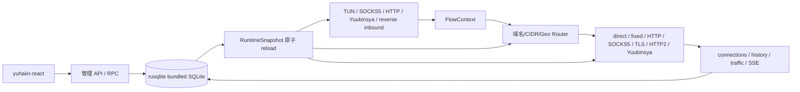

# yuhaiin Go → Rust 实现清单

更新时间：2026-08-10

这份文件是“当前实现状态”的唯一入口；详细迁移设计、Go 源码映射和历史验收记录放在 [MIGRATION.md](MIGRATION.md)。这里不再使用 P0/P1/P2，所有事项按模块组织。

状态含义：

- `[x]` 已实现，并有自动化测试或运行验收。
- `[~]` 主路径已实现，但仍有明确的兼容、平台或生产验收缺口。
- `[ ]` 尚未实现。
- `不适用` 表示 Go 当前版本没有对应能力，不能把它当作 Rust 缺口。
- `延期` 表示当前范围明确不阻塞 Rust 替换 Go；不是“忘记了”。

## 当前迁移覆盖率

> 更新时间：2026-08-10。这个百分比按本文件的“功能条目”计算，不是代码行数、性能比例或最终质量分数。

| 指标 | 数值 | 说明 |
| --- | ---: | --- |
| 当前范围条目 | 66 | `[x]` 已实现 + `[~]` 主路径已实现但仍有缺口；明确 `延期`/`不适用` 不计入当前替换范围 |
| 完成条目 | 53 / 66 | `[x]`，80.3% |
| 部分完成条目 | 13 / 66 | `[~]`，19.7%；每个部分完成条目按 50% 计入加权覆盖率 |
| 加权迁移覆盖率 | **59.5 / 66 = 90.2%** | `(53 + 13 × 0.5) / 66` |
| 明确延期 | 4 | 订阅、DoQ/DoH3、Shadowsocks/SSR、低频复杂协议等，不阻塞当前主路径 |
| Go 没有对应能力 | 1 | 本地 DoH 管理端点 |

模块分布如下；“覆盖率”沿用同一规则，因此能直接看出剩余工作集中在哪里：

| 模块 | `[x]` | `[~]` | 当前覆盖率 | 主要剩余边界 |
| --- | ---: | ---: | ---: | --- |
| 公共核心/workspace | 3 | 0 | 100.0% | Android/macOS 权限与设备验收 |
| SQLite 配置与状态 | 4 | 1 | 90.0% | 更多生产版本、未建模表、异常快照 |
| FakeIP | 3 | 1 | 87.5% | 更多生产数据样本 |
| DNS resolver/server | 6 | 0 | 100.0% | DoQ/DoH3 明确延期；更多生产异常快照 |
| Router/Trie/GeoIP | 5 | 0 | 100.0% | 发布策略中的数据库更新验收 |
| Proxy/transport | 20 | 2 | 95.5% | raw standalone HTTP/2 不携带目标地址、Linux transparent UDP、平台 listen 绑定、复杂协议 |
| NAT | 3 | 1 | 87.5% | Android/macOS route/NAT 生命周期 |
| TUN inbound | 4 | 2 | 83.3% | namespace 长矩阵、Android/macOS 实机 |
| 管理 API/connections/统计 | 3 | 3 | 75.0% | 已补真实 node/inbound/route reload→数据面与统计→重启读回，并以独立 Go/Rust SQLite 副本逐响应验证核心 node/inbound/resolver/route mutation；仍需更多生产版本、错误矩阵和并发统计锁竞争 |
| 平台与发布 | 2 | 3 | 70.0% | Android/macOS 实机、service-manager 现场回滚 |

覆盖率不会把 `[~]` 自动改成 `[x]`；只有对应的测试、进程级验证或平台证据完成后才更新条目状态。

## 当前模块执行面板

下面只列仍会产生实际工作量的项目；已经通过主路径验收的能力保留在后面的模块证据表中。每一项都对应一个可直接执行的下一步，避免把多个不相关缺口塞进一行。

| 模块 | 当前状态 | 下一步可执行项 | 验收证据 |
| --- | --- | --- | --- |
| SQLite / 生产库 | `[~]` | 增加更多生产版本快照；逐表核对 route/resolver projection；补异常关闭后的未建模表检查 | 默认 3 份真实快照已通过 `make production-parity-smoke`；store fixture tests |
| FakeIP | `[~]` | 增加真实生产 FakeIP 表快照，并验证双栈池容量/TTL/重启后的分配稳定性 | FakeIP store tests + Go state takeover |
| Linux transparent inbound | `[~]` | 在具备 `CAP_NET_ADMIN` 的独立 namespace 中验证 TPROXY UDP、redir IPv4/IPv6 和多 flow teardown | 默认 `make transparent-service-smoke` 已真实验证隔离 namespace REDIRECT TCP：非 root client → Rust redir → `SO_ORIGINAL_DST` → direct outbound → echo，并检查 upload/download counters、shutdown；rootless Podman 会明确输出 TPROXY skip。强制 gate `YUHAIIN_TPROXY_ENABLED=1 make transparent-service-smoke` 已确认规则命中但 rootless 用户 namespace 无法把非本地 UDP 交给透明 socket；剩余是 rootful/宿主机 `CAP_NET_ADMIN` 的 TPROXY UDP、IPv4/IPv6 redir 和多 flow teardown |
| TUN / NAT | `[~]` | 增加 MTU/fragment/namespace teardown 矩阵；补 Android VpnService fd 和 macOS utun 实机验收 | `tun-service.sh`、`p0_tun`、平台设备日志 |
| API / reload | `[~]` | 已覆盖 node mutation 后新连接切换出口、latency、traffic/history 和同库重启读回；Go/Rust parity 已覆盖核心 node/inbound/resolver/route mutation 的独立副本闭环；继续补错误矩阵、route.rules.test history 和更多生产快照 | `api-reload-flow.sh`、`api-contract.sh`、`go-api-parity.sh` |
| connections / statistics | `[~]` | 增加更多 production telemetry 快照；逐字段核对长时间范围与升级期间锁竞争 | `stats-concurrency.sh`、`go-rust-stats.sh` |
| 更新 / 发布 | `[~]` | 在至少一种 systemd 和一种 launchd 环境做替换、回滚、SIGTERM 和备份恢复演练 | `docs/RELEASE_REPLACEMENT.md` |
| Android | `[~]` | 真机验证 VpnService fd、权限、route 生命周期和电量/RSS | Android instrumentation/runtime log |
| macOS | `[~]` | 获得 SDK/clang 后编译 runtime，验证 utun、权限、route、LaunchDaemon 和 SIGTERM | macOS target check + runtime log |
| 明确延期 | `延期` | subscriptions、DoQ/DoH3、Shadowsocks/SSR、Tailscale/WireGuard/Reality/Mux/QUIC 不阻塞当前替换 | 需求变更时单独建项 |

### 本轮执行顺序


每完成一项，先补对应自动化证据，再只修改该项状态；不因单元测试通过而把平台或生产验收提前标成 `[x]`。

## 替换目标

Rust 服务必须能够复用现有 `yuhaiin-react`，从 inbound 到 outbound 经过同一个 snapshot/router/monitor 链路：



当前总体结论：`[~]`。Linux 单一路径的数据面、管理面、SQLite、FakeIP、DNS、Router、NAT、核心代理组合和 Rust-native pprof 已能运行；完整替换仍受平台路径、少数低频兼容协议、发布切换手册和订阅等明确缺口限制。

## 1. 公共核心与 workspace

| 状态 | 模块 | Rust 位置 | 当前结果 | 剩余工作 |
| --- | --- | --- | --- | --- |
| `[x]` | workspace 分层 | `crates/yuhaiin-core`, `chain`, `protocol`, `store`, `geo`, `trie`, `runtime` | 共用类型、proxy/transport、存储、路由、运行时边界已拆开；HTTP API 复用 store/runtime struct | Android/macOS 的权限、TUN fd/route 和实机验收 |
| `[x]` | Flow/Proxy contract | `yuhaiin-core::FlowContext`, `proxy::{AsyncProxy,AsyncDatagram,AsyncProxySelector}` | TCP、UDP、ping、close、取消、timeout、backpressure 统一到一个可扩展边界 | 少数协议专属错误语义继续补齐 |
| `[x]` | 纯 Rust 网络基础 | core 的 DNS/TUN/NAT/protocol，以及 `socket2` | 默认不引入 TLS/OpenSSL/C 网络绑定；SQLite bundled C binding 是批准的例外 | 不为不需要的 Go 包机械复刻 |

## 2. SQLite 配置与状态

| 状态 | 功能 | 位置 | 验收 |
| --- | --- | --- | --- |
| `[x]` | 经过验证的 SQLite 后端 | `crates/yuhaiin-store/src/sqlite.rs` | `rusqlite 0.40 + bundled SQLite`；WAL/NORMAL、busy timeout、quick_check、backup/restore、资源 probe |
| `[x]` | schema/migration | `schema.rs`, `migration.rs` | Rust schema v3、Go v1/v5/v6 compatibility、未来版本 fail-closed、事务回滚/修复重试 |
| `[x]` | typed repository | `repository.rs` | nodes、inbounds、resolvers、routes、lists、tags、settings、NAT、MaxMind、FakeIP 读写；未知 Go JSON 保留 |
| `[x]` | 并发与异常终止 | `src/tests`, `tests/cross_process` | WAL 多进程 writer/reader、未提交事务 force-stop、sidecar lock、损坏库 fail-closed |
| `[~]` | 真实生产库兼容覆盖 | store tests | 已有真实 Go v5/v6-shaped fixture 和 415MB 导出；默认 `production-parity-smoke` 已对 `tmp/v2/state.db`、`tmp/yuhaiin/state.db`、`tmp/aws/yuhaiin/state.db` 三份停止快照完成 Go/Rust 双进程、逐操作 API 对照；覆盖 nodes、resolvers、inbounds、route rules/lists、settings、统计、FakeDNS、hosts、server、interfaces、licenses；修复了旧 telemetry migration ledger、partial network_split、带端口 dns_hosts、禁用 FakeIP 空 CIDR 和 route list persisted metrics；`tmp/state.db` 仍可用 `YUHAIIN_SOURCE_DB` 显式诊断，但当前先在 Go 自己的重复 `fakeip_entries` migration 失败，未计入默认 smoke；仍需更多生产版本验证 route/resolver projection 逐行语义、未建模表和异常快照 |
| `延期` | fsqlite | — | 已停止实验；性能、内存和生态不满足要求，不再作为候选后端 |

## 3. FakeIP

| 状态 | 功能 | 位置 | 当前结果 | 剩余工作 |
| --- | --- | --- | --- | --- |
| `[x]` | 双栈池与持久化 | `yuhaiin-store/src/fakeip.rs` | IPv4/IPv6 独立 namespace、cursor、allocate/release/reopen、反向映射、容量 LRU、TTL、touch flush |
| `[x]` | DNS transform | `FakeIpAsyncDnsHandler`, `FakeIpView` | A/AAAA/PTR/HTTPS/SVCB hint、FakeIP→域名恢复、DNS/TUN/router 闭环 |
| `[x]` | 异常与压力 | FakeIP tests | Go Pebble NDJSON/Go v6 import、force-stop、双栈 soak、冲突 snapshot 原子失败 |
| `[~]` | 更多生产数据 | store fixture | 继续增加真实生产库样本；不影响当前主路径 |

## 4. DNS resolver 与 server

| 状态 | 功能 | 位置 | 当前结果 | 剩余工作 |
| --- | --- | --- | --- | --- |
| `[x]` | resolver facade | `yuhaiin-core/src/dns*`, `runtime/src/resolver.rs` | system/UDP/TCP、hosts、FakeIP、IPv4/IPv6 policy、按 route 选择 resolver、query fallback |
| `[x]` | UDP/TCP | `dns_udp_async.rs`, `dns_tcp_async.rs`, runtime DNS supervisor | 纯 Tokio client/server、RFC1035 TCP fallback、多连接、同地址 UDP+TCP listener、owner cancellation |
| `[x]` | DoH/DoT client | `runtime::{doh_tls,dot_tls,resolver}.rs` | RustCrypto TLS、HTTP/2 DoH、DoT length-prefix、可注入 proxy/bootstrap connector |
| `[x]` | DNS/TUN/Inbound 闭环 | `RuntimeDnsHandler`, `ConnectionMonitor`, TUN dispatcher, socket inbound adapters | TUN 与 socket inbound 共用 snapshot 选择 resolver/FakeIP；公共 TCP relay、SOCKS5/Trojan/VLESS/Yuubinsya/透明 UDP 及 Yuubinsya chain TCP/UOT 都在协议边界接管 DNS request，并按各自 wire framing 回写；非法 DNS payload 仍转发 |
| `[x]` | DNS 上游 interface policy | resolver factories | UDP/TCP、RustCrypto DoH/DoT direct dialer 接受和 outbound 相同的 source-address policy；自定义 factory 保持默认兼容，selector reload 会重建 resolver；`scripts/integration/dns-source-bind.sh` 在 host-network Podman 中复用 UDP/TCP 真实 async client/server 测试并确认源 IPv4 地址 |
| `[x]` | Go 空配置启动基线 | `RuntimeSettings`, `runtime::defaults`, `data_plane::configured_dns_server`, `api::default_settings` | 无持久 settings 时对齐 Go 的 IPv6、HTTP system proxy、debug/save 日志默认值；无 DNS row/overlay 时默认监听 `127.0.0.1:5353`；真正空库首次构建时幂等写入 mixed/TUN/yuubinsya、bootstrap resolver、LAN route/list；API 与运行时共用同一默认对象 | 真实生产库的更多部分/异常快照继续补 fixture；删除默认项后不自动恢复 |
| `延期` | DoQ / DoH3 | — | 使用量低，等纯 Rust QUIC/HTTP3 方案稳定后再加入；不阻塞当前替换 |
| `不适用` | 本地 DoH server 管理端点 | — | Go `pkg/net/dns/server/server.go` 的本地 DNS server 只启动 UDP/TCP；DoH 是 resolver 的上游 client transport，现有 Rust 已实现 DoH/HTTP2 client 和 `resolver.server` UDP/TCP 管理 API | 若未来前端明确新增本地 DoH listener，再作为独立能力设计；当前不为填补表格增加 Go 没有的功能 |

## 5. Router、Trie、GeoIP

| 状态 | 功能 | 位置 | 当前结果 | 剩余工作 |
| --- | --- | --- | --- | --- |
| `[x]` | domain trie | `yuhaiin-trie` | parent、wildcard、优先级、规范化、网络/端口约束 |
| `[x]` | CIDR trie | `yuhaiin-trie` | IPv4/IPv6 longest-prefix lookup、随机对照回归 |
| `[x]` | runtime router | `runtime/src/route.rs`, `trie::router` | immutable snapshot、publish/rollback、resolver policy、direct/proxy/bypass/block；兼容 Go route expression 中单端口字符串（例如 `"6969"`）并保持真正非法范围 fail-closed |
| `[x]` | connection explainability | `FlowContext`, monitor | rule/tag/list/matchHistory/resolver/geo 与实际 proxy 选择共用同一 snapshot |
| `[x]` | MaxMindDB | `crates/yuhaiin-geo` | reader、坏库错误、校验下载、atomic refresh、IPv4-mapped IPv6、route 注入、真实 `Country-without-asn.mmdb` 查询验收均已完成；fixture 保存在 `~/.cache/yuhaiin-rust-maxmind`，SHA-256 为 `1d900f73aa4644d255793548319410ff559ef9294a662ec1a0354f106c794155` | 后续只需按发布策略更新并重新验收数据库 |

## 6. Proxy 与 transport（inbound / outbound）

所有支持的 inbound 都在 `yuhaiin-runtime::inbound::run_until` 下启动；outbound 通过 `RuntimeSnapshot::build_proxy_selector` 进入同一个 router/monitor 链路。协议 wire codec 和可复用 transport 放在 `yuhaiin-protocol` / `yuhaiin-chain`，不是散落到 inbound 文件中。

### 6.1 已支持的协议矩阵

| 状态 | 能力 | Inbound | Outbound | 主要位置 |
| --- | --- | --- | --- | --- |
| `[x]` | direct / drop / fixed | — / fixed listener 边界 | 是 | `core::proxy`, `proxy_factory` |
| `[x]` | HTTP proxy / CONNECT | 是 | 是 | `runtime::inbound`, `core::proxy` |
| `[x]` | SOCKS5 | 是 | 是 | `runtime::inbound`, `core::proxy`；outbound 已覆盖 TCP CONNECT + UDP ASSOCIATE、认证和 domain framing |
| `[x]` | SOCKS4A | 是 | — | `runtime/src/proxy/socks4a.rs` |
| `[x]` | TLS transport | 是 | 是 | `runtime::doh_tls`, `protocol::tls`; chain 和 Trojan/VLESS/VMess 等协议层 outbound 默认使用纯 Rust Mozilla WebPKI roots，追加 Go `ca_cert`，并支持 `insecure_skip_verify` |
| `[x]` | HTTP/2 transport | 是 | 是 | `chain`, runtime HTTP2 inbound |
| `[x]` | Go standalone HTTP/2 raw transport | 是（transport） | raw transport；可叠加 HTTP CONNECT/SOCKS5 作为 TCP outbound | `yuhaiin-chain::ChainClient`, `h2_tunnel`, `yuhaiin-protocol::{http,socks5}`；`[fixedv2,http2]` 保持 raw stream 且最终出站 fail-closed，`[fixedv2,http2,http]` 与 `[fixedv2,http2,socks5]` 已完成协议握手、认证、domain framing、双向 relay、latency 和 runtime 子进程回归。raw H2 没有 UDP datagram parent，因此 HTTP/SOCKS5 UDP 明确返回 unsupported；不能把 standalone H2 单独当成带目标地址的最终出站 |
| `[x]` | Yuubinsya TCP | 是 | 是 | `core::yuubinsya`, `chain` |
| `[x]` | Yuubinsya native UDP | 是 | 是 | `core::proxy`, `chain` |
| `[x]` | Yuubinsya UDP-over-TCP | 是 | 是 | `chain::{h2,UOT,direct_uot}` |
| `[x]` | WebSocket transport | 是 | 是 | `core::websocket`, runtime/protocol |
| `[x]` | protocol wrappers | inbound/outbound 共用 | inbound/outbound 共用 | `yuhaiin-protocol` |
| `[x]` | Go inbound protocol aliases / noop | `none` accept-and-close；`mix`、`reverseHttp`、`reverseTcp` 旧 JSON 拼写归一化并保留 section 配置 | 与 Go contract oneof 的兼容字段回归 | `runtime::inbounds::normalize_inbound_protocol` |
| `[x]` | Go 低频 inbound：`reverse_http` / `reverse_tcp` | 是；目标地址/URL 解析后复用共享 router、outbound、relay 和 monitor | reverse TCP 原始流、reverse HTTP 请求改写/原始流回退均有 loopback 单测；HTTPS target 受 `doh-tls` feature 控制 | 继续补 Go fixture 互操作 |
| `[~]` | Linux 透明 inbound：`tproxy` / `redir` | TCP 已接入；TPROXY UDP 已接入；redir 按 Go contract 禁用 UDP | Linux TCP 使用 `IP_TRANSPARENT`、`SO_ORIGINAL_DST`/`IP6T_SO_ORIGINAL_DST`；TPROXY UDP 使用原目标 ancillary；IPv4/IPv6 原目标 ancillary 已用本机 Linux socket 回归。`make transparent-service-smoke` 又在隔离 Podman namespace 真实验证了非 root REDIRECT TCP → Rust redir → direct outbound → echo、upload/download counters 和 shutdown，并验证 TPROXY socket capability；TLS/WS 等透明 transport fail-closed | 用真实 Linux network namespace/宿主机 CAP_NET_ADMIN 重跑 TPROXY UDP 策略路由、IPv4/IPv6 redir 和多 flow 生命周期 |

### 6.2 连接链路与策略

| 状态 | 功能 | 当前结果 | 剩余工作 |
| --- | --- | --- | --- |
| `[x]` | inbound → router → outbound | HTTP/SOCKS5/SOCKS4A/Trojan/VLESS/Yuubinsya/TUN 都走共享 FlowContext 和 selector；有真实 loopback relay 回归；域名目标会按同一 resolver snapshot 先解析为 socket endpoint，同时保留原始域名供 TLS/HTTP2/Yuubinsya 使用；Podman 已验证 HTTP inbound → direct 的 IP/域名目标；`tests/service_chain.rs` 进一步用真实子进程/API 验证 HTTP inbound → route rule → HTTP CONNECT outbound、固定 + SOCKS5 outbound（保留 domain framing）、固定 + HTTP/2 + HTTP/SOCKS5 outbound、认证 SOCKS5 TCP inbound → direct、Yuubinsya TCP inbound → direct、TLS termination → HTTP inbound → direct、mixed inbound → SOCKS5 UDP → direct，以及 HTTP + mixed UDP → TLS + HTTP/2 + Yuubinsya UOT outbound，并检查 TCP/UDP connections 与 latency | 继续增加 Go fixture，不改变主链路 |
| `[x]` | inbound settings | `store::InboundSettings`, `RuntimeSnapshot`, `ConnectionMonitor` | Go legacy `inbound_settings` 与 Rust overlay、前端 API、reload 已统一；`sniff` 影响公共 relay，DNS 三项同时作用于 TUN、socket inbound 和 Yuubinsya chain；reload 原子替换 resolver handler |
| `[x]` | HTTP/2 pool | fixed endpoint、TLS identity、ALPN、multi-stream/multi-connection、idle/drain、GOAWAY replacement、metrics | h2 公共 API 无法主动发送 client GOAWAY，保持 application-level drain |
| `[x]` | Yuubinsya reliability | migrate ID、coalesce、bounded retry/replay、UOT/native UDP、ping、服务端 demux、TLS/H2 listener | 主动 GOAWAY 同上；继续 Go 低版本 fixture |
| `[x]` | outbound source interface | `SocketPolicyProxy` 统一覆盖 direct/fixed/HTTP CONNECT/SOCKS5、protocol wrappers、HTTP/2 Yuubinsya、direct UOT 和 native UDP；reload 替换 policy；UDP/TCP/DoH/DoT resolver dialer 也复用同一 source-address policy | inbound listen socket 的平台专用绑定仍需按平台验收 |
| `[x]` | node latency DNS/UDP/IP | `runtime::latency` | `dns`/`udp` 经由共享 `AsyncProxy::open_datagram` 发起 DNS A 查询并校验事务 ID；`ip` 通过运行时 resolver 并行解析 A/AAAA，再将具体 IPv4/IPv6 endpoint 交给 proxy，同时保留 Host/SNI；默认 resolver/target 与 Go 兼容；DoQ 继续延期 | 增加远端节点和 Podman 网络环境的长期回归 |
| `[~]` | 低频/复杂 Go 协议 | 现有可用协议已优先完成；Tailscale、WireGuard、Reality、Mux、QUIC 等不纳入当前 Rust 主路径 | 仅在实际前端配置/需求出现时评估，不伪装为已兼容 |
| `延期` | Shadowsocks / ShadowsocksR | 仓库已有部分历史实现，但当前范围不以它们为替换门槛 | 按用户决定暂不继续扩展；后续可删除或单独维护 |

## 7. NAT

| 状态 | 功能 | 位置 | 当前结果 |
| --- | --- | --- | --- |
| `[x]` | Full Cone table | `core::nat`, store NAT config | source/migrate ID、endpoint-independent forward/reverse mapping、默认 full cone |
| `[x]` | UDP relay | `core::tun`, runtime inbound | 同 source 多目标共享 relay，任意外部 peer 回包，translated endpoint rebind |
| `[x]` | 生命周期 | `TunProxyRuntime`, `NatTable` | idle/touch/sweep、graceful close、force abort、backpressure、runtime drop、跨进程重启回收 |
| `[~]` | 平台 NAT/route 细节 | Linux 已有纯 Rust netlink route backend | Android/macOS fd/route 生命周期仍待实机验收 |

## 8. TUN（inbound）

| 状态 | 功能 | 位置 | 当前结果 | 剩余工作 |
| --- | --- | --- | --- | --- |
| `[x]` | 单一路径 TUN | `core::tun` | `tun-rs AsyncDevice + smoltcp`；不并行实现 tun2socket 和用户态 stack 两条路径 |
| `[x]` | inbound owner | `runtime::inbound::run_until` | TUN record 会在同一个 inbound listener task 集合中创建 device；与 SOCKS5/HTTP/Yuubinsya/UDP listener 共同 reload、shutdown、abort，不再由独立 supervisor 管理 |
| `[x]` | TCP/UDP/ICMP | `core::tun` | dispatcher、proxy bridge、DNS hijack、FakeIP reverse、NAT、bounded queue/backpressure |
| `[x]` | Linux Podman | `tun-smoke`, `tun-service-smoke`, `p0_tun`, `tun_fakeip_smoke` | privileged/network=none 创建、runtime inbound owner、AnyIP routed TCP、route、DNS/FakeIP、selected fixed proxy echo、SIGTERM 和设备重开；`make tun-service-smoke` 复用 `~/.cache/yuhaiin-rust/integration/tun-service` 并保留失败日志；2026-08-10 实测 lifecycle/echo 通过，4 MiB TUN→fixed→loopback benchmark 为 55.77 MiB/s、peak RSS 12,440 KiB |
| `[~]` | 设备异常与 namespace | 测试已有设备消失、kernel cleanup、同名重开基础覆盖；在独立 rootless user/network namespace 中执行 `p0_tun` 的 loopback netem loss 与 matrix 测试均通过 | 继续补 namespace teardown、真实 MTU/fragment 长矩阵 |
| `[~]` | Android/macOS TUN | `TunRuntime::from_async_device` + `inbound::run_until_with_tun_runtime` 可把外部设备接入同一个 inbound owner；reload 复用设备并重建 proxy/dispatcher | Android VpnService fd、macOS utun/权限/route/生命周期实机验收 |

## 9. 管理 API、实时 connections 与统计

| 状态 | 功能 | 位置 | 当前结果 | 剩余工作 |
| --- | --- | --- | --- | --- |
| `[~]` | 前端 API/RPC | `runtime/src/api.rs` | 对齐现有 generated client；settings、nodes、inbounds、DNS、hosts/FakeDNS、route、TUN、connections 等共用 store/runtime struct；列表 API 已补 Go 的 query 字段边界并在过滤后计算 total；核心错误已按 Go RPC 分类为 400/404/503/500；node.use/nodes.selected 已对齐 Go 的独立 TCP/UDP 选择、Go `metadata` 原始字符串及旧 key 回退；nodes.active 已按 live proxy selector 而非 enabled 行返回；node.close 现在按 Go `ProxyStore.Delete` 关闭 live slot、保留配置，成功 reload 后可重建；node save 返回的 origin 对齐 Go 的 `manual`，空 group 保留 Go 的空字符串；inbound save 返回持久化后的 contract，resolver system/default 字段在存储后规范化；settings 现在按 Go contract 返回默认值、写回 `settings_kv`，backup config 同时读写 Go `backup_settings`；route list/rule detail GET 与持久化层已补 Go 的默认值规范化并隐藏 Rust 内部 `match` 字段，route tags 已改为读写 Go `node_tags_v2` 并按 `name/type/hash` 过滤；route mutation 会维护 rule/list pending activation，`route.activation` 合并两类状态，显式 apply 同时清理，过期 activation 按 Go timer 生命周期惰性归零，route list refresh 使用未来一分钟的 host-index deadline；route list config 现在优先读写 Go `settings_kv.route_extra`，Rust overlay 作为新库 fallback，并按 Go contract 规范化数字字符串；fresh Rust service 的 31 个核心只读 RPC 及节点/resolver/inbound/route mutation smoke 已实际验证 200；`tests/api_contract.rs` 在单个真实进程中覆盖主要 React CRUD、分页/query、reload 后 `nodes.active`、connections/traffic/telemetry/history、SSE、tools 和代表性 404；`tests/api_reload_flow.rs` 以两个真实 HTTP CONNECT 出口证明 node PUT 后新连接切换出口，以旧监听关闭/新监听可用证明 inbound PUT reload，并以 route PUT 后直连 fixture 未收到 CONNECT 证明 route reload；同时验证 latency、traffic/history 与同库重启读回；已静态核对 React generated.ts 的 88 个 operation，并新增 88 项按实际传输方式（87 个 JSON-RPC + `connections.events` GET/SSE）的自动路由覆盖测试，流式 `connections.events`/`tools.logs` 按 Go 的直接 SSE 路由处理；Go 协议互操作与真实 namespace TUN 回归均通过；`go-api-parity.sh` 现覆盖 25 个稳定只读响应和核心 node/inbound/resolver/route mutation 的 create/update/use/apply/delete 闭环，使用独立副本并保留原始错误 body；`route.rules.test` 的 Go 全量 history 与 Rust 选中 rule history 仍待单独收敛 | 继续用真实 Go handler 做剩余错误语义、完整 response 字段、route.rules.test history 和更多 production snapshot |
> **Fresh-state note:** Rust 的 Go 默认投影已补齐：首次初始化同步 `settings_kv`、
> `route_extra`、`bootstrap.system=true`、LAN rule priority=1 和 Go 的 route preview，并移除
> 不属于 Go `nodes_v2` 的 `rust-builtin/direct` 持久化节点；实际 Rust/Go fresh RPC 对照记录见
> `MIGRATION.md` §53。宿主机已有 `127.0.0.1:1080` 时，API contract 的 active-node 进程 smoke
> 需放到 Podman 独立 network namespace，避免默认 mixed listener 端口冲突。

> **Process regression note:** `tests/api_contract.rs` 现在还会在真实 runtime 子进程中
> 校验 fresh mixed inbound 的 `tcp_udp.udp=enabled`，并通过 loopback HTTP server 验证
> direct node 的域名 latency；`scripts/integration/api-contract.sh` 会运行该文件的全部
> process tests，而不是只运行管理面大测试。

| `[x]` | live connections | `monitor`, `connections` API/SSE | 建立、更新、关闭、数字 ID close、EventSource added/removed |
| `[~]` | history/traffic/statistics | `monitor`, SQLite persistence | Rust checkpoint 负责频繁 crash recovery；无 checkpoint 时可接管 Go 的 `statistics_kv`、`traffic_hourly`、`connection_history`、`failed_connection_history` 和 telemetry 表；运行期间首次写入及每 30 秒低频写回 Go 兼容统计投影，SQLite 锁导致的投影失败按 2 秒起、60 秒封顶指数退避，正常 shutdown 先收敛 persistence worker 再做最终原子投影；history 按 Go key 合并，旧 checkpoint 中重复 `(protocol, addr, process)` 也会先合并，避免真实生产库最终 flush 的 UNIQUE 冲突；`connections.total.counters` 现在只保留活动 flow，关闭和重启都会清除 live counter，与 Go `Connections.Remove` 一致；统计 projection 现在创建 Go v6 所需的 hourly/daily 四张 telemetry 表，按 Go 的 30 天 hourly retention 将旧数据按 UTC 日聚合；若生产库因历史 schema version 复用仍只有 Go v5 文本维度表，Rust 接管写回会在同一事务内转换为 compact `telemetry_dimension_values` + hourly/daily 表；真实 schema-7 原始生产副本经 Rust 优雅停止后，Go `connections.telemetry` 已返回 200；独立文件库 reader、真实 schema-7 takeover 和真实子进程 `Child::kill` 已验证 checkpoint、Go 表及 WAL/sidecar 重开恢复；`tests/service_chain.rs` 现在还用真实 TLS/H2/Yuubinsya TCP/UOT UDP flow 读取 traffic、telemetry、failed-history，并在 TCP 关闭后读取 history；新增真实 runtime 进程测试，在流量更新期间并发读取六类统计 API，停止后重启同一 SQLite 并读回 traffic/history，且有 Podman 入口；新增 `scripts/integration/go-rust-stats.sh`，让 Go/Rust 在独立 Podman namespace 共享同一 SQLite，各自通过 mixed inbound 产生真实流量并并发读取 RPC 统计，最终两边统计均为非零 | 生产库更多版本/异常中断 fixture；升级期间统计表锁竞争与更多 telemetry source/逐字段长范围快照仍需补充 |
> **Telemetry projection note (2026-08-10):** `ConnectionMonitor` 现在按 Go `dimensionsForConnection` 生成非空维度：优先 `inboundName`/`nodeName`，归一化 IPv4/IPv6/HTTP2 source，FakeIP 地址回退到 domain/hosts，FakeIP 不写 destination，并取最后一个非空 rule；公共 summary 仍按 Go 固定 9 维和顺序返回空组；旧 Rust checkpoint 的 `source` 维度在恢复时也会归一化。`monitor` 维度/FakeIP/source 单测、8 条真实 service-chain、统计并发重启测试、Go/Rust 共享 SQLite 进程读写 smoke 及扩展 Go/Rust 管理面对照均通过。剩余是更多生产快照和逐字段长范围对照。 |
| `[x]` | runtime reload | `RuntimeController` | 配置先构建新 snapshot，失败保留旧 snapshot；selector/inbound/DNS 按 owner 收敛 |
| `[~]` | 软件更新 | `runtime/src/update.rs`, `/api/v2/update/*` | releases 分页、stable/beta/main、平台 asset、checksum、进度状态、`~/.cache` 下载和 Unix detached helper；RustCrypto reqwest 无 native TLS | 不同发行版 service manager 的现场升级/回滚验收 |
| `[x]` | pprof | `pprof-rs` Rust-native profiler、`/debug/pprof/` index 和 `/debug/pprof/profile?seconds=N` protobuf profile endpoint；沿用 settings `pprof` gate，禁用时返回 404 | profile 格式遵循 Rust `pprof` crate，不承诺 Go wire compatibility |
| `延期` | subscriptions | API 保留兼容形状 | refresh/update 仍返回未实现；按用户决定暂不阻塞替换 |

## 10. 平台与发布

| 状态 | 平台/能力 | 当前结果 | 验收缺口 |
| --- | --- | --- | --- |
| `[x]` | Linux desktop | binary、SQLite、HTTP API、DNS、inbound owner、TUN、Podman smoke | 持续增加真实生产配置回归 |
| `[x]` | Linux container | Podman host-network / privileged network=none smoke | 已有；每次新增数据面模块继续复用 `~/.cache` 状态目录 |
| `[~]` | Android | `yuhaiin-core` 与 `yuhaiin-runtime --all-features` 均已通过 `aarch64-linux-android` target check；bundled SQLite 使用 `/opt/android-ndk/.../aarch64-linux-android35-clang`；已有外部 fd 注入的 inbound owner API | VpnService fd、权限、电量/内存实测；继续补 Android 原生 route/生命周期验收 |
| `[~]` | macOS | `yuhaiin-core` 的 `async-proxy,tun` 已通过 `aarch64-apple-darwin` target check；runtime 仍需 macOS SDK/clang 编译 bundled SQLite | macOS SDK/clang runtime target check；utun、LaunchDaemon、权限、SIGTERM/route 实机验收 |
| `[~]` | 发布替换手册 | Rust binary 已兼容 Go service command 的 `-host/-path/-u/-p/-eweb/-nfs-mode`；`-path DIR` 使用 `DIR/state.db`，默认监听 `0.0.0.0:50051`，`-eweb DIR` 提供同一 listener 的静态资源和 SPA fallback，显式 `YUHAIIN_DB/YUHAIIN_HTTP` 仍可覆盖；新增 `docs/RELEASE_REPLACEMENT.md`，覆盖 `/opt/android-ndk` Android 构建、SQLite backup、systemd/launchd 替换与回滚、旧 Go 并行限制和健康检查 | Windows service 安装、不同发行版 service manager 与现场 backup/rollback 演练 |

## 11. 必跑验证

这些命令通过后，才可以把对应模块从 `[~]` 改为 `[x]`：

```bash
cargo fmt --all -- --check
cargo check -p yuhaiin-runtime --no-default-features --offline
cargo test --workspace --all-features --offline --quiet
git diff --check
```

关键 Podman 验收使用 `~/.cache`，禁止把状态或临时数据库放到 `/tmp`：

```bash
cargo build -p yuhaiin-core --bin tun-smoke --all-features --offline
podman run --rm --privileged --network=none \
  -v /home/asutorufa/Documents/Programming/yuhaiin-rust/target/debug/tun-smoke:/usr/local/bin/tun-smoke:ro \
  --entrypoint /bin/sh docker.io/library/debian:testing -c \
  'YUHAIIN_TUN_NAME=yuhaiin-codex0 YUHAIIN_TUN_HOLD_MS=250 /usr/local/bin/tun-smoke'

# Real runtime inbound owner, SQLite fixture and shutdown cleanup:
scripts/integration/tun-service.sh

# Same smoke through the Makefile entry point:
make tun-service-smoke

# Isolated Linux transparent inbound: REDIRECT TCP; rootless Podman records a TPROXY skip:
make transparent-service-smoke

# Required full TPROXY UDP gate; needs rootful Podman or a host namespace with CAP_NET_ADMIN:
YUHAIIN_TPROXY_ENABLED=1 make transparent-service-smoke

# Frontend management API process contract and reload/observer smoke:
scripts/integration/api-contract.sh
make api-reload-flow-smoke

# Foreground binary startup/readiness logs and clean SIGTERM:
make startup-logs-smoke

# Go/Rust shared SQLite statistics read/write interoperability:
make go-rust-stats-smoke

# Go/Rust management parity over all discovered stopped production snapshots:
make production-parity-smoke

# Release runtime throughput and Linux RSS/CPU process sampling:
make benchmark-throughput

# Privileged real TUN packet relay throughput and Linux RSS/CPU sampling:
make benchmark-tun-throughput
```

Benchmark status is intentionally explicit: HTTP inbound → router → HTTP
CONNECT outbound and the single-path TUN relay both have repeatable benchmarks;
TUN defaults to a stable 4 MiB packet-stream fixture and larger long-stream
tests remain a separate follow-up. WireGuard is not implemented in the current
scope and therefore has no reported number.

当前阶段新增的 source-bind 容器回归：

```bash
podman run --rm --network=host \
  -v /home/asutorufa/Documents/Programming/yuhaiin-rust/target/debug/deps/yuhaiin_core-b469181d7e2ccc9d:/usr/local/bin/yuhaiin-core-test:ro \
  --entrypoint /usr/local/bin/yuhaiin-core-test docker.io/library/debian:testing \
  proxy::tests::direct_connector_honors_local_bind_address --exact --nocapture
```

上面的 hash 是一次构建产物示例；实际运行时从 `target/debug/deps` 选择最新的 core test binary。

## 12. 下一步执行顺序

1. 补 node latency 在更多代理协议/失败重试下的长生命周期回归；UDP/TCP resolver source-address 已由 `scripts/integration/dns-source-bind.sh` 覆盖，RustCrypto DoH/DoT 已由 `scripts/integration/doh-source-bind.sh` 覆盖，真实 SOCKS5 UDP ASSOCIATE 已由 `scripts/integration/socks5-udp-associate.sh` 覆盖，API node latency → direct proxy datagram → DNS UDP 已由 `scripts/integration/node-latency-dns.sh` 覆盖，内置 resolver 已完成 policy 接入，自定义 factory 仍可按需覆写扩展入口。Go 互操作测试已在本机显式运行并通过，详见 `MIGRATION.md` 2026-08-09 记录。
2. 补 Android/macOS target、权限、TUN fd/route 生命周期和实际资源消耗验收。
3. 补发布切换/rollback 手册：binary 替换、SQLite backup、失败回滚、旧 Go 并行运行和状态目录锁。
4. 对现有 frontend generated operations 做一次逐项 route/schema 快照比对；四个核心只读 RPC 已与 Go fresh state 实际收到 200 并核对顶层字段，`tests/service_chain.rs` 已覆盖真实配置 mutation/reload 后的数据面与观测面；subscription 维持明确的 deferred 状态；剩余是完整 operation、生产数据和 mutation/reload side effect 快照。
5. 每完成一项，只修改本模块表格、验收命令和 `MIGRATION.md` 的一条 dated entry，不再把所有历史细节堆回本文件。
6. 完成 Linux `tproxy`/`redir` 验收：在真正的 network namespace/宿主机 CAP_NET_ADMIN 环境覆盖 TPROXY UDP ancillary、redir IPv4/IPv6、权限失败及多 flow 生命周期；Podman REDIRECT TCP 已有可重复验收记录。
7. 补统计兼容验收：Go fresh state 的 Rust takeover、native Rust state 的 Go reverse-open startup smoke、真实 schema-7 原始 telemetry 表经 Rust 转换后由 Go 成功读取，以及 Rust 进程内并发统计 reader + 重启读回 smoke 已通过；仍需用更多真实 Go v6/生产形状数据库验证 source normalization、Rust 最终 flush 后 Go 的逐字段长范围结果、Go 进程并发读写/升级期间锁竞争，以及 force-abort/进程崩溃时 checkpoint 与 Go 表之间的恢复边界。
8. 补管理 API 契约验收：`tests/api_contract.rs` 与 `go-api-parity.sh` 已覆盖主要真实进程路径及核心 node/inbound/resolver/route mutation；继续逐项执行 generated client 的剩余 list/detail/mutation 操作，记录 Rust 与 Go 的 response 字段、分页、query 过滤、错误状态和 reload side effect 差异；单独收敛 `route.rules.test` 的全量 match history，再补更多 production snapshot。
