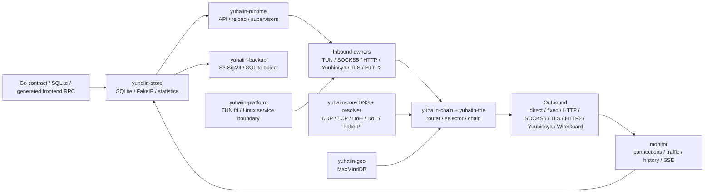

# yuhaiin Go → Rust 迁移清单

更新时间：2026-08-14

这是一份面向“Rust 二进制直接替换 Go 后端、前端不改”的活清单。它按模块记录 Go 的权威入口、Rust 的实现位置、可复现证据和剩余动作；不再使用 P1/P2。

运行约定：宿主机只负责路径准备、Podman 调度、curl 和结果收集；Rust/Go harness、测试函数、runtime、代理链、SQLite 副本和网络命名空间均在 Podman 中运行。构建缓存和测试状态只放在 `~/.cache/yuhaiin-rust`，不使用 `/tmp`。

缓存维护：`make cache-usage` 是只读检查，会报告总量、最大一级目录并在默认 20 GiB（可用
`YUHAIIN_CACHE_WARN_GIB` 调整）时报警；`make cache-prune` 只清理超过
`YUHAIIN_CACHE_RETENTION_DAYS`（默认 1 天）的 integration/parity/benchmark 场景目录，保留
`cargo-target` 和 `fixtures`。需要预览时设置 `YUHAIIN_CACHE_DRY_RUN=1`；不会自动删除可复用
构建产物。一次性 cross/CI/musl target 也只有在显式设置
`YUHAIIN_CACHE_PRUNE_TRANSIENT=1` 后才会按固定 allowlist 清理；确认没有 cargo/rustc 运行时，
还可设置 `YUHAIIN_CACHE_PRUNE_DEBUG=1` 清掉 `cargo-target/debug` 的依赖中间产物，但保留
debug 二进制。所有临时状态仍放在 `~/.cache/yuhaiin-rust`，不使用 `/tmp`。

## 总体状态

| 指标 | 当前值 |
| --- | ---: |
| 纳入统计的模块验收项 | 41 |
| 已完成 `[x]` | 34 |
| 主路径可用但仍有现场/样本缺口 `[~]` | 7 |
| 有实际功能缺口 `[ ]` | 0 |
| 加权覆盖率 | **91.5%** = `(34 + 7 × 0.5) / 41` |
| 主目标 | Linux desktop：Rust 可启动、管理前端可接入、普通 inbound/outbound 可串联 |
| 当前结论 | **Linux desktop 主路径已具备替换前验收条件**；TUN 多路由 lease、RST/reconnect、graceful/SIGKILL teardown、Debian rootful firewall matrix 和 TPROXY UDP delivery/idle/force-stop 已闭环，剩余 `[~]` 主要是生产异常快照、更长统计样本、TLS/ECH 现场、Windows/macOS 原生 runner 和第三方 WireGuard |

`[x]` 表示代码和对应测试/进程证据都存在；`[~]` 表示主路径已经能运行，但验证范围还不足以称为 Go 的完整替换；`[ ]` 表示仍有明确功能或现场证据缺口；`延期` 不计入 41 项统计。

### 一眼速览

下面只统计 8 个实现模块的功能条目；Android、macOS、QUIC/DoH3、Reality、Mux、Tailscale、
Shadowsocks 等明确延期项不计入覆盖率。模块内的 `[~]` 是“主路径已运行、现场或样本仍不足”，
不是未实现。

| 模块 | 已完成 | 主路径可用但待补现场/样本 | 纳入条目 | 加权覆盖率 |
| --- | ---: | ---: | ---: | ---: |
| 公共数据面、NAT、TUN | 4 | 0 | 4 | 100% |
| DNS、FakeIP、MaxMindDB | 5 | 0 | 5 | 100% |
| Router、Trie、GeoIP | 4 | 0 | 4 | 100% |
| Protocol、transport、proxy chain | 10 | 4 | 14 | 85.7% |
| WireGuard outbound | 3 | 0 | 3 | 100% |
| SQLite、配置、FakeIP persistence、统计 | 2 | 2 | 4 | 75.0% |
| Runtime、inbound owner、API、观察面 | 4 | 2 | 6 | 83.3% |
| Platform boundary（仅 Linux desktop 条目） | 1 | 0 | 1 | 100% |
| **合计** | **34** | **7** | **41** | **91.5%** |

计算方式：`(已完成 + 主路径可用但待补现场/样本 × 0.5) / 纳入条目`；功能总览中的
Inbound/outbound 能力矩阵是交叉索引，不重复计入上表。

## 架构边界



TUN 是 inbound 的一种。它和 SOCKS5、HTTP proxy、Yuubinsya、TLS/HTTP2 inbound 一样由 `inbounds` owner 管理；WireGuard 的 userspace stack 只属于 outbound，不创建第二个 OS TUN inbound。

## 模块状态

### 1. 公共数据面、NAT 和 TUN

| Go 权威入口 | Rust 位置 | 状态 | 证据 | 下一动作 |
| --- | --- | :---: | --- | --- |
| `pkg/net/netapi/*`、`pkg/net/proxy/proxy/*` | `crates/yuhaiin-core/src/lib.rs`、`proxy.rs`、`flow.rs` | `[x]` | `workspace-tests`、proxy/flow unit tests | — |
| `pkg/net/nat/table.go`、`source.go`、`migrate.go` | `crates/yuhaiin-core/src/nat.rs`、`nat_tests.rs`、`nat_process` | `[x]` | full-cone、多 source、rebind、idle reap、force-stop | — |
| `pkg/net/proxy/tun/tun.go`、`tun/device/*` | `crates/yuhaiin-core/src/tun.rs`、`tun_unit_tests.rs`、`tun_runtime_tests.rs` | `[x]` | `tun-rs AsyncDevice + smoltcp`；TCP/UDP/ICMP、fragment、DNS/FakeIP、NAT、真实 packet echo、rootful TCP+UDP fixed traffic、3-route lease、TCP RST/reconnect、graceful/SIGKILL teardown 已有；IPv4 kernel fragmentation 五档、IPv6 合法 MTU 四档和扩展头分片布局单测均通过；Debian VM 又通过了 TCP/reload/force-stop、MTU 1280 UDP、TLS/H2/Yuubinsya chain 和带 Hop-by-Hop + Destination Options 的真实 IPv6/UDP TUN round-trip；2026-08-14 的 `make tun-distro-smoke` 已用 `YUHAIIN_TEST_IMAGE` 在 Alpine、Ubuntu 24.04、Fedora 三种 user/network namespace 跑完 reload、traffic、close 和 576/1280/1500/9000/9216 五档 65507-byte UDP；桌面 supervisor 现在按 Go 语义为每个 enabled TUN inbound 管理独立 OS TUN/device/route lease，注入式 FD API 仍保持单设备 | — |
| `pkg/net/proxy/tun/tun2socket/*`、`tun/gvisor/*` | 单一路径 `tun-rs + smoltcp` | `延期` | 按约定不同时维护 tun2socket 和第二套 userspace stack | 只有当前路径出现性能/兼容性问题时再评估 |
| `pkg/route/loopback.go`、`pkg/net/netlink/*` | `crates/yuhaiin-runtime/src/loopback.rs`、`interfaces.rs`、`crates/yuhaiin-core/src/tun.rs` | `[x]` | rootful TUN connection metadata 已逐字段固定 endpoint、localAddr、process、PID、UID 和 selected node；loopback guard 单测覆盖 | — |

### 2. DNS、FakeIP 和 MaxMindDB

| Go 权威入口 | Rust 位置 | 状态 | 证据 | 下一动作 |
| --- | --- | :---: | --- | --- |
| `pkg/net/dns/resolver/udp.go`、`tcp.go`、`dns.go` | `crates/yuhaiin-core/src/dns_resolver_async.rs`、`dns_udp_async.rs`、`dns_tcp_async.rs` | `[x]` | UDP/TCP resolver/server source-bind smoke 和 unit tests；新增完整 DNS packet boundary，MX/TXT/CNAME/NS/DNSSEC 等未建模 QTYPE 会保留原始报文、EDNS/DNSSEC 字段和 transaction id；2026-08-14 修复 `SystemAsyncIpResolver` 的 typed query 不再把 PTR/HTTPS/SVCB 降级为 A/AAAA，Unix 保留原始 UDP，Windows 使用 Hickory 系统配置/缓存 resolver，Linux 单测 3/3、Windows GNU Podman cfg/build smoke 通过 | — |
| `pkg/net/dns/resolver/doh.go`、`dot.go`、`dohjson.go` | `crates/yuhaiin-runtime/src/doh_tls.rs`、`dot_tls.rs`、`rustcrypto_resolver.rs` | `[x]` | DoH/DoT real TLS、HTTP/2、timeout、certificate、local bind tests；DoH/UDP/TCP 原始 DNS 报文透传复用同一 resolver boundary | — |
| `pkg/net/dns/server/server.go` | `crates/yuhaiin-runtime/src/data_plane.rs`、`crates/yuhaiin-core/src/dns_*` | `[x]` | 同一配置同时绑定 UDP/TCP，reload 复用同一 handler；运行时 DNS 对预加载 FakeIP 的 IPv4/IPv6 PTR 反向映射返回本地答案；长期运行的 TUN DNS handler 会在 resolver/FakeIP/`hijackDns` reload 后切换快照；未建模 QTYPE 走原始 upstream packet path，并由真实 RuntimeDnsHandler→UDP/TCP server/client 回归固定 | — |
| `pkg/net/dns/fakeip/*` | `crates/yuhaiin-store/src/fakeip.rs`、`resolver.rs`、`tun.rs` | `[x]` | 双栈 allocation/reverse/TTL/touch/reopen、Go Pebble NDJSON/v6 takeover、DNS packet hook；FakeDNS whitelist/skipCheckList 按 Go 优先级从 JSON/SQLite 加载，含 wildcard、query 和 overlay reload 单测 | — |
| `pkg/net/trie/maxminddb/*` | `crates/yuhaiin-geo/src/lib.rs` | `[x]` | 纯 Rust reader、SHA-256、atomic refresh、坏库 fail-closed、IPv4-mapped IPv6；`make maxmind-smoke` 使用用户指定的 `Country-without-asn.mmdb` 和固定 SHA-256 在 Podman 中查询真实库 | — |

### 3. Router、Trie 和 GeoIP

| Go 权威入口 | Rust 位置 | 状态 | 证据 | 下一动作 |
| --- | --- | :---: | --- | --- |
| `pkg/net/trie/domain/*`、`pkg/net/trie/cidr/*` | `crates/yuhaiin-trie/src/lib.rs`、`router.rs` | `[x]` | parent/wildcard/normalize、IPv4/IPv6 LPM、随机 naive model 对照 | — |
| `pkg/route/rule.go`、`nested.go`、`history.go` | `crates/yuhaiin-runtime/src/route.rs`、`crates/yuhaiin-trie/src/router.rs`、`crates/yuhaiin-runtime/src/proxy.rs` | `[x]` | priority、host/CIDR/port、all/any/not、negative matcher、match history，以及 Go `node_tags_v2` 的 node/mirror tag 数据面选择；TCP/UDP node set 均支持成员失败重试，且 tag endpoint 会同步到连接 metadata；Podman HTTP inbound→tag→HTTP outbound 链通过 | — |
| `pkg/route/list.go`、`downloader.go`、`contract.go` | `crates/yuhaiin-runtime/src/route.rs`、`api.rs` | `[x]` | local/HTTP route list、atomic cache、API mutation/reload；Podman loopback HTTP fixture 已验证 remote body→`.part` 原子缓存→reload→运行时 trie→`errorMsgs=[]`；RuntimeService 已按 Go 分钟语义启动可 reload/shutdown 的后台刷新 timer；4 个停止态 Go SQLite 的 route/resolver projection、mutation 和错误 contract 均与 Rust identical | — |
| `pkg/route/loopback.go`、process/inbound matchers | `crates/yuhaiin-runtime/src/loopback.rs`、`route.rs`、`proxy.rs` | `[x]` | process/inbound/local endpoint metadata 参与选择；自环 fail-closed | TUN 真实 kernel 现场另计 |

### 4. Protocol、transport 和 proxy chain

| Go 权威入口 | Rust 位置 | 状态 | 证据 | 下一动作 |
| --- | --- | :---: | --- | --- |
| `pkg/net/proxy/direct/*`、`fixed/*`、`fixedv2/*`、`drop/*`、`reject/*`、`http/*`、`mock/http.go` | `crates/yuhaiin-core/src/proxy.rs`、`crates/yuhaiin-core/src/proxy_factory.rs`、`crates/yuhaiin-protocol/src/http.rs`、`http_mock.rs`、`crates/yuhaiin-runtime/src/proxy/http.rs`、`proxy.rs` | `[x]` | direct/fixed/drop/reject(block)/HTTP CONNECT service chain；Go `drop` 的 per-destination 512-entry/5-second expiry adaptive delay、TCP/UDP write sink 和 delayed EOF 已与立即 reject 分离并由 core TCP/UDP tests 固定；域名 endpoint async resolve 已修复；Go `fixedv2` 的首地址与 alternate 地址会保留为有序 endpoint 列表，连接失败时按顺序回退；每地址 `network_interface` 会传到 Linux TCP/UDP socket 的 `SO_BINDTODEVICE`，并由 Podman 单测验证；Go outbound `http_mock` 的固定 GET 请求、runtime 节点映射和底层 datagram 透传已补齐，`yuhaiin-runtime` 进程 builder 的真实 TCP echo 测试通过；Go inbound `proxy`/`http_mock` 透明 transport 也复用普通 listener，`service-chain-smoke` 通过 2/2 实际 HTTP echo | — |
| `pkg/net/proxy/socks5/client.go`、`server.go` | `crates/yuhaiin-protocol/src/socks5.rs`、`socks5_server.rs`、`crates/yuhaiin-runtime/src/inbounds/socks5.rs` | `[x]` | TCP auth/request、UDP ASSOCIATE、IPv4/IPv6/domain framing、inbound/outbound chain | — |
| `pkg/net/proxy/socks4a/server.go`、`mixed/*` | `crates/yuhaiin-runtime/src/proxy/socks4a.rs`、`inbounds/mod.rs` | `[x]` | mixed inbound dispatches SOCKS4A/SOCKS5/HTTP | — |
| `pkg/net/proxy/tls/*` | `crates/yuhaiin-protocol/src/tls.rs`、`crates/yuhaiin-runtime/src/proxy/*` | `[x]` | RustCrypto TLS inbound/outbound、SNI、CA、insecureSkipVerify contract | — |
| `pkg/net/proxy/tls/unwrap.go` (`tls_termination`) | `crates/yuhaiin-runtime/src/proxy.rs`、`crates/yuhaiin-store/src/compat_proxy.rs` | `[~]` | Go contract point 已注册并由 Rust 导入/runtime 分发；TLS server 解包 wrapper 支持默认证书、`serverNameCertificate` wildcard、ALPN、Go JSON byte array/base64 和 `certFile/keyFile`、`certFilePath/keyFilePath` 文件路径；证书加载现在按 Go `x509KeyPair` 语义先尝试完整文件对，文件不存在或解析失败时回退内嵌 `cert/key`；Podman TLS-specific resolver/parser/build tests 4/4，覆盖 exact、单标签 wildcard、大小写/末尾点、无 SNI 默认回退和 Go 文件字段；真实 `reverse_http raw TLS → tls_termination → http_termination → HTTP target` 及 standalone `reverse_http raw TLS → tls_termination → HTTP target` 进程链均通过；`make go-termination-parity-smoke` 已在 Go/Rust Podman 前台进程中完成组合链、upstream 502、standalone、坏文件路径回退和仅 named `serverNameCertificate`（无默认证书、带 SNI）链共 10/10，且 TLS handshake 使用后台 pipe 不阻塞 reverse relay | 继续补更多 Go 现场证书/异常矩阵 |
| `pkg/net/proxy/reverse/unwrap.go` (`http_termination`) | `crates/yuhaiin-runtime/src/proxy/http_termination.rs`、`crates/yuhaiin-runtime/src/proxy.rs`、`crates/yuhaiin-store/src/compat_proxy.rs` | `[~]` | Go contract point 的 parent-preserving reverse HTTP 行为已接入；Hyper HTTP/1+HTTP/2 server、HTTP/HTTPS upstream、域名 header trie、hop-by-hop 清理、streaming body、TLS termination marker、TCP/UDP/ping/close 委托均有 Rust focused tests；Podman runtime 9/9、store 1/1，新增 domain Host → direct parent 回归、explicit HTTPS 目标和 502/CONNECT/malformed error 矩阵，真实 reverse HTTP plain 与 raw TLS 组合链 2/2、完整 service-chain 33/33；`make go-termination-parity-smoke` 对 Go/Rust 的组合链、upstream 不可达 502、standalone TLS termination、坏文件路径回退和 named serverNameCertificate 共 10/10；新增 opt-in `make go-termination-https-smoke` 使用系统 CA 在 Podman 中真实访问 `reverse_http URL=https://example.com/`，Go/Rust 200 响应 2/2，完整 termination 场景 10/10；HTTP inbound 现在也接受 Go `httputil.ReverseProxy` 语义的 absolute-form `GET https://...`，在已选 outbound stream 上完成 origin TLS 后再改写并转发请求；新增 opt-in `make http-inbound-https-smoke`，Podman 真实链路 1/1，普通 service-chain 28/28；HTTP inbound 现按 HTTP/1.1 framing 循环处理同一客户端连接上的多个请求，支持 Content-Length/chunked/关闭分隔响应，并按 Go ReverseProxy 清理固定及 `Connection` token hop-by-hop headers；新增 `Expect: 100-continue` 本地解锁、上游 informational/103 forwarding，单元 21/21 和 Podman 真实 HTTP inbound→direct→本地 target 持久客户端链 2/2；55ms sniff 超时后仍依据已读 request line 保留 HTTP rewrite；活跃 Hyper task 会在新连接时回收；外层 duplex connection 的动态 HTTP target 不伪造单一 outbound 地址；本轮补齐 Go Director 的 `X-Forwarded-For` 追加、`TE: trailers` 保留、空 `User-Agent` 和 `Transfer-Encoding` 清理，`http_termination` focused 9/9、service-chain 33/33、Go/Rust termination parity 10/10 | 继续补 Go/Rust HTTP inbound HTTPS 对照、证书/异常和更多 HTTPS 现场矩阵 |
| Go `pkg/net/proxy/tls.NewTlsAutoServer`、`pkg/cert.GenerateServerCert` | `crates/yuhaiin-runtime/src/inbounds/tls_auto.rs` | `[~]` | 动态 SNI 叶子证书、精确/单标签 wildcard、DNS/IP SAN、ALPN、按配置域名共享证书缓存；RustCrypto X.509 builder 已兼容 Go 的 ECDSA P-256、Ed25519、RSA CA/PKCS#8，10 个 Podman focused tests 通过；保存 inbound 时已按 Go 语义生成缺失/半套 `caCertBase64`/`caKeyBase64` 并保持 reload 稳定；真实 `tls_auto → HTTP inbound → router → direct outbound` 进程链 1/1 | rustls server-side ECH 尚未有等价公开 API；补 Go/Rust live config 和 ECH 现场后再升为 `[x]` |
| `pkg/net/proxy/http2/v1/*`、`v2/*` | `crates/yuhaiin-chain/src/h2_tunnel.rs`、`h2_server.rs`、`crates/yuhaiin-core/src/http2.rs` | `[x]` | prior-knowledge、TLS ALPN、pool/drain/GOAWAY、HTTP CONNECT/SOCKS5 bridge | — |
| `pkg/net/proxy/yuubinsya/*`、`yuubinsya2/*` | `crates/yuhaiin-core/src/yuubinsya.rs`、`crates/yuhaiin-chain/src/session.rs`、`direct_uot.rs` | `[x]` | TCP、native UDP、UOT/dup-over-TCP、Ping、migration/reconnect、Go client interop | — |
| `pkg/net/proxy/network_split/*` | `crates/yuhaiin-store/src/compat_proxy.rs`、`crates/yuhaiin-store/src/compat_proxy_async.rs`、`crates/yuhaiin-runtime/src/proxy.rs` | `[x]` | 按 Go 语义分别构造 TCP/UDP branch，保留父链前缀；direct/fixed/drop/reject/HTTP/HTTP proxy/SOCKS5/TLS/WebSocket/HTTP/2/协议层/Yuubinsya/WireGuard/`bootstrap_dns_warp`/`proxy` branch 已接入；`bootstrap_dns_warp` 和 `proxy` 按 Go 注册语义作为 no-op wrapper 透传父代理，独立节点退化为 direct/zero base；WireGuard branch 复用 Cloudflare BoringTun userspace builder（Go contract 同样注册 WireGuard，underlay 不依赖父 proxy）；父链 fixed endpoint 会用于 connections/tag metadata；Podman runtime/store focused tests、真实 HTTP inbound→router→`fixed→network_split(tcp=wireguard)`→BoringTun peer，以及 SOCKS5 UDP→`network_split(udp=wireguard)`→peer 均通过；仅 nested `network_split` 仍显式拒绝 | — |
| `pkg/net/proxy/aead/*` | `crates/yuhaiin-protocol/src/aead.rs`、`crates/yuhaiin-runtime/src/inbounds/mod.rs` | `[x]` | TCP/UDP wire and Go interop；入站 AEAD→HTTP/2、AEAD→WebSocket 共享 transport 解包，声明顺序逆置时仍按 Go listener wrapper 顺序解包；TLS→AEAD→HTTP/2 也由真实进程链验证；Podman focused/runtime tests 通过 | — |
| `pkg/net/proxy/websocket/*`、HTTP obfs | `crates/yuhaiin-protocol/src/websocket.rs`、`http_obfs.rs`、`crates/yuhaiin-runtime/src/proxy/websocket.rs` | `[x]` | Go WebSocket→HTTP/2 interop、fragmented headers、early data | — |
| `pkg/net/proxy/vless/*`、`vmess/*`、`trojan/*` | `crates/yuhaiin-protocol/src/{vless,vmess,trojan}.rs`、runtime counterparts | `[~]` | parser/runtime/unit coverage；`make service-chain-smoke` 在 Podman 中通过 API→HTTP inbound→domain router→普通 VLESS/VMess/Trojan outbound 的 TCP 3/3 payload echo，并新增 VLESS/VMess/Trojan 的普通、TLS+WebSocket TCP 7/7 payload echo，以及 VLESS/VMess 普通、TLS+WebSocket UDP 5/5 framing、connections、selected node、match history；Rust runtime builder 现在也覆盖 Go-compatible VLESS/VMess/Trojan TLS/WebSocket transport layer，且共享 stream transport builder；本轮新增 `fixedv2 → HTTP/2 → VLESS/VMess/Trojan` 的可复用 transport/protocol 组合和真实 H2 CONNECT body wire harness，Podman `http2_protocol_layers` 通过 1/1（循环覆盖 3 种协议），runtime 构造回归 2/2；新增真实 `::1 → HTTP/2 → VLESS/VMess/Trojan` TCP 链路，Podman focused test 通过 3/3，fixed transport 使用 listener 实际地址族；`make go-protocol-interop-smoke` 当前在 Podman 通过 16/16 个真实 Go listener/client wire test，覆盖 VLESS 双向普通/TLS/TLS+WebSocket、VLESS UDP、VMess 普通/TLS+WebSocket/UDP、Trojan 普通/TLS+WebSocket/UDP；本轮补齐 Go 兼容 VMess legacy `alter_id>0` 的 user 链、时间 HMAC、AES-128-CFB 请求/响应头和 MD5 body key/IV，协议 focused `39 passed, 0 failed, 2 ignored`、workspace all-features `40 passed, 0 failed, 2 ignored`，runtime legacy builder 回归通过；新增真实 ServiceProcess VLESS/Trojan TCP 入站→direct outbound 回显和 connections 元数据回归 2/2 | 更广的 runtime listener/outbound、地址族和远端 UDP/真实远端组合矩阵 |
| `pkg/net/proxy/tproxy/*`、`redir/*` | `crates/yuhaiin-runtime/src/proxy/transparent.rs` | `[x]` | REDIRECT TCP、IPv4/IPv6 ancillary decoder unit tests；透明 TCP 现在复用普通 inbound transport 解包，TLS/TLS-auto/AEAD/http_mock allow-list 与 TLS→relay、AEAD→relay Podman unit 均已验证；PROXY protocol、HTTP/2、WebSocket 仍因会改变原始目的地址而显式拒绝；当前源码二进制在 Debian 6.5 rootful VM 中通过 iptables 与 native nft TPROXY UDP（每项 2 flow、original destination、reply/rebind、monitor 统计、socket readback、idle reap）、IPv4/IPv6 REDIRECT 及 SIGKILL teardown；测试脚本的 `--rm` 回收竞态也已收敛 | — |
| `pkg/net/proxy/shadowsocks/*`、`shadowsocksr/*` | Rust protocol modules remain compatibility code | `延期` | 当前迁移范围不以 SS/SSR 为门槛 | 后续若 Go 未废弃再决定是否保留 |
| `pkg/net/proxy/quic/*`、`reality/*`、`mux/*`、`tailscale/*` | — | `延期` | 用户明确暂不实现 | 不阻塞 Linux desktop replacement |

### 5. WireGuard outbound

| Go 权威入口 | Rust 位置 | 状态 | 证据 | 下一动作 |
| --- | --- | :---: | --- | --- |
| `pkg/net/proxy/wireguard/{wireguard,bind,device}.go` | `crates/yuhaiin-wireguard/src/lib.rs`、`crates/yuhaiin-runtime/tests/wireguard_chain.rs` | `[x]` | Cloudflare `boringtun 0.7.1`、reserved/base64/PSK/keepalive/AllowedIPs、smoltcp TCP/UDP adapter；本地双 peer 已验证 authenticated endpoint roaming 和完整 UDP session；runtime WireGuard 让 peer endpoint 和最终目标都使用配置 resolver，驱动初始化也在构建返回前完成 ready/error 握手；外部验证入口同时接受 Go JSON 与标准 WARP/`wg-quick` INI；`make wireguard-chain-smoke` 在 Podman 通过真实 runtime HTTP/TCP 与 SOCKS5/UDP inbound→CIDR router→WireGuard outbound→BoringTun peer 的 TCP/UDP echo、连接元数据和 latency；2026-08-14 Debian VM 标准 Go `wireguard-go` peer 与 Rust 端实际完成 TCP+UDP echo 2/2；最新 64 MiB packet benchmark 为 542.52 MiB/s、peak RSS 3,732 KiB、11 CPU ticks、190 次进程采样 | 真实 WARP/public peer、真实链路 keepalive/NAT endpoint 变化归入下方外部兼容项 |
| Go `WireGuard` node config | `crates/yuhaiin-store/src/compat_proxy*.rs`、`crates/yuhaiin-runtime/src/proxy.rs` | `[x]` | `make wireguard-smoke`：Podman `--network=none` 双 userspace peer，11/11（另 1 个 benchmark ignored），并覆盖 WARP/`wg-quick` INI 解析和不完整配置拒绝 | — |
| Go packet path | `scripts/benchmark/wireguard.sh` | `[x]` | release BoringTun packet benchmark，Podman 64 MiB 基线同时记录吞吐、峰值 RSS、CPU ticks 和进程采样次数，结果只作同机回归基线 | 公网/第三方链路性能不能由本地 benchmark 推断 |

### 6. SQLite、配置兼容、FakeIP persistence 和统计

| Go 权威入口 | Rust 位置 | 状态 | 证据 | 下一动作 |
| --- | --- | :---: | --- | --- |
| `pkg/storage/sqlite/{sqlite,migrations,compact}.go` | `crates/yuhaiin-store/src/sqlite.rs`、`schema.rs`、`migration.rs` | `[x]` | `rusqlite + bundled SQLite`、WAL、busy timeout、quick check、rollback、backup/restore、force-stop | — |
| `pkg/store/{node,inbound,resolver,route_*,settings,backup}.go`、`pkg/app/backup.go`、`pkg/s3/*` | `crates/yuhaiin-store/src/repository.rs`、`compat_runtime.rs`、`crates/yuhaiin-backup/src/lib.rs`、`tests/*` | `[~]` | typed repository、Go v1/v5/v6/schema-7、unknown JSON、users/routes/tags/settings/NAT；S3 SigV4 PUT/GET、Go camelCase 配置、BLAKE2b `lastBackupHash` 和选中 outbound proxy transport 已接入 API，并由本地兼容端点 wire test、runtime API test、`make s3-minio-smoke` 的真实 MinIO Podman 上传/下载覆盖；新增 backup unit 8/8，覆盖禁用/不完整配置、空/绝对 object key、HTTP 状态/body 截断和签名请求；Rust `backup_to` 现按 Go `backupRuntimeTables` 清理与 Go 完全一致的 12 张统计/连接/FakeIP 运行时表，重置 `route_list_refresh` 并清空 `lastBackupHash`/`updated_at`，缺失的惰性统计表跳过；新增坏 JSON、目标 sidecar 和 staging 清理异常回归，store 定向 120 passed/0 failed/5 ignored、Clippy、workspace 49 harnesses 和真实 MinIO 均通过 | 真实 AWS 权限现场，以及更多异常快照逐表 diff |
| `pkg/net/dns/fakeip/sqlite.go`、`pool.go` | `crates/yuhaiin-store/src/fakeip.rs` | `[x]` | reopen、cursor、release、capacity、dual-stack 和 legacy import | 更多生产容量/TTL 样本 |
| `pkg/statistics/{sqlite,statistic,telemetry,conn}.go` | `crates/yuhaiin-store/src/statistics.rs`、`crates/yuhaiin-runtime/src/monitor.rs` | `[~]` | traffic/history/telemetry、Go projection、SSE、并发 reader/writer、force-stop recovery；Go/Rust live-flow parity 与 API history UTC 已验证；新增真实前台 HTTP flow 的 SSE 初始/新增/移除、close、total/traffic/telemetry/history 进程测试；`make stats-soak-smoke` 在 Podman 中以 24 readers×1000 rounds、2000 writes 运行 89.50s 通过；统计 harness 现在把 SQLite、WAL、日志持久化到 `~/.cache/yuhaiin-rust`，并在每轮报告字节数；跨进程 SQLite 写锁释放后的 projection retry 也有 focused 回归 | 更长 production projection 与真实生产时段样本 |

### 7. Runtime、inbound owner、API 和实时观察面

| Go 权威入口 | Rust 位置 | 状态 | 证据 | 下一动作 |
| --- | --- | :---: | --- | --- |
| `pkg/node/runtime.go`、`pkg/inbound/*` | `crates/yuhaiin-runtime/src/controller.rs`、`inbounds/mod.rs` | `[x]` | immutable snapshot、atomic reload；普通 node/route/resolver reload 只替换已注册 live selector，并同步长期 TUN DNS handler，inbound/user/selected-node/apply 才发送专用事件重绑 listener；HTTP CONNECT 持久连接在 route reload 期间继续传输，inbound reload 仍采用 latest-wins | — |
| `pkg/inbound/*`、`pkg/net/proxy/{http,socks5,yuubinsya,tls}.go`、`pkg/net/proxy/reverse/*` | `crates/yuhaiin-runtime/src/inbounds/*`、`proxy/*` | `[x]` | inbound→router→outbound service chain；HTTP/SOCKS5/Yuubinsya/TLS/HTTP2/mixed/reverse；Go 的 `proxy`/`http_mock` server transport 透明 wrapper 已纳入普通 listener；Podman 真实前台进程已覆盖 reverse TCP raw relay 和 reverse HTTP path/Host rewrite、direct outbound、connections metadata，以及透明 transport 2/2 HTTP echo；新增 AEAD→HTTP/2→HTTP、TLS→AEAD→HTTP/2→HTTP outbound 真实进程链；`api-reload-flow-smoke` 现通过 API 动态 POST 新增 SOCKS5/Yuubinsya inbound、各自完成 TCP echo 和 connections metadata，再 DELETE 并确认两个 listener 解绑（3/3） | — |
| Go TUN inbound contract | `crates/yuhaiin-runtime/src/inbounds/mod.rs`、`data_plane.rs` | `[x]` | TUN 作为 inbound supervisor；真实 user+network namespace、rootful TCP+UDP fixed traffic、multi-route lease、reload、RST/reconnect、graceful/SIGKILL teardown 已通过；真实 kernel IPv4 五档、IPv6 合法 MTU 四档 fragmentation matrix 已通过；扩展头分片布局和真实 Hop-by-Hop + Destination Options IPv6/UDP round-trip 在 Podman 中通过；`tun-api-process-smoke` 编译和运行均在 Podman，验证真实前台二进制通过 API 对默认禁用 TUN、单个新增 TUN 和两个同时 enabled 的 TUN 做开关，两个设备可同时在 `/proc/net/dev` 出现并独立关闭；Alpine、Ubuntu 24.04、Fedora 三种容器用户态的 `tun-distro-smoke` 均通过；Debian rootful VM 的 route matrix 通过 3 routes、graceful cleanup 和 owner SIGKILL cleanup | — |
| `pkg/httpapi/v2*.go`、`register.go` | `crates/yuhaiin-runtime/src/api.rs` | `[x]` | generated frontend RPC route coverage、read/mutation/error parity、API reload/live flow；`inbounds/config` 的 DNS 劫持变更会触发 inbound owner reload | 更多生产 response 字段样本 |
| `pkg/net/netapi/{conn,server}.go`、`pkg/statistics/notify.go` | `crates/yuhaiin-runtime/src/monitor.rs`、`log.rs`、`service.rs` | `[x]` | connections、SSE、traffic、history、telemetry、node latency、pprof、启动日志；TUN 在出站 TCP/UDP socket 建立前先发布 pending flow，建链后以同一 ID merge `localAddr/underlyingType/protocol`，并以 Go-compatible `connections_added` 更新事件回填；真实前台 API 进程测试覆盖连接字段、SSE 初始/新增/移除、close、total/traffic/telemetry/history；Podman `go-live-flow-parity-smoke` 比较 Go/Rust 真实 live flow，workspace 289 runtime tests 通过 | — |
| Go service lifecycle | `crates/yuhaiin-runtime/src/service.rs`、`src/bin/service/*`、`src/update.rs` | `[~]` | Linux systemd install/rollback/health smoke；macOS launchd plist/bootstrap/kickstart、Windows Service SCM install/start/stop/delete/recovery-actions/health/rollback 已实现；macOS `launchctl bootout` 失败现在会 fail-closed，不会在旧服务仍运行时替换二进制；update helper 的成功安装、保留 rollback image、stop/restart failure 恢复、失败时清理 `*.update-stage` 和 staged retry 均有 Podman 单测；foreground 默认 stderr progress；前台退出信号与 Go 对齐，处理 SIGHUP/SIGINT/SIGTERM/SIGQUIT，且 Podman 进程回归实际发送 SIGHUP；默认数据库目录按 Go `os.UserConfigDir` 语义选择 Linux `XDG_CONFIG_HOME`、macOS `~/Library/Application Support` 和 Windows `%APPDATA%`，并保留已有 Rust state 的回退选择；新增 GitHub Actions `native-service` 的 macOS/Windows 原生 runner harness，按 install→health→restart→health→update→health→rollback→health→uninstall 验证并把日志留在 `~/.cache/yuhaiin-rust` | 等待 macOS/Windows 原生 runner 首次真实权限现场安装、更新和回滚 |

### 8. Platform boundary

| Go 权威入口 | Rust 位置 | 状态 | 证据 | 下一动作 |
| --- | --- | :---: | --- | --- |
| `pkg/net/proxy/tun/device/*`、`pkg/net/netlink/*` | `crates/yuhaiin-platform/src/lib.rs`、`yuhaiin-core::TunRuntime` | `[x]` | Unix owned FD、Linux desktop TUN、injected FD boundary、纯 Rust route manager、rootful multi-route lease/teardown、IPv4/IPv6 kernel fragmentation；IPv6 扩展头分片布局及真实 IPv6/UDP extension-header TUN round-trip 也已在 Podman 覆盖；`YUHAIIN_TEST_IMAGE` 已实际验证 Alpine、Ubuntu 24.04、Fedora 三种用户态，Debian rootful VM 又实际通过 3-route lease 的存活、graceful cleanup 和 SIGKILL cleanup；桌面 enabled TUN 使用独立设备和可回收 route lease，TUN DNS handler 支持 resolver/inbound policy hot reload | — |
| Android `VpnService` / AAR host | `TunRuntime::from_owned_fd` API 已预留 | `延期` | 当前范围先完成纯 desktop replacement | 后续同步修改 yuhaiin-android |
| macOS utun / app lifecycle | platform boundary 文档和接口已留口 | `延期` | 当前范围不计入 desktop Linux 覆盖率 | 后续单独验收 |

## Inbound / outbound 能力矩阵

| 能力 | Inbound | Outbound | 当前状态 |
| --- | :---: | :---: | :---: |
| direct / reject(block) / drop / fixed | fixed/direct listener | 是 | `[x]` |
| HTTP proxy / CONNECT | 是 | 是 | `[x]` |
| SOCKS5 TCP | 是 | 是 | `[x]` |
| SOCKS5 UDP ASSOCIATE | 是 | 是 | `[x]` |
| mixed / mix UDP | 是 | 是 | `[x]` |
| SOCKS4A | 是 | — | `[x]` |
| TLS | 是 | 是 | `[x]` |
| HTTP/2 | 是 | 是 | `[x]` |
| Yuubinsya TCP | 是 | 是 | `[x]` |
| Yuubinsya native UDP | 是 | 是 | `[x]` |
| Yuubinsya UOT / dup-over-TCP | 是 | 是 | `[x]` |
| reverse TCP / reverse HTTP | 是 | — | `[x]`：真实前台进程分别验证 raw relay、HTTP path/Host rewrite、direct outbound 和 connections metadata |
| TUN | 是 | — | `[x]`：真实 user/rootful data-plane、每个 enabled inbound 独立设备、3-route lease、reload、reset/reconnect、teardown、IPv4 五档和 IPv6 合法 MTU 四档 fragmentation、真实 IPv6 extension-header round-trip 均通过 |
| redir TCP / TPROXY UDP | 是 | — | `[x]`：TLS/TLS-auto/AEAD transport 可在透明 TCP listener 上先解包再 relay；当前源码在 Debian rootful VM 通过 iptables/native nft 的 2-flow delivery、original destination、回包/rebind、idle reap、IPv4/IPv6 REDIRECT 和 force-stop |
| DNS UDP / TCP / DoH / DoT | server/client | resolver/client | `[x]` |
| WireGuard | — | 是 | `[~]`：BoringTun userspace adapter 已通过本地双 peer |
| Cloudflare WARP MASQUE | — | — | `延期`：Go 侧依赖 QUIC/HTTP3；当前范围明确延期 QUIC/DoH3，不把它误报成 WireGuard 缺口 |
| DoQ / DoH3、QUIC、Reality、Mux、Tailscale | — | — | `延期` |
| Shadowsocks / ShadowsocksR | — | — | `延期` |

## 当前未完成项与下一阶段计划（唯一执行清单）

> 这里只列仍需动作的事项；已经完成的功能和证据保留在上面的模块表及下面的详细验证记录中。`[~]` 表示代码主路径已可运行，但还缺现场或更宽样本；`[ ]` 才表示功能尚未实现。本轮不把明确延期项混入 41 项统计。

### Protocol、transport 和 proxy chain

- `[~]` **tls_auto / ECH**：普通动态 SNI、证书缓存、Go-shaped CA 字段和真实 TCP 链已通过；rustls 当前没有可直接使用的 server-side ECH API。下一步确认上游 API 或可维护的纯 Rust 实现；若仍无稳定实现，保留明确降级行为并将 ECH 记为延期能力。
- `[~]` **VLESS / VMess / Trojan 更宽运行矩阵**：TCP、UDP、TLS、WebSocket、HTTP/2、Go wire interop 和真实 router chain 已通过；Go 侧 `pkg/net/proxy/{vless,vmess,trojan}` 目前注册的是 outbound contract point，并没有对应 inbound listener，因此 Rust 的 VLESS/Trojan inbound 属于扩展能力，不把缺少 VMess inbound 当作 Go parity 缺口；下一步只补更多独立 outbound listener、IPv4/IPv6、远端 UDP fixture 和 latency 场景。

### SQLite、配置兼容和统计

- `[~]` **Go 停止态 SQLite 快照**：4 份快照的 API read/mutation/error parity 和 schema audit 已通过；四份快照均通过逐表语义 SHA-256 row digest，`row_count_diffs` 为空，digest 会规范化投影时间、telemetry surrogate id 和 connection JSON key order；当前唯一的非 migration 内容差异是 v2 `metadata.schema_version` 的 7→6 兼容迁移。审计期间发现并修复 Rust checkpoint 会丢失 Go `connection_history.protocol` 的真实兼容问题，2026-08-14 又完成四份真实 Go 快照的 `SIGKILL → 重启 → 全读矩阵 replay`，仍需更多异常中断/未知字段样本，报告只写入 `~/.cache/yuhaiin-rust`。
- `[~]` **S3 backup**：SigV4、MinIO、restore、proxy transport 和失败语义已通过；下一步在拥有 AWS 权限的环境执行一次真实 S3 PUT/GET/restore，或保留 AWS 现场为外部验收项。
- `[~]` **statistics projection**：实时 connections、SSE、traffic、history、telemetry、force-stop 和 48-reader soak 已通过；统计 harness 已修复为挂载并复用 scenario SQLite，不再把 WAL 留在临时容器内；2026-08-14 连续两轮不重置的 `12 readers × 160 rounds × 256 writes` 均为 2/2 passed，SQLite 从 917504 增至 921600 bytes、WAL 从 197824 增至 214304 bytes；失败连接现在同步 UPSERT Go-compatible `failed_history`，checkpoint 恢复时再合并 durable rows；四份 Go fixture 均完成 mutation 后 `SIGKILL → 重启 → 全读矩阵 replay`；下一步仍需更长 production-like projection/reload 和异常失败样本。

### WireGuard 外部兼容

- `[~]` **真实 WARP/public peer**：本地 BoringTun 双 peer 和 Debian VM 的 Go `wireguard-go` TCP/UDP interop 已通过；下一步验证 reserved、keepalive、NAT endpoint roaming 和网络策略现场。

### CI、发布和原生 service manager

- `[~]` **Darwin/Windows native runner**：release contract、Linux musl、Windows GNU dependency smoke 和 harness 静态检查已通过；下一步运行 GitHub Actions 的 macOS launchd、Windows SCM install/update/rollback job，保存现场日志并确认 SDK/权限差异。

### 明确延期（不计入 41 项）

- `延期` DoQ、DoH3、QUIC、Reality、Mux、yamux、Tailscale、Cloudflare WARP MASQUE。
- `延期` Shadowsocks、ShadowsocksR、订阅更新、Android 独立应用、macOS utun/独立应用。

### 已完成模块的回归入口

| 模块 | 维护入口 |
| --- | --- |
| TUN / NAT / transparent | `make tun-api-process-smoke tun-chain-service-smoke tun-route-matrix-smoke transparent-service-smoke` |
| DNS / FakeIP / MaxMindDB | `make dns-source-smoke doh-source-smoke maxmind-smoke` |
| Router / route list / GeoIP | `make api-reload-flow-smoke production-parity-smoke` |
| Inbound → router → outbound | `make service-chain-smoke api-contract-smoke go-live-flow-parity-smoke` |
| Go protocol interop | `make go-protocol-interop-smoke` |
| WireGuard | `make wireguard-smoke wireguard-chain-smoke wireguard-external-smoke` |
| SQLite / backup / statistics | `make workspace-tests s3-minio-smoke stats-soak-smoke` |
| release / service lifecycle | `make release-contract-smoke release-linux-cross-smoke release-windows-cross-smoke` |

## 已完成验证记录（详细附录）

### Linux 权限和数据面

- `[x]` Debian VM rootful Podman 已通过基础 TUN route lease、普通 packet echo、3 次 reload、MTU 五档、TLS/H2/Yuubinsya chain 和 force-stop teardown。
- `[x]` `make tun-route-matrix-smoke` 的 rootful Podman matrix 已通过 3 条真实 IPv4 routes（含 metric）：owner 存活时可见，graceful close 与 owner SIGKILL 后均 absent；日志位于 `~/.cache/yuhaiin-rust/integration/tun-route-matrix/`。
- `[x]` rootful TUN 已通过 TCP RST 后重新建立连接并完成 echo；smoltcp dispatcher 的 fragment reassembly、overlap、expiry、overflow 和恢复已有单元/模拟 packet 覆盖。
- `[x]` rootful runtime-owned TUN 已通过同一服务内的 TCP+UDP fixed outbound traffic；UDP 客户端使用独立子进程避开 loopback guard，虚拟 routed destination 回包源地址由 smoltcp 单测固定为目标地址。
- `[x]` 真实 kernel IPv4 fragmentation 已在 Debian VM rootful Podman 通过 MTU 576/1280/1500/9000/9216 五档；每档均回环最大合法 IPv4 UDP payload 65507 字节，覆盖 kernel ingress 分片、smoltcp 重组、smoltcp 出方向分片和 kernel egress 重组。
- `[x]` IPv6 ingress/egress fragmentation 已在 Debian VM rootful Podman 通过合法 MTU 1280/1500/9000/9216 四档；每档均回环最大合法 IPv6 UDP payload 65507 字节，覆盖 kernel ingress 分片、Rust ingress 重组、proxy echo、TUN boundary egress 分片和 kernel egress 重组。IPv6 MTU 576 按协议最低 MTU 约束 fail-closed，不作为合法档位。
- `[x]` 在同一 rootful namespace 执行 TPROXY UDP：默认 iptables 与 native nft backend 均通过 transparent socket readback、original destination `10.254.1.2:18082`、local listener `0.0.0.0:18083`、两个 source flow、回包、rebind 和 upload/download monitor 统计。
- `[x]` TPROXY UDP 在 rootful VM 用测试专用 1 秒 timeout 验证了 2 个 flow 的 idle reap；iptables 与 native nft 均通过 service SIGKILL 后的进程级观测，生产默认仍保持 90 秒 `UDP_IDLE_TIMEOUT`。
- `[x]` 当前源码透明服务二进制已在 Debian 6.5 rootful VM 通过 iptables/native nft 两套 firewall backend；每套均覆盖 IPv4 TCP REDIRECT、IPv6 TCP REDIRECT、TPROXY UDP 两条 source flow、original destination、reply/rebind、monitor 统计、idle reap 和 SIGKILL teardown。透明 TCP 的 TLS wrapper 已复用 `prepare_inbound_stream` 并有 Podman unit 覆盖，公共 `UDP_IDLE_TIMEOUT`/reap/close 单测、容器 namespace teardown 也已覆盖基础生命周期；更广发行版/现场差异归入 platform `[~]`。
- `[x]` 将当前 user+network namespace TUN smoke 保持为 CI 默认路径；它证明真实 kernel TUN packet path，Debian rootful VM 的 `tun-route-matrix` 又验证了 3 条 route takeover、graceful cleanup 和 owner SIGKILL cleanup。
- `[x]` IPv6 扩展头已在 Podman 中完成两层回归：core `network=none` harness 覆盖 Hop-by-Hop、Routing、Routing 后 Destination Options、分片重组和重复分片拒绝；`make tun-ipv6-extension-smoke` 另外在 disposable user/network namespace 创建真实 TUN，发送 Hop-by-Hop + Destination Options 原始 IPv6/UDP 包，完成 fixed UDP 出站、echo 回写和设备关闭。smoltcp 地址容量与 ingress extension-header normalization 由单测固定；更广泛发行版/firewall 组合仍保留为 `[~]`。
- `[x]` rootful TUN connection metadata 已在 rootful fixture 中逐字段固定 endpoint/localAddr、selected node、process、PID 和 UID；本轮现场为 `/usr/local/bin/tun-service-smoke`、pid `7`、uid `0`。
- `[x]` `make tun-api-process-smoke` 的编译和运行均在 Podman 中完成；disposable user/network namespace 验证默认 TUN、新增 TUN 和两个同时 enabled 的 TUN，rootful namespace 又验证了真实设备创建/销毁和 API 开关（本轮 rootless/rootful 各 1/1）。共享脚本的 rootful entrypoint 已改为使用调用者实际挂载的 harness，避免 API smoke 错误调用未挂载的 `tun-service-smoke`；rootful TUN → TLS/H2/Yuubinsya chain 也通过。
- `[x]` 2026-08-13 在 Podman 重跑 `make tun-api-process-smoke`：真实前台二进制的 `foreground_binary_api_toggle_changes_real_tun_device` 为 `1 passed, 0 failed`；再次确认 API disable/enable 会唤醒 inbound owner，真实 TUN 设备会在 `/proc/net/dev` 出现/消失，两个 enabled 设备可独立关闭。
- `[x]` TUN 集成脚本的主服务和 MTU 矩阵现在支持 `YUHAIIN_TEST_IMAGE`（以及更具体的 `YUHAIIN_TUN_DISTRO_IMAGE`）覆盖容器发行版；2026-08-14 的 `make tun-distro-smoke` 已在 Alpine、Ubuntu 24.04、Fedora 三种 Podman 用户/network namespace 中完成 reload、无路由窗口、真实 packet traffic、close，以及 576/1280/1500/9000/9216 五档 MTU 回环 65507 字节 UDP，证明 harness 不依赖单一用户态；其他发行版/宿主 kernel 组合属于扩展回归，不再作为当前 Linux desktop 主路径缺口。
- `[x]` 2026-08-14 修复桌面 TUN supervisor 的 owner 隔离：一个 enabled TUN 的 open/dispatcher task 失败时不再 `abort_all` 健康 sibling；失败 owner 保留错误状态并等待显式 inbound reload 或 shutdown，随后才统一重建。`make tun-api-process-smoke`、`make service-chain-smoke` 与 runtime TUN focused tests 在 Podman 通过；该行为与 Go 的“一 inbound 一 owner”生命周期一致。
### Go 生产兼容和统计

- `[~]` 对更多停止态 Go SQLite 做逐表 schema/未知表/异常快照 diff；当前 4 份停止态 snapshot 的 API read/mutation/error parity 已通过，当前重跑的 3 份副本还完成了逐表语义 SHA-256 row digest，源库只读，副本和结果放 `~/.cache/yuhaiin-rust`。
- `[x]` `production-parity-smoke` 现在额外在 Podman 中审计四份停止态快照的 SQLite 对象、逐表列约束、索引保留和语义行内容；Rust 允许的 `dns_resolvers`、`route_rules`、小时级 traffic/failure projection schema migration 被显式列出，projection 时间、telemetry surrogate id 和 connection JSON key order 的已知差异被规范化，其余源表/对象缺失会直接失败。
- `[x]` 2026-08-14 使用 `~/.cache/yuhaiin-rust` 中三份停止态 Go 数据库副本重新运行 `make production-parity-smoke`；每份均在 Podman 完成 Rust takeover、SQLite 对象/语义行审计、info/settings/nodes/inbounds/resolvers/routes/publishes/connections/统计读取、核心 mutation 和错误矩阵，全部 `identical`，源副本未被修改；审计发现的 Go `connection_history.protocol` checkpoint 丢失已修复，并由 runtime 回归锁定。
- `[~]` 增加更长时间 telemetry/history、强停和 reload 组合样本；2026-08-14 已补充 Podman 真实前台进程的 48 readers×3000 rounds、10000 writes 压力回归（2/2 passed，433.71s），覆盖 force-stop reopen 与 restart persistence；统计脚本本轮改为挂载 `~/.cache/yuhaiin-rust/integration/stats-concurrency`，连续两次 `12×160×256` 重用同一 SQLite 并报告 WAL 增长（197824→214304 bytes）；此前 32×2000/5000、32×1200/3000 和更小矩阵也通过。容器压力不能替代真实生产时段的长期 projection 样本，因此仍保留 `[~]`。
- `[x]` SQLite 升级/启动与统计投影的锁竞争已有跨进程 Podman 回归：真实持有 `<db>-yuhaiin-write-lock` 时，另一个 `ConfigStore::open` 会等待并在释放后完成；真实 `BEGIN IMMEDIATE` 持有者释放后，`replace_go_statistics` 会通过生产 busy-retry 路径完成，6 个 cross-process tests 通过（另 1 个长压 test 显式 ignored）。
- `[x]` 使用缓存中的停止态 Go `state.db` 做 Go/Rust API read + core mutation parity；包括 `connections.history` 的 UTC 时间格式、节点/入站/解析器/路由/发布，以及订阅更新空请求的 Go “refresh all” 成功 contract。另用真实 Go v1 `/home/asutorufa/Documents/Programming/yuhaiin/tmp/state.db` 的独立副本完成同一读/写/错误矩阵 parity；源库保持只读，所有副本和日志位于 `~/.cache/yuhaiin-rust`。
- `[x]` refact-user 分支的 users API parity harness 现在也完全在 Podman 中运行；先在容器内让 Rust 接管 prepared SQLite，再用独立 Go/Rust 容器对 basic/UUID/token 的 create/update/get/list/delete、node reference conflict 和 missing-user 错误做对照。
- `[x]` 2026-08-14 使用缓存的 `refact-user` Go 工作树重新运行 users parity；basic/UUID/token 的 create/update/get/list/delete、node reference conflict 和 missing-user 错误均通过，日志保存在 `~/.cache/yuhaiin-rust/integration/refact-user-parity/`。
- `[x]` 2026-08-14 `make production-abnormal-parity-smoke` 在 Podman 对四份停止态 Go fixture 合计通过 takeover、完整 read/mutation/error parity，以及两端 `SIGKILL → 重启 → 全读操作 replay`；失败历史使用同步 SQLite UPSERT 并在 checkpoint 恢复时合并，避免强停丢失计数。已知 Go/Rust 环境或 transport 颗粒度差异（`doh.pub` CA trust、DoH HTTP/2 transport-attempt 计数、bootstrap DNS history、v2 `LIMIT 1000` tie）仅在 force-stop 阶段做窄化，不放宽其他统计或 API 差异；一次连续多 fixture 执行遇到 pasta namespace 延迟释放端口，剩余 fixture 使用独立 `YUHAIIN_PRODUCTION_PORT_BASE` 重跑通过。
- `[~]` S3 backup 已不再静默退化为本地备份：`backup.run` 按 Go object name 上传，`backup.restore` 空请求按配置下载，失败返回 unavailable；SigV4、本地兼容端点、Go BLAKE2b hash 和“经选中 outbound proxy 访问 S3”的 HTTP/HTTPS transport 已测试。`make s3-minio-smoke` 已在 Podman 通过真实 MinIO 完成 bucket 创建、SigV4 PUT/GET、object 校验和 restore 下载；真实 AWS 权限现场及更多异常快照逐表 diff 仍待补。
- `[x]` 统计公开契约已逐字段对齐：connections 的完整 metadata/matchHistory、total 的 string counters、traffic 的 UTC bucket、telemetry 的固定九维/失败计数、history/failed-history/block-history 的 process、count、time、dumpProcessEnabled 和 API 1000 条边界均有单测或 Podman parity；失败项按 `(protocol, host, process)` 分组，阻断历史不再丢失进程标志，同时保留 Go failed-history 全量 SQLite 语义。
- `[x]` 2026-08-13 在 Podman 重跑 `make go-live-flow-parity-smoke` 和 `make workspace-tests`：Go/Rust 真实 live flow 的 connections、total、traffic、telemetry、history 对照通过；该次 workspace 49 个 harness 全部通过（chain 56、291 个 runtime tests、132 个 store tests、24 个 service-chain tests、3 个 WireGuard chain tests）。最新新增的 service-chain 项目由下方独立命令验证。结果保存在 `~/.cache/yuhaiin-rust/integration/go-live-flow-parity/20260813034332-2381346` 与 `~/.cache/yuhaiin-rust/integration/workspace-tests`。
- `[x]` 2026-08-14 在 Podman 重跑 `make service-chain-smoke`：多协议真实 inbound → router → outbound 主链 33/33 通过（另 1 项外部网络测试 ignored），覆盖 HTTP、SOCKS5、Yuubinsya、mixed、TLS、`tls_auto`、AEAD、HTTP/2、reverse、`http_termination`、standalone `tls_termination`、`tls_termination → http_termination`、network_split、VLESS/VMess/Trojan TCP/UDP、VLESS/Trojan TCP/UDP 真实协议入站、IPv6 和中心用户认证；另修复三个 reverse termination 并发测试共享 SQLite 导致的间歇性 TLS `InvalidContentType` 假失败。
- `[x]` 2026-08-14 同一 Podman service-chain 新增 `vless_and_trojan_udp_inbounds_route_through_the_runtime_process`：VLESS 长度帧、Trojan Associate frame、真实 UDP echo、`underlyingType=udp` 和两条 connections 元数据均通过 2/2；新增 `yuubinsya_native_udp_and_uot_inbounds_route_through_the_runtime_process`，覆盖 Yuubinsya native UDP、UOT/dup-over-TCP、真实 UDP echo 和 native/UOT connections 元数据；协议入站的 TCP/UDP 运行时覆盖现在都不再只依赖内部 unit test。
- `[x]` 2026-08-14 扩展 HTTP/2 协议 outbound fixture：VLESS/VMess/Trojan 的 IPv4 和 IPv6 H2 TCP 链均先完成 payload，再通过 `/api/v2/nodes/{id}/latency` 发起第二条健康连接；3/3 latency 通过，fixture 固定数据目标 443 与健康目标 80 的端口语义。
- `[x]` 2026-08-14 重新运行 `make go-live-flow-parity-smoke` 和 `make go-rust-stats-smoke`：Go/Rust 真实 HTTP inbound → router → HTTP outbound 的 connections、total、traffic、history、telemetry、reload 后状态，以及共享 state 下的实时统计均通过；结果位于 `~/.cache/yuhaiin-rust/integration/go-live-flow-parity/20260814102414-127082` 和 `~/.cache/yuhaiin-rust/integration/go-rust-stats/20260814102414-126953`。
- `[x]` 2026-08-14 对照 Go `pkg/net/proxy` 注册点确认：VLESS、VMess、Trojan 在 Go 版本只有 outbound contract point，没有 inbound server；Rust 当前新增的 VLESS/Trojan inbound 进程链作为扩展能力保留，Go parity 仍以 outbound wire/transport、UDP framing 和 router chain 为准。
- `[x]` 2026-08-14 在 Podman 对照 Go `httputil.ReverseProxy` Director 的转发头语义：Rust `http_termination` 会按 source endpoint 追加 `X-Forwarded-For`，保留 `TE: trailers`，补充空 `User-Agent` 以抑制 Hyper 默认 UA，并清理 `Transfer-Encoding`；新增 focused test 通过，随后完整 `service-chain-smoke` 33/33 和 `make go-termination-parity-smoke` 10/10 通过。
- `[x]` 2026-08-14 `make api-route-parity-smoke` 通过，82 个 Go v2 RPC operation 均有 Rust RPC 或 direct route 覆盖；本轮不把 route 数量覆盖误当作 handler 行为 parity，行为仍由上面的 API/production harness 验证。
- `[x]` 2026-08-14 在 Podman 重跑 `make startup-logs-smoke`：真实前台二进制输出 database/API/supervisor startup progress、`runtime ready`、TUN disabled 和 clean shutdown；手动执行 `./yuhaiin` 不再是无输出的黑盒。
- `[x]` 2026-08-14 新增 CLI 默认状态路径兼容回归：Go `state.db` 存在时优先接管，只有 Go 状态不存在且 Rust state 存在时才回退到 Rust state；Linux Podman 二进制单测 11/11、Windows GNU cross target check 和 `make startup-logs-smoke` 均通过。macOS/Windows 的 cfg 分支已纳入 native target 编译，真实权限安装仍属于原生 runner `[~]`。
- `[x]` 2026-08-14 在 Podman 重跑 `make tun-reload-traffic-smoke` 与 `make tun-reset-reconnect-smoke`：TUN disable→enable 后流量恢复，TCP reset 后重新连接并恢复流量，两个场景均 clean teardown。
- `[x]` 2026-08-14 在 Podman 重跑 `make release-linux-cross-smoke` 和 `make release-windows-cross-smoke`：aarch64 Linux musl 与 x86_64 Windows GNU target 的 runtime `cargo check --all-features` 通过；`make release-contract-smoke` 继续锁定六平台 native release matrix。
- `[x]` 2026-08-14 修复新 Podman Cargo 缓存的 Windows cross 依赖解析：可写 Cargo home 允许下载 `rust-std` 与 locked crates，`cargo check --config net.offline=false --locked` 覆盖持久化 offline 配置；release contract、Windows GNU smoke、Linux musl smoke 均通过。
- `[x]` route list `refreshInterval` 已由 RuntimeService 持有后台 timer：配置 reload 立即重读，刷新产生的 reload 不会忙循环，服务 shutdown 会停止任务；定时刷新夹具验证 `lastRefreshTime` 和 reload 生命周期。
- `[x]` API response 字段、生产 route/resolver projection 和 MaxMind country projection 已补齐证据：四份停止态 Go SQLite 的完整 API read/mutation/error parity、runtime route-list GeoIP metadata 持久化测试，以及 `make maxmind-smoke` 对用户指定 Country-without-asn 数据库的真实查询均通过；Go 当前 MaxMind 接口只暴露 country，不额外把 ASN 当作迁移缺口。
- `[x]` Runtime DNS handler 在 socket/TUN 共用边界上恢复预加载 FakeIP 的 `in-addr.arpa`/`ip6.arpa` PTR 映射；未知 PTR 仍按上游 resolver 的现有能力处理。
- `[x]` Go inbound `proxy` 与 `http_mock` transport 已按其真实 `NewServer` 语义复用普通 listener；allow-list 单测覆盖大小写和 deferred transport，Podman `service-chain-smoke` 的 18/18 进程链包含两种透明 wrapper 的 HTTP echo。Go outbound `none`、`proxy` 和 `bootstrap_dns_warp` no-op point 已映射为 parent-preserving wrapper（独立节点为 direct/zero proxy），HTTP/2 chain parser 也会移除这些无行为层后再验证实际 wire shape；混入未知未来协议时仍保留 unknown，不静默丢层。
- `[x]` Go `network_split` 已恢复 TCP/UDP 分支和父链前缀语义：分支支持 direct/fixed/drop/reject/HTTP/HTTP proxy/SOCKS5/TLS/WebSocket/协议层/Yuubinsya/WireGuard，HTTP/2 分支会像 Go `ContractWrap` 一样把父代理作为 plaintext prior-knowledge H2 dialer，UDP 仍委托父代理；`bootstrap_dns_warp` 和 `proxy` 按 Go 的 no-op wrapper 语义透传父代理，避免替换父链。WireGuard 分支按 Go 的注册语义使用独立 BoringTun underlay，不错误地把父 proxy 套进 WireGuard。父链 fixed endpoint 会继续填充前端 `connections.outbound`，nested split 仍显式拒绝。Podman focused tests、HTTP/TCP 和 SOCKS5/UDP 的真实 WireGuard network_split chain 均通过。
- `[x]` 入站 transport 组合按 Go listener 声明顺序通过真实进程链验证：`TLS → AEAD → HTTP/2 → HTTP outbound`，包含 TLS/AEAD 解包、H2 CONNECT、router、SQLite connections、流量统计和 HTTP authority。
- `[~]` Go `tls_auto` inbound 已进入普通 TCP/TLS listener：从 Go-shaped `ca_cert`/`ca_key`/`servernames`/`next_protos` 生成动态 SNI 证书，支持 ECDSA P-256、Ed25519、RSA CA 和 wildcard/SAN；保存 contract 时按 Go 语义补齐并持久化 canonical `caCertBase64`/`caKeyBase64`，Podman focused unit tests 10/10，真实 `tls_auto → HTTP → router → direct` 进程链 1/1。ECH server key API 仍保留为明确缺口，不伪装成完整支持。

### WireGuard 外部兼容

- `[~]` 使用真实第三方/WARP peer 验证 reserved、handshake、keepalive 和 NAT endpoint 变化；本地 authenticated roaming 及 TCP/UDP userspace session 已由双 peer 单测覆盖。2026-08-14 在 Debian 6.5 VM 上用标准 Go `wireguard-go` 作为第三方 userspace peer，Rust BoringTun 端通过真实 UDP underlay 完成 TCP echo 与 UDP echo，`make wireguard-external-smoke` 结果为 2/2；入口现在可直接读取 Go JSON 或标准 WARP/`wg-quick` INI，并支持 TCP request/expected-reply 检查。仍需真实 WARP/public peer 的 endpoint roaming、keepalive、NAT 变化和网络策略现场确认。
- `[x]` 保持本地双 peer smoke 和 release packet benchmark；两者只证明协议/适配器正确性和同机趋势，不宣称公网性能。

### CI 与发布（不计入上面的 41 项功能覆盖率）

- `[~]` `.github/workflows/rust.yml` 已加入 Rust/Podman 检查、Linux `x86_64/aarch64-unknown-linux-musl`、Darwin `x86_64/aarch64`、Windows `x86_64/aarch64` 六项 release matrix；checks job 现在先运行 `make release-windows-cross-smoke`，并由 `make release-contract-smoke` 锁定该门禁、六个 target、产物名、`release/checksums.txt` 和 rolling-main 发布条件，且会拒绝误引用仓库根 checksum；Windows GNU `x86_64` cfg/依赖检查已通过，脚本现在使用 `~/.cache/yuhaiin-rust/release-windows-cargo-home` 的可写缓存并允许网络补齐缺失的 locked crate，显式固定容器内 `CARGO_HOME`/`CARGO_TARGET_DIR`/`TMPDIR` 并覆盖 offline 配置，避免只读宿主 Cargo cache 在 offline 模式下因缺少 `bytes` 索引/源码而失败；Darwin 检查因缺少 Apple clang/SDK 在 C 依赖阶段停止；仍需第一次 GitHub Actions 远程运行确认原生 runner/SDK 的现场差异。
- `[x]` 新增 `make release-linux-cross-smoke`，使用与 workflow 相同的 SHA 固定 `cross-tools/musl-cross` toolchain；Podman 中 `x86_64-unknown-linux-musl` 与 `aarch64-unknown-linux-musl` 的 runtime `--all-features` target check 均通过，验证了 Linux 两个架构的 linker、ring、SQLite 和完整 workspace 依赖。Darwin/Windows 的正式 release 仍必须由各自原生 runner 验证。
- `[x]` 旧 Actions 的 `trojan.rs` `clippy::byte-char-slices` 已通过 `*b"\r\n"` 修复，`rusqlite 0.39.0` / `libsqlite3-sys 0.37.0` 锁定；Rust 1.97.1 Podman 中 fmt、全 workspace Clippy 和 workspace tests 均通过。HTTP/2 pool 的 key 还纳入 endpoint `network_interface`，避免相同地址的不同网卡策略复用连接。
- `[x]` 发布资产名称与运行时 update contract 对齐：`yuhaiin-{linux,darwin,windows}-{amd64,arm64}`，Windows 保留 `.exe`；`v*` tag 发布稳定 release，`main` 生成可覆盖的 rolling prerelease 并更新 `main` tag。
- `[~]` macOS launchd 与 Windows Service 的安装/更新/回滚代码、跨 target 编译和单测已完成；update helper 的替换事务已通过注入 platform hooks 覆盖成功与 restart failure rollback；新增 `native-service` GitHub Actions job，在 macOS/Windows 原生 runner 依次执行 install、health、restart、staged update、health、rollback、health 和 uninstall，日志只写入 `~/.cache/yuhaiin-rust` 并在 job 结束时上传 artifact；真实 launchd/SCM 权限现场及远程 Actions 首次运行仍待验收。
- `[x]` 2026-08-13 在 Podman `network=none` 中重跑 `make release-contract-smoke`；六个 native target、checks gate、release artifact assembly、`release/checksums.txt` 和 rolling-main publication contract 均通过。该项仍不等价于 GitHub-hosted Darwin/Windows runner 的真实编译。
- `[x]` 2026-08-13 在 Alpine Podman 容器中直接启动 `make build-release-musl` 生成的 Linux amd64 musl release 二进制，轮询 `/health` 后发送 `SIGTERM`，进程退出并记录 graceful shutdown；这补足了 release 产物的最小用户态生命周期证据，仍不替代原生 Darwin/Windows runner。

### 主动延期（本轮不阻塞）

- `延期` DoQ、DoH3、QUIC、Reality、Mux、yamux、Tailscale。
- `延期` Cloudflare WARP MASQUE（依赖 QUIC/HTTP3）；WireGuard userspace 仍使用已验证的 Cloudflare BoringTun。
- `延期` Shadowsocks、ShadowsocksR、订阅。
- `延期` Android 独立应用、AAR/JNI/VpnService lifecycle、macOS utun/独立应用；macOS launchd 桌面服务已纳入本轮。

## 最近一次可复现证据

下面只保留每类证据的最新结果；模块表和“唯一未完成清单”负责说明范围，历史结果不在这里重复堆积。

| 类别 | 命令 | Podman 验证结果 |
| --- | --- | --- |
| 全 workspace | `make workspace-tests` | 51 个 harness，0 失败；backup 9、chain 56、core 157、runtime 314、store 136（5 ignored）、trie 27、service-chain 33（1 ignored）、WireGuard 11（1 benchmark ignored）、WireGuard runtime chain 3、stats concurrency 2；外部 WARP、Go 工具链和显式 release benchmark 按设计 ignored/单独入口；新增备份快照清理/非法设置/sidecar/staging 回归、RuntimeDnsHandler→UDP/TCP server/client 原始 QTYPE 回归与 Go no-op contract point chain 回归 |
| NetworkSplit 兼容 | `podman-cargo.sh -- cargo test -p yuhaiin-runtime --all-features network_split`；`podman-cargo.sh -- cargo test -p yuhaiin-store --all-features go_network_split_runtime_keeps_branch_layers_and_prefix_transport` | runtime TCP/UDP dispatch、HTTP/2 branch wrapping parent 与 Go-shaped config/prefix transport 均通过；测试状态和构建缓存位于 `~/.cache/yuhaiin-rust/integration/network-split/`、`~/.cache/yuhaiin-rust/cargo-target/` |
| Go API / SQLite | `make production-parity-smoke`、`make production-abnormal-parity-smoke` | 4 份停止态 Go SQLite 的 info/settings/nodes/inbounds/resolvers/routes/publishes/connections/统计稳定投影、核心 mutation 和错误矩阵逐项 identical；四份 fixture 又完成 `SIGKILL → 重启 → 全读矩阵 replay`，失败历史同步 UPSERT/恢复合并通过；Rust takeover 结构审计逐表保留源对象/列约束/索引，已知 projection migration 与 force-stop 环境差异单独记录 |
| Go live flow | `make go-live-flow-parity-smoke`、`make go-rust-stats-smoke` | 2026-08-14 Go/Rust 真实 HTTP inbound → router → HTTP outbound 流量、connections、total、traffic、history、telemetry、reload 后统计及共享 state 实时统计 parity 通过 |
| live inbound/reload | `make api-reload-flow-smoke tun-api-process-smoke` | Podman `network=none` API mutation/reload/restart flow 3/3；新增覆盖普通 SOCKS5/Yuubinsya inbound 的动态添加、真实 outbound echo、connections metadata、删除和 listener 解绑；真实前台二进制通过 API 开启、关闭并持久化 TUN 设备 1/1，确认 TUN 与普通 inbound 共用 reload supervisor |
| SQLite backup snapshot | `podman-cargo.sh -- cargo test --locked -p yuhaiin-store --lib`；`make s3-minio-smoke` | Go 运行时表清理、路由刷新状态归零、备份哈希归零、非法设置/目标 sidecar/staging 失败均 fail-closed；store 120 passed、5 ignored，all-features workspace store 136 passed、5 ignored，Clippy、真实 MinIO 上传/下载/restore 和 workspace 49 harnesses 均通过 |
| SQLite lock contention | `podman-cargo.sh -- cargo test -p yuhaiin-store --test cross_process --no-run`，随后在 Debian Podman 执行 harness | 升级/启动 write-lock 与统计 `BEGIN IMMEDIATE` holder 两条跨进程场景通过；6 passed、1 ignored |
| Go wire interop | `make go-protocol-interop-smoke` | 16 passed，覆盖 Yuubinsya、WebSocket/H2、H2 v1、VLESS TCP/UDP、VMess TCP/UDP、Trojan TCP/UDP 的 Go↔Rust wire tests |
| HTTP/2 protocol layering | `podman-cargo.sh -- cargo test -p yuhaiin-chain --test http2_protocol_layers`；`make service-chain-smoke` | chain harness 1 passed；同一 harness 循环验证 VLESS/VMess/Trojan 在 Go-compatible H2 CONNECT transport 上完成 TCP 握手、响应头和 payload echo；runtime service-chain 以 1 个 TCP + 1 个 UDP 测试分别循环覆盖三种协议，并新增 IPv4/IPv6 H2 TCP outbound latency 3/3 |
| service chains | `make service-chain-smoke` | 33 passed、1 ignored、0 failed；HTTP/SOCKS5/mixed/TLS/`tls_auto`/H2/Yuubinsya（含 native UDP、UOT/dup-over-TCP 入站）、NetworkSplit TCP branch、VLESS/VMess/Trojan TCP/UDP、VLESS/VMess/Trojan over HTTP/2 TCP/UDP、VLESS/Trojan TCP/UDP 真实协议入站、reverse、`http_termination`、standalone `tls_termination`、`tls_termination → http_termination`、透明 wrapper 和实时状态链通过 |
| HTTP/TLS termination focused | `podman-cargo.sh -- cargo test -p yuhaiin-runtime --all-features http_termination`；`podman-cargo.sh -- cargo test -p yuhaiin-runtime --all-features tls_termination`；`podman-cargo.sh -- cargo test -p yuhaiin-runtime --all-features tls_auto`；`podman-cargo.sh -- cargo test -p yuhaiin-store --all-features go_node_runtime_preserves_proxy_layers_and_selects_supported_base`；`make service-chain-smoke`；`make go-termination-parity-smoke`；`make go-termination-https-smoke`；`make http-inbound-https-smoke` | runtime `http_termination` 8 passed、`tls_termination` filter 4 passed（TLS-specific 4/4）、`tls_auto` unit 10 passed + process 1 passed、store 1 passed；reverse HTTP plain/raw-TLS 进程链 2/2、standalone TLS termination 无 SNI 进程链 1/1、named `serverNameCertificate` live parity 1/1、坏文件路径回退 live parity 2/2、Go/Rust reverse HTTPS upstream 2/2；Go/Rust termination parity 10/10，opt-in HTTPS matrix 10/10；HTTP inbound absolute-form HTTPS 外网链路 1/1；完整 service-chain 33 passed/1 ignored；runtime `--no-default-features --lib` 检查通过 |
| statistics soak | `YUHAIIN_STATS_READER_COUNT=48 YUHAIIN_STATS_READER_ROUNDS=3000 YUHAIIN_STATS_WRITE_ROUNDS=10000 make stats-concurrency-smoke` | Podman 真实前台进程 48 readers×3000 rounds、10000 writes，含强停恢复与 restart persistence：2 passed，433.71s；此前 32×2000/5000、32×1200/3000 和更小矩阵也通过 |
| API / SSE | `make api-contract-smoke` | 4 passed；管理 API、嵌套路由 history、domain latency、SSE 初始/新增/移除、连接字段、close、total/traffic/telemetry/history 通过 |
| TUN lifecycle | `make tun-api-process-smoke` | 真实前台 runtime 通过 API 独立开关单个及两个 TUN，验证设备出现/消失和反复 disable→enable→disable |
| TUN data plane | `make tun-chain-service-smoke` | 真实 TUN → fixed → TLS → HTTP/2 → Yuubinsya → echo 通过；rootful route lease、MTU、RST/reconnect、UDP、graceful/SIGKILL teardown 已有对应证据 |
| rootful TUN process | `YUHAIIN_TUN_USER_NAMESPACE=0 make tun-api-process-smoke tun-service-smoke tun-chain-service-smoke` | Podman rootful namespace 通过 API 设备开关、TUN packet echo，以及 TUN → TLS/H2/Yuubinsya chain；共享 harness entrypoint 修复后真实执行 |
| transparent | `make transparent-service-smoke` + Debian rootful VM matrix | 当前源码二进制通过 IPv4/IPv6 REDIRECT、iptables/native nft TPROXY UDP 2-flow、original destination、reply/rebind、idle reap、SIGKILL force-stop；脚本由 Podman 执行，VM kernel 为 Debian 6.5 |
| WireGuard protocol | `make wireguard-smoke` | Cloudflare BoringTun userspace 双 peer：11 passed，1 ignored；authenticated handshake、PSK、reserved、keepalive、AllowedIPs、TCP/UDP、resolver、interface bind 和 WARP/`wg-quick` INI 配置覆盖 |
| WireGuard chain | `make wireguard-chain-smoke` | 3 passed；HTTP/TCP → `network_split(tcp=wireguard)`、SOCKS5/UDP → `network_split(udp=wireguard)`，以及普通 WireGuard outbound 的 CIDR router → BoringTun peer echo 通过 |
| MaxMind / feature gate | `make maxmind-smoke`；`podman-cargo.sh -- cargo test -p yuhaiin-core --no-default-features --all-targets` | 真实 Country-without-asn 数据库查询 1/1 通过；core 无 async-proxy feature 65 个单测、NAT process 1 个测试通过 |
| startup / service | `make startup-logs-smoke`、`make systemd-service-smoke` | 默认前台日志、runtime ready/shutdown、systemd install/health/自动 rollback/显式 rollback 通过 |
| release contract | `make release-contract-smoke` | Linux musl、Darwin、Windows 的 amd64/arm64 六目标、产物名、checksum、checks gate、rolling-main contract 通过 |
| musl release build | `make build-release-musl` | Podman 内成功完成 `x86_64-unknown-linux-musl` release 构建，产出 static PIE `yuhaiin` |
| musl release lifecycle | Podman Alpine release process smoke | 直接运行上述 musl 产物，`/health`、`SIGTERM`、进程退出和 graceful shutdown 日志均通过 |
| benchmark | `make benchmark-throughput`、`YUHAIIN_TUN_BENCH_BYTES=$((64 * 1024 * 1024)) make benchmark-tun-throughput`、`make benchmark-wireguard-throughput` | 最新 Podman release run：HTTP CONNECT 152.08 MiB/s / peak RSS 19,616 KiB / 35 ticks / 21 samples（64 MiB）；TLS/H2/Yuubinsya 54.26 MiB/s / 21,804 KiB / 98 ticks / 57 samples（64 MiB）；TUN 47.82 MiB/s / 13,280 KiB / 241 ticks / 35,591 samples（64 MiB）；BoringTun 542.52 MiB/s / 3,732 KiB / 11 ticks / 190 samples（64 MiB）。均为同机趋势基线，不能直接作为跨机器性能承诺 |
| quality gate | `make check`、`make clippy`、`make release-windows-cross-smoke` | Podman 中 workspace check、`clippy --workspace --all-targets --all-features -- -D warnings` 和 x86_64 Windows GNU dependency/target smoke 通过 |

本轮新增的 v1 对照命令为：

```bash
YUHAIIN_PREPARE=0 \
YUHAIIN_SOURCE_DB=/home/asutorufa/Documents/Programming/yuhaiin/tmp/state.db \
make production-parity-smoke
```

结果为所有 read、core mutation 和 error case `identical`，包括空 `{}` 的
`subscriptions.update`。v1 源库不能先由 Rust takeover 后再交给当前 Go 迁移器，因此该
旧 schema 使用两个服务各自从只读副本启动的 independent parity 模式；新版生产库仍保留
默认 Rust-first takeover 模式。

## 常用命令

```bash
make build                         # debug binary
make build-release                 # release binary
make build-musl                   # MUSL=1 debug binary
make fmt-check
make workspace-tests
make service-chain-smoke
make go-protocol-interop-smoke
make tun-reload-traffic-smoke
make tun-reset-reconnect-smoke
make tun-mtu-smoke
make wireguard-smoke
make tun-api-process-smoke
make maxmind-smoke
make wireguard-chain-smoke
YUHAIIN_WIREGUARD_EXTERNAL_CONFIG=... YUHAIIN_WIREGUARD_EXTERNAL_TCP_TARGET=... make wireguard-external-smoke
make benchmark-throughput
make benchmark-tun-throughput
make benchmark-wireguard-throughput
make cache-usage
```

运行 TUN 测试时，`YUHAIIN_TUN_USER_NAMESPACE=auto` 会在宿主没有 `CAP_NET_ADMIN` 时自动使用容器内 disposable user/network namespace；rootful 现场可设置 `YUHAIIN_TUN_USER_NAMESPACE=0`，显式验证正常 Linux namespace 的权限和路由行为。
