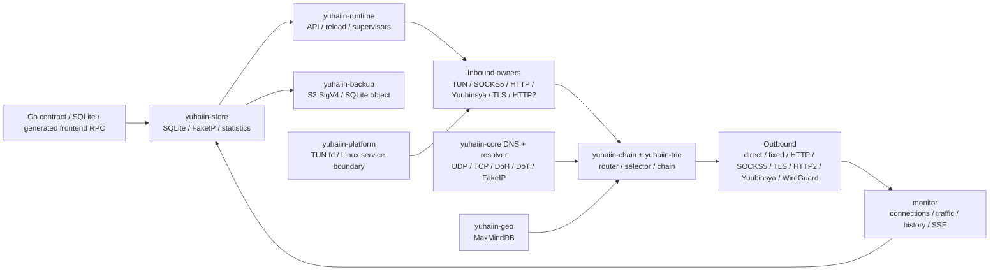

# yuhaiin Go → Rust 迁移清单

更新时间：2026-08-12

这是一份面向“Rust 二进制直接替换 Go 后端、前端不改”的活清单。它按模块记录 Go 的权威入口、Rust 的实现位置、可复现证据和剩余动作；不再使用 P1/P2。

运行约定：宿主机只负责 Rust/Go harness 编译；测试函数、runtime、代理链、SQLite 副本和网络命名空间均在 Podman 中运行。构建缓存和测试状态只放在 `~/.cache/yuhaiin-rust`，不使用 `/tmp`。

缓存维护：`make cache-usage` 查看分层占用；`make cache-prune` 只清理超过
`YUHAIIN_CACHE_RETENTION_DAYS`（默认 1 天）的 integration/parity/benchmark 场景目录，保留
`cargo-target` 和 `fixtures`。需要预览时设置 `YUHAIIN_CACHE_DRY_RUN=1`；不会自动删除可复用
构建产物；确认没有 cargo/rustc 运行时，可额外设置 `YUHAIIN_CACHE_PRUNE_DEBUG=1` 清掉
`cargo-target/debug` 的依赖中间产物，但保留 debug 二进制。

## 总体状态

| 指标 | 当前值 |
| --- | ---: |
| 纳入统计的验收项 | 48 |
| 已完成 `[x]` | 33 |
| 主路径可用但仍有现场/样本缺口 `[~]` | 15 |
| 有实际功能缺口 `[ ]` | 0 |
| 加权覆盖率 | **84.4%** = `(33 + 15 × 0.5) / 48` |
| 主目标 | Linux desktop：Rust 可启动、管理前端可接入、普通 inbound/outbound 可串联 |
| 当前结论 | **主路径已可在 Linux desktop 进行替换前验收**；rootful TUN 多路由 lease、RST/reconnect、graceful/SIGKILL teardown 和 TPROXY UDP delivery/idle/force-stop 已闭环，生产异常快照、真实 firewall 组合和第三方 WireGuard 仍是 `[~]` |

`[x]` 表示代码和对应测试/进程证据都存在；`[~]` 表示主路径已经能运行，但验证范围还不足以称为 Go 的完整替换；`[ ]` 表示仍有明确功能或现场证据缺口；`延期` 不计入 48 项统计。

## 架构边界



TUN 是 inbound 的一种。它和 SOCKS5、HTTP proxy、Yuubinsya、TLS/HTTP2 inbound 一样由 `inbounds` owner 管理；WireGuard 的 userspace stack 只属于 outbound，不创建第二个 OS TUN inbound。

## 模块状态

### 1. 公共数据面、NAT 和 TUN

| Go 权威入口 | Rust 位置 | 状态 | 证据 | 下一动作 |
| --- | --- | :---: | --- | --- |
| `pkg/net/netapi/*`、`pkg/net/proxy/proxy/*` | `crates/yuhaiin-core/src/lib.rs`、`proxy.rs`、`flow.rs` | `[x]` | `workspace-tests`、proxy/flow unit tests | — |
| `pkg/net/nat/table.go`、`source.go`、`migrate.go` | `crates/yuhaiin-core/src/nat.rs`、`nat_tests.rs`、`nat_process` | `[x]` | full-cone、多 source、rebind、idle reap、force-stop | — |
| `pkg/net/proxy/tun/tun.go`、`tun/device/*` | `crates/yuhaiin-core/src/tun.rs`、`tun_unit_tests.rs`、`tun_runtime_tests.rs` | `[~]` | `tun-rs AsyncDevice + smoltcp`；TCP/UDP/ICMP、fragment、DNS/FakeIP、NAT、真实 packet echo、rootful TCP+UDP fixed traffic、3-route lease、TCP RST/reconnect、graceful/SIGKILL teardown 已有；IPv4 kernel fragmentation 五档、IPv6 合法 MTU 四档和扩展头分片布局单测均通过；Debian VM 又通过了 TCP/reload/force-stop、MTU 1280 UDP 和 TLS/H2/Yuubinsya chain | 仍需补更广泛发行版/防火墙现场，以及真实内核 IPv6 extension-header 分片现场 |
| `pkg/net/proxy/tun/tun2socket/*`、`tun/gvisor/*` | 单一路径 `tun-rs + smoltcp` | `延期` | 按约定不同时维护 tun2socket 和第二套 userspace stack | 只有当前路径出现性能/兼容性问题时再评估 |
| `pkg/route/loopback.go`、`pkg/net/netlink/*` | `crates/yuhaiin-runtime/src/loopback.rs`、`interfaces.rs`、`crates/yuhaiin-core/src/tun.rs` | `[x]` | rootful TUN connection metadata 已逐字段固定 endpoint、localAddr、process、PID、UID 和 selected node；loopback guard 单测覆盖 | — |

### 2. DNS、FakeIP 和 MaxMindDB

| Go 权威入口 | Rust 位置 | 状态 | 证据 | 下一动作 |
| --- | --- | :---: | --- | --- |
| `pkg/net/dns/resolver/udp.go`、`tcp.go`、`dns.go` | `crates/yuhaiin-core/src/dns_resolver_async.rs`、`dns_udp_async.rs`、`dns_tcp_async.rs` | `[x]` | UDP/TCP resolver/server source-bind smoke 和 unit tests | — |
| `pkg/net/dns/resolver/doh.go`、`dot.go`、`dohjson.go` | `crates/yuhaiin-runtime/src/doh_tls.rs`、`dot_tls.rs`、`rustcrypto_resolver.rs` | `[x]` | DoH/DoT real TLS、HTTP/2、timeout、certificate、local bind tests | — |
| `pkg/net/dns/server/server.go` | `crates/yuhaiin-runtime/src/data_plane.rs`、`crates/yuhaiin-core/src/dns_*` | `[x]` | 同一配置同时绑定 UDP/TCP，reload 复用同一 handler；运行时 DNS 对预加载 FakeIP 的 IPv4/IPv6 PTR 反向映射返回本地答案；长期运行的 TUN DNS handler 会在 resolver/FakeIP/`hijackDns` reload 后切换快照 | — |
| `pkg/net/dns/fakeip/*` | `crates/yuhaiin-store/src/fakeip.rs`、`resolver.rs`、`tun.rs` | `[x]` | 双栈 allocation/reverse/TTL/touch/reopen、Go Pebble NDJSON/v6 takeover、DNS packet hook；FakeDNS whitelist/skipCheckList 按 Go 优先级从 JSON/SQLite 加载，含 wildcard、query 和 overlay reload 单测 | — |
| `pkg/net/trie/maxminddb/*` | `crates/yuhaiin-geo/src/lib.rs` | `[x]` | 纯 Rust reader、SHA-256、atomic refresh、坏库 fail-closed、IPv4-mapped IPv6；`make maxmind-smoke` 使用用户指定的 `Country-without-asn.mmdb` 和固定 SHA-256 在 Podman 中查询真实库 | — |

### 3. Router、Trie 和 GeoIP

| Go 权威入口 | Rust 位置 | 状态 | 证据 | 下一动作 |
| --- | --- | :---: | --- | --- |
| `pkg/net/trie/domain/*`、`pkg/net/trie/cidr/*` | `crates/yuhaiin-trie/src/lib.rs`、`router.rs` | `[x]` | parent/wildcard/normalize、IPv4/IPv6 LPM、随机 naive model 对照 | — |
| `pkg/route/rule.go`、`nested.go`、`history.go` | `crates/yuhaiin-runtime/src/route.rs`、`crates/yuhaiin-trie/src/router.rs` | `[x]` | priority、host/CIDR/port、all/any/not、negative matcher 和 match history | — |
| `pkg/route/list.go`、`downloader.go`、`contract.go` | `crates/yuhaiin-runtime/src/route.rs`、`api.rs` | `[~]` | local/HTTP route list、atomic cache、API mutation/reload；remote refresh 的 `errorMsgs` 已与 Go 一样写回 `route_lists_v2` 并和 reload 同事务提交；RuntimeService 已按 Go 分钟语义启动可 reload/shutdown 的后台刷新 timer | 更多生产 route/resolver projection snapshot |
| `pkg/route/loopback.go`、process/inbound matchers | `crates/yuhaiin-runtime/src/loopback.rs`、`route.rs`、`proxy.rs` | `[x]` | process/inbound/local endpoint metadata 参与选择；自环 fail-closed | TUN 真实 kernel 现场另计 |

### 4. Protocol、transport 和 proxy chain

| Go 权威入口 | Rust 位置 | 状态 | 证据 | 下一动作 |
| --- | --- | :---: | --- | --- |
| `pkg/net/proxy/direct/*`、`fixed/*`、`drop/*`、`http/*` | `crates/yuhaiin-core/src/proxy.rs`、`crates/yuhaiin-protocol/src/http.rs`、`crates/yuhaiin-runtime/src/proxy/http.rs` | `[x]` | direct/fixed/drop/HTTP CONNECT service chain；域名 endpoint async resolve 已修复 | — |
| `pkg/net/proxy/socks5/client.go`、`server.go` | `crates/yuhaiin-protocol/src/socks5.rs`、`socks5_server.rs`、`crates/yuhaiin-runtime/src/inbounds/socks5.rs` | `[x]` | TCP auth/request、UDP ASSOCIATE、IPv4/IPv6/domain framing、inbound/outbound chain | — |
| `pkg/net/proxy/socks4a/server.go`、`mixed/*` | `crates/yuhaiin-runtime/src/proxy/socks4a.rs`、`inbounds/mod.rs` | `[x]` | mixed inbound dispatches SOCKS4A/SOCKS5/HTTP | — |
| `pkg/net/proxy/tls/*` | `crates/yuhaiin-protocol/src/tls.rs`、`crates/yuhaiin-runtime/src/proxy/*` | `[x]` | RustCrypto TLS inbound/outbound、SNI、CA、insecureSkipVerify contract | — |
| `pkg/net/proxy/http2/v1/*`、`v2/*` | `crates/yuhaiin-chain/src/h2_tunnel.rs`、`h2_server.rs`、`crates/yuhaiin-core/src/http2.rs` | `[x]` | prior-knowledge、TLS ALPN、pool/drain/GOAWAY、HTTP CONNECT/SOCKS5 bridge | — |
| `pkg/net/proxy/yuubinsya/*`、`yuubinsya2/*` | `crates/yuhaiin-core/src/yuubinsya.rs`、`crates/yuhaiin-chain/src/session.rs`、`direct_uot.rs` | `[x]` | TCP、native UDP、UOT/dup-over-TCP、Ping、migration/reconnect、Go client interop | — |
| `pkg/net/proxy/aead/*` | `crates/yuhaiin-protocol/src/aead.rs` | `[x]` | TCP/UDP wire and Go interop | — |
| `pkg/net/proxy/websocket/*`、HTTP obfs | `crates/yuhaiin-protocol/src/websocket.rs`、`http_obfs.rs`、`crates/yuhaiin-runtime/src/proxy/websocket.rs` | `[x]` | Go WebSocket→HTTP/2 interop、fragmented headers、early data | — |
| `pkg/net/proxy/vless/*`、`vmess/*`、`trojan/*` | `crates/yuhaiin-protocol/src/{vless,vmess,trojan}.rs`、runtime counterparts | `[~]` | parser/runtime/unit coverage；`make service-chain-smoke` 在 Podman 中通过 API→HTTP inbound→domain router→普通 VLESS/VMess/Trojan outbound 的 TCP 3/3 payload echo，并新增 VLESS/VMess/Trojan 的普通、TLS+WebSocket TCP 7/7 payload echo，以及 VLESS/VMess 普通、TLS+WebSocket UDP 5/5 framing、connections、selected node、match history；Rust runtime builder 现在也覆盖 Go-compatible VLESS/VMess/Trojan TLS/WebSocket transport layer，且共享 stream transport builder；`make go-protocol-interop-smoke` 当前在 Podman 通过 14/14 个真实 Go listener/client wire test，覆盖 VLESS 双向普通/TLS/TLS+WebSocket、VLESS UDP、VMess 普通/TLS+WebSocket、Trojan 普通/TLS+WebSocket | 更广的 runtime listener/outbound、HTTP2、地址族和远端 UDP/真实远端组合矩阵 |
| `pkg/net/proxy/tproxy/*`、`redir/*` | `crates/yuhaiin-runtime/src/proxy/transparent.rs` | `[~]` | REDIRECT TCP、IPv4/IPv6 ancillary decoder unit tests；rootful iptables 与 native nft TPROXY UDP 均已完成 2 flow、original destination、reply/rebind、monitor 统计、socket readback、加速 idle reap；iptables/nft service SIGKILL 也已通过；Debian VM 现场再次通过 iptables、native nft 和 IPv6 REDIRECT | 真实生产 firewall/nftables 组合 matrix |
| `pkg/net/proxy/shadowsocks/*`、`shadowsocksr/*` | Rust protocol modules remain compatibility code | `延期` | 当前迁移范围不以 SS/SSR 为门槛 | 后续若 Go 未废弃再决定是否保留 |
| `pkg/net/proxy/quic/*`、`reality/*`、`mux/*`、`tailscale/*` | — | `延期` | 用户明确暂不实现 | 不阻塞 Linux desktop replacement |

### 5. WireGuard outbound

| Go 权威入口 | Rust 位置 | 状态 | 证据 | 下一动作 |
| --- | --- | :---: | --- | --- |
| `pkg/net/proxy/wireguard/{wireguard,bind,device}.go` | `crates/yuhaiin-wireguard/src/lib.rs`、`crates/yuhaiin-runtime/tests/wireguard_chain.rs` | `[~]` | Cloudflare `boringtun 0.7.1`、reserved/base64/PSK/keepalive/AllowedIPs、smoltcp TCP/UDP adapter；本地双 peer 已验证 authenticated endpoint roaming 和完整 UDP session；`make wireguard-chain-smoke` 在 Podman 通过真实 runtime HTTP/TCP 与 SOCKS5/UDP inbound→CIDR router→WireGuard outbound→BoringTun peer 的 TCP/UDP echo、连接元数据和 latency；当前 packet benchmark 为 588.64 MiB/s、peak RSS 3,460 KiB | 真实第三方/WARP peer、真实链路 keepalive/NAT endpoint 变化；Go node contract 没有独立 source-interface 字段 |
| Go `WireGuard` node config | `crates/yuhaiin-store/src/compat_proxy*.rs`、`crates/yuhaiin-runtime/src/proxy.rs` | `[x]` | `make wireguard-smoke`：Podman `--network=none` 双 userspace peer，7/7（另 1 个 benchmark ignored） | — |
| Go packet path | `scripts/benchmark/wireguard.sh` | `[x]` | release BoringTun packet benchmark，结果只作同机回归基线 | 公网/第三方链路性能不能由本地 benchmark 推断 |

### 6. SQLite、配置兼容、FakeIP persistence 和统计

| Go 权威入口 | Rust 位置 | 状态 | 证据 | 下一动作 |
| --- | --- | :---: | --- | --- |
| `pkg/storage/sqlite/{sqlite,migrations,compact}.go` | `crates/yuhaiin-store/src/sqlite.rs`、`schema.rs`、`migration.rs` | `[x]` | `rusqlite + bundled SQLite`、WAL、busy timeout、quick check、rollback、backup/restore、force-stop | — |
| `pkg/store/{node,inbound,resolver,route_*,settings,backup}.go`、`pkg/app/backup.go`、`pkg/s3/*` | `crates/yuhaiin-store/src/repository.rs`、`compat_runtime.rs`、`crates/yuhaiin-backup/src/lib.rs`、`tests/*` | `[~]` | typed repository、Go v1/v5/v6/schema-7、unknown JSON、users/routes/tags/settings/NAT；S3 SigV4 PUT/GET、Go camelCase 配置、BLAKE2b `lastBackupHash` 和选中 outbound proxy transport 已接入 API，并由本地兼容端点 wire test、runtime API test、`make s3-minio-smoke` 的真实 MinIO Podman 上传/下载覆盖 | 真实 AWS 权限现场，以及更多异常快照逐表 diff |
| `pkg/net/dns/fakeip/sqlite.go`、`pool.go` | `crates/yuhaiin-store/src/fakeip.rs` | `[x]` | reopen、cursor、release、capacity、dual-stack 和 legacy import | 更多生产容量/TTL 样本 |
| `pkg/statistics/{sqlite,statistic,telemetry,conn}.go` | `crates/yuhaiin-store/src/statistics.rs`、`crates/yuhaiin-runtime/src/monitor.rs` | `[~]` | traffic/history/telemetry、Go projection、SSE、并发 reader/writer、force-stop recovery；Go/Rust live-flow parity 与 API history UTC 已验证；`make stats-soak-smoke` 在 Podman 中以 12 readers×160 rounds、256 writes 通过 | 更长 production projection、升级期间 lock contention |

### 7. Runtime、inbound owner、API 和实时观察面

| Go 权威入口 | Rust 位置 | 状态 | 证据 | 下一动作 |
| --- | --- | :---: | --- | --- |
| `pkg/node/runtime.go`、`pkg/inbound/*` | `crates/yuhaiin-runtime/src/controller.rs`、`inbounds/mod.rs` | `[x]` | immutable snapshot、atomic reload；普通 node/route/resolver reload 只替换已注册 live selector，并同步长期 TUN DNS handler，inbound/user/selected-node/apply 才发送专用事件重绑 listener；HTTP CONNECT 持久连接在 route reload 期间继续传输，inbound reload 仍采用 latest-wins | — |
| `pkg/inbound/*`、`pkg/net/proxy/{http,socks5,yuubinsya,tls}.go` | `crates/yuhaiin-runtime/src/inbounds/*`、`proxy/*` | `[x]` | inbound→router→outbound service chain；HTTP/SOCKS5/Yuubinsya/TLS/HTTP2/mixed/reverse | — |
| Go TUN inbound contract | `crates/yuhaiin-runtime/src/inbounds/mod.rs`、`data_plane.rs` | `[~]` | TUN 作为 inbound supervisor；真实 user+network namespace、rootful TCP+UDP fixed traffic、multi-route lease、reload、RST/reconnect、graceful/SIGKILL teardown 已通过；真实 kernel IPv4 五档、IPv6 合法 MTU 四档 fragmentation matrix 已通过；扩展头分片布局在 Podman core harness 中通过；`tun-api-process-smoke` 还验证真实前台二进制通过 API 对默认禁用 TUN 与用户新增 TUN 做 disable/enable 切换，设备在 `/proc/net/dev` 中出现/消失 | 继续补更广泛发行版/firewall 组合和真实 IPv6 extension-header 现场 |
| `pkg/httpapi/v2*.go`、`register.go` | `crates/yuhaiin-runtime/src/api.rs` | `[x]` | generated frontend RPC route coverage、read/mutation/error parity、API reload/live flow；`inbounds/config` 的 DNS 劫持变更会触发 inbound owner reload | 更多生产 response 字段样本 |
| `pkg/net/netapi/{conn,server}.go`、`pkg/statistics/notify.go` | `crates/yuhaiin-runtime/src/monitor.rs`、`log.rs`、`service.rs` | `[~]` | connections、SSE、traffic、history、telemetry、node latency、pprof、启动日志 | 完整 response/历史数据逐字段 parity |
| Go service lifecycle | `crates/yuhaiin-runtime/src/service.rs`、`src/bin/service/*`、`src/update.rs` | `[~]` | Linux systemd install/rollback/health smoke；macOS launchd plist/bootstrap/kickstart、Windows Service SCM install/start/stop/delete/recovery-actions/health/rollback 已实现；update helper 的成功安装、保留 rollback image、restart failure 恢复和 staged retry 均有单测；foreground 默认 stderr progress | macOS/Windows 真实权限现场安装、更新和回滚 |

### 8. Platform boundary

| Go 权威入口 | Rust 位置 | 状态 | 证据 | 下一动作 |
| --- | --- | :---: | --- | --- |
| `pkg/net/proxy/tun/device/*`、`pkg/net/netlink/*` | `crates/yuhaiin-platform/src/lib.rs`、`yuhaiin-core::TunRuntime` | `[~]` | Unix owned FD、Linux desktop TUN、injected FD boundary、纯 Rust route manager、rootful multi-route lease/teardown、IPv4/IPv6 kernel fragmentation；IPv6 扩展头分片布局也已在 Podman core harness 覆盖；TUN DNS handler 支持 resolver/inbound policy hot reload | 更广泛发行版 firewall 现场和真实 IPv6 extension-header 分片现场 |
| Android `VpnService` / AAR host | `TunRuntime::from_owned_fd` API 已预留 | `延期` | 当前范围先完成纯 desktop replacement | 后续同步修改 yuhaiin-android |
| macOS utun / app lifecycle | platform boundary 文档和接口已留口 | `延期` | 当前范围不计入 desktop Linux 覆盖率 | 后续单独验收 |

## Inbound / outbound 能力矩阵

| 能力 | Inbound | Outbound | 当前状态 |
| --- | :---: | :---: | :---: |
| direct / drop / fixed | fixed/direct listener | 是 | `[x]` |
| HTTP proxy / CONNECT | 是 | 是 | `[x]` |
| SOCKS5 TCP | 是 | 是 | `[x]` |
| SOCKS5 UDP ASSOCIATE | 是 | 是 | `[x]` |
| mixed / mix UDP | 是 | 是 | `[x]` |
| SOCKS4A | 是 | — | `[x]` |
| TLS | 是 | 是 | `[x]` |
| HTTP/2 | 是 | 是 | `[x]` |
| Yuubinsya TCP | 是 | 是 | `[x]` |
| Yuubinsya native UDP | 是 | 是 | `[x]` |
| Yuubinsya UOT / dup-over-TCP | 是 | 是 | `[x]` |
| TUN | 是 | — | `[~]`：真实 user/rootful data-plane、3-route lease、reload、reset/reconnect、teardown、IPv4 五档和 IPv6 合法 MTU 四档 fragmentation 通过；扩展头布局单测通过，更广泛 firewall/真实 extension-header 现场仍补 |
| redir TCP / TPROXY UDP | 是 | — | `[~]`：rootful iptables/nft 2-flow delivery、original destination、回包/rebind、idle reap、force-stop 通过；真实生产 firewall matrix 仍补充 |
| DNS UDP / TCP / DoH / DoT | server/client | resolver/client | `[x]` |
| WireGuard | — | 是 | `[~]`：BoringTun userspace adapter 已通过本地双 peer |
| Cloudflare WARP MASQUE | — | — | `延期`：Go 侧依赖 QUIC/HTTP3；当前范围明确延期 QUIC/DoH3，不把它误报成 WireGuard 缺口 |
| DoQ / DoH3、QUIC、Reality、Mux、Tailscale | — | — | `延期` |
| Shadowsocks / ShadowsocksR | — | — | `延期` |

## 可执行 checklist（唯一未完成清单）

### Linux 权限和数据面

- `[x]` Debian VM rootful Podman 已通过基础 TUN route lease、普通 packet echo、3 次 reload、MTU 五档、TLS/H2/Yuubinsya chain 和 force-stop teardown。
- `[x]` `make tun-route-matrix-smoke` 的 rootful Podman matrix 已通过 3 条真实 IPv4 routes（含 metric）：owner 存活时可见，graceful close 与 owner SIGKILL 后均 absent；日志位于 `~/.cache/yuhaiin-rust/integration/tun-route-matrix/`。
- `[x]` rootful TUN 已通过 TCP RST 后重新建立连接并完成 echo；smoltcp dispatcher 的 fragment reassembly、overlap、expiry、overflow 和恢复已有单元/模拟 packet 覆盖。
- `[x]` rootful runtime-owned TUN 已通过同一服务内的 TCP+UDP fixed outbound traffic；UDP 客户端使用独立子进程避开 loopback guard，虚拟 routed destination 回包源地址由 smoltcp 单测固定为目标地址。
- `[x]` 真实 kernel IPv4 fragmentation 已在 Debian VM rootful Podman 通过 MTU 576/1280/1500/9000/9216 五档；每档均回环最大合法 IPv4 UDP payload 65507 字节，覆盖 kernel ingress 分片、smoltcp 重组、smoltcp 出方向分片和 kernel egress 重组。
- `[x]` IPv6 ingress/egress fragmentation 已在 Debian VM rootful Podman 通过合法 MTU 1280/1500/9000/9216 四档；每档均回环最大合法 IPv6 UDP payload 65507 字节，覆盖 kernel ingress 分片、Rust ingress 重组、proxy echo、TUN boundary egress 分片和 kernel egress 重组。IPv6 MTU 576 按协议最低 MTU 约束 fail-closed，不作为合法档位。
- `[x]` 在同一 rootful namespace 执行 TPROXY UDP：默认 iptables 与 native nft backend 均通过 transparent socket readback、original destination `10.254.1.2:18082`、local listener `0.0.0.0:18083`、两个 source flow、回包、rebind 和 upload/download monitor 统计。
- `[x]` TPROXY UDP 在 rootful VM 用测试专用 1 秒 timeout 验证了 2 个 flow 的 idle reap；iptables 与 native nft 均通过 service SIGKILL 后的进程级观测，生产默认仍保持 90 秒 `UDP_IDLE_TIMEOUT`。
- `[~]` 真实生产 firewall/nftables 组合 matrix 仍待补；公共 `UDP_IDLE_TIMEOUT`/reap/close 单测、容器 namespace teardown 和 Debian VM 的 iptables/native nft/IPv6 REDIRECT 现场已覆盖基础生命周期。
- `[~]` 将当前 user+network namespace TUN smoke 保持为 CI 默认路径；它证明真实 kernel TUN packet path，但 rootful route takeover 另由 `tun-route-matrix-smoke` 验证。
- `[x]` IPv6 出方向扩展头分片布局已在 Podman `network=none` 中通过：Hop-by-Hop、Routing、Routing 后 Destination Options、分片重组和重复分片拒绝均有断言；真实内核对该组合的端到端现场仍待补。
- `[x]` rootful TUN connection metadata 已在 rootful fixture 中逐字段固定 endpoint/localAddr、selected node、process、PID 和 UID；本轮现场为 `/usr/local/bin/tun-service-smoke`、pid `7`、uid `0`。
- `[x]` `make tun-api-process-smoke` 在 Podman disposable user/network namespace 中启动真实 `yuhaiin` 前台进程，通过 HTTP API 将新增 TUN inbound 在 disabled → enabled → disabled → enabled → disabled 间切换；真实接口名在 `/proc/net/dev` 中按每个状态出现/消失，覆盖 fresh-store 默认禁用 `tun` 记录不阻塞自定义启用 TUN 的回归。

### Go 生产兼容和统计

- `[~]` 对更多停止态 Go SQLite 做逐表 schema/未知表/异常快照 diff；当前 3 份停止态 snapshot 的 API read/mutation/error parity 已通过，源库只读，副本和结果放 `~/.cache/yuhaiin-rust`。
- `[~]` 增加长时间 telemetry/history、升级中 lock contention、强停和 reload 组合样本。
- `[x]` 使用缓存中的停止态 Go `state.db` 做 Go/Rust API read + core mutation parity；包括 `connections.history` 的 UTC 时间格式、节点/入站/解析器/路由/发布/订阅 deferred 错误 contract。
- `[~]` S3 backup 已不再静默退化为本地备份：`backup.run` 按 Go object name 上传，`backup.restore` 空请求按配置下载，失败返回 unavailable；SigV4、本地兼容端点、Go BLAKE2b hash 和“经选中 outbound proxy 访问 S3”的 HTTP/HTTPS transport 已测试。`make s3-minio-smoke` 已在 Podman 通过真实 MinIO 完成 bucket 创建、SigV4 PUT/GET、object 校验和 restore 下载；真实 AWS 权限现场及更多异常快照逐表 diff 仍待补。
- `[x]` 统计公开契约已逐字段对齐：connections 的完整 metadata/matchHistory、total 的 string counters、traffic 的 UTC bucket、telemetry 的固定九维/失败计数、history/failed-history/block-history 的 process、count、time、dumpProcessEnabled 和 API 1000 条边界均有单测或 Podman parity；失败项按 `(protocol, host, process)` 分组，阻断历史不再丢失进程标志，同时保留 Go failed-history 全量 SQLite 语义。
- `[x]` route list `refreshInterval` 已由 RuntimeService 持有后台 timer：配置 reload 立即重读，刷新产生的 reload 不会忙循环，服务 shutdown 会停止任务；定时刷新夹具验证 `lastRefreshTime` 和 reload 生命周期。
- `[~]` 补完整 API response 字段、更多生产 route/resolver projection 和 MaxMind country projection 样本；Go 当前 MaxMind 接口只暴露 country，不额外把 ASN 当作迁移缺口；remote route refresh 的持久化错误字段已补齐。
- `[x]` Runtime DNS handler 在 socket/TUN 共用边界上恢复预加载 FakeIP 的 `in-addr.arpa`/`ip6.arpa` PTR 映射；未知 PTR 仍按上游 resolver 的现有能力处理。

### WireGuard 外部兼容

- `[~]` 使用真实第三方/WARP peer 验证 reserved、handshake、keepalive 和 NAT endpoint 变化；本地 authenticated roaming 及 TCP/UDP userspace session 已由双 peer 单测覆盖。`make wireguard-external-smoke` 已提供用户配置驱动的 Podman host-network 入口。Go 的 WireGuard node contract 没有独立 source-interface 字段，因此不把不存在的配置项扩进 Rust API。
- `[x]` 保持本地双 peer smoke 和 release packet benchmark；两者只证明协议/适配器正确性和同机趋势，不宣称公网性能。

### CI 与发布（不计入上面的 48 项功能覆盖率）

- `[~]` `.github/workflows/rust.yml` 已加入 Rust/Podman 检查、Linux `x86_64/aarch64-unknown-linux-musl`、Darwin `x86_64/aarch64`、Windows `x86_64/aarch64` 六项 release matrix；本地 YAML、target 名称、产物名和 checksum contract 已检查，仍需第一次 GitHub Actions 远程运行确认 runner/SDK 的现场差异。
- `[x]` 发布资产名称与运行时 update contract 对齐：`yuhaiin-{linux,darwin,windows}-{amd64,arm64}`，Windows 保留 `.exe`；`v*` tag 发布稳定 release，`main` 生成可覆盖的 rolling prerelease 并更新 `main` tag。
- `[~]` macOS launchd 与 Windows Service 的安装/更新/回滚代码、跨 target 编译和单测已完成；update helper 的替换事务已通过注入 platform hooks 覆盖成功与 restart failure rollback；真实 launchd/SCM 权限现场及远程 Actions 首次运行仍待验收。

### 主动延期（本轮不阻塞）

- `延期` DoQ、DoH3、QUIC、Reality、Mux、yamux、Tailscale。
- `延期` Cloudflare WARP MASQUE（依赖 QUIC/HTTP3）；WireGuard userspace 仍使用已验证的 Cloudflare BoringTun。
- `延期` Shadowsocks、ShadowsocksR、订阅。
- `延期` Android 独立应用、AAR/JNI/VpnService lifecycle、macOS utun/独立应用；macOS launchd 桌面服务已纳入本轮。

## 最近一次可复现证据

| 命令 | Podman 场景 | 结果 |
| --- | --- | --- |
| `make workspace-tests`（2026-08-12 当前轮） | 48 个 harness；isolated/stats/host-network 分组 | core 145、runtime 253、store 128、service-chain 16、WireGuard 7（1 个 benchmark ignored）、WireGuard runtime chain 2；0 失败 |
| `make workspace-tests`（2026-08-12 update helper） | Podman；宿主机只编译 harness | `run_update_helper` 成功替换、保留 `.update-backup`、重启失败恢复旧 binary 和保留 staged retry 两项单测通过 |
| `YUHAIIN_SOURCE_DB=... make go-api-parity-smoke`（2026-08-12 当前轮） | 既有停止态 Go 快照复制到 Podman；Go/Rust 独立数据库副本 | info/settings/nodes/inbounds/resolvers/routes/publishes/connections、全部 mutation 和错误矩阵 identical |
| `make production-parity-smoke`（2026-08-12 当前轮） | 3 份停止态 Go v5/v6/AWS-shaped snapshot；每份在 Podman 独立运行 Go/Rust | 3/3 API read、core mutation、error matrix identical |
| `make tun-chain-service-smoke`（2026-08-12 当前轮） | disposable user/network Podman namespace、真实 TUN inbound | TUN→fixed→TLS→HTTP/2→Yuubinsya→echo 通过；`runtime-tun-chain-ready`、traffic、close 全部通过 |
| `make go-live-flow-parity-smoke` + `make go-rust-stats-smoke`（2026-08-12 当前轮） | Podman Go/Rust live mixed inbound，共享 SQLite 统计接管 | Go/Rust 真实流量、connections/total/traffic/history 和 reload 后统计均通过 |
| `make go-protocol-interop-smoke`（2026-08-12 当前轮） | Podman host network；真实 Go checkout/client/server | 14/14 个测试用例：Yuubinsya TCP/UOT/native UDP/Ping、WebSocket→H2（普通/TLS）、H2 v1、VLESS 双向普通/TLS/TLS+WebSocket、VLESS UDP、VMess 普通/TLS+WebSocket、Trojan 普通/TLS+WebSocket |
| `make service-chain-smoke`（2026-08-12 当前轮） | host-network | 16/16：多个 inbound→router→outbound chain，含 HTTP/TLS/HTTP2/SOCKS5/Yuubinsya、普通 VLESS/VMess/Trojan TCP、Trojan→WebSocket、VLESS/VMess/Trojan→TLS→WebSocket，以及 mixed UDP→VLESS/VMess/Trojan（含 VLESS/VMess TLS→WebSocket） |
| `make tun-reload-traffic-smoke` | rootless Podman + `unshare -Urn` + `/dev/net/tun` | 3 cycle：disable、不可达、reopen、traffic、close 通过 |
| `make tun-reset-reconnect-smoke` / Debian VM rootful `tun-service.sh` | `/dev/net/tun`、`YUHAIIN_TUN_USER_NAMESPACE=0` | RST flow 被 target 接受并关闭；随后正常 reconnect echo、device close 通过 |
| `make tun-mtu-smoke` | 同上 | IPv4 MTU 576/1280/1500/9000/9216 全部通过；默认最大合法 IPv4 UDP payload 65507 字节 |
| Debian VM rootful IPv6 TUN matrix | Podman `--network=none`、容器内开启 IPv6、IPv6-only portal/route | MTU 1280/1500/9000/9216 全部通过；最大合法 IPv6 UDP payload 65507 字节逐字节回环；MTU 576 按 IPv6 minimum MTU fail-closed |
| `make tun-chain-service-smoke` | 同上 | TUN→fixed→TLS→HTTP/2→Yuubinsya→echo 通过 |
| `make tun-connection-metadata-smoke` | 同上 | `component=tun`、node、outbound、localAddr、process、PID、UID 逐字段通过 |
| Debian VM rootful `tun-service.sh` | Podman `rootless=false`、`/dev/net/tun`、`YUHAIIN_TUN_USER_NAMESPACE=0` | 普通 256B traffic、3-cycle reload、MTU 576/1280/1500/9000/9216、TLS/H2/Yuubinsya chain、force-stop 全通过 |
| Debian VM rootful `tun-route-matrix.sh` | Podman `--privileged --network=none`、`tun-routes`、3-route lease | 3 条 route 存在于 owner 存活期间，graceful close 与 SIGKILL 后均 absent |
| Debian VM rootful `transparent-service.sh` / iptables | TPROXY UDP、isolated client/target netns | socket probe、2 个 UDP source flow、original destination、reply/rebind、monitor stats 通过；本轮 VM 复核再次通过 |
| Debian VM rootful `transparent-service.sh` / nft | native nft TPROXY、同一 isolated netns | 与 iptables backend 同样通过；fixture 入口设置 `service-client/accept_local=1` 以满足 Linux 本地源包校验；本轮 VM 复核再次通过 |
| Debian VM rootful `transparent-service.sh` idle/force-stop | iptables + native nft；idle 为测试专用 1 秒 timeout | 两个 UDP flow idle 后 monitor 从 2→0；两种 backend 的 service SIGKILL 均观测到 status=137，fixture cleanup 完成 |
| Debian VM rootful `tun-service.sh` connection metadata | rootful `/dev/net/tun`、direct outbound | `component=tun`、`node=tun-fixed`、`outbound=127.0.0.1:*`、`local=198.18.0.1:*` 通过 |
| Debian VM rootful `tun-udp-service-smoke` | `YUHAIIN_TUN_UDP_TRAFFIC=1`、fixed outbound、独立 UDP client 子进程 | `runtime-tun-udp-target-received bytes=32`、`runtime-tun-udp-traffic-ok`、`runtime-tun-closed` 通过；UDP-first 顺序也通过 |
| Debian VM rootful `tun-service.sh` UDP/chain | MTU 1280、8192-byte UDP；`tls-h2-yuubinsya` | UDP-first target 原样收到 8192 bytes；TUN→TLS→HTTP/2→Yuubinsya 32-byte echo 通过 |
| `make wireguard-smoke` | `--network=none` 双 userspace peer | 7/7（另 1 个 benchmark ignored） |
| `make wireguard-chain-smoke`（2026-08-12 当前轮） | Podman host-network runtime harness、同一 BoringTun peer | 2/2：HTTP/TCP 与 SOCKS5/UDP 两条真实 inbound→CIDR router→WireGuard outbound 链均通过；UDP 首包握手期间缓存并重发，connections/route history/total counters 通过 |
| `make benchmark-throughput` | release harness、Podman host network、64 MiB 单流 | HTTP CONNECT 102.18 MiB/s、peak RSS 19,188 KiB；TLS/H2/Yuubinsya 26.03 MiB/s、peak RSS 20,904 KiB；原始日志存 `~/.cache/yuhaiin-rust/benchmarks/http-throughput` |
| `make benchmark-tun-throughput` | release harness、privileged Podman、真实 kernel TUN、4 MiB 单流 | TUN→fixed→loopback 31.23 MiB/s、peak RSS 13,236 KiB；原始日志存 `~/.cache/yuhaiin-rust/benchmarks/tun-throughput` |
| `make benchmark-wireguard-throughput` | release harness、`--network=none` | 64 MiB BoringTun packet baseline 588.64 MiB/s、peak RSS 3,460 KiB（单次同机趋势，不外推公网），结果存 `~/.cache/yuhaiin-rust/benchmarks/wireguard` |
| `make api-reload-flow-smoke` | disposable Podman service | 普通 inbound/node/route reload、route reload 期间同一 HTTP CONNECT 隧道持续 echo，以及 TUN 配置持久化通过；TUN API 子用例不冒充 rootful device evidence |
| `make tun-api-process-smoke` | disposable Podman user/network namespace、真实 `/dev/net/tun`、前台 binary | API TUN disable/enable 后真实设备 visibility 通过；覆盖默认禁用 TUN 与新增启用 TUN 并存 |
| `make maxmind-smoke` | 缓存真实 `Country-without-asn.mmdb`、Podman `--network=none` | 固定 SHA-256；IPv4 与 IPv4-mapped IPv6 查询通过 |
| `make tun-ipv6-extension-smoke` | Podman `--network=none`、core test harness | Hop-by-Hop/Routing/后置 Destination Options 分片重组通过；已有 Fragment Header fail-closed |
| `make stats-soak-smoke` | `--network=none` Podman、可复用 SQLite fixture | 12 个并发 readers 各 160 轮、256 个流量写入，force-stop/restart、connections/traffic/telemetry/history 全部通过 |
| `cargo test --offline -p yuhaiin-backup`、runtime API S3 test、`make s3-minio-smoke` | Podman workspace 会执行 local compatible endpoint；MinIO smoke 在独立 Podman network 中包含真实 SigV4 PUT/GET、API upload/download 和选中 outbound proxy transport | 6 个 backup crate 单元测试 + 1 个 local wire test、runtime S3 run/restore、Go hash/object contract 通过；MinIO smoke 通过 bucket/object/restore 校验；状态位于 `~/.cache/yuhaiin-rust` |
| `make workspace-tests`（2026-08-12 当前轮） | Podman；宿主机只编译 harness | 48 个 harness；core 145、runtime 253、store 128、WireGuard 7、service-chain 16、WireGuard runtime chain 2 全部通过；新增 VLESS/VMess/Trojan TLS→WebSocket TCP/UDP builder/真实链路回归通过；外部 WireGuard harness 的 2 个公网测试显式 ignored；另有 Debian VM rootful TUN/TPROXY 现场复核 |
| `make tun-api-process-smoke`（2026-08-12 当前轮） | Podman disposable user/network namespace、前台 runtime、`/dev/net/tun` | 1/1 通过；真实设备按 disabled→enabled→disabled→enabled→disabled 出现/消失，排除“API 已保存但 TUN supervisor 未切换” |
| `make build MUSL=1`（2026-08-12 当前轮） | 宿主只做 target 编译，产物留在 `~/.cache/yuhaiin-rust` | `x86_64-unknown-linux-musl` debug runtime 构建通过；未把宿主编译当作容器运行时证据 |
| `make startup-logs-smoke` | foreground Podman；不传命令、不传 `YUHAIIN_DB/YUHAIIN_HTTP/YUHAIIN_QUIET`，只隔离 HOME/config | 真实 `./yuhaiin` 默认启动会在 stderr 输出 database、API bind、runtime ready、shutdown/stopped；因此不是静默卡死；`YUHAIIN_QUIET=1` 仍可显式关闭 |

## 常用命令

```bash
make build                         # debug binary
make build-release                 # release binary
make build-musl                   # MUSL=1 debug binary
make fmt-check
make workspace-tests
make service-chain-smoke
make go-protocol-interop-smoke
make tun-reload-traffic-smoke
make tun-reset-reconnect-smoke
make tun-mtu-smoke
make wireguard-smoke
make tun-api-process-smoke
make maxmind-smoke
make wireguard-chain-smoke
YUHAIIN_WIREGUARD_EXTERNAL_CONFIG=... YUHAIIN_WIREGUARD_EXTERNAL_TCP_TARGET=... make wireguard-external-smoke
make benchmark-throughput
make benchmark-tun-throughput
make benchmark-wireguard-throughput
make cache-usage
```

运行 TUN 测试时，`YUHAIIN_TUN_USER_NAMESPACE=auto` 会在宿主没有 `CAP_NET_ADMIN` 时自动使用容器内 disposable user/network namespace；rootful 现场可设置 `YUHAIIN_TUN_USER_NAMESPACE=0`，显式验证正常 Linux namespace 的权限和路由行为。
