# yuhaiin-rust 项目架构与修改指南

> 这是一份面向开发者的“从哪里读、调用怎么走、改动应该放在哪里”的代码地图。
> 文档按当前 workspace 的源码组织和实际调用关系编写，代码位置以仓库内路径为准。

## 1. 先记住一件事：runtime 是组装层，不是所有逻辑的归宿

这个项目可以分成四个层次：

1. `yuhaiin-types`：不依赖 Tokio、操作系统和具体网络实现的公共类型/能力契约。
2. `yuhaiin-core`、`yuhaiin-dns`、`yuhaiin-trie`、`yuhaiin-protocol`、`yuhaiin-chain`：可复用的领域实现。
3. `yuhaiin-store`、`yuhaiin-tun`、`yuhaiin-wireguard`、`yuhaiin-geo`：持久化、平台数据面和外部能力适配。
4. `yuhaiin-runtime`、`yuhaiin-api`：把配置、路由、代理、inbound、TUN、DNS 和管理 API 组装成一个可运行服务。

因此，遇到一个问题时先判断它属于哪类：

| 问题 | 首先看哪里 | 不要直接改哪里 |
| --- | --- | --- |
| 公共 trait、地址、DNS 返回值 | `yuhaiin-types` | 不要在 `runtime` 里再定义第二套等价 trait |
| DNS wire/cache/UDP/TCP/DoH/DoT | `yuhaiin-dns` | 不要把 DNS 编码塞进 API 或 inbound |
| 流上下文、异步 socket/proxy 基础能力、NAT | `yuhaiin-core` | 不要让协议 crate 直接依赖 runtime 配置；不要为了“去 Tokio”再恢复一套同步 proxy API |
| 路由规则和 trie | `yuhaiin-trie` + `yuhaiin-runtime/src/route.rs` | 不要在每个 inbound 自己匹配规则 |
| 节点、链、协议组合 | `yuhaiin-chain` + `yuhaiin-protocol` | 不要在 HTTP API handler 里拼接握手 |
| 配置加载、迁移、Go 兼容 | `yuhaiin-store` | 不要在 handler 里直接写 SQLite 表 |
| 运行时快照、reload、selector、inbound owner | `yuhaiin-runtime` | 不要在 store 里持有 live socket/task |
| REST/RPC、认证、服务生命周期 | `yuhaiin-api` | 不要让协议数据面反向依赖 API router |

## 2. Workspace 总览

workspace 成员定义在 [`Cargo.toml`](../Cargo.toml)。当前共有 13 个 crate：

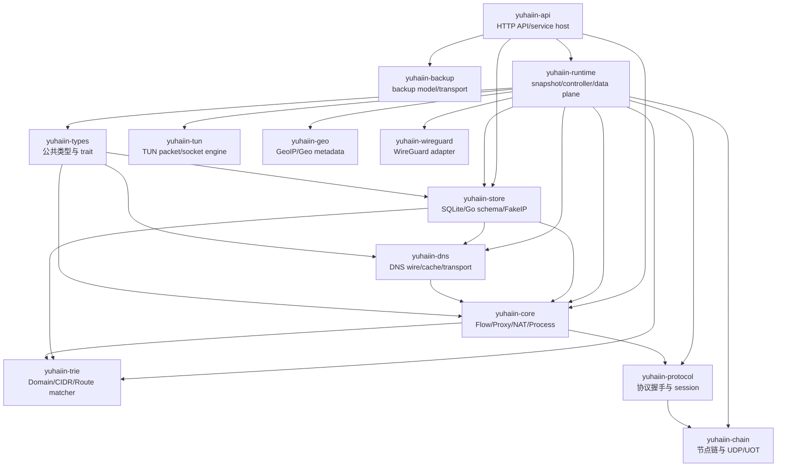

### 2.1 每个 crate 的职责和入口

| crate | 负责什么 | 建议阅读顺序 |
| --- | --- | --- |
| [`yuhaiin-types`](../crates/yuhaiin-types/src/lib.rs) | 公共 `DomainName`、`Endpoint`、`Network`、错误、future alias、DNS/inbound contract | `lib.rs` → `dns.rs` → `net.rs` → `inbound.rs` |
| [`yuhaiin-dns`](../crates/yuhaiin-dns/src/lib.rs) | DNS 模型的 wire 编解码、缓存、hosts、FakeIP 视图、UDP/TCP/QUIC/DoH/DoT 传输 | `dns.rs`/`cache.rs` → `dns_resolver.rs` → `transport.rs` → 各 transport |
| [`yuhaiin-core`](../crates/yuhaiin-core/src/lib.rs) | `FlowContext`、路由模式/解析策略、异步 socket/proxy 基础、NAT、进程信息、sniff | `lib.rs` → `flow.rs` → `proxy.rs` → `nat.rs` → `process.rs` |
| [`yuhaiin-trie`](../crates/yuhaiin-trie/src/lib.rs) | 域名、CIDR、磁盘 trie 和组合路由索引 | `router.rs` → `ondisk.rs` → `lib.rs` |
| [`yuhaiin-protocol`](../crates/yuhaiin-protocol/src/lib.rs) | 异步 base proxy factory、SOCKS、HTTP、VLESS、VMess、Trojan、Shadowsocks、H2、WebSocket、Yuubinsya 等协议层 | `proxy_factory.rs` → `session.rs`/`tls.rs` → 具体协议文件 |
| [`yuhaiin-chain`](../crates/yuhaiin-chain/src/lib.rs) | 把一个或多个 node/transport/protocol 组合成出站链，处理 TLS/WebSocket/H2/UOT、重试和 UDP | `config.rs` → `go_node.rs` → `lib.rs` |
| [`yuhaiin-store`](../crates/yuhaiin-store/src/lib.rs) | typed repository、SQLite、schema、Go v6/legacy 兼容、FakeIP mapping、统计与状态 | `lib.rs` → `sqlite.rs`/`schema.rs` → `repository.rs` → `migration.rs` |
| [`yuhaiin-tun`](../crates/yuhaiin-tun/src/lib.rs) | OS TUN fd、smoltcp packet/socket、dispatcher、proxy runtime、写回 TUN | `runtime.rs` → `dispatcher.rs` → `packet.rs` → `proxy.rs` |
| [`yuhaiin-geo`](../crates/yuhaiin-geo/src/lib.rs) | GeoIP/Geo metadata 的读取和查询接口 | `lib.rs` |
| [`yuhaiin-wireguard`](../crates/yuhaiin-wireguard/src/lib.rs) | WireGuard engine、driver 和代理适配 | `config.rs` → `engine.rs` → `proxy.rs` |
| [`yuhaiin-backup`](../crates/yuhaiin-backup/src/lib.rs) | backup 数据格式和传输辅助 | `lib.rs` |
| [`yuhaiin-runtime`](../crates/yuhaiin-runtime/src/lib.rs) | 运行时 snapshot、controller、selector、resolver bridge、inbound、TUN/DNS supervisor | `lib.rs` → `controller.rs` → `inbounds/` → `data_plane.rs` |
| [`yuhaiin-api`](../crates/yuhaiin-api/src/lib.rs) | 服务进程入口、HTTP router、认证、API handler、runtime 生命周期 | `bin/yuhaiin.rs` → `service/runtime.rs` → `api.rs` |

## 3. 公共 trait 应该放在哪里

本项目正在把“跨 crate、与具体 runtime 无关”的 contract 收敛到
[`yuhaiin-types`](../crates/yuhaiin-types/src/lib.rs)。它相当于 Rust 侧的公共 `netapi`
边界，但不要把所有 trait 都机械搬进去。

### 3.1 当前公共 contract

| contract | 位置 | 为什么属于 types |
| --- | --- | --- |
| `BoxFuture`、`LocalBoxFuture` | [`types/src/lib.rs`](../crates/yuhaiin-types/src/lib.rs#L13) | 只描述 future 的发送能力，不绑定 Tokio |
| `DomainName`、`Error`、`Result`、`IpSet` | [`types/src/lib.rs`](../crates/yuhaiin-types/src/lib.rs#L30) | DNS、proxy、route、store 都需要 |
| `Network`、`Endpoint` | [`types/src/net.rs`](../crates/yuhaiin-types/src/net.rs#L9) | 地址/网络类型的共同语言 |
| `DnsHandler`、`AsyncDnsHandler`、`AsyncIpResolver` | [`types/src/dns.rs`](../crates/yuhaiin-types/src/dns.rs#L48) | DNS consumer 不应该依赖具体 UDP/DoH 实现 |
| `DnsRecordType`、`DnsResponse`、SVCB/HTTPS model | [`types/src/dns.rs`](../crates/yuhaiin-types/src/dns.rs#L11) | 保留地址以外的 DNS 数据，避免 resolver 只能返回 IP |
| `InboundDnsHandler` | [`types/src/inbound.rs`](../crates/yuhaiin-types/src/inbound.rs#L6) | socket inbound 和 TUN 都可能拦截 DNS |

当前 `yuhaiin-types` 只有 `lib.rs`、`dns.rs`、`net.rs`、`inbound.rs` 四个源码模块，
不包含 proxy module。`AsyncProxy`、`AsyncDatagram`、`AsyncStream` 仍然位于
`yuhaiin-core::proxy`，因为它们携带 `FlowContext`、Tokio I/O stream 和异步生命周期；
把它们继续下沉到 `types` 会让底层公共 crate 反而暴露 runtime-specific contract。

`yuhaiin-core` 和 `yuhaiin-dns` 通过 re-export 保持 `Endpoint`、DNS model 等旧路径可用，
但新代码应优先使用 canonical path：

```rust
// 新的 canonical path
use yuhaiin_types::{AsyncDnsHandler, AsyncIpResolver, Endpoint, InboundDnsHandler};

// 运行时 proxy contract 仍在 core；它不是 types contract
use yuhaiin_core::proxy::{AsyncDatagram, AsyncProxy, AsyncStream};
```

本次 commit 明确删除了 `StreamConnector`、`BlockingStreamProxy`、同步 HTTP/SOCKS
connector 和 `yuhaiin-protocol/src/tls_sync.rs`。项目不再为了 runtime-neutrality 维护
一套 blocking proxy；需要替换 runtime 或测试时，应注入 `AsyncProxy`/`AsyncDatagram`
实现，或者在真正的 OS/同步边界单独写 adapter。

### 3.2 哪些 trait 不应继续下沉

下面这些 contract 的参数已经携带 runtime 语义，继续放到 `types` 会把低层 crate
重新绑到高层：

- `FlowContext` 相关的异步 `AsyncProxy`/`AsyncDatagram`：它们需要完整 flow metadata、Tokio stream、取消和路由上下文，属于 `yuhaiin-core` 的异步能力层；不要因为它们是 trait 就继续下沉到 `yuhaiin-types`。
- `RuntimeProxySelector`、`ProxyBuild`：它们依赖 `RuntimeSnapshot`、store 配置、node tag 和 reload slot，属于 `yuhaiin-runtime`。
- inbound protocol handler：它们需要 `InboundSpec`、monitor、DNS policy、UDP session/worker，属于 runtime 的 inbound 组件。
- `ResolverTransportFactory`、`ResolverProxyBridge`：它们必须知道 resolver endpoint、selector、NAT/UDP 传输和失败记录，属于 runtime resolver adapter。
- `FlowObserver`：虽然是抽象接口，但它和 `FlowKey` 的生命周期/统计语义绑定，当前仍应在 `yuhaiin-core::flow`，由 runtime monitor 实现。

判断规则很简单：如果 trait 的签名只包含 `Endpoint`、`DomainName`、`IpSet`、字节切片和
公共错误，就优先考虑 `yuhaiin-types`；如果签名出现 `RuntimeSnapshot`、Tokio stream、
store、monitor、selector、platform fd 或 route reload，就留在对应实现层。

## 4. Feature flags：为什么“能编译”不等于“功能完整"

[`yuhaiin-runtime/Cargo.toml`](../crates/yuhaiin-runtime/Cargo.toml) 的默认 feature 是：

```text
tun, tun-routes, doh-tls, websocket, http-termination
```

主要关系：

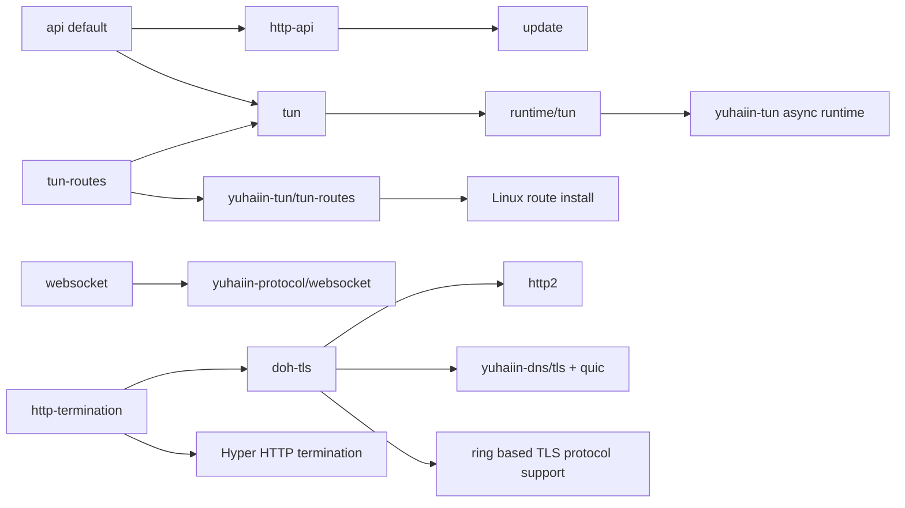

`yuhaiin-api` 的默认 feature 是 `http-api, tun, tun-routes, doh-tls, websocket,
http-termination`；`yuhaiin-runtime` 自己的默认 feature 不包含管理 API，但包含同一组
数据面能力（不含 `http-api`）。`tun` 现在是 runtime 的兼容/组装 feature，真正的
`yuhaiin-tun` async 实现始终编译；只有 `tun-routes` 才额外启用 route_manager。

`async-proxy`、`async-dns` 和同步 TLS feature 已从 workspace feature 图中删除。修改
feature-gated 代码时，要同时确认：

1. 代码在默认 feature 下是否编译。
2. `--no-default-features` 是否仍然能编译；如果不能，错误是新改动还是现有的条件编译缺口。异步 proxy/TUN 实现已经是 crate 的常规代码，不再通过旧的 `async-proxy` feature 开关。
3. TUN 代码的 `tun` 和 `tun-routes` 是否混用了：打开 TUN 不一定意味着可以安装 Linux route。
4. async boundary 的 future 类型是否应为 `BoxFuture` 还是 `LocalBoxFuture`。只有真正跨线程的 handler 才需要 `Send`。

## 5. 程序启动：从 `main` 到四个 supervisor

### 5.1 入口调用链

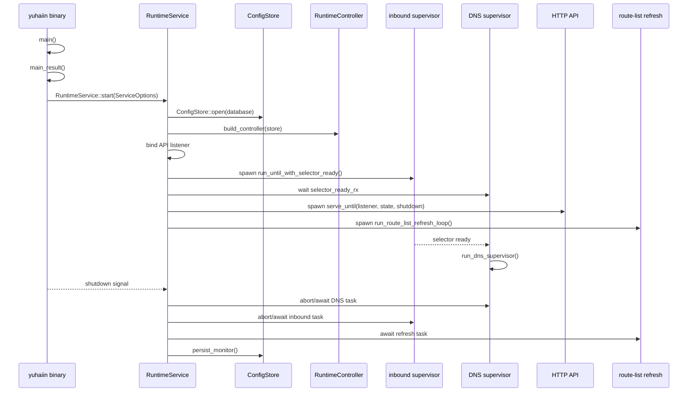

关键位置：

- [`main`](../crates/yuhaiin-api/src/bin/yuhaiin.rs#L37) 只负责进程级错误展示。
- [`main_result`](../crates/yuhaiin-api/src/bin/yuhaiin.rs#L44) 解析参数、默认路径和 service options。
- [`RuntimeService::start`](../crates/yuhaiin-api/src/service/runtime.rs#L18) 是真正的组装根：打开 store、建立 controller、绑定 API，并 spawn API/inbound/DNS/route refresh。
- [`build_controller`](../crates/yuhaiin-api/src/service/controller.rs#L11) 将 `ConfigStore` 和 resolver/proxy factory 装配到 `RuntimeController`。
- [`RuntimeService` lifecycle](../crates/yuhaiin-api/src/service/lifecycle.rs#L9) 负责 shutdown、等待 child task、Drop 时兜底 abort。

### 5.2 为什么 selector ready 先于 DNS

DNS resolver 可能要通过 proxy selector 出站。服务启动时必须先让 inbound supervisor
构建并发布 selector，再启动 `run_dns_supervisor`，否则 DNS 的 proxy resolver 可能在
selector 尚未存在时绑定失败或递归构造。

这也是 `RuntimeService::start` 中 `oneshot::channel()` 的意义：它不是普通的“任务已
spawn”信号，而是“selector 已经可以被 resolver bridge 使用”的就绪信号。

## 6. Runtime snapshot、controller 和 reload

### 6.1 三个对象的职责

| 对象 | 位置 | 生命周期/职责 |
| --- | --- | --- |
| `RuntimeSnapshot` | [`runtime/src/lib.rs`](../crates/yuhaiin-runtime/src/lib.rs#L125) | 一次完整配置加载的不可变视图；包含 settings、resolver registry、hosts/FakeIP、route、geo、proxy config、NAT policy |
| `RuntimeBuilder` | [`runtime/src/lib.rs`](../crates/yuhaiin-runtime/src/lib.rs#L363) | 从 store + 注入的 upstream resolver 构造一个 snapshot；构造失败时不发布半成品 |
| `RuntimeController` | [`runtime/src/controller.rs`](../crates/yuhaiin-runtime/src/controller.rs#L26) | 持有 store、`RuntimeHandle`、monitor、reload channels 和 live selector；串行化 rebuild 与 owner 生命周期 |

snapshot 的核心不变量是：旧 flow 可以继续持有旧 snapshot，新 flow 在成功 build 后看到
新 snapshot。因此配置 reload 不应在原地修改一组被所有 flow 共享的可变对象。

```mermaid
flowchart LR
    STORE[(ConfigStore)] --> BUILDER[RuntimeBuilder::build]
    BUILDER --> SNAP[RuntimeSnapshot<br/>immutable]
    SNAP --> HANDLE[RuntimeHandle::replace]
    HANDLE --> NEW[新 flow / 新 listener]
    OLD[旧 flow] -.仍持有旧 Arc.-> SNAP_OLD[旧 snapshot]
    CTRL[RuntimeController] --> HANDLE
    CTRL --> OWNER[InboundOwners / DNS owners / TUN owner]
    EVENT[API mutation] --> CTRL
    CTRL --> RELOAD[InboundReload::{All,One,Dns}]
```

### 6.2 入口函数的意义

- `RuntimeBuilder::with_options`：只设置 runtime-only knobs，不改变持久化 Go schema。
- `RuntimeBuilder::with_resolver_factory`：给 resolver registry 注入具体 transport factory。
- `RuntimeBuilder::with_resolver_proxy_bridge`：让 DoH/DoT/UDP resolver 根据 route mode 走 direct 或 proxy。
- `RuntimeBuilder::build`：读取配置、加载 hosts/FakeIP、构建 resolver、route trie、proxy config，最后形成完整 snapshot。
- `RuntimeController::reload`：全量重建/发布，并根据 snapshot 改变 owner。
- `RuntimeController::mutate_and_reload`：API 写入 store 后用同一把控制锁重建，避免写入和 live runtime 之间出现竞态。
- `mutate_and_reload_inbound`：只重载一个 inbound 的配置边界。
- `mutate_and_reload_dns`：只通知 DNS supervisor；DNS 配置变化不应无条件重启每个 inbound。
- `rebuild_locked_with_events`：在 controller 的 reload lock 内完成 build、发布 handle、发送事件。

### 6.3 reload 边界

当前应该遵循以下边界：

| 配置变化 | 应该触发 | 不应该顺便触发 |
| --- | --- | --- |
| 单个 inbound 的 listen/protocol/auth | `InboundReload::One(id)`，停止并重建该 owner | 不要重建其它 inbound、FakeIP、全局 hosts |
| 全局 inbound 设置 | `InboundReload::All` | 不要把普通 route-list refresh 当成全量 stop |
| DNS server listen 地址/transport | DNS reload，重绑 UDP/TCP listener | 不要让每个 inbound 重新 bind |
| hosts/FakeIP/route list/route rule | 发布新的 snapshot；新 flow 使用新 selector metadata | 不要为了 hosts 变化直接删除旧 flow |
| node 选择/selector slot | 更新 selector 的 live slot | 不要把不相关的 DNS listener 当作 node owner |
| TUN device 名称/fd/地址/系统 route | TUN owner 自己重建 | 不要只换 selector 伪装成 device reload |

这条边界是维护项目时最重要的约束之一：**配置的 owner 负责它的资源和重启，snapshot
负责不可变数据，controller 负责协调两者。**

## 7. 一条 TCP socket flow 的完整路径

### 7.1 从监听到协议解析

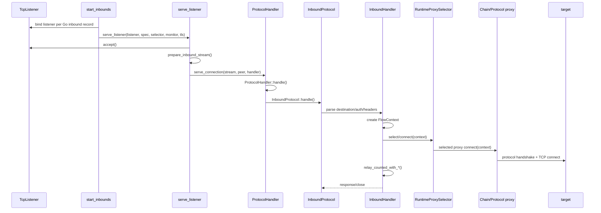

实际入口：

1. [`run_until`](../crates/yuhaiin-runtime/src/inbounds/mod.rs#L194) / `run_until_with_selector_ready` 进入 inbound supervisor。
2. [`run_until_inner`](../crates/yuhaiin-runtime/src/inbounds/mod.rs#L311) 调用 [`start_inbounds`](../crates/yuhaiin-runtime/src/inbounds/listeners.rs)；后者读取 Go inbound records、构建 auth/selector/monitor 并保存 owner。
3. [`serve_listener`](../crates/yuhaiin-runtime/src/inbounds/mod.rs#L1219) 接受 socket，必要时执行 TLS acceptor 和 protocol-specific preparation。
4. [`serve_connection`](../crates/yuhaiin-runtime/src/inbounds/mod.rs#L1498) 把 socket 交给 `ProtocolHandler::handle`。
5. `ProtocolHandler` 根据 normalized protocol 进入 `InboundProtocol::handle`，或进入 mixed、reverse HTTP、Yuubinsya 等特殊分支。
6. `InboundHandler` 负责把“线上的协议输入”变成统一的 `FlowContext`、`InboundStream`/`InboundDatagram`，再交给 runtime selector。

### 7.2 FlowContext 是跨层的“连接信封"

[`FlowContext`](../crates/yuhaiin-core/src/lib.rs#L84) 不只是目标地址，主要字段的来源如下：

| 字段 | 谁填写 | 谁消费 |
| --- | --- | --- |
| `source`、`local_addr` | listener/TUN tuple | loopback、统计、策略 |
| `destination` | SOCKS/HTTP/TUN packet/protocol parser | route、resolver、proxy |
| `original_domain` | 协议输入或 FakeIP reverse lookup | SNI、远端域名 framing、route |
| `resolved_destination` | resolver/direct connect | 最终 socket |
| `route_mode`、`resolver_policy` | `RuntimeSnapshot::apply_route` | selector/resolver |
| `inbound`、`inbound_name`、`process` | inbound spec/process resolver | route rule context |
| `tag`、`lists`、`match_history` | route list/router | API/statistics/debug |
| `outbound`、`outbound_addr` | selector/selected proxy | monitor/API |
| `fake_ip`、`hosts`、`geo` | FakeIP/hosts/geo adapter | route/observability |

不要在协议 crate 里新增另一套 `ConnectionContext`。如果字段确实是跨 inbound、TUN、
DNS 和 proxy 都需要的 flow metadata，应扩展 `FlowContext`；如果只是某个 wire protocol
的临时解析状态，应留在对应 protocol/session struct。

### 7.3 route 到 outbound 的实际判断

`RuntimeSnapshot::apply_route` 先用 `RouteListSnapshot::matching_names` 填充 list membership，
再调用 `RouterRuntime::apply_to_context`，最后把 resolver id 写回 context。路由规则核心是
[`RouteRule::matches_with_context`](../crates/yuhaiin-trie/src/router.rs#L88)：顺序包括：

1. `always_false` 和排除 pattern。
2. excluded/required host lists。
3. network 和 excluded network。
4. port range 和 excluded ports。
5. Geo country / excluded Geo country。
6. inbound name、process name、excluded inbound/process。

所以新增一个“按上下文路由”的条件时，应先考虑 `RouteRule` 的输入和序列化模型，之后
再修改 runtime 的 route application；不要在单个 `InboundHandler` 里提前决定 proxy。

## 8. UDP inbound：session 只分发，worker 才做网络 I/O

这是当前最容易误改的生命周期设计。

### 8.1 对象关系

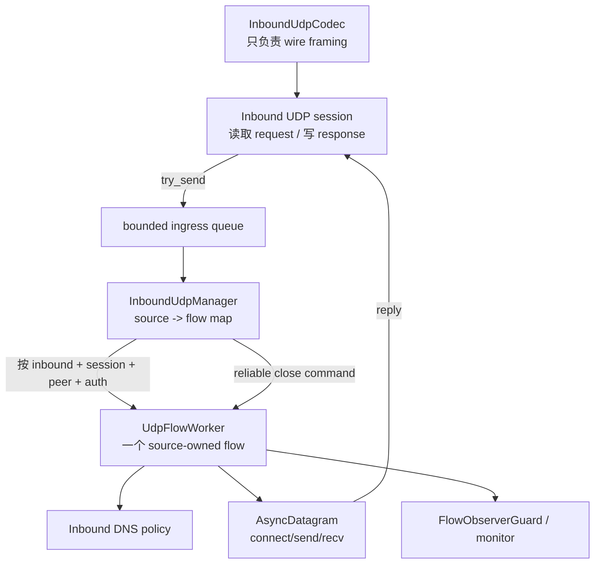

关键类型在 [`inbounds/handler.rs`](../crates/yuhaiin-runtime/src/inbounds/handler.rs)：

- `InboundUdpRequest`/`InboundUdpResponse`：codec 与通用 session 之间的 wire-neutral message。
- `InboundUdpCodec`：只定义 `recv`、`send`，不负责 DNS、route、proxy 或网络 I/O。
- `UdpSourceKey`：`inbound_id + session_id + source + authentication`，故意不包含 target；这才支持 full-cone UDP 一个 source 对多个目标。
- `InboundUdpManager`：维护 source 到 worker 的 map，入口 `dispatch` 使用 bounded `try_send`。
- `UdpFlowWorker`：自己持有 `AsyncDatagram`、flow observer、idle timer、reply metadata，负责所有可能阻塞的 DNS/route/open/send/recv。

### 8.2 队列和关闭语义

- 数据队列满时允许丢包：`UdpDispatchResult::Dropped` 是有意的背压策略。
- close 命令使用 unbounded control channel，不能因为数据队列满而丢失。
- `pending_close` 处理“close 先到、worker 尚未完成 open”的情况。
- `generation` 防止旧 worker 的 Closed 事件删除新 worker。
- session、manager 不应 `await` worker 的 network I/O；否则一个慢目标会阻塞整个 UDP ingress。
- worker idle cleanup 后要关闭 datagram 并释放 `FlowObserverGuard`，避免统计里的 live flow 残留。

修改 UDP 时，优先改 codec、manager、worker 三者中的一个明确边界，并补充：队列满、
close-before-open、worker replacement、多个 target、idle timeout、DNS hijack 的测试。

## 9. TUN 数据面

### 9.1 TUN 运行时调用链

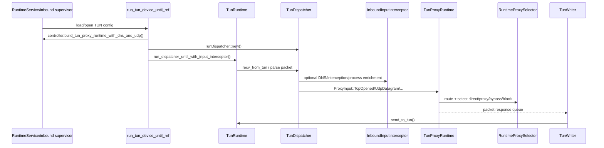

关键位置：

- [`TunRuntime`](../crates/yuhaiin-tun/src/runtime.rs#L69)：持有平台 device、smoltcp device、读写队列和可选 route setup。
- [`TunDispatcher`](../crates/yuhaiin-tun/src/dispatcher.rs#L115)：处理 IP version、TCP/UDP tuple、ICMP、fragment/extension header 和写回前 packet。
- [`run_tun_device_until_ref`](../crates/yuhaiin-runtime/src/data_plane.rs#L570)：runtime 侧 supervisor，选择 proxy ids、构建 `TunProxyRuntime`、创建 interceptor/dispatcher，并等待 shutdown 或匹配的 inbound reload。
- `controller.build_tun_proxy_runtime_with_dns_and_udp`：把 TUN 连接、DNS hijack、UDP/full-cone NAT 和 selector 接在一起。

### 9.2 TUN 与 socket inbound 的共同点

二者不应该各自实现一套 route/proxy 逻辑。共同点是：

1. 都最终生成 `FlowContext`。
2. 都使用同一个 runtime snapshot/selector。
3. 都可以使用 `InboundDnsHandler` 处理 DNS packet。
4. 都通过 `FlowObserver`/monitor 记录连接和字节。

区别是输入和输出：socket inbound 读写一个 client stream；TUN 从 IP packet 生成 proxy
输入，并把结果重新编码成 packet 写回 device。

## 10. DNS：从公共 contract 到真实 transport

### 10.1 分层

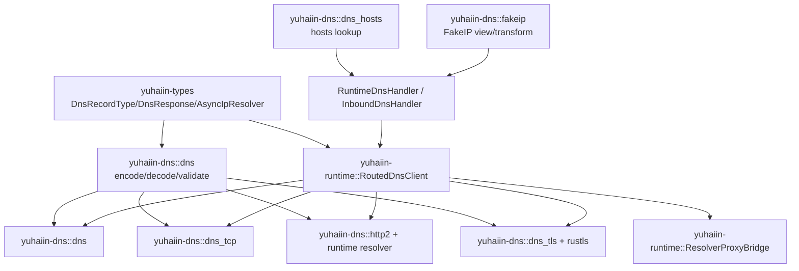

### 10.2 两种 DNS 使用方式

1. **地址解析**：proxy/TUN 需要 `IpSet` 时调用 `AsyncIpResolver::resolve`。
2. **完整 DNS packet**：DNS listener、DNS hijack 或需要保留 PTR/HTTPS/SVCB 记录时调用 `query_packet`/`AsyncDnsHandler::answer`，不能把所有返回值压缩成 IP。

`AsyncIpResolver::query` 的默认实现会把 A/AAAA 映射到 `ResolveStrategy`，并返回最小
TTL；具体 transport 可以覆盖它，保留 `ptr_names`、`service_bindings` 和真实 TTL。

### 10.3 `RoutedDnsClient` 的查询流程

[`RoutedDnsClient`](../crates/yuhaiin-runtime/src/resolver.rs) 负责将 runtime 的 resolver
配置转换成具体查询：

1. `query`/`query_packet` 经过 `TimeoutResolver` 施加超时。
2. `encode_query` 生成标准 DNS wire packet，`validate_query_packet` 检查输入。
3. 根据 resolver kind 选择 UDP、TCP、DoH、DoT 或 QUIC transport。
4. 如目标 resolver 的出站 mode 是 proxy，`ResolverProxyBridge::open_datagram` 或 `connect` 通过 selector；direct mode 走 `open_datagram_direct`/`connect_direct`。
5. 收到 packet 后执行 `validate_response_packet`、`response_is_truncated`；UDP 截断时可以转 TCP。
6. `decode_response` 还原 `DnsResponse`；随后 cache/FakeIP/hosts policy 决定对调用方的最终回答。

不要在 `RoutedDnsClient` 里直接读取 API 或 SQLite。resolver 的 typed config 由
`RuntimeBuilder` 从 store 加载，client 只消费构造好的 endpoint/factory/bridge。

### 10.4 DNS listener supervisor

[`run_dns_supervisor`](../crates/yuhaiin-runtime/src/data_plane.rs#L628) 在每轮循环：

1. 读取 configured DNS listen address。
2. 从 controller handle 取得当前 snapshot 和 `dns_handler`。
3. 独立尝试 bind UDP 与 TCP；一个 transport bind 失败不必杀掉另一个。
4. 通过 `wait_for_shutdown_or_dns_reload` 等待 DNS reload 或全局 shutdown。
5. reload 后只重绑 DNS listener，不重启所有 inbound owner。

这个 supervisor 和 resolver transport 是两个方向：前者是“别人来访问本服务的 DNS
入口”，后者是“本服务向上游 DNS 查询的客户端”。排查问题时先确认是哪一侧。

### 10.5 FakeIP、hosts 和 inbound DNS policy

- `hosts` 是名字到固定地址/目标的优先级输入，runtime snapshot 中有独立 `HostsTable`。
- global FakeIP resolver 和 inbound DNS hijack FakeIP 可以是两个 pool；不能假设关闭 global FakeIP 就一定没有 inbound pool。
- `FlowContext::original_domain` 用于从 FakeIP 反查域名后保留原域名；`fake_ip` 记录应用真正看到的 synthetic address。
- `InboundDnsHandler` 只回答“是否拦截”和“给这个 packet 什么响应”，不负责决定所有普通 resolver 的 transport。

## 11. Proxy、protocol、chain 的关系

### 11.1 三个层次

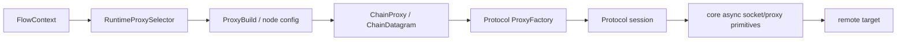

- `yuhaiin-core` 提供最底层的 async socket connect、stream/datagram 基础和 `FlowContext`；当前不再提供同步 connector。
- `yuhaiin-protocol` 负责“如何在一个已获得的底层 stream/datagram 上做协议握手”，例如 SOCKS5、VLESS、VMess、Trojan、Shadowsocks、H2、WebSocket、Yuubinsya。
- `yuhaiin-protocol::proxy_factory::BaseProxyConfig::build` 负责把 Direct/Reject/Drop/Fixed/HTTP/SOCKS5/Yuubinsya UDP 等基础出站配置变成 `Arc<dyn AsyncProxy>`；HTTP CONNECT 现在也是异步 `HttpProxy` 套在 `FixedAsyncProxy` 上。
- `yuhaiin-protocol::tls::RustCryptoTlsProxy` 只包装已有的 `AsyncProxy`，负责异步 TLS 握手和 ALPN；旧的 `tls_sync.rs` 已删除。
- `yuhaiin-chain` 负责把多个 node、TLS、WebSocket、H2、UOT/UDP 阶段组合起来；`ChainClient` 是链的连接/缓存/重试核心，`ChainProxy`/`ChainDatagram` 把链暴露成 runtime 可用的 proxy capability。
- `yuhaiin-runtime/src/proxy.rs` 根据 Go node/proxy config 构造上面这些对象，并把它们注册到 `RuntimeProxySelector`。

这次调整后的关键调用关系是：

```text
RuntimeProxySelector
  -> RuntimeProxySelector/ProxyBuild
  -> BaseProxyConfig::build 或 ChainClient
  -> AsyncProxy / AsyncDatagram
  -> RustCryptoTlsProxy、HTTP、协议 session 等 wrapper
  -> runtime relay 或 TUN proxy task
```

`AsyncProxy` 是 core 的 runtime-facing capability；它不应因为“公共 trait”这个名字就被
继续移动到 `yuhaiin-types`。只有不携带 Tokio、socket、FlowContext 生命周期的 DNS、inbound
DNS policy、endpoint/network model 才进入 `types`。

### 11.2 添加一个新的 outbound protocol

建议顺序：

1. 在 `yuhaiin-protocol/src/proxy_factory.rs` 增加 config/variant 的解析和工厂分派。
2. 在新的 protocol 文件中实现 handshake/session；不要读取 store 或 runtime controller。
3. 如果需要新 transport（H2/WebSocket/TLS/UOT），优先复用 `yuhaiin-chain` 的阶段。
4. 在 `yuhaiin-runtime/src/proxy.rs` 的 `build_protocol_proxy` 或对应 helper 中把 persisted config 映射到 protocol factory。
5. 在 `yuhaiin-chain/src/config.rs`/`go_node.rs` 补齐 Go node 的兼容转换。
6. 加 protocol unit test、chain integration test、runtime selector test；最后跑 workspace check。

需要避免的反模式：

- 在 protocol crate 里直接依赖 `ConfigStore`。
- 在 runtime selector 中实现一段只属于协议 wire framing 的读写。
- 把 UDP session 和 TCP handshake 共用同一个只支持 stream 的 trait。
- 通过全局 mutable singleton 保存 node 选择；selector 的 slot 已经是 snapshot/reload 的边界。

### 11.3 direct、bypass、proxy、block

`RouteMode` 在 [`yuhaiin-core/src/lib.rs`](../crates/yuhaiin-core/src/lib.rs) 中定义：

- `Direct`：直接连接目标，通常使用 direct resolver。
- `Proxy`：使用选中的 node/chain，通常使用 proxy resolver。
- `Bypass`：管理语义上绕过一般代理选择，具体出站仍由 runtime 绑定的 bypass proxy 实现。
- `Block`：不建立 outbound；应尽早返回明确的 blocked error/empty response。

route decision、resolver policy、selector choice 三者必须来自同一个 snapshot。不要让
resolver 重新根据“当前全局设置”再选一次 mode，否则会出现 route 说 proxy、DNS 却 direct
的分裂行为。

## 12. Store、schema 和 Go 兼容

### 12.1 store 的边界

[`ConfigStore`](../crates/yuhaiin-store/src/lib.rs#L105) 是 SQLite 连接和 typed repository 的
入口。高层应使用 repository 方法，不要依赖表名。store 里大致有：

| 模块 | 作用 |
| --- | --- |
| `sqlite.rs` | 连接、锁、事务和错误映射 |
| `schema.rs` | Rust 原生表初始化和 schema 约束 |
| `repository.rs` | typed records 和 Go v2 兼容读取/写入 |
| `migration.rs` | legacy schema import、幂等 marker、部分迁移恢复 |
| `resolver.rs` | resolver records、FakeIP pool 的持久化 glue |
| `fakeip.rs` | legacy FakeIP export/import、v4/v6 mapping 和 transform |
| `statistics.rs` | connection history、telemetry、traffic |
| `status.rs` | 运行状态、selected node、管理状态 |
| `compat_runtime.rs` / `compat_proxy.rs` | 给 runtime/proxy 消费的 Go contract view |

### 12.2 启动加载和迁移

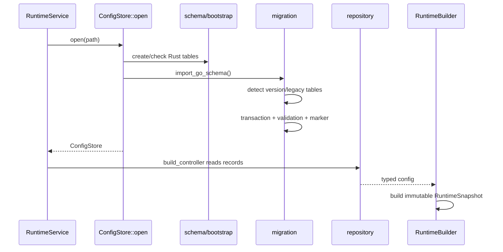

`import_go_schema` 的重要特点：

- 用 transaction 包住跨表转换。
- 通过 `yuhaiin_meta` marker 保证重复启动幂等。
- 先验证 id/text/json/timestamp，再写入目标表。
- 不认识的字段尽量保留在 `data_json`，避免 Rust 读写造成 Go 字段丢失。
- 迁移失败时必须保持原始数据可恢复；不要用“先清空旧表再重建”的方式修复。

### 12.3 修改配置字段的安全顺序

新增或修改一个 persisted setting 时，按这个顺序做：

1. 确认字段属于 Go compatibility schema、Rust native schema，还是 runtime-only option。
2. 在对应 record/serde model 增加字段，处理缺失字段的默认值。
3. 在 repository 增加读取和写入，避免 API 直接拼 SQL。
4. 如果旧数据库需要转换，修改 migration 并增加 idempotency test。
5. 在 `RuntimeBuilder` 将 record 转成 snapshot 字段。
6. 在 controller 中决定 reload owner（snapshot-only、inbound、DNS、TUN 或全量）。
7. 在 API handler 只做输入校验、调用 repository/controller、返回 DTO。

## 13. API 和控制面

### 13.1 API 的组成

```mermaid
flowchart TD
    BIN[yuhaiin-api/bin/yuhaiin.rs]
    SERVICE[service/runtime.rs]
    STATE[ApiState]
    AUTH[ApiAuth / authenticate]
    ROUTER[router() / serve_until]
    HANDLERS[api.rs handlers]
    CTRL[RuntimeController]
    STORE[ConfigStore]
    EVENTS[SSE connection events]

    BIN --> SERVICE
    SERVICE --> STATE
    STATE --> AUTH
    STATE --> ROUTER
    ROUTER --> HANDLERS
    HANDLERS --> CTRL
    HANDLERS --> STORE
    CTRL --> EVENTS
```

主要 handler 分组：

| 分组 | 函数位置 | 写操作的后续 |
| --- | --- | --- |
| auth/health | [`api.rs`](../crates/yuhaiin-api/src/api.rs#L420) | 只读/认证 |
| node | `node_get`、`node_put`、`node_delete`、`node_latency` | selected node + selector/reload |
| connections | `connections_get`、`connections_close`、`connections_events` | monitor/history/close command |
| inbound | `inbounds_config_*`、`inbounds_*`、`inbound_*` | `mutate_and_reload_inbound` 或 all |
| resolver/hosts/FakeDNS | `hosts_*`、`fakedns_*`、`get_resolver_value` | DNS/snapshot reload |
| route | route list/rule get/delete/put | snapshot rebuild/route refresh |
| canonical/default | `default_settings`、`canonical_settings_value`、`default_fakedns`、`default_tun_config` | DTO 默认形状，不能误当 live state |

API handler 的推荐结构：

```text
extract path/query/json
    -> validate public input
    -> call repository/controller method
    -> controller writes store and/or rebuilds snapshot
    -> return API DTO
```

不要在 API handler 内：

- 直接 bind listener 或 spawn长期 task。
- 直接修改 `RuntimeHandle` 内部 slot。
- 直接访问 SQLite 的兼容表。
- 把“API 返回的默认值”写成“runtime 已经启用”的事实。

## 14. 支持组件

### 14.1 `yuhaiin-geo`

提供 `GeoLookup` 能力和 MaxMind metadata。路由只依赖抽象查询接口；`RouteRule` 的 geo
条件在没有 geo 数据时采取 fail-closed 语义（需要匹配指定国家但没有 geo 时不匹配）。

### 14.2 `yuhaiin-wireguard`

包含 config、driver、engine、proxy。runtime 只负责根据 node/inbound 配置选择和组装，
WireGuard handshake/packet engine 不应混入通用 TCP proxy。

### 14.3 `yuhaiin-backup`

备份 model/transport 被 API service 使用；backup 不应直接持有 live runtime resource。恢复
配置后应回到 store import/migration，再通过 controller rebuild，而不是直接替换 selector。

## 15. 常见修改任务：应该改哪些文件

### 15.1 添加一个公共 DNS/inbound/net trait

先判断 trait 是否满足“零 runtime/平台依赖”。如果满足：

1. 在 `crates/yuhaiin-types/src/{dns,inbound,net}.rs` 或 `lib.rs` 中定义最小 contract；这里没有 `proxy.rs`。
2. 只使用 `DomainName`、`Endpoint`、`IpSet`、`BoxFuture`、`Result` 等 types 内类型。
3. 在 `types/src/lib.rs` re-export。
4. 在旧 crate re-export，保持旧路径源码兼容。
5. 将 codec/transport 的实现留在 `yuhaiin-dns` 或 `runtime`。
6. 为 `Send` 做明确判断：跨 Tokio task/线程才要求 `BoxFuture`；本地单线程边界用 `LocalBoxFuture`。

如果新增的是 `AsyncProxy`、`AsyncDatagram`、`AsyncStream` 或需要 `FlowContext`/Tokio I/O
的 wrapper，应留在 `yuhaiin-core::proxy`；如果新增的是协议 framing 或 TLS/HTTP session，
应留在 `yuhaiin-protocol`。不要为了复用一个名字而把 runtime-specific capability 塞进
无依赖的 `yuhaiin-types`。

### 15.2 添加新的 inbound protocol

```text
Go inbound record
  -> store::repository::list_go_inbounds
  -> runtime::inbounds::listeners::start_inbounds
  -> normalize_inbound_protocol
  -> inbounds/mod.rs::ProtocolHandler
  -> 新 protocol adapter
  -> InboundHandler::serve_stream_with_prefix / UDP codec
  -> RuntimeProxySelector
```

需要修改的地方通常是：

- store 的 Go record 解析（若 schema 新增字段）。
- `start_inbounds` 的 protocol dispatch 和 listener owner。
- `inbounds/mod.rs` 的 `InboundProtocol` 分支。
- `inbounds/handler.rs` 的通用 stream/UDP 调用，而不是重复实现 route。
- protocol-specific tests 和 reload tests。

如果新协议是 UDP，优先实现 `InboundUdpCodec`，不要从 codec 内部直接连接 upstream。

### 15.3 修改 route 条件

```text
persisted Go/Rust rule
  -> store record
  -> runtime::route::RuleVariant / RouteListSnapshot
  -> yuhaiin-trie::RouteRule
  -> RouteRule::matches_with_context
  -> RouterRuntime::apply_to_context
  -> RuntimeSnapshot::apply_route
```

同时检查：规则优先级、excluded 条件、`FlowContext` 是否已经填充所需 metadata、路由
命中记录是否会反映到 API/statistics。仅在 `matches_with_context` 加一个判断，但没有让
TUN/socket inbound 填写字段，通常会造成规则永远不命中。

### 15.4 修改 DNS transport

不要从 API handler 直接创建 `UdpSocket`。正确路径是：

1. 在 `yuhaiin-dns` 增加 wire/transport client。
2. 让它实现 `AsyncIpResolver` 或 `query_packet`。
3. 在 runtime `ResolverTransportFactory` 中注册构造逻辑。
4. 如需代理出站，使用 `ResolverProxyBridge`，不要自己复制 selector 逻辑。
5. 明确 UDP truncation、TCP fallback、timeout、cache 和 FakeIP 的层次。
6. 如果修改的是服务监听地址，只改 `run_dns_supervisor` owner/reload；不要把 resolver client 和 listener 混成一个对象。

### 15.5 修改 TUN 行为

先判断是 packet parser、platform device 还是 proxy runtime：

- IP header/tuple/fragment：`yuhaiin-tun/src/packet.rs`、`dispatcher.rs`。
- OS fd、device、route install：`yuhaiin-tun/src/runtime.rs`、`platform/`。
- TCP/UDP flow 到 proxy：`yuhaiin-tun/src/proxy.rs`、`proxy_tasks.rs`、`proxy_output.rs`。
- store config 兼容和 supervisor：`yuhaiin-runtime/src/data_plane.rs`。
- route/proxy/DNS 选择：`yuhaiin-runtime/src/controller.rs` 和 snapshot/selector。

修改 TUN 时至少验证：IPv4/IPv6、TCP close、UDP multi-target、DNS hijack、FakeIP reverse
lookup、shutdown/reload、写回队列背压。

### 15.6 修改持久化或迁移

先阅读 [`MIGRATION.md`](../MIGRATION.md) 和 [`GO_COMPATIBILITY.md`](../GO_COMPATIBILITY.md)，
然后只在 store 层改。必须增加：

- 空数据库启动。
- 旧数据库启动。
- 重复启动/重复迁移。
- 部分表存在、部分表缺失。
- malformed JSON/text/timestamp 的 fail-closed 行为。
- unknown/future fields 的保留行为。

## 16. 调试路线：从现象反查组件

### 16.1 “配置写成功但没有生效"

按顺序检查：

1. API handler 是否真的调用了 `mutate_and_reload*`，还是只写 store。
2. controller 发布的 `InboundReload` 类型和 owner 是否匹配。
3. 新 snapshot 是否 build 成功；看 monitor/log 中 resolver/route error。
4. 新 flow 是否通过 `RuntimeHandle::load` 取得了新 snapshot。
5. 旧 flow 仍使用旧 snapshot 是设计行为，不代表 reload 失败。
6. 如果是 DNS listen 配置，确认看的是 DNS supervisor 的 bind 日志，而不是 inbound listener 日志。

### 16.2 “规则不命中"

检查 `FlowContext` 在调用 `apply_route` 前的：

- destination 是 domain 还是 FakeIP address。
- `original_domain` 是否恢复。
- `network`/port 是否正确。
- `inbound_name`/`process` 是否已填。
- `lists` 是否由 `RouteListSnapshot::matching_names` 计算。
- geo provider 是否存在。

### 16.3 “DNS 好像没走代理"

区分三种流量：

1. TUN/socket 的 DNS hijack packet：看 `InboundDnsHandler`/`RuntimeDnsHandler`。
2. runtime 为目标域名做的地址解析：看 `AsyncIpResolver`/`RoutedDnsClient`。
3. DNS listener 收到外部请求后向上游查询：看 `run_dns_supervisor` + handler。

再看 `ResolverProxyBridge` 的 resolver id/mode，而不是只看最终 DNS server 地址。

### 16.4 “内存或 task 越来越多"

先从生命周期统计入手：

- listener owner 是否因为 reload 没有 drop。
- UDP manager 的 source map 是否有 Closed event/generation 处理。
- `FlowObserverGuard` 是否在 abort 时释放。
- H2 pool、NAT table、resolver cache、FakeIP pool 是否有明确容量/TTL。
- fd/socket/task 数量是否随重复 workload 单调增加。

容量上限本身不能证明没有 retention。要用重复 workload、RSS、heap profile、fd/task/socket
计数做 A/B；heap profile 还必须使用匹配 build-id 的未 strip/debug binary。

## 17. 推荐测试矩阵

日常最小验证：

```bash
cargo fmt --all -- --check
cargo check --workspace
cargo test -p yuhaiin-types
cargo test -p yuhaiin-dns --features tls,quic
cargo test -p yuhaiin-core --features http2,tls-ring
cargo test -p yuhaiin-runtime
cargo test -p yuhaiin-tun --features tun-routes
git diff --check
```

按改动类型追加：

| 改动 | 建议测试 |
| --- | --- |
| `yuhaiin-types` trait/model | types + 依赖它的 dns/core/runtime check |
| DNS | `yuhaiin-dns` 默认模块及 `tls,quic` feature，packet validation、truncation、cache、SVCB |
| route/trie | trie unit tests + runtime route tests + TUN/socket context tests |
| inbound TCP | runtime inbound tests、协议握手、reload/close |
| inbound UDP | multi-target、bounded queue drop、close-before-open、generation、idle cleanup |
| TUN | runtime tun tests、dispatcher/packet tests、`yuhaiin-tun --features tun-routes`、真实平台 smoke |
| store/migration | empty/legacy/partial/repeat DB fixture tests |
| chain/protocol | protocol unit + chain integration + runtime selector build |
| API | handler tests、round-trip/default shape、mutation publishes reload |
| async/feature 边界 | 确认没有重新引入 `async-proxy`/`async-dns`；检查默认 feature 和 `--no-default-features` 的条件编译 |
| TUN throughput | `bash scripts/benchmark/tun-throughput.sh`；脚本会构建 `yuhaiin-tun/src/bin/tun_smoke.rs`，需要 `tun-routes` 时显式打开 |

验证时要把“代码基线”和“当前工作树”分开记录：公共 trait 抽取完成后应先跑上面的默认
workspace check，再跑 DNS/core 的可选 feature 测试；如果工作树正处在移除旧 feature 或
整理 re-export 的中间状态，`cargo check` 的错误可能来自未完成的条件编译/导出迁移，而
不是业务逻辑回归。当前 checkout 的 `cargo check -p yuhaiin-runtime --no-default-features`
仍有已知缺口：`inbounds/mod.rs` 无条件 re-export 了 tun 专属
`InboundInputInterceptor`，`listeners.rs` 无条件导入了 http2/websocket listener；它们
需要单独条件化。修改相关 feature 时应把它作为独立问题确认，不要把它误判成公共 trait
抽取造成的回归。

## 18. 快速代码索引

| 想了解什么 | 从这里开始 | 下一步 |
| --- | --- | --- |
| 进程如何启动 | `api/bin/yuhaiin.rs::main` | `api/service/runtime.rs::RuntimeService::start` |
| controller 如何组成 | `api/service/controller.rs::build_controller` | `runtime/controller.rs::RuntimeController` |
| snapshot 包含什么 | `runtime/lib.rs::RuntimeSnapshot` | `RuntimeBuilder::build` |
| reload 如何发生 | `runtime/controller.rs::reload` | `mutate_and_reload*`、`InboundReload` |
| inbound listener | `runtime/inbounds/listeners.rs::start_inbounds` | `runtime/inbounds/mod.rs::serve_listener` |
| TCP 协议进入点 | `runtime/inbounds/mod.rs::serve_connection` | `ProtocolHandler::handle`、`InboundProtocol::handle` |
| 通用流代理 | `runtime/inbounds/handler.rs::InboundHandler` | `serve_stream_with_prefix`、`relay_with_prefix` |
| UDP actor | `runtime/inbounds/handler.rs::InboundUdpManager` | `spawn_udp_flow`、`UdpFlowWorker::run` |
| TUN 入口 | `runtime/data_plane.rs::run_tun_device_until_ref` | `yuhaiin-tun::TunRuntime`、`TunDispatcher` |
| route 决策 | `runtime/lib.rs::RuntimeSnapshot::apply_route` | `trie/router.rs::RouteRule::matches_with_context` |
| DNS 查询 | `runtime/resolver.rs::RoutedDnsClient` | `ResolverProxyBridge`、`yuhaiin-dns::dns` |
| 出站 selector | `runtime/proxy.rs::RuntimeProxySelector` | `build_protocol_proxy`、`yuhaiin-chain` |
| flow 统计 | `core/flow.rs::FlowObserver` | `runtime/monitor.rs`、`FlowObserverGuard` |
| direct socket | `core/proxy.rs::connect_tokio_tcp*` | interface/local bind/error mapping |
| 配置读取 | `store/lib.rs::ConfigStore` | `store/repository.rs` |
| Go 迁移 | `store/migration.rs::import_go_schema` | `GO_COMPATIBILITY.md` |
| FakeIP | `store/fakeip.rs::FakeIpPool` | `dns/fakeip.rs`、runtime snapshot |

## 19. 最后给自己的修改清单

每次动一个组件前，先回答这五个问题：

1. 这个逻辑属于公共 contract、领域实现、runtime 组装，还是 API/store 边界？
2. 它的 owner 是 snapshot、listener、DNS supervisor、TUN owner、UDP worker 还是 API task？
3. 它改动后应该发布哪一种 reload event？
4. 旧 flow/旧 task/旧 database 在切换时是否仍然安全？
5. 我能用一个具体的函数调用链和测试说明它确实生效吗？

如果这五个问题能回答清楚，项目虽然 crate 数量多，但修改路径通常是确定的：先进入
正确的 domain crate，再由 `yuhaiin-runtime` 组装，最后由 `yuhaiin-api` 或平台入口触发。

## 20. 逐 crate 的内部组件索引

前面的章节解释了跨 crate 主流程。本节按源码文件继续往下拆，目标是让你打开一个
文件后知道：它的输入是什么、输出是什么、内部状态在哪里、下一个应该跳到哪个函数。

### 20.1 `yuhaiin-types`：最底层公共语言

源码目录只有四个文件，依赖故意保持为空：

| 文件 | 关键内容 | 内部逻辑 |
| --- | --- | --- |
| [`lib.rs`](../crates/yuhaiin-types/src/lib.rs) | `BoxFuture`、`LocalBoxFuture`、`DomainName`、`IpSet`、`Error`、`ResolveStrategy` | `DomainName::new` 做规范化/长度/label 校验；`IpSet::iter` 以 v4 后 v6 顺序暴露地址；错误只携带 kind/message |
| [`net.rs`](../crates/yuhaiin-types/src/net.rs) | `Network`、`Endpoint` | 统一表达 TCP/UDP/ICMP/Any 和 IP/domain endpoint；不做 socket 连接 |
| [`dns.rs`](../crates/yuhaiin-types/src/dns.rs) | DNS model 和 `DnsHandler`、`AsyncDnsHandler`、`AsyncIpResolver` | `AsyncIpResolver::query`/`query_packet` 有最小默认实现，具体 resolver 可以保留 PTR/SVCB/HTTPS/raw packet |
| [`inbound.rs`](../crates/yuhaiin-types/src/inbound.rs) | `InboundDnsHandler` | 只定义 DNS 是否拦截和异步回答，不知道 inbound listener 或 TUN 具体实现 |

修改这里的原则是“只新增可复用语义，不新增运行时策略”。例如 `Endpoint` 可以增加
一个地址转换方法；但“应该使用哪个 proxy id”必须留在 runtime。`AsyncProxy` 等异步
出站能力不属于这个 crate 的公共语言层。

### 20.2 `yuhaiin-dns`：DNS 的模型、编解码和传输实现

#### 20.2.1 模块地图

| 文件 | 组件 | 关键函数/类型 | 作用 |
| --- | --- | --- | --- |
| [`dns.rs`](../crates/yuhaiin-dns/src/dns.rs) | wire/model/UDP | `encode_query`、`decode_query`、`encode_response`、`decode_response`、`validate_*`、`AsyncUdpDnsClient` | Hickory message 与 types model 的边界；同时提供 UDP transport |
| [`cache.rs`](../crates/yuhaiin-dns/src/cache.rs) | cache | `DnsCache`、`CachingDnsHandler` | bounded LRU、TTL 和 raw packet cache |
| `dns_hosts.rs` | hosts | `HostsTable`、`HostsDnsHandler`、`AsyncHostsDnsHandler` | 先按 domain/IP 查静态 hosts，再决定 passthrough/upstream |
| `fakeip.rs` | FakeIP view | `FakeIpView`、`FakeIpViewStore` | 只提供回答转换/反查视图；持久化 pool 的 owner 在 store |
| `dns_resolver.rs` | resolver | `DnsResolver`、`AsyncDnsResolver`、`AsyncDnsFlight`、`SendAsyncDnsQuery` | 同步兼容与异步 runtime 的 transport 组合；cache、singleflight、raw packet、A/AAAA 合并 |
| `dns_resolver_stack.rs` | resolver stack | `AsyncHostsResolver` | 把 hosts 层包在异步 resolver 上 |
| `dns_datagram.rs` | datagram abstraction | `AsyncDnsDatagram`、`DnsDatagramConnector` | 给 UDP/QUIC/代理 resolver 提供统一 datagram |
| `dns_tcp.rs` | async TCP | `AsyncTcpDnsClient`、`AsyncTcpDnsServer` | 两字节 length-prefix 的 DNS over TCP 和 listener loop |
| `dns_tls.rs` | DoT/DoH TLS glue | `DnsTlsConnector`、`DotResolverFactory`、`DohResolverFactory` | TLS stream、SNI/证书、resolver factory |
| `dns_http.rs` | DoH over HTTP | `DnsOverHttp`、`DnsOverHttpHandler` | 通过 Hyper 协商 HTTP/1.1 或 HTTP/2，发送 DNS POST/响应 |
| `dns_quic.rs` | DoQ | `DoqClient`、`DoqResolverFactory` | QUIC stream/datagram 的 DNS framing |
| `transport.rs` | socket bind helper | `bind_udp_socket` 等 | local address/interface policy，不包含 DNS policy |

#### 20.2.2 typed/raw wire 流程

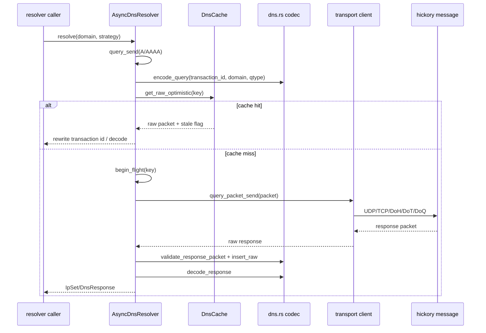

`AsyncDnsResolver` 的内部状态不是简单的 cache：

1. `begin_flight` 用 `(DomainName, qtype)` 做 in-flight 去重；同一时刻第二个请求等待 `AsyncDnsFlight::notify`。
2. owner 请求完成后 `finish_flight` 写入结果、移除 map entry、唤醒 waiters。
3. raw cache 允许 stale response 先返回，并通过 `start_refresh` 触发后台刷新；因此不能把“返回 stale”误认为“没有发起刷新”。
4. `resolve_send` 对 A/AAAA 使用 `tokio::join!`；一族失败而另一族成功时保留成功的地址，二者都失败才返回错误。
5. packet API 使用原始 transaction id 和 qtype；`query_packet` 不能退化成只处理 A/AAAA。

#### 20.2.3 Async UDP 的内部生命周期

`AsyncUdpDnsClient::socket` 惰性创建一个共享 `UdpSocket`，并 spawn 一个 receiver task。
每个 `query_packet_once`：

```text
validate_query_packet
  -> decode_raw_query_key
  -> pending[(id, domain, qtype)] = oneshot sender
  -> socket.send_to
  -> timeout(receiver)
  -> receiver task 按 peer + key 找 sender
```

当 response 的 truncation bit 为 true，`AsyncUdpDnsClient::query_packet` 转到
`AsyncTcpDnsClient::query_packet`。当最后一个 client handle drop 时，`Drop for
AsyncUdpDnsClient` 唤醒 receiver，避免 reload 后遗留一个 task/socket。

`AsyncUdpDnsServer::serve_until` 使用 `FuturesUnordered` 保存请求处理 future，并用
`max_inflight` 限制并发。单个请求的 malformed/upstream 错误被丢弃，listener 继续服务；
只有 socket 级错误或 owner shutdown 才退出。

### 20.3 `yuhaiin-core`：flow、socket、NAT 和平台观察

| 文件 | 内部组件 | 关键函数 | 读代码时要抓住的语义 |
| --- | --- | --- | --- |
| [`lib.rs`](../crates/yuhaiin-core/src/lib.rs) | `RouteMode`、`ResolverPolicy`、`FlowContext` | `FlowContext::new`、`effective_destination`、`proxy_destination`、`local_bind_for` | 原始目标、FakeIP 恢复域名、最终解析 socket 是三种不同地址，不能覆盖混用 |
| [`flow.rs`](../crates/yuhaiin-core/src/flow.rs) | flow identity/observer | `FlowKey::endpoint`、`Flow::context`、`FlowObserverGuard::open`/`Drop` | RAII close 保证 task 被 abort 时也发布一次 close |
| [`proxy.rs`](../crates/yuhaiin-core/src/proxy.rs) | async proxy capability | `connect_tokio_tcp_with_interface`、`AsyncStream`、`AsyncDatagram`、`AsyncProxy`、`AsyncProxySelector` | socket 连接、stream metadata、datagram 和 proxy selection 是不同接口；同步 connector 已移除 |
| [`nat.rs`](../crates/yuhaiin-core/src/nat.rs) | endpoint-independent NAT | `NatTable::insert`、`touch`、`bind_translated`、`lookup_*`、`sweep`、`UdpNatRelay` | source/translated/remote 的 key 关系和 idle timeout 决定 full-cone 行为 |
| [`process.rs`](../crates/yuhaiin-core/src/process.rs) | socket → process | `ProcessResolver`、`default_process_resolver`、`LinuxProcResolver::resolve_with_error` | TUN context 可以补 process/path/pid/uid；平台不支持时保持 None |
| [`sniff.rs`](../crates/yuhaiin-core/src/sniff.rs) | protocol metadata | `inspect`、`tls_server_name`、`http_host` | 只从已读 prefix 推断协议，不应消耗原始 stream |
| [`geo.rs`](../crates/yuhaiin-core/src/geo.rs) | Geo capability | `GeoLookup::country_code` | route 只依赖查询接口，不持有数据库文件格式 |

异步代理的调用约定：

```text
AsyncProxy::connect(&FlowContext) -> BoxAsyncStream
AsyncProxy::open_datagram(&FlowContext) -> Arc<dyn AsyncDatagram>
AsyncProxy::ping(&FlowContext) -> latency result
AsyncProxySelector::route_context(&mut FlowContext)
AsyncProxySelector::select(&FlowContext) -> Arc<dyn AsyncProxy>
```

`route_context` 负责把 context 补成 selector 需要的形式；`select` 只选择已构造的
proxy。构造 proxy、读取 store、构造 resolver 不应在每次 `select` 内重复发生。

### 20.4 `yuhaiin-trie`：从 pattern 到 immutable router

#### 20.4.1 三种索引

| 类型 | 位置 | 匹配算法 | 用途 |
| --- | --- | --- | --- |
| `DomainTrie<T>` | [`lib.rs`](../crates/yuhaiin-trie/src/lib.rs#L33) | domain label 反向存储；`search` exact/wildcard，`search_parent` 允许 parent cover subdomain | hosts/list membership |
| `CidrTrie<T>` | [`lib.rs`](../crates/yuhaiin-trie/src/lib.rs#L210) | IP bit path 的最长可用前缀 | CIDR route |
| `CombinedTrie<T>` | [`lib.rs`](../crates/yuhaiin-trie/src/lib.rs#L316) | domain 和 IP 两个索引，根据 `Endpoint` 分支 | route primary pattern |

`HostTrie` 在 [`ondisk.rs`](../crates/yuhaiin-trie/src/ondisk.rs#L51) 上面再提供内存/磁盘
两种 storage。`build_at` 生成 disk table，`open_at` 映射已有 table；调用方通过
`search`/`search_parent`，不需要知道数据是否在内存。

#### 20.4.2 Router compile/publish


`Router::compile` 先按 priority 排序，把有 pattern 的规则放进 `CombinedTrie`，把空 pattern
或 network-only 规则放进 `global_rules`。`Router::decide_context` 先找候选，再调用
`RouteRule::matches_with_context` 做 host-list、network、port、geo、inbound/process 和
negative constraints 的完整判断。`Router::apply_to_context` 写入 `route_mode`、
`resolver_policy`、`match_history`、`tag` 等 flow metadata。

`RouterRuntime::compile_and_publish` 在新 router 完整编译后再替换 `Arc`；
`rollback` 可以恢复旧 snapshot。这是 route reload 不打断读者的原因。

### 20.5 `yuhaiin-protocol`：协议 framing 和 session

协议 crate 的共同结构不是“每个文件都实现一个完整代理”，而是三层：

1. **wire codec**：把 request/header/datagram frame 编解码成 `Endpoint` 和 payload。
2. **client proxy**：拿一个 `Arc<dyn AsyncProxy>` 做上游连接，再写协议 header。
3. **server/session**：inbound 侧验证认证、读 destination、把剩余 stream 交给 runtime relay。

| 类别 | 文件 | 入口符号 | 内部流程 |
| --- | --- | --- | --- |
| proxy factory | [`proxy_factory.rs`](../crates/yuhaiin-protocol/src/proxy_factory.rs) | `BaseProxyConfig::build`、`BaseProxyKind` | persisted base endpoint/kind → Direct/Reject/Drop/Fixed/HTTP/SOCKS5/Yuubinsya UDP 等 `AsyncProxy`；fallback 通过 `FixedAsyncProxy` 或对应 wrapper 组合 |
| TLS wrapper | [`tls.rs`](../crates/yuhaiin-protocol/src/tls.rs) | `RustCryptoTlsProxy::new_with_options`、`AsyncProxy::connect` | 在已有 `AsyncProxy` 上做异步 rustls 握手，保留 local address，设置 SNI/ALPN 和证书校验策略；没有同步 TLS sibling |
| SOCKS/HTTP | `socks5.rs`、`socks5_server.rs`、`socks4a_server.rs`、`http.rs`、`http_server.rs` | `Socks5Proxy::new`、`server_handshake`、`read_endpoint`、`parse_udp_packet` | client/server framing；server 把 destination 交给 `InboundHandler` |
| VLESS | [`vless.rs`](../crates/yuhaiin-protocol/src/vless.rs) | `parse_uuid`、`encode_request`、`read_request`、`VlessProxy::new` | UUID + command + endpoint；UDP 使用 length-delimited datagram |
| VMess | [`vmess.rs`](../crates/yuhaiin-protocol/src/vmess.rs) | `command_key`、`encode_request`、`decode_request`、`read_body_frame`、`VmessProxy::new` | request/response header、security mode、body frame、UDP datagram |
| Trojan | [`trojan.rs`](../crates/yuhaiin-protocol/src/trojan.rs) | `password_hash`、`write_request`、`read_request`、`encode_udp_frame`、`TrojanProxy::new` | password hash + command + endpoint；UDP frame 独立于 TCP |
| Shadowsocks | `shadowsocks.rs` | `Method::parse`、`encrypt_udp_packet`、`decrypt_udp_packet`、`ShadowsocksProxy::new` | cipher state、stream payload、UDP AEAD packet |
| ShadowsocksR | `shadowsocksr.rs` | `CipherMethod::parse`、`ShadowsocksrConfig::new`、`ShadowsocksrProxy::new` | protocol/obfs/cipher 三段配置和 session state |
| H2 | [`h2_tunnel.rs`](../crates/yuhaiin-protocol/src/h2_tunnel.rs) | `H2Pool::open`、`H2Connection::handshake_with_limits`、`open_connect_stream` | endpoint identity → reusable H2 connection → bounded concurrent streams |
| WebSocket/HTTP obfs | `websocket.rs`、`websocket_io.rs`、`http_obfs.rs` | `WebSocketProxy::new`、`WebSocketIo::new`、`HttpObfsProxy::new` | stream wrapping，不改变上层 `FlowContext` |
| Yuubinsya | [`yuubinsya.rs`](../crates/yuhaiin-protocol/src/yuubinsya.rs)、`session.rs` | `encode_header`、`decode_header`、`YuubinsyaTcpSession::connect/accept`、`YuubinsyaServerProxy::serve_observed_with_dns` | custom auth/header、TCP stream、UOT、server UDP session、DNS observation |
| direct UOT | `direct_uot.rs`、`direct_uot_session.rs` | `parse_go_direct_uot`、`DirectUotProxy` | direct UDP over a stream-like UOT session |

#### 20.5.1 一次 outbound TCP handshake

```text
RuntimeProxySelector::select(context)
  -> concrete protocol proxy::connect(context)
  -> upstream AsyncProxy::connect(proxy_destination/context)
  -> protocol::write_request / encode_request
  -> protocol::read_response (if protocol has response header)
  -> BoxAsyncStream returned to runtime relay
```

协议层只负责自己拥有的 bytes；destination 的 route/resolver decision 已经由 runtime
完成。协议需要保留原始域名时读取 `context.proxy_destination()`，不要使用已经替换成
IP 的 `resolved_destination`。

#### 20.5.2 Yuubinsya/H2 的生命周期

- `YuubinsyaTcpSession` 的 `connect`/`accept` 只做 header/session framing；上层 `YuubinsyaServerProxy` 才负责观察 inbound、DNS 识别和 UDP session。
- `H2Pool` 按 endpoint/identity 复用 connection；`open_connect_stream` 增加 active stream 计数，`drain`/`close` 负责 reload/shutdown。
- 任何新建 pool/cache 都要提供 idle reap/close；否则 runtime snapshot reload 可能只换 selector 而旧 H2 connection 永不释放。

本次 commit 后 protocol 的旧同步入口不再是兼容层：`StreamConnector`、blocking HTTP/SOCKS
connector 和 `tls_sync.rs` 均已删除。新增协议 client 应实现/包装 `AsyncProxy`；新增协议
server 则只负责 framing/auth，再把 flow 交给 runtime 的 inbound handler。

### 20.6 `yuhaiin-chain`：节点链的验证、建连和 UDP

#### 20.6.1 配置到 validated chain

```text
JSON / Go node JSON
  -> parse_config / parse_go_node
  -> serde decode into ChainConfig
  -> ChainConfig::validate
  -> ValidatedChain
  -> ChainClient::new / new_with_resolver
```

[`config.rs`](../crates/yuhaiin-chain/src/config.rs#L8) 将 chain 拆成 `ChainNode`、固定地址、
TLS、WebSocket、HTTP2、Yuubinsya、HTTP、Socks5 等可组合段；`ValidatedChain` 保存后续
建连必需的规范化值。`go_node.rs::parse_go_node` 负责 Go 的字段/默认值兼容，不应该把
这些兼容判断散落到 runtime selector。

#### 20.6.2 `ChainClient` 内部调用

| 方法 | 逻辑 |
| --- | --- |
| `connect_tcp` / `connect_tcp_with_bind_and_interface` | 根据 chain 先建底层 socket，再套 TLS/HTTP/WebSocket/H2/协议段，返回 stream |
| `connect_raw_with_bind_and_interface` | 返回适合 protocol handshake 的裸/链后 stream |
| `connect_uot_with_bind_and_interface` | 建立 stream 后进入 UOT session，提供 UDP 复用 |
| `ping*` | 使用同一条 chain 做 latency/health probe，记录缓存 ping 结果 |
| `close` | 关闭 client 内 H2 pool、session 和缓存资源 |

`ChainProxy` 把 `ChainClient` 暴露给 runtime 的 `AsyncProxy`。UDP 侧的
`ChainDatagram`、`PendingUotDatagram`、`RetryQueue` 处理 datagram 映射和可恢复错误；
重试队列只能重试明确可恢复的 UOT/transport error，不能把认证失败无限重试。

### 20.7 `yuhaiin-store`：持久化、兼容和运行时数据

#### 20.7.1 `ConfigStore::open` 的真实边界

[`ConfigStore::open`](../crates/yuhaiin-store/src/lib.rs#L400) 是 storage bootstrap，不是
runtime builder。它负责：

1. 打开 SQLite backend/连接池状态。
2. 建立 native schema。
3. 调用 migration/import 检查 Go legacy tables。
4. 返回可 clone 的 store handle；真正的 domain record 由 repository 读取。

`with_write_transaction` 通过连接锁和 write retry 执行闭包，并统一 storage error；
`apply(&[ConfigMutation])` 用于多项 config 的原子写入。写配置后 controller 是否 rebuild
是上层责任。

#### 20.7.2 repository 分类

| repository 方法组 | 记录 | runtime 消费者 |
| --- | --- | --- |
| `list/put/delete_go_nodes` | node、group、chain JSON | `RuntimeBuilder`、API node |
| `list/put_go_inbounds` | inbound listener/protocol/config | `start_inbounds`、TUN loader |
| `list/put_go_resolvers` | resolver kind/config | `RuntimeBuilder`/resolver factory |
| `load_go_dns_hosts_table`、`list_go_dns_settings` | hosts/DNS settings | snapshot/DNS supervisor |
| `list/put_go_route_settings/rules/lists` | route fallback/rule/list | route compiler/list refresh |
| `list/put_go_node_tags` | tag → node ids | `NodeSetProxy`/selector |
| `get/put_go_selected_node_ids` | selected TCP/UDP node | selector/API |
| user methods in `users.rs` | credential records | inbound auth/API |
| statistics methods | traffic/history/telemetry | monitor/API |

不要将 Go v2 record 和 native record 混为同一 DTO：Go record 保留外部 schema，native
record 用于 Rust 新组件；兼容层通过 `compat_*`/repository 做映射。

#### 20.7.3 FakeIP 持久化流程

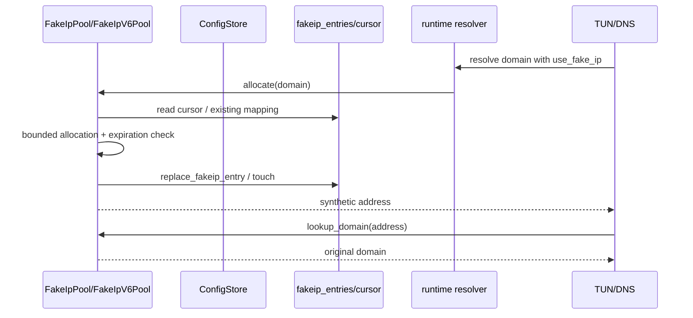

`FakeIpPool::allocate`、`lookup_domain`、`lookup_ip`、`flush_touches` 是内存状态和持久化
状态的边界。`FakeIpPools::snapshot` 给 runtime/TUN 一个只读 view；不要从 packet path
直接查询 SQLite。

### 20.8 `yuhaiin-tun`：packet engine、proxy task 和写回

| 文件 | 组件 | 关键函数 | 说明 |
| --- | --- | --- | --- |
| [`config.rs`](../crates/yuhaiin-tun/src/config.rs) | `TunConfig`、`TunRouteLease` | `validate`、`TunRouteLease::apply/close` | 配置合法性和系统 route 生命周期 |
| [`platform.rs`](../crates/yuhaiin-tun/src/platform.rs) | `AsyncDevice` glue | `async_device_from_owned_fd`、`enable_loopback` | OS fd/loopback 能力，不解析 IP packet |
| [`runtime.rs`](../crates/yuhaiin-tun/src/runtime.rs) | `TunRuntime` | `open`、`from_owned_fd`、`recv_from_tun`、`send_to_tun`、`run_dispatcher_until_with_input_interceptor` | 连接 OS TUN 和 smoltcp/dispatcher/proxy runtime |
| [`packet.rs`](../crates/yuhaiin-tun/src/packet.rs) | packet queue/fragment | `inspect_ip_packet`、`fragment_ip_packet`、`Ipv6FragmentReassembler::push`、`SmoltcpTunDevice` | 解析 tuple、分片/重组、收发队列 |
| [`dispatcher.rs`](../crates/yuhaiin-tun/src/dispatcher.rs) | `TunDispatcher` | `poll`、`poll_with`、`prepare_rx`、`next_proxy_input` | smoltcp socket event → `ProxyInput` |
| `dispatcher_input.rs` | socket input | TCP/UDP/ICMP 输入准备 | 把 socket 状态变化转成 dispatcher event |
| `dispatcher_sockets.rs` | socket write/close | `write_tcp`、`write_udp`、`close_*` | proxy output → smoltcp socket |
| [`proxy.rs`](../crates/yuhaiin-tun/src/proxy.rs) | `TunProxyRuntime` | `handle_proxy_input`、`open_tcp_flow`、`handle_udp_datagram`、`sweep`、`close_graceful` | flow task map、context/process/NAT、bounded command/output channel |
| `proxy_tasks.rs` | worker futures | `run_tcp_proxy`、`run_udp_proxy`、`run_icmp_proxy` | 真正执行 async proxy connect/read/write/recv/send |
| `proxy_output.rs` | output drain | `process_proxy_outputs` | 把 worker 输出应用到 dispatcher，并清理 close flow |

#### 20.8.1 TUN loop 的每一轮

`TunRuntime::run_dispatcher_until_with_input_interceptor` 的核心迭代可以按下面理解：

```text
recv_from_tun / smoltcp poll
  -> TunDispatcher::poll
  -> dispatcher.next_proxy_input
  -> interceptor.intercept (不能 await I/O)
  -> TunProxyRuntime::handle_proxy_input
  -> task command channel
  -> TunProxyRuntime::process_proxy_outputs
  -> dispatcher.write_tcp/write_udp/close
  -> flush_pending_icmp_to_tun
  -> NatTable sweep / task cleanup
  -> SmoltcpTunDevice::take_tx
  -> bounded TunWriter queue
  -> fragment_ip_packet + write_tun_fragment
```

TCP 一个 flow 一个 `ProxyTask`；UDP 按 source 复用 `UdpProxyTask`，worker 内部维护
`target -> TunFlowKey` 映射，所以同一 source 可收到多个 target 的回复。队列满时 packet
侧要有可观察的 backpressure/超时，不能在 `Interface::poll` 持有 mutable borrow 时执行
阻塞连接。

### 20.9 `yuhaiin-runtime` 的辅助组件

runtime 不只有 `lib.rs/controller.rs`。下面是组件边界：

| 模块 | 关键类型/函数 | 逻辑 |
| --- | --- | --- |
| `handle.rs` | `RuntimeHandle::load`、`publish`、`publish_if_revision`、`rebuild` | `Arc<RuntimeSnapshot>` + revision；读者无锁读取，发布者做替换 |
| `settings.rs` | `RuntimeSettings::load/from_value/from_go_settings_kv/to_json`、`Ipv6PolicyResolver` | Go settings KV/native JSON 双向转换；IPv6 策略包裹 upstream resolver |
| `route.rs` | `RouteListSnapshot::matching_names`、`load_route_lists`、`compile_go_route_rules*`、`refresh_route_list_caches*` | list 内容与 rule compiler 分开；远端 list refresh 通过 transport/proxy，不直接改 live router |
| `resolver.rs` | `ResolverProxyBridge::connect/open_datagram`、`TimeoutResolver`、`BuiltinResolverFactory`、`RoutedDnsClient` | resolver endpoint 的 direct/proxy 传输，超时、cache、raw query |
| `rustcrypto_resolver.rs` | `RustCryptoResolverFactory`、`RuntimeDnsDatagram` | rustls/rustcrypto resolver transport adapter |
| `proxy.rs` | `ProxyBuild::build_proxy`、`build_proxy_selector*`、`RuntimeProxySelector` | node config → protocol/chain/base proxy；再加 resolver、socket policy、connect budget、loopback tracking 和可替换 selector slot |
| `inbounds/mod.rs` | `run_until*`、`start_inbounds`、`ProtocolHandler`、`serve_listener`、`serve_connection` | listener owner、protocol dispatch、TLS/mixed/reverse 分支 |
| `inbounds/handler.rs` | `InboundHandler`、`InboundUdpManager`、`UdpFlowWorker` | 统一 flow context、DNS interception、stream relay、UDP actor |
| `inbounds/socks5.rs` | `Socks5UdpCodec` | SOCKS5 UDP wire framing，交给通用 UDP manager |
| `inbounds/tls_auto.rs` | `TlsAutoAuthority`、`TlsAutoResolver` | SNI → 动态/缓存证书，不参与 outbound route |
| `data_plane.rs` | `load_tun_config`、`run_tun_device_until_ref`、`run_dns_supervisor` | TUN/DNS owner 和 reload wait |
| `monitor.rs` | `ConnectionMonitor`、`FlowObserver` implementation、`request_close`、`persist` | live connection、traffic/telemetry/history、SSE event、close request |
| `latency.rs` | `probe`、`probe_with_resolver` | node latency/HTTP/STUN/UDP probe；不改变普通 flow selector |
| `loopback.rs` | `LoopbackDetector`、`TrackedConnection` | 防止 outbound 连接再次回到本进程 inbound |
| `interfaces.rs` | `discover_interfaces`、`interface_for_ip` | network interface metadata 和 bind policy |
| `log.rs` | `RuntimeLog` | bounded log ring、level、SSE/API 输出 |
| `defaults.rs` | `DefaultAddressPlan` | default inbound/TUN/DNS address 计划，不代表已 bind |
| `update.rs` | `Channel`、release/status types | update control plane；不应该参与数据面 proxy |

#### 20.9.1 runtime proxy 子模块

`runtime/src/proxy.rs` 只做 config-to-capability 的组装和 selector wrapper；inbound 适配器
按协议拆在 `runtime/src/proxy/`，共享 relay、sniff、统计和 UDP flow 生命周期：

| 文件 | 作用 |
| --- | --- |
| `proxy/common.rs` | `RoutedProxy`、stream sniff/record、relay accounting、UDP flow idle state 和共享 I/O helper |
| `proxy/http.rs` | HTTP inbound adapter；认证、CONNECT/forward 后进入通用 stream relay |
| `proxy/http_termination.rs` | 可选的 Hyper HTTP/1/2 termination，接到已经构造好的 upstream `AsyncProxy` |
| `proxy/reverse.rs` | reverse TCP/HTTP inbound，复用 selector 和通用 relay |
| `proxy/socks4a.rs` | SOCKS4/4A inbound framing、认证和 upstream dispatch |
| `proxy/transparent.rs` | Linux tproxy/redir TCP/UDP listener 和 original-destination 处理 |
| `proxy/trojan.rs` / `proxy/vless.rs` | Trojan/VLESS inbound adapter、认证和 UDP codec/session |
| `proxy/websocket.rs` | shared WebSocket I/O/server acceptor 的 runtime 适配 |
| `proxy/yuubinsya.rs` | Yuubinsya inbound server、DNS handler adapter 和 UDP codec |

#### 20.9.2 `RuntimeProxySelector` 的构造和选择

```mermaid
flowchart TD
    CONFIG[GoProxyRuntimeConfig + node tags] --> BUILD[ProxyBuild::build_proxy]
    BUILD --> CHAIN[ChainProxy / protocol proxy]
    CHAIN --> WRAP1[ResolvingProxy]
    WRAP1 --> WRAP2[SocketPolicyProxy]
    WRAP2 --> WRAP3[ConnectBudgetProxy]
    WRAP3 --> WRAP4[LoopbackTrackingProxy]
    WRAP4 --> SLOT[selector slot]
    CONTEXT[FlowContext] --> ROUTE[route_context]
    ROUTE --> SLOT
    SLOT --> SELECT[select(context)]
```

`ProxyBuild` 是构造结果，可能同时含 TCP/UDP capability；`RuntimeProxySelector` 保存
可替换的 live slot。新 flow 读取新 slot，旧 flow 已经拿到的 `Arc<dyn AsyncProxy>` 不会被
强制替换。包装器分别负责 resolver、network interface/local bind、connect semaphore、
loopback detection，不要把它们合并成一个难以测试的 `connect` 巨型函数。

### 20.10 `yuhaiin-api`：HTTP adapter、RPC 分派和服务管理

#### 20.10.1 router 到 value handler

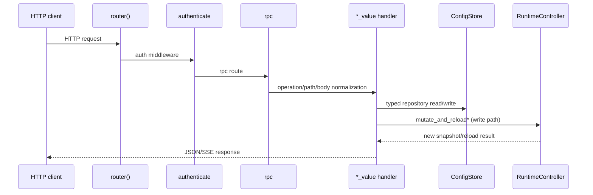

`api.rs` 采用两层 handler：外层 `nodes_get`/`node_put` 等适配 Axum extractor，内层
`get_node_value`/`save_node_value` 等处理统一 JSON contract。这是为了兼容 `/api/v2`
的 operation 形状；修改 API 时应先找对应的 `*_value`，不要只改外层 route。

关键模块：

| 文件 | 组件 | 关键位置 |
| --- | --- | --- |
| [`api.rs`](../crates/yuhaiin-api/src/api.rs#L270) | router/middleware | `router`、`authenticate`、`serve`、`serve_until`、`rpc` |
| `api.rs` | node | `nodes_get_value`、`save_node_value`、`select_node_value`、`node_latency_value` |
| `api.rs` | inbound | `inbounds_get_value`、`save_inbound_value`、`delete_inbound_value` |
| `api.rs` | resolver | `resolvers_get_value`、`save_resolver_value`、`delete_resolver_value` |
| `api.rs` | route | `route_config_put_value`、`save_route_list_value`、`save_route_rule_value`、`route_rules_test_value`、`route_apply_value` |
| `api.rs` | hosts/FakeDNS | `hosts_put_value`、`fakedns_put_value`、`resolver_server_put_value` |
| `api.rs` | monitor | `connections_events`、`connections_close`、stats/history handlers |
| `api.rs` | refresh | `run_route_list_refresh_loop_inner`、`refresh_geo_database`、`RouteListRefreshGuard` |
| `backup_transport.rs` | proxy-backed S3 | `write_request`、`read_response`、`decode_chunked_body`、`tls_stream` |
| `service/runtime.rs` | process host | `RuntimeService::start`、child task join/abort |
| `service/lifecycle.rs` | lifecycle facade | shutdown/status/wait/drop |
| `bin/service/mod.rs` | OS service | install/start/stop/launchd/windows-service helpers |

#### 20.10.2 API 写操作的完整链

以 inbound 修改为例：

```text
inbound_put
  -> get JSON body / normalize public fields
  -> save_inbound_value
  -> repository.put_go_inbound / delete...
  -> controller.mutate_and_reload_inbound(id, operation)
  -> RuntimeBuilder::build (new snapshot)
  -> RuntimeHandle::publish
  -> InboundReload::One(id)
  -> inbound owner stop/restart
  -> JSON response
```

route list 的 activation 不等于立刻重建每个 listener；它可能先写 activation state，
由 refresh loop 下载/编译 list，再由 route snapshot reload。node selection 则主要更新
selected metadata 和 selector slot。判断“写入后应该怎样生效”时，应看 value handler
里调用的具体 `mutate_and_reload*`，而不是根据 URL 名字猜。

### 20.11 `yuhaiin-geo`、`yuhaiin-wireguard`、`yuhaiin-backup`

#### Geo

[`GeoDb`](../crates/yuhaiin-geo/src/lib.rs#L35) 负责打开/解析 MaxMind 数据，
`country_code` 实现 `GeoLookup`。`GeoDatabaseManager::load` 将 metadata 和 `Arc<GeoDb>`
作为一个 `GeoSnapshot` 发布；`refresh` 通过 `GeoDownloadTransport` 下载临时内容、校验
后再替换，不应在 route match 时读文件。

#### WireGuard

```text
WireGuardConfig::from_json_or_ini / from_wireguard_ini
  -> WireGuardEngine::from_config
  -> WireGuardProxy::connect/open_datagram
```

配置解析在 [`config.rs`](../crates/yuhaiin-wireguard/src/config.rs#L17)，engine 在
[`engine.rs`](../crates/yuhaiin-wireguard/src/engine.rs#L47)，runtime adapter 在
[`proxy.rs`](../crates/yuhaiin-wireguard/src/proxy.rs#L32)。WireGuard 的 crypto/driver
状态不要放进通用 `AsyncProxy` trait；只在最后一层实现该 capability。

#### Backup

[`S3Client`](../crates/yuhaiin-backup/src/lib.rs#L128) 只依赖 `S3Transport`：`put`/`get` 做
签名请求和对象读写。API 的 `backup_run_value`/`restore_backup_value` 负责把数据库或
snapshot 编码交给 client；恢复完成后必须回到 `ConfigStore::restore_database`/migration
和 controller rebuild，不能直接把备份 bytes 当作 live snapshot。

## 21. 按功能追踪的端到端调用链

前面是按组件拆。本节给出修改时最常用的“从用户动作追到数据面”的完整链。

### 21.1 创建/修改 node

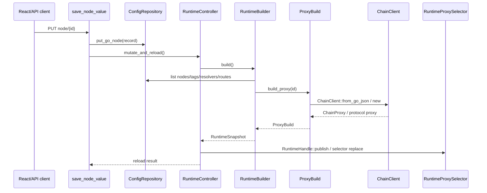

最容易犯的错误是只改 `GoNodeRecord` 的 JSON 转换，忘记 `build_proxy` 对新的 chain type
做分派；或者只更新 selector slot，忘记把新的 resolver/route snapshot 一起构造。

### 21.2 修改 inbound

```text
API inbound_put/delete
  -> repository.put/delete_go_inbound
  -> mutate_and_reload_inbound(id)
  -> build new RuntimeSnapshot
  -> publish snapshot
  -> broadcast InboundReload::One(id)
  -> wait_for_shutdown_or_matching_inbound_reload(owner, id)
  -> owner returns / listener socket drops
  -> start_inbounds(... only_id=Some(id))
```

这里的 owner 语义很关键：旧 listener 任务退出后 socket 必须 drop，新的 `bind` 才能成功；
不能仅仅把 `InboundSpec` 放到一个共享 mutex 里期待协议 handler 自动改变。

### 21.3 TUN TCP flow

```text
OS TUN packet
  -> TunRuntime::recv_from_tun
  -> TunDispatcher::poll
  -> inspect_ip_packet / smoltcp socket
  -> ProxyInput::TcpOpened
  -> ProxyInputInterceptor::intercept
  -> TunProxyRuntime::handle_proxy_input
  -> context_for_flow (process + FakeIP context)
  -> selector.route_context
  -> selector.select
  -> run_tcp_proxy
  -> AsyncProxy::connect
  -> bidirectional command/output relay
  -> process_proxy_outputs
  -> dispatcher.write_tcp
  -> SmoltcpTunDevice TX queue
  -> fragment_ip_packet
  -> OS TUN
```

### 21.4 socket inbound UDP flow

```text
client datagram
  -> Socks5UdpCodec/TrojanUdpCodec/TransparentUdpCodec::recv
  -> InboundUdpRequest{id, peer, target, payload}
  -> InboundUdpManager::dispatch (try_send)
  -> UdpSourceKey lookup
  -> spawn_udp_flow / UdpFlowWorker::run
  -> InboundHandler::answer_datagram (DNS hijack branch)
  -> FlowContext + route_context
  -> AsyncProxy::open_datagram
  -> datagram.send_to
  -> datagram.recv_from
  -> InboundUdpResponse
  -> codec.send
```

socket UDP 和 TUN UDP 都有 source-owned/full-cone 语义，但它们的 flow map 属于不同 owner：
socket inbound 在 `InboundUdpManager`，TUN 在 `TunProxyRuntime::udp_tasks`。不要为了“统一”
把两个 task map 合并到全局 runtime。

### 21.5 DNS hijack flow

```text
TUN/socket receives UDP or TCP DNS packet
  -> InboundDnsHandler::should_hijack(destination_port, packet)
  -> RuntimeDnsHandler / InboundHandler::answer_datagram
  -> FakeIP/hosts/policy decision
  -> RuntimeSnapshot::dns_resolver_for_route_mode
  -> RoutedDnsClient::query_packet
  -> ResolverProxyBridge (direct/proxy)
  -> validate/rewrite/encode response
  -> packet/socket response queue
```

只要 DNS hijack 开关或 inbound FakeIP policy 变化，就要检查 `RuntimeSnapshot` 中三个
resolver registry：`resolver_by_id`、`dns_resolver_by_id`、`inbound_resolver_by_id`。它们
故意区分“给 flow 解析的 FakeIP resolver”“listener 不带 FakeIP 的 resolver”和“inbound
DNS policy resolver”。

## 22. 测试文件也是组件文档

如果不知道某个组件应该保持什么行为，优先读对应测试，而不是只看实现：

| 行为 | 测试入口 |
| --- | --- |
| DNS wire/SVCB/cache/UDP | `yuhaiin-dns/src/dns.rs` tests、`dns_hosts_tests.rs`、`tests/dns_quic.rs` |
| core NAT/process | `yuhaiin-core/src/nat_tests.rs`、`tests/nat_process.rs` |
| trie route flow | `yuhaiin-trie/tests/p0_flow.rs`、`router.rs` tests |
| protocol 与 Go 兼容 | `yuhaiin-protocol/tests/go_*_interop.rs`、`chain/tests/go_*_interop.rs` |
| H2/WebSocket/UOT | `yuhaiin-chain/tests/http2_*`、`yuhaiin-protocol/src/h2_tunnel.rs` tests |
| store schema/migration | `yuhaiin-store/src/tests/{schema,go_import,snapshot,storage}.rs`、`tests/fixtures/` |
| FakeIP | `yuhaiin-store/src/fakeip_tests.rs`、FakeIP fixture NDJSON/SQL |
| TUN packet/proxy | `yuhaiin-tun/src/tun_unit_tests.rs`、`tun_proxy_tests.rs`、`tests/tun_routes.rs`、`yuhaiin-tun/src/bin/tun_smoke.rs` |
| runtime resolver/TUN/reload | `yuhaiin-runtime/tests/{doh_tls,legacy_v1_runtime}.rs`、controller/data_plane tests |
| API contract/reload | `yuhaiin-api/tests/{api_contract,api_reload_flow,startup_logs,stats_concurrency}.rs` |
| backup | `yuhaiin-backup/tests/s3_local.rs`、API backup tests |
| wireguard | `yuhaiin-wireguard/src/tests.rs`、`tests/external.rs`、API `wireguard_chain.rs` |

`yuhaiin-store/src/bin/tun_fakeip_smoke.rs` 还覆盖了一个重要边界：FakeIP DNS 不再通过
TUN 专属 handler 直接注入，而是用 `FakeIpDnsProxy`/`FakeIpDnsDatagram` 把
`FakeIpAsyncDnsHandler` 接入统一的 `AsyncProxy` datagram 路径。它是验证 adapter 的 smoke
入口，不应被误读成新的公共 `yuhaiin-types` trait。

测试名称经常直接表达兼容性约束，例如 `reloadable_tun_dns_handler_switches_snapshots_without_rebuilding_owner` 表明 DNS handler 可以换 snapshot，但 TUN owner 不应因此被重建；这类测试比注释更能说明当前设计。

## 23. “我要改 X”时的导航决策树

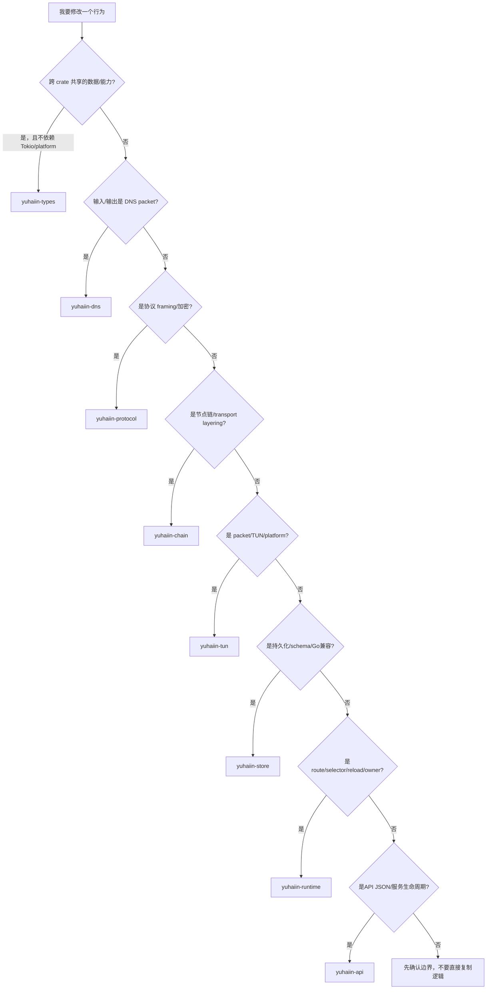

### 23.1 修改前的最小阅读集

| 改动 | 先读这几个函数 | 再读这些测试 |
| --- | --- | --- |
| 新公共 trait | `types` 对应 trait、旧 crate re-export | types + 两个实际实现 |
| 新 resolver | `AsyncIpResolver`、`RoutedDnsClient::query_packet`、`ResolverTransportFactory` | DNS packet/timeout/singleflight |
| 新 outbound | `BaseProxyConfig::build`、`RuntimeProxySelector::build_proxy`、`ChainClient::connect_*` | protocol/chain interop |
| 新 inbound | `start_inbounds`、`ProtocolHandler::handle`、`InboundHandler` | API reload + protocol server |
| 新 route matcher | `compile_go_route_rules*`、`RouteRule::matches_with_context`、`Router::apply_to_context` | trie `p0_flow` + route test |
| 新 TUN packet行为 | `inspect_ip_packet`、`TunDispatcher::poll`、`TunProxyRuntime::handle_proxy_input` | packet/fragment/proxy tests |
| 新配置字段 | repository `list/put`、`RuntimeBuilder::build`、API `*_value` | empty/legacy/reload fixture |

## 24. 文档覆盖范围和使用方式

当前文档已经覆盖 workspace 的 13 个 crate、生产源码模块、主要测试入口、启动/控制面、
TCP/UDP/TUN/DNS 数据面、route/proxy/protocol/chain/store/API 的关键函数链。这里的“完整”
指每个组件的职责、边界、主调用流程和修改入口均有索引；不会把没有分支/状态的每个
trivial getter 逐行抄进文档。

实际读代码时建议按这个顺序：

1. 先看第 2 节的 crate 图，确定依赖方向。
2. 再看第 5/6 节，理解 snapshot/controller/reload owner。
3. 按现象进入第 7–14 节对应的数据面。
4. 需要改具体实现时跳到第 20 节模块表和函数名。
5. 最后用第 21–23 节的端到端链和测试表确认改动没有越过边界。

源码行号会随着后续编辑变化；函数名和文件路径是稳定索引，行号只作为当前 checkout
的快速跳转提示。任何行号与当前源码不一致时，以同一文件中的函数定义为准，并在修改
文档时顺便更新链接。

## 25. `add0b04` 之后的迁移速查

最近一次大更新把“公共 contract”“异步运行时能力”“协议 wrapper”和“TUN smoke 入口”
重新分层。后续修改可以按下面的替换关系定位：

| 旧位置/旧入口 | 当前入口 | 迁移含义 |
| --- | --- | --- |
| `yuhaiin-core`/各 crate 自己定义 `Endpoint`、`Network` | `yuhaiin-types::{Endpoint, Network}` | 地址和网络类型只有一份 canonical definition；core 只 re-export |
| DNS model/handler 分散在 `yuhaiin-dns`、runtime | `yuhaiin-types::{DnsResponse, DnsHandler, AsyncDnsHandler, AsyncIpResolver}` | DNS wire codec、transport、cache 仍留在 `yuhaiin-dns`，types 只保留 contract/model |
| runtime/TUN 各自的 inbound DNS contract | `yuhaiin-types::InboundDnsHandler` | hijack 判断和回答接口共享；具体 handler 仍由 runtime/store/dns 实现 |
| `StreamConnector`、`BlockingStreamProxy`、同步 HTTP/SOCKS connector | `yuhaiin-core::proxy::{AsyncProxy, AsyncDatagram, AsyncStream}` | outbound 能力统一为 async；不再维护 parallel blocking API |
| `yuhaiin-protocol/src/tls_sync.rs` | `yuhaiin-protocol/src/tls.rs::RustCryptoTlsProxy` | TLS 作为已有 `AsyncProxy` 的异步 wrapper；证书/SNI/ALPN 逻辑集中在一个入口 |
| runtime 自己拼基础 HTTP/SOCKS/direct proxy | `yuhaiin-protocol::proxy_factory::BaseProxyConfig::build` | protocol 负责可复用 base async proxy，runtime 负责把 persisted config 映射进去 |
| `cargo build -p yuhaiin-core --features tun,async-proxy` 的 TUN benchmark | `cargo build -p yuhaiin-tun --bin tun-smoke --features tun-routes --release` | TUN async implementation 归 `yuhaiin-tun`；route install 是独立 feature |
| TUN smoke 直接注入 DNS handler | `FakeIpDnsProxy` + `FakeIpDnsDatagram` | DNS hijack 通过统一 datagram proxy capability 验证，而不是创建 TUN 专属旁路 |

因此，“新增公共 trait”不再是把所有 proxy trait 都放进 `yuhaiin-types`：先判断它是否
只表达平台无关的值/contract；若它需要 `FlowContext`、Tokio I/O、socket metadata 或
异步资源生命周期，就应该留在 core/protocol/runtime 的对应层。
